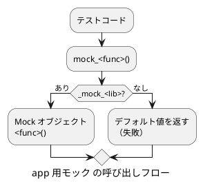
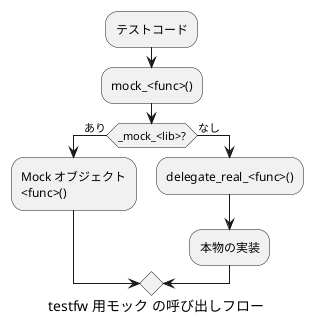

# C ライブラリ関数の mock 作成

このプロジェクトの include_override 方式で新しいモジュールの mock を作成する手順を示す。

## ⚠ 作業前の確認：モックの種別

作成するモックが **app 用**(`app/<name>/test/libsrc/`) か **testfw 用**(`framework/testfw/libsrc/`) かを
ユーザーに確認してから作業を開始すること。両者は設計方針が根本的に異なる。

| 項目 | app 用モック | testfw 用モック |
|---|---|---|
| 格納場所 | `app/<name>/test/libsrc/` | `framework/testfw/libsrc/` |
| モックなし時の動作 | デフォルト値 (失敗) を返す | `delegate_real_` で本物に委譲 |
| `delegate_real_` | 原則なし | あり (必須) |
| `delegate_fake_` | なし | あり |
| 呼び出し元情報引数 | なし | `file, line, func` あり |
| `WEAK_ATR` | 使用 | 使用 (関数名は `mock_<func>`) |
| ON_CALL デフォルト | 失敗値 (`Return(-1)` 等) | `Invoke(delegate_real_<func>)` |
| 可変長引数 (出力系) | `allocvprintf` で文字列化してモックへ | 同左 |
| 可変長引数 (入力系) | `va_list` をそのままモックへ | 同左 |

## 概要 (include_override 方式)

本物のヘッダー (`prod/include/`) をテストビルドでは `test/include_override/` にあるヘッダーに差し替える。
override ヘッダーは本物を include した後、マクロで各関数を `mock_<func>()` に置き換える。
mock 関数はグローバルポインター `_mock_<lib>` が示す Mock オブジェクトに委譲する。





## 構成するファイル

| ファイル | 役割 |
|---|---|
| `prod/include/<lib>/<module>/<module>.h` | 本物のヘッダー (変更不要) |
| `test/include/<lib>/<module>/mock_<module>.h` | (1) mock 関数・delegate 関数の宣言、マクロ置き換え定義 |
| `test/include_override/<lib>/<module>/<module>.h` | (2) 本物の include 後にマクロで mock へ差し替える override ヘッダー |
| `test/include/mock_<lib>.h` | (3) MockClass への `MOCK_METHOD` 追加 |
| `test/libsrc/mock_<lib>/mock_<lib>.cc` | (4) ON_CALL でデフォルト動作を登録 |
| `test/libsrc/mock_<lib>/<module>/mock_<func>.cc` | (5) mock 実装 (関数ごと) |

## 共通手順

### mock ヘッダーを作成する

`test/include/<lib>/<module>/mock_<module>.h`

mock 関数・delegate 関数の宣言と、override ヘッダー経由でのみ発動するマクロ置き換えを定義する。

```c
#ifndef MOCK_<MODULE>_H
#define MOCK_<MODULE>_H

#include <stdint.h>
/* 引数型に応じた追加 include */

#ifdef __cplusplus
extern "C"
{
#endif

    /* mock 関数の宣言 */
    extern <rettype> mock_<func>(<args>);

#ifdef __cplusplus
}
#endif

/* _IN_OVERRIDE_HEADER_ フラグがある場合のみマクロ置き換えを有効にする */
#ifdef _IN_OVERRIDE_HEADER_<LIB>_<MODULE>_H

/* _NO_OVERRIDE フラグで関数ごとに無効化できる */
#ifndef <FUNC>_NO_OVERRIDE
#define <func>(<args>) mock_<func>(<args>)
#endif

#else

/* override ヘッダの外では delegate 関数の宣言のみ (testfw 用のみ必要) */
#ifdef __cplusplus
extern "C"
{
#endif

    extern <rettype> delegate_real_<func>(<args>);

#ifdef __cplusplus
}
#endif

#endif /* _IN_OVERRIDE_HEADER_ */

#endif /* MOCK_<MODULE>_H */
```

ポイント:
- `_IN_OVERRIDE_HEADER_` フラグで、マクロ置き換えが override ヘッダー経由の場合だけ発動する
- `_NO_OVERRIDE` フラグにより、mock 化対象自身のソースをテストする際に関数単位で本物を使える
- delegate 関数宣言は testfw 用のみ。app 用モックには `delegate_real_` は不要

### override ヘッダーを作成する

`test/include_override/<lib>/<module>/<module>.h`

テストビルドではこのヘッダーが本物の代わりに読み込まれる。

```c
#ifndef _OVERRIDE_<LIB>_<MODULE>_H
#define _OVERRIDE_<LIB>_<MODULE>_H

/* 本物を先に include して型定義・マクロを継承する */
#include "../../../../prod/include/<lib>/<module>/<module>.h"

/* フラグを囲んで mock ヘッダの置き換えマクロを局所的に有効化する */
#define _IN_OVERRIDE_HEADER_<LIB>_<MODULE>_H
#include <<lib>/<module>/mock_<module>.h>
#undef _IN_OVERRIDE_HEADER_<LIB>_<MODULE>_H

#endif
```

### MockClass に MOCK_METHOD を追加する

`test/include/mock_<lib>.h` の MockClass 定義に追記する。

```cpp
// <module>
MOCK_METHOD(<rettype>, <func>, (<args>));
```

引数なし関数は `(<rettype>, <func>, ())` のように空括弧を使う。

## app 用実装パターン

### ON_CALL でデフォルト失敗値を登録する

`test/libsrc/mock_<lib>/mock_<lib>.cc` のコンストラクターに追記する。
モックがアタッチされている際の無指定時動作として失敗値を返す。

```cpp
ON_CALL(*this, <func>(<matchers>))
    .WillByDefault(Return(-1));   // 失敗値 (void 関数は Return())
```

### mock 実装ファイルを作成する (通常関数)

`test/libsrc/mock_<lib>/<module>/mock_<func>.cc`

```cpp
#include <testfw.h>
#include <mock_<lib>.h>

WEAK_ATR <rettype> <func>(<args>)
{
    <rettype> rtc = <default>;   // デフォルト値（失敗）

    if (_mock_<lib> != nullptr)
    {
        rtc = _mock_<lib>-><func>(<args>);
    }
    // else: モックがアタッチされていない場合はデフォルト値のまま

    if (getTraceLevel() > TRACE_NONE)
    {
        printf("  > %s <入力引数>", __func__, <入力引数>...);
        if (getTraceLevel() >= TRACE_DETAIL)
        {
            printf(" -> <戻り値または出力引数の値>\n", <値>);
        }
        else
        {
            printf("\n");
        }
    }

    return rtc;   /* void 関数は省略 */
}
```

`delegate_real_` は定義しない。モックがアタッチされていない場合は失敗値を返す。

### 可変長引数のテンプレート (app 用)

**出力系 (`printf` 系)**：`allocvprintf` でフォーマット済み文字列に変換してからモックへ渡す。
`vsnprintf` の固定バッファは上限超過リスクがあるため使用しない。

```cpp
#include <stdarg.h>
#include <testfw.h>
#include <mock_<lib>.h>

WEAK_ATR <rettype> <func>(<args>, const char *format, ...)
{
    va_list args;
    va_start(args, format);
    char *str = allocvprintf(format, args);
    va_end(args);

    <rettype> rtc = <default>;

    if (str != NULL && _mock_<lib> != nullptr)
    {
        rtc = _mock_<lib>-><func>(<args>, str);
    }

    if (getTraceLevel() > TRACE_NONE)
    {
        printf("  > %s <入力引数>, %s", __func__, <入力引数>..., str);
        if (getTraceLevel() >= TRACE_DETAIL)
        {
            printf(" -> <戻り値>\n", <値>);
        }
        else
        {
            printf("\n");
        }
    }

    free(str);
    return rtc;
}
```

**入力系 (`scanf` 系)**：`va_list` をそのままモックへ渡す。

```cpp
#include <stdarg.h>
#include <testfw.h>
#include <mock_<lib>.h>

WEAK_ATR int <func>(const char *buffer, const char *format, ...)
{
    int rtc = <default>;
    va_list args;

    va_start(args, format);

    if (_mock_<lib> != nullptr)
    {
        rtc = _mock_<lib>-><func>(buffer, format, args);
    }

    va_end(args);

    if (getTraceLevel() > TRACE_NONE)
    {
        printf("  > %s \"%s\", \"%s\"", __func__, buffer, format);
        if (getTraceLevel() >= TRACE_DETAIL)
        {
            printf(" -> %d\n", rtc);
        }
        else
        {
            printf("\n");
        }
    }

    return rtc;
}
```

### プラットフォーム条件分岐 (app 用)

app 用モックでプラットフォーム分岐が必要な場合は、`#ifdef _WIN32` を直接使わず
`app/com_util/prod/include/com_util/base/platform.h` の統一マクロを使う。

```c
#if defined(PLATFORM_LINUX)
    /* Linux 向け処理 */
#elif defined(PLATFORM_WINDOWS)
    /* Windows 向け処理 */
#endif /* PLATFORM_ */
```

```c
#if defined(PLATFORM_LINUX)
    /* Linux 向け処理 */
#endif /* PLATFORM_LINUX */
```
```c
#if defined(PLATFORM_WINDOWS)
    /* Windows 向け処理 */
#endif /* PLATFORM_WINDOWS */
```
## testfw 用実装パターン

### ON_CALL で delegate_real_ をデフォルト登録する

`framework/testfw/libsrc/mock_<lib>/mock_<lib>.cc` に Mock クラスの実装を作成する。

**基本形**: 少数の関数を持つ MockClass の場合、コンストラクタに直接 ON_CALL を書く。

```cpp
Mock_<lib>::Mock_<lib>()
{
    ON_CALL(*this, <func>(<matchers>))
        .WillByDefault(Invoke(delegate_real_<func>));

    _mock_<lib> = this;
}

Mock_<lib>::~Mock_<lib>()
{
    _mock_<lib> = nullptr;
}
```

引数なし関数は `()` のまま、引数ありは `(_, _)` のように `_` を並べる。

**switch パターン**: 関連する複数の関数を一括して fake/real に切り替えたい場合は、
`switch_to_mock_<domain>()` / `switch_to_real_<domain>()` メソッドに ON_CALL を移す。
コンストラクタで `switch_to_real_<domain>()` を呼んでデフォルトを real 委譲に設定する。
一括切り替え対象外の関数 (printf, scanf など) はコンストラクタに個別 ON_CALL を書く。

```cpp
Mock_<lib>::Mock_<lib>()
{
    switch_to_real_<domain>();   // 一括 real 委譲をデフォルト設定

    ON_CALL(*this, <other_func>(_, _, _, _))
        .WillByDefault(Invoke(delegate_real_<other_func>));

    _mock_<lib> = this;
}

void Mock_<lib>::switch_to_mock_<domain>()
{
    ON_CALL(*this, <func>(_, _, _, _))
        .WillByDefault(Invoke(delegate_fake_<func>));
    // ... 関連する全関数
}

void Mock_<lib>::switch_to_real_<domain>()
{
    ON_CALL(*this, <func>(_, _, _, _))
        .WillByDefault(Invoke(delegate_real_<func>));
    // ... 関連する全関数
}
```

### mock 実装ファイルを作成する (通常関数)

`framework/testfw/libsrc/mock_<lib>/mock_<func>.cc`

```cpp
#include <test_com.h>
#include <mock_<lib>.h>

using namespace testing;

<rettype> delegate_fake_<func>(const char *file, const int line, const char *func, <args>)
{
    // avoid -Wunused-parameter
    (void)file;
    (void)line;
    (void)func;

    /* fake 実装（下記指針を参照） */
    return <safe_value>;
}

<rettype> delegate_real_<func>(const char *file, const int line, const char *func, <args>)
{
    // avoid -Wunused-parameter
    (void)file;
    (void)line;
    (void)func;

    return <func>(<args>);   /* void 関数は return なし */
}

<rettype> mock_<func>(const char *file, const int line, const char *func, <args>)
{
    <rettype> rtc;

    if (_mock_<lib> != nullptr)
    {
        rtc = _mock_<lib>-><func>(file, line, func, <args>);
    }
    else
    {
        rtc = delegate_real_<func>(file, line, func, <args>);
    }

    if (getTraceLevel() > TRACE_NONE)
    {
        printf("  > <func> <入力引数>", <入力引数>...);
        if (getTraceLevel() >= TRACE_DETAIL)
        {
            printf(" from %s:%d -> <戻り値>\n", file, line, <値>);
        }
        else
        {
            printf("\n");
        }
    }

    return rtc;
}
```

### delegate_fake_ の実装指針

- アプリケーションが NULL ポインター参照でクラッシュしない範囲で最低限パスする実装にする
- **リソース獲得系**(fopen 等): `malloc(sizeof(<type>))` で偽リソースを生成して返す (NULL にしない)
  - `malloc` を使うことで呼び出しごとに一意なアドレスが確保される
  - 複数インスタンスを扱うテストでもトレース (`0x%p` 出力) 上でハンドルを区別できる
- **リソース解放系**(fclose 等): 対応する `free` で解放して成功値を返す (獲得系と対になる)
- **書き込み系**(fprintf 等): 実際には書き込まず、書き込んだことになる値 (`strlen(str)` 等) を返す
- **読み込み系**(fgets 等): データなし状態 (NULL / 空文字列) を返す
- **その他の成功系**: 0(成功) を返す

### 可変長引数のテンプレート (testfw 用)

testfw 用も可変長引数の方針は app 用と同じ (出力系: 文字列化、入力系: va_list 渡し)。
関数シグネチャに `file, line, func` が加わる点が異なる。

**出力系 (`printf` 系) の重要規則:**
- mock 関数はオリジナルの `(fmt, ...)` シグネチャを保持する
- delegate_real_ / delegate_fake_ の引数型は `const char *str` (展開済み文字列) に変換する
- MOCK_METHOD も `const char *str` で宣言する (`fmt, ...` ではない)
- `allocvprintf` が NULL を返した場合は `rtc = -1` でエラーにする

```cpp
<rettype> delegate_real_<func>(const char *file, const int line, const char *func, <args>, const char *str)
{
    // avoid -Wunused-parameter
    (void)file; (void)line; (void)func;

    return <func>(<args>, "%s", str);   /* 展開済み str をそのまま渡す */
}

<rettype> delegate_fake_<func>(const char *file, const int line, const char *func, <args>, const char *str)
{
    // avoid -Wunused-parameter
    (void)file; (void)line; (void)func; (void)<stream>;

    return (int)strlen(str);   /* 書き込んだことにする値 */
}

<rettype> mock_<func>(const char *file, const int line, const char *func, <args>, const char *fmt, ...)
{
    va_list args;
    char *str;
    <rettype> rtc;

    va_start(args, fmt);
    str = allocvprintf(fmt, args);
    va_end(args);

    if (str == NULL)
    {
        rtc = -1;
    }
    else if (_mock_<lib> != nullptr)
    {
        rtc = _mock_<lib>-><func>(file, line, func, <args>, str);
    }
    else
    {
        rtc = delegate_real_<func>(file, line, func, <args>, str);
    }

    /* トレース出力 (末尾改行削除パターン参照) */

    free(str);
    return rtc;
}
```

**va_list 受け取り型 (`vfprintf` 系) の追加規則:**
- mock 関数は `va_list ap` をそのまま受け取る
- `va_copy(args_copy, ap)` でコピーしてから `allocvprintf` へ渡す (va_list は一度消費すると再利用不可)
- delegate のシグネチャは同様に `const char *str` に変換する

```cpp
<rettype> mock_<func>(const char *file, const int line, const char *func, <args>, const char *fmt, va_list ap)
{
    va_list args_copy;
    char *str;
    <rettype> rtc;

    va_copy(args_copy, ap);
    str = allocvprintf(fmt, args_copy);
    va_end(args_copy);

    if (str == NULL)
    {
        rtc = -1;
    }
    else if (_mock_<lib> != nullptr)
    {
        rtc = _mock_<lib>-><func>(file, line, func, <args>, str);
    }
    else
    {
        rtc = delegate_real_<func>(file, line, func, <args>, str);
    }

    /* トレース出力 (末尾改行削除パターン参照) */

    free(str);
    return rtc;
}
```

### プラットフォーム条件分岐 (testfw 用)

testfw 用モックは libc など OS 差異のある関数を扱うため、プラットフォーム分岐が必要になる。
`#ifdef _WIN32` / `#ifndef _WIN32` を直接使う。

**Linux 専用関数** (`fork`, `access` など): ファイル全体を囲む。

```cpp
#ifndef _WIN32

/* ... 実装全体 ... */

#endif /* _WIN32 */
```

**Windows 専用関数** (`fopen_s` など): ファイル全体を囲む。

```cpp
#ifdef _WIN32

/* ... 実装全体 ... */

#endif /* _WIN32 */
```

**クロスプラットフォーム関数で OS ごとに実装が異なる場合** (`fopen` の delegate_real_ など):
関数内部で分岐する。switch_to_mock_*/switch_to_real_* 内の ON_CALL も同様に分岐する。

```c
FILE *delegate_real_fopen(...)
{
#ifndef _WIN32
    return fopen(filename, modes);
#else
    FILE *fp = NULL;
    errno_t err = fopen_s(&fp, filename, modes);
    if (err != 0) { return NULL; }
    return fp;
#endif
}
```

## トレース出力パターン

### TRACE_INFO (呼び出し記録)

入力引数を表示する。「この関数が何の引数で呼ばれたか」が分かる。

| 引数の種類 | 出力形式 |
|---|---|
| 引数なし | `  > mock_func` |
| 数値引数 | `  > mock_func 1000, 3` |
| ポインター引数 (入力) | `  > mock_func 0x00ff1234` |
| ポインター引数 (出力) | `  > mock_func 0x00ff1234` (アドレスのみ) |

### TRACE_DETAIL (戻り値/出力引数)

TRACE_INFO の出力に続けて ` -> ` の後ろに値を付ける。

| 戻り値の種類 | 出力形式 |
|---|---|
| 整数 | `  > mock_func -> 0` |
| uint64_t | `  > mock_func -> 1745496896000` (`(unsigned long long)` キャスト) |
| ポインター | `  > mock_func -> 0x00ff1234` |
| void (出力引数あり) | `  > mock_func 0x... -> 2026-04-24 12:34:56, 789000000[ns]` |
| void (出力ポインター null) | `  > mock_func 0x... -> (null)` |

出力引数の null チェックを入れる。

testfw 用では TRACE_DETAIL に `from %s:%d` で呼び出し元ファイル・行番号も付加する。

### 末尾改行削除 (出力系文字列のトレース)

fprintf 等の出力系関数でトレース表示する際は `malloc + memcpy` で文字列をコピーし、末尾の `\n` を除去する。
`trimmed_str != NULL` のガードを入れること。

```c
size_t len = strlen(str);
char *trimmed_str = (char *)malloc(len + 1);
memcpy(trimmed_str, str, len + 1);
if (trimmed_str != NULL)
{
    if (len > 0 && trimmed_str[len - 1] == '\n')
    {
        trimmed_str[len - 1] = '\0';
    }
    printf("  > <func> 0x%p, %s", (void *)stream, trimmed_str);
    free(trimmed_str);
    if (getTraceLevel() >= TRACE_DETAIL)
    {
        printf(" from %s:%d -> %d\n", file, line, rtc);
    }
    else
    {
        printf("\n");
    }
}
```

### リソース解放系のポインタ値退避

fclose 等のリソース解放関数は内部でポインタ変数を変更する場合がある。
トレース出力で解放前のアドレスを記録するために、関数呼び出し前にアドレス値を退避する。

```c
void * _fp = fp; // fclose 内にて初期化されるため、退避

rtc = _mock_stdio->fclose(file, line, func, fp);

printf("  > fclose 0x%p", (void *)_fp);  // 退避値を使う
```

### ポインタ型戻り値の NULL チェック付き表示

fopen 等のポインタを返す関数では、NULL か否かで表示を分岐する。

```c
if (fp == NULL)
{
    printf(" from %s:%d -> NULL\n", file, line);
}
else
{
    printf(" from %s:%d -> 0x%p\n", file, line, (void *)fp);
}
```

## テストコードでの mock 注入

Google Test の Fixture で Mock オブジェクトを生成すると `_mock_<lib>` が自動登録される。
`EXPECT_CALL` で呼び出し回数の検証と振る舞いの上書きを組み合わせる。

```cpp
TEST_F(MyTest, example)
{
    Mock_com_util mock;   // コンストラクタで _mock_com_util = this

    // 呼び出し回数だけ検証し、振る舞いはデフォルト (ON_CALL の設定) を使う
    EXPECT_CALL(mock, com_util_get_monotonic_ms()).Times(1);

    // 戻り値を差し替える
    EXPECT_CALL(mock, com_util_get_monotonic_ms())
        .WillOnce(Return(1234ULL));

    // void 関数の出力引数を差し替える (ラムダ)
    EXPECT_CALL(mock, com_util_get_realtime_utc(_, _))
        .WillOnce([](struct tm *utc_tm, int32_t *tv_nsec) {
            utc_tm->tm_year = 126;   // 2026
            *tv_nsec = 0;
        });

    // テスト対象コードを呼び出す
    /* ... */
}   // デストラクタで _mock_com_util = nullptr
```

## 実装例の参照

### app 用モックの参照例

```text
app/com_util/test/include/com_util/clock/mock_clock.h
    ← mock ヘッダーの例 (マクロ置き換え定義)
app/com_util/test/include_override/com_util/clock/clock.h
    ← override ヘッダーの例
app/com_util/test/include/mock_com_util.h
    ← MockClass・MOCK_METHOD の例
app/com_util/test/libsrc/mock_com_util/mock_com_util.cc
    ← ON_CALL でデフォルト失敗値を登録する例
app/com_util/test/libsrc/mock_com_util/crt/mock_com_util_access.cc
    ← 通常関数の mock 実装例
app/com_util/test/libsrc/mock_com_util/trace/mock_trace_logger_writef.cc
    ← 出力系可変長引数の mock 実装例 (allocvprintf で文字列化)
app/com_util/test/libsrc/mock_com_util/crt/mock_com_util_sscanf.cc
    ← 入力系可変長引数の mock 実装例 (va_list をモックへ渡す)
```

### testfw 用モックの参照例

```text
framework/testfw/include_override/stdio.h
    ← override ヘッダーの例
framework/testfw/include/mock_stdio.h
    ← mock ヘッダー・MockClass の例 (file/line/func 付きシグネチャ)
framework/testfw/libsrc/mock_libc/mock_fclose.cc
    ← 通常関数の mock 実装例 (delegate_real_/delegate_fake_/トレース)
framework/testfw/libsrc/mock_libc/mock_fprintf.cc
    ← 出力系可変長引数の mock 実装例 (allocvprintf で文字列化)
```
