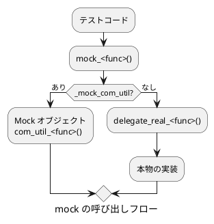

# C ライブラリ関数の mock 作成

このプロジェクトの include_override 方式で新しいモジュールの mock を作成する手順を示す。

## 概要 (include_override 方式)

本物のヘッダー (`prod/include/`) をテストビルドでは `test/include_override/` にあるヘッダーに差し替える。override ヘッダーは本物を include した後、マクロで各関数を `mock_<func>()` に置き換える。mock 関数はグローバルポインター `_mock_com_util` が示す Mock オブジェクトに委譲し、オブジェクトがなければ `delegate_real_<func>()` 経由で本物を呼び出す。



## 構成するファイル

| ファイル | 役割 |
|---|---|
| `prod/include/<lib>/<module>/<module>.h` | 本物のヘッダー (変更不要) |
| `test/include/<lib>/<module>/mock_<module>.h` | (1) mock 関数・delegate 関数の宣言、マクロ置き換え定義 |
| `test/include_override/<lib>/<module>/<module>.h` | (2) 本物の include 後にマクロで mock へ差し替える override ヘッダー |
| `test/include/mock_<lib>.h` | (3) MockClass への `MOCK_METHOD` 追加 |
| `test/libsrc/mock_<lib>/mock_<lib>.cc` | (4) ON_CALL で delegate をデフォルト登録 |
| `test/libsrc/mock_<lib>/<module>/mock_<func>.cc` | (5) mock 実装 (関数ごと) |

## 手順

### mock ヘッダーを作成する

`test/include/<lib>/<module>/mock_<module>.h`

mock 関数・delegate 関数の宣言と、override ヘッダー経由でのみ発動するマクロ置き換えを定義する。

```c
#ifndef MOCK_<MODULE>_H
#define MOCK_<MODULE>_H

#include <stdint.h>
/* 引数型に応じた追加 include */

#ifdef __cplusplus
extern "C"
{
#endif

    /* mock 関数の宣言 */
    extern <rettype> mock_<func>(<args>);

#ifdef __cplusplus
}
#endif

/* _IN_OVERRIDE_HEADER_ フラグがある場合のみマクロ置き換えを有効にする */
#ifdef _IN_OVERRIDE_HEADER_<LIB>_<MODULE>_H

/* _NO_OVERRIDE フラグで関数ごとに無効化できる */
#ifndef <FUNC>_NO_OVERRIDE
#define <func>(<args>) mock_<func>(<args>)
#endif

#else

/* override ヘッダの外では delegate 関数の宣言のみ */
#ifdef __cplusplus
extern "C"
{
#endif

    extern <rettype> delegate_real_<func>(<args>);

#ifdef __cplusplus
}
#endif

#endif /* _IN_OVERRIDE_HEADER_ */

#endif /* MOCK_<MODULE>_H */
```

ポイント:
- `_IN_OVERRIDE_HEADER_` フラグで、マクロ置き換えが override ヘッダー経由の場合だけ発動する
- `_NO_OVERRIDE` フラグにより、mock 化対象自身のソースをテストする際に関数単位で本物を使える
- delegate 関数は override ヘッダーの外側で宣言し、テストコードから直接呼び出せるようにする

### override ヘッダーを作成する

`test/include_override/<lib>/<module>/<module>.h`

テストビルドではこのヘッダーが本物の代わりに読み込まれる。

```c
#ifndef _OVERRIDE_<LIB>_<MODULE>_H
#define _OVERRIDE_<LIB>_<MODULE>_H

/* 本物を先に include して型定義・マクロを継承する */
#include "../../../../prod/include/<lib>/<module>/<module>.h"

/* フラグを囲んで mock ヘッダの置き換えマクロを局所的に有効化する */
#define _IN_OVERRIDE_HEADER_<LIB>_<MODULE>_H
#include <<lib>/<module>/mock_<module>.h>
#undef _IN_OVERRIDE_HEADER_<LIB>_<MODULE>_H

#endif
```

### (3) MockClass に MOCK_METHOD を追加する

`test/include/mock_<lib>.h` の MockClass 定義に追記する。

```cpp
// <module>
MOCK_METHOD(<rettype>, <func>, (<args>));
```

引数なし関数は `(<rettype>, <func>, ())` のように空括弧を使う。

### ON_CALL で delegate をデフォルト登録する

`test/libsrc/mock_<lib>/mock_<lib>.cc` のコンストラクターに追記する。
明示的な振る舞い設定がない場合に `delegate_real_` 経由で本物と同等の動作になる。

```cpp
ON_CALL(*this, <func>(<matchers>))
    .WillByDefault(Invoke(delegate_real_<func>));
```

引数なし関数は `()` のまま、引数ありは `(_, _)` のように `_` を並べる。

### mock 実装ファイルを作成する (関数ごと)

`test/libsrc/mock_<lib>/<module>/mock_<func>.cc`

```cpp
#include <testfw.h>
#include <mock_<lib>.h>
#include <<lib>/<module>/<module>.h>
#include <<lib>/<module>/mock_<module>.h>

/* 本物を呼び出す delegate
   override マクロの影響を受けない位置で定義する */
<rettype> delegate_real_<func>(<args>)
{
    return <func>(<args>);   /* void 関数は return なし */
}

/* mock 関数本体 */
<rettype> mock_<func>(<args>)
{
    <rettype> rtc = <default>;   /* void 関数は宣言不要 */

    if (_mock_com_util != nullptr)
    {
        rtc = _mock_com_util-><func>(<args>);   /* void 関数は代入なし */
    }
    else
    {
        rtc = delegate_real_<func>(<args>);
    }

    if (getTraceLevel() > TRACE_NONE)
    {
        printf("  > %s <入力引数>", __func__, <入力引数>...);
        if (getTraceLevel() >= TRACE_DETAIL)
        {
            printf(" -> <戻り値または出力引数の値>\n", <値>);
        }
        else
        {
            printf("\n");
        }
    }

    return rtc;   /* void 関数は省略 */
}
```

トレース出力は `return` の直前 (呼び出し後) に置く。出力引数の値を TRACE_DETAIL で表示するため。

## トレース出力パターン

### TRACE_INFO (呼び出し記録)

入力引数を表示する。「この関数が何の引数で呼ばれたか」が分かる。

| 引数の種類 | 出力形式 |
|---|---|
| 引数なし | `  > mock_func` |
| 数値引数 | `  > mock_func 1000, 3` |
| ポインター引数 (入力) | `  > mock_func 0x00ff1234` |
| ポインター引数 (出力) | `  > mock_func 0x00ff1234` (アドレスのみ) |

### TRACE_DETAIL (戻り値/出力引数)

TRACE_INFO の出力に続けて ` -> ` の後ろに値を付ける。

| 戻り値の種類 | 出力形式 |
|---|---|
| 整数 | `  > mock_func -> 0` |
| uint64_t | `  > mock_func -> 1745496896000` (`(unsigned long long)` キャスト) |
| ポインター | `  > mock_func -> 0x00ff1234` |
| void (出力引数あり) | `  > mock_func 0x... -> 2026-04-24 12:34:56, 789000000[ns]` |
| void (出力ポインター null) | `  > mock_func 0x... -> (null)` |

出力引数の null チェックを入れる。

## 関数単位の mock 無効化 (_NO_OVERRIDE)

mock 化対象のソース自身をテストする際、特定の関数だけ本物のままにしたい場合がある。
テストの makefile またはコンパイルオプションで `_NO_OVERRIDE` フラグを立てる。

```makefile
# clock.c 自身のテストで com_util_get_monotonic_ms だけ本物を使う例
CFLAGS += -DCOM_UTIL_GET_MONOTONIC_MS_NO_OVERRIDE
```

## テストコードでの mock 注入

Google Test の Fixture で Mock オブジェクトを生成すると `_mock_com_util` が自動登録される。
`EXPECT_CALL` で呼び出し回数の検証と振る舞いの上書きを組み合わせる。

```cpp
TEST_F(MyTest, example)
{
    Mock_com_util mock;   // コンストラクタで _mock_com_util = this

    // 呼び出し回数だけ検証し、振る舞いはデフォルト (delegate_real_) を使う
    EXPECT_CALL(mock, com_util_get_monotonic_ms()).Times(1);

    // 戻り値を差し替える
    EXPECT_CALL(mock, com_util_get_monotonic_ms())
        .WillOnce(Return(1234ULL));

    // void 関数の出力引数を差し替える (ラムダ)
    EXPECT_CALL(mock, com_util_get_realtime_utc(_, _))
        .WillOnce([](struct tm *utc_tm, int32_t *tv_nsec) {
            utc_tm->tm_year = 126;   // 2026
            *tv_nsec = 0;
        });

    // テスト対象コードを呼び出す
    /* ... */
}   // デストラクタで _mock_com_util = nullptr
```

## 実装例 (framework/testfw)

```text
framework/testfw/include_override/stdio.h               ← override ヘッダの例
framework/testfw/include/mock_stdio.h                   ← mock ヘッダの例 (マクロ置き換え・MockClass・delegate 宣言)
framework/testfw/libsrc/mock_libc/mock_fopen.cc         ← mock 実装の例 (delegate_real_・mock 本体・トレース出力)
```
