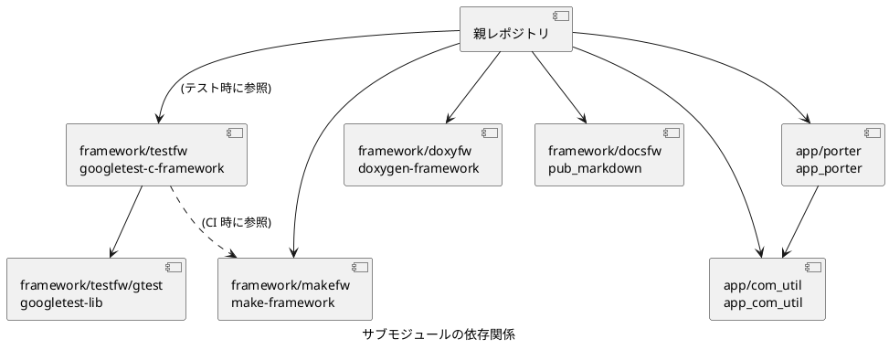

# c-modernization-kit

レガシ C コードのモダナイゼーションのための統合フレームワーク

## 概要

C 言語のソース コードを対象として Linux/Windows 両対応のコーディング、テスト、ドキュメント生成までのすべての作業を一気通貫で実施できる仕組みの例をデモンストレーションするリポジトリです。

## 特徴

- Linux/Windows クロスプラットフォーム対応: Linux は GCC、Windows は MSVC を使用したコーディング、ビルド、デバッグ環境
- .NET サポート: C ライブラリを .NET から利用するためのラッパー実装例とサンプル アプリケーション
- 自動テスト: Google Test を利用した自動テスト、テスト コードはプロダクション コードと分離して管理、整理されたエビデンスの生成
- Docs as Code: Doxygen と Doxybook2 を利用した包括的なドキュメント生成
- ドキュメント発行: Pandoc を利用した html と docx 形式の出力
- サンプル コード: 実際のプロジェクトでの使用例を想定したサンプル コード

### 公開される成果物

注: Markdown 側で多言語対応を行っていないので、現段階で以下の言語別ページは目立った作用を発揮していません。また、Doxygen の出力は単一言語で Japanese-en 固定です。

- [GitHub Pages](https://hondarer.github.io/c-modernization-kit/)

## Windows 環境における注意事項

Windows では、`Start-VSCode-With-Env.cmd` を使用して VS Code を起動してください。MinGW PATH と VSBT 環境変数を自動設定し、VS Code を起動します。

```powershell
.\Start-VSCode-With-Env.cmd
```

## サブモジュール

このプロジェクトは以下のサブモジュールを使用しています。  
Clone 後、サブモジュールの初期化を行ってください。

```bash
git submodule update --init --recursive
```

- `app/com_util` - C プロジェクト向け汎用ユーティリティ ライブラリ ([https://github.com/Hondarer/app_com_util](https://github.com/Hondarer/app_com_util))
- `app/porter` - UDP/IP および TCP/IP をサポートする通信ライブラリ ([https://github.com/Hondarer/app_porter](https://github.com/Hondarer/app_porter))
- `framework/docsfw` - Markdown ドキュメント発行フレームワーク ([https://github.com/Hondarer/pub_markdown](https://github.com/Hondarer/pub_markdown))
- `framework/doxyfw` - Doxygen ドキュメント生成フレームワーク ([https://github.com/Hondarer/doxygen-framework](https://github.com/Hondarer/doxygen-framework))
- `framework/makefw` - Make ビルド フレームワーク ([https://github.com/Hondarer/make-framework](https://github.com/Hondarer/make-framework))
- `framework/testfw` - Google Test ベースのテスト フレームワーク ([https://github.com/Hondarer/googletest-c-framework](https://github.com/Hondarer/googletest-c-framework))

サブモジュールの実配置は `.gitmodules` に定義しています。

### サブモジュールの依存関係



## ライセンス

[LICENSE](./LICENSE) を参照してください。
