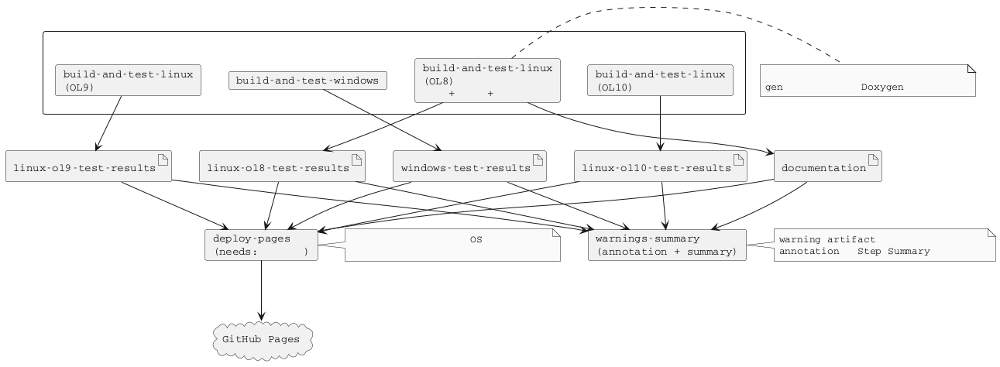
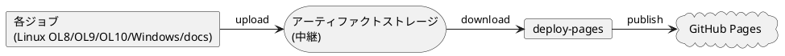

# GitHub Actions CI/CD 仕様

本プロジェクトでは GitHub Actions を使用した継続的インテグレーション (CI) とドキュメント生成を実装しています。

## 概要

main ブランチへの変更時に、Linux/Windows 両環境での自動ビルド・テスト、およびドキュメント生成を実行し、コード品質を維持します。

## ワークフロー構成

### ワークフロー ファイル

本プロジェクトでは統合ワークフローを使用しています:

- `.github/workflows/ci.yml` - ビルド、テスト、ドキュメント生成、Pages デプロイの統合ワークフロー

このワークフローには、次の 4 つのジョブが含まれています。

1. `build-and-test-linux` - Linux 環境でのビルドとテスト (Oracle Linux 8 / Oracle Linux 9 / Oracle Linux 10 のマトリクス実行)。OL8 のレグではビルドとテストの後にドキュメント生成も実行
2. `build-and-test-windows` - Windows 環境でのビルドとテスト
3. `warnings-summary` - warning artifact の有無を集約し、annotation と Step Summary で通知
4. `deploy-pages` - テスト結果とドキュメントの統合と GitHub Pages へのデプロイ

Linux ビルド (OL8/OL9/OL10) と Windows ビルドのジョブが並列実行されます。これらの完了後に `warnings-summary` が warning artifact を集約し、main ブランチへの push では `deploy-pages` がテスト結果とドキュメントを統合して GitHub Pages にデプロイします。

ドキュメント生成を独立したジョブにせず、OL8 のレグへ含めています。Doxygen の入力には `gen/` 配下の自動生成ソースが含まれますが、これらは Git の管理対象外であり、make のパース時またはビルド規則でしか生成されません。ビルド済みの断面でドキュメントを生成することが、自動生成ソースを成果物へ含めるための条件です。詳細は [build-and-test-linux ジョブ](#build-and-test-linux-ジョブ) を参照してください。  
`.jenkins/inner-build.sh` も `BUILD_DOCS` により 1 つの OS だけがドキュメント生成を担当する構成であり、GitHub Actions と Jenkins で同じ実行順になります。

### トリガー条件

すべてのワークフローは、次のイベントで実行されます。

| イベント | 対象ブランチ |
|---------|-------------|
| push | main |
| pull_request | main |

### 共通環境変数

`.github/workflows/ci.yml` では、全ジョブ共通の `env` として、CI が動的に導入するツールのバージョンと検証値を定義します。

| 変数名 | 値 | 説明 |
|--------|-----|------|
| `OPENCPPCOVERAGE_VERSION` | `0.9.9.0` | Windows CI で使用する OpenCppCoverage のバージョン |
| `INNOEXTRACT_VERSION` | `1.9` | OpenCppCoverage のインストーラーを展開する innoextract のバージョン |
| `REPORTGENERATOR_VERSION` | `5.5.11` | Windows CI で使用する ReportGenerator のバージョン |
| `WINFLEXBISON_VERSION` | `2.5.25` | Windows CI で使用する WinFlexBison のバージョン |
| `WINFLEXBISON_SHA256` | `8D324B62BE33604B2C45AD1DD34AB93D722534448F55A16CA7292DE32B6AC135` | WinFlexBison 配布 ZIP の SHA-256 |

これらのバージョンと配布元は、Windows 開発環境を構築する [devbin-win](https://github.com/Hondarer/devbin-win) の `subscripts/config/packages.psd1` に揃えます。  
開発者のローカル環境と CI で同じバージョンのツールを使用することが目的であり、どちらか一方を更新した場合はもう一方も合わせて更新します。

framework home 系 (`MAKEFW_HOME` / `DOCSFW_HOME` / `DOXYFW_HOME` / `TESTFW_HOME`) と実行時パスは、各ジョブの `Load app environment` ステップが `.vscode/.env.*` から読み込みます。  
`MAKEFW_HOME` は `make` / `make test` / `make doxy` などで必須です。未設定の場合は `MAKEFW_HOME is required. Export MAKEFW_HOME before running make` を出力して停止します。  
`DOCSFW_HOME` は `make docs` と VS Code の Markdown 発行タスクで使用します。  
`DOXYFW_HOME` は `make doxy` が doxyfw を呼び出すときに使用します。  
`TESTFW_HOME` は `make` / `make test` が testfw をビルドし、テスト実行スクリプトやライブラリを参照するときに使用します。  
これらのパスを変更する場合は、VS Code の `.env.*` / `settings.json` と Jenkins の `.jenkins/inner-build.sh` も同時に確認します。

## 実行環境

### Linux 環境

Linux 環境では Oracle Linux 開発コンテナーをマトリクス戦略で使用し、複数バージョンでのビルドとテストを実行しています。

```yaml
runs-on: ubuntu-latest
strategy:
  matrix:
    include:
      - os-name: ol8
        image: ghcr.io/hondarer/oracle-linux-container/oracle-linux-8-dev:latest
        docs: true
        fetch-depth: 0
      - os-name: ol9
        image: ghcr.io/hondarer/oracle-linux-container/oracle-linux-9-dev:latest
        fetch-depth: 1
      - os-name: ol10
        image: ghcr.io/hondarer/oracle-linux-container/oracle-linux-10-dev:latest
        fetch-depth: 1
container:
  image: ${{ matrix.image }}
```

`docs` はドキュメント生成を担当するレグを示します。ドキュメント関連のステップは `if: ${{ matrix.docs }}` で OL8 だけが実行します。  
`fetch-depth` は `actions/checkout` へ渡す取得履歴の深さです。`make docs` が Markdown の author と date を `git log` から取得するため、OL8 だけ全履歴 (`0`) が必要です。値を `${{ matrix.docs && 0 || 1 }}` のような式で導出してはいけません。GitHub Actions の式では数値の `0` が falsy と評価され、OL8 でも `1` になります。

| OS 名 | コンテナー イメージ | 説明 |
|--------|-----------------|------|
| ol8 | `ghcr.io/hondarer/oracle-linux-container/oracle-linux-8-dev:latest` | Oracle Linux 8 開発コンテナー |
| ol9 | `ghcr.io/hondarer/oracle-linux-container/oracle-linux-9-dev:latest` | Oracle Linux 9 開発コンテナー |
| ol10 | `ghcr.io/hondarer/oracle-linux-container/oracle-linux-10-dev:latest` | Oracle Linux 10 開発コンテナー |

CI の表示名とビルド成果物の内部識別子は目的が異なるため、命名を分けています。

| 用途 | 命名 |
|------|------|
| コンテナー、matrix、artifact | `ol8` / `ol9` / `ol10` |
| `TARGET_ARCH` の OS 部分 | `el8` / `el9` / `el10` |
| Linux ライブラリ配置 | `linux_el8_x64` / `linux_el9_x64` / `linux_el10_x64` |

`el` 系の内部識別子は、makefw が RHEL 系 OS から生成する値であり、CI の表示名である `ol` 系の識別子とは置き換えません。

これらのコンテナーには、次の開発ツールが含まれています。

- C/C++ コンパイラ (GCC)
- GNU Make
- Google Test
- Doxygen, PlantUML, Pandoc

#### Linux 環境変数

| 変数名 | 値 | 説明 |
|--------|-----|------|
| HOST_USER | user | コンテナー内ユーザー名 |
| HOST_UID | 1001 | ユーザー ID |
| HOST_GID | 127 | グループ ID |

### Windows 環境

Windows 環境では Windows Server 2025 (VS 2026 イメージ) ランナーを使用しています。

```yaml
runs-on: windows-2025-vs2026
```

Windows 環境では、次のツールを動的にセットアップしています。いずれも devbin-win と同じ公式リリースをダウンロードして展開し、`GITHUB_PATH` へ追加します。パッケージ マネージャー (Chocolatey、.NET グローバル ツール) は使用しません。

- **WinFlexBison** - flex/bison 互換のコード生成ツール (公式リリース ZIP の SHA-256 を検証して展開)
- **innoextract** - Inno Setup インストーラーの展開ツール (OpenCppCoverage の展開に使用)
- **OpenCppCoverage** - C++ コード カバレッジ ツール (公式インストーラーを innoextract で展開)
- **ReportGenerator** - カバレッジ レポート生成ツール (公式リリース ZIP の `net47` を展開)
- **MSVC 環境** - カスタム スクリプト (`Add-VSBT-Env-x64.ps1`) で環境変数を設定

OpenCppCoverage の配布物は Inno Setup 形式のインストーラーです。  
innoextract で展開すると、インストーラーの実行と管理者権限が不要になり、devbin-win がローカルに配置する内容と同じファイル構成になります。

WinFlexBison の実行ファイル名は `win_bison` / `win_flex` です。  
Windows ジョブの `BISON` / `FLEX` 環境変数を通じて、makefw のコマンド上書き機構へ渡します。

## ジョブ実行フロー



## 実行ステップ

### build-and-test-linux ジョブ

1. **リポジトリのチェックアウト**
    - サブモジュールを含めて再帰的にチェックアウト
    - 取得する履歴の深さは `matrix.fetch-depth` に従い、OL8 は全履歴、OL9 と OL10 は最新コミットのみを取得

2. **Git safe directory 設定**
    - コンテナー内での Git 操作を許可

3. **ビルド**
    - `make` を実行してプロジェクトをビルド
    - ビルド ログを `logs/linux-build.log` に保存

4. **テストの実行**
    - `make test` を実行
    - testfw および test ディレクトリ配下のテストを実行
    - テスト ログを `logs/linux-test.log` に保存

5. **テスト結果アーティファクトのアップロード**
    - テスト結果 (`app/**/results/`) と `make test` ログを同じ artifact に保存

6. **ビルド ログ アーティファクトのアップロード**
    - ビルド ログのみを保存

7. **ドキュメント生成と発行** (OL8 のみ)
    - docsfw の npm モジュールと puppeteer のキャッシュを復元
    - `make doxy && make docs` を実行
    - Doxygen および Pandoc でドキュメントを生成
    - `make` 系ターゲットは `MAKEFW_HOME` を必須で参照し、`make doxy` は `DOXYFW_HOME`、`make docs` は `DOCSFW_HOME` を参照
    - ルート `makefile` の既定ターゲットが `make skills` を実行済みのため、ここでの skill 同期は不要

8. **ドキュメント アーティファクトのアップロード** (OL8 のみ)
    - 中継用に `documentation-ja`、`documentation-en`、`documentation-doxygen` を分割して保存
    - ドキュメント警告を `docs-warns` として保存
    - HTML と docx を言語・種別ごとの SHA 付き artifact としても保存

#### ドキュメント生成を OL8 のレグで行う理由

`gen/` 配下の自動生成ソースは Git の管理対象外であり、チェックアウト直後のワークスペースには存在しません。生成のタイミングは対象により異なります。

| app | 生成物 | 生成のタイミング |
|-----|--------|----------------|
| `string-catalog-sample` | `prod/src/cmd/string-catalog-command-sample/gen/` | `app/string-catalog-sample/makepart.mk` のパース時 |
| `struct-meta` | `prod/libsrc/struct_meta/parse/gen/` | flex/bison のビルド規則 |
| `struct-meta` | `prod/src/cmd/struct-meta-sample/gen/` | ビルド済みの `prod/cbin/struct-meta-gen` を実行するビルド規則 |

いずれも `make doxy` の経路ではリーフ makefile をパースしないため生成されません。`struct-meta` は生成に実行体のビルドを必要とするため、ソース生成だけを行う軽量な手段も成立しません。ビルドとテストを終えた断面でドキュメントを生成することが、自動生成ソースを Doxygen の入力に含めるための条件です。

Doxygen 側に追加の設定は不要です。`framework/doxyfw/Doxyfile` の `EXCLUDE_PATTERNS` は `*/obj/*` のみであり、`gen/` を除外していません。特定の app で自動生成ソースを除外する場合は、その app の `Doxyfile.part` へ `EXCLUDE_PATTERNS` を全量で指定します。`Doxyfile.part` は共通 `Doxyfile` への単純連結であり、Doxygen は後から指定された設定を優先して解釈するため、`+=` による追記は使えません。

Windows 専用の生成物は対象外です。`app/c-platform/prod/src/cmd/eventlog-register/` の `.mc` から `mc.exe` が生成する `gen/` は、Linux 環境でドキュメントを生成する構成上、成果物に含まれません。

### build-and-test-windows ジョブ

1. **リポジトリのチェックアウト**
    - サブモジュールを含めて再帰的にチェックアウト

2. **WinFlexBison のインストール**
    - 公式リリース ZIP をダウンロード
    - SHA-256 の一致と `win_bison` / `win_flex` の実行を確認
    - PATH に追加し、makefw の `BISON` / `FLEX` へ実行ファイル名を設定

3. **OpenCppCoverage のインストール**
    - innoextract の公式リリース ZIP をダウンロードして展開
    - OpenCppCoverage の公式インストーラーをダウンロードし、innoextract で展開
    - 展開先の `app` ディレクトリを PATH に追加

4. **ReportGenerator のインストール**
    - 公式リリース ZIP をダウンロードして展開
    - `net47` ディレクトリを PATH に追加

5. **MSVC 環境のセットアップ**
    - カスタム スクリプト (`Add-VSBT-Env-x64.ps1`) で環境変数を設定

6. **ビルド**
    - `make` を実行してプロジェクトをビルド
    - ビルド ログを `logs/windows-build.log` に保存

7. **テストの実行**
    - `make test` を実行
    - テスト ログを `logs/windows-test.log` に保存

8. **テスト結果アーティファクトのアップロード**
    - テスト結果 (`app/**/results/`) と `make test` ログを同じ artifact に保存

9. **ビルド ログ アーティファクトのアップロード**
    - ビルド ログのみを保存

### warnings-summary ジョブ

このジョブは、`build-and-test-linux` および `build-and-test-windows` の完了後に `if: always()` で実行されます。

**目的**:

- ビルドやドキュメント生成を最後まで実行します。
- warning artifact が存在する場合でも、ワークフロー自体の成功状態を維持して通知します。
- Pull Request でも `deploy-pages` に依存せず警告を確認できるようにします。

**処理フロー**:

1. workflow run にアップロードされた artifact 一覧を取得します。
2. `linux-ol8-warns` / `linux-ol9-warns` / `linux-ol10-warns` / `windows-warns` / `docs-warns` の有無を確認します。
3. warning artifact が存在する場合は warning annotation を出力し、Step Summary に対象 artifact 名を列挙します。
4. warning artifact が存在しない場合は Step Summary に「warning なし」を出力します。

### deploy-pages ジョブ

このジョブは、先行のジョブ (`build-and-test-linux` (OL8/OL9/OL10)、`build-and-test-windows`) が並列実行され、すべて完了した後に実行されます。

**実行条件**:

- `needs: [build-and-test-linux, build-and-test-windows]` により、並列実行されたすべてのジョブが成功するまで待機
- `if: github.ref == 'refs/heads/main' && github.event_name == 'push'` により、main ブランチへの push 時のみ実行

**処理フロー**:

1. **リポジトリの sparse checkout**
    - `index.html` のタイトル解決に必要な `bin` と `.vscode` だけを取得 (サブモジュールは取得しない)

2. **アーティファクトのダウンロード**
    - Linux OL8 テスト結果アーティファクト (`linux-ol8-test-results`) をダウンロード
    - Linux OL9 テスト結果アーティファクト (`linux-ol9-test-results`) をダウンロード
    - Linux OL10 テスト結果アーティファクト (`linux-ol10-test-results`) をダウンロード
    - Windows テスト結果アーティファクト (`windows-test-results`) をダウンロード
    - ドキュメント アーティファクト (`documentation-ja` / `documentation-en` / `documentation-doxygen`) をダウンロードして `pages/` へ結合
    - Linux OL8 ログ アーティファクト (`linux-ol8-logs`) をダウンロード
    - Linux OL9 ログ アーティファクト (`linux-ol9-logs`) をダウンロード
    - Linux OL10 ログ アーティファクト (`linux-ol10-logs`) をダウンロード
    - Windows ログ アーティファクト (`windows-logs`) をダウンロード
    - ビルド警告アーティファクト (`linux-ol8-warns` / `linux-ol9-warns` / `linux-ol10-warns` / `windows-warns`) は、存在する場合のみダウンロード

3. **アーティファクトの整理と統合**
    - Linux OL8 テスト結果と `make test` ログを `linux-ol8-test-results.zip` にアーカイブ
    - Linux OL9 テスト結果と `make test` ログを `linux-ol9-test-results.zip` にアーカイブ
    - Linux OL10 テスト結果と `make test` ログを `linux-ol10-test-results.zip` にアーカイブ
    - Windows テスト結果と `make test` ログを `windows-test-results.zip` にアーカイブ
    - Linux OL8 ビルド ログを `linux-ol8-logs.zip` にアーカイブ
    - Linux OL9 ビルド ログを `linux-ol9-logs.zip` にアーカイブ
    - Linux OL10 ビルド ログを `linux-ol10-logs.zip` にアーカイブ
    - Windows ビルド ログを `windows-logs.zip` にアーカイブ
    - ビルド警告は、存在する OS のみ `linux-ol8-warns.zip` / `linux-ol9-warns.zip` / `linux-ol10-warns.zip` / `windows-warns.zip` にアーカイブ
    - アーカイブを `pages/artifacts/` に配置
    - `pages/` 配下のドキュメントと統合

4. **GitHub Pages へのデプロイ**
    - 閲覧用の HTML を `pages/` に保持
    - `pages/` の総量と内訳を実行ログに記録
    - 統合した `pages/` を GitHub Pages artifact として公開

Pages に配置する対象と容量の考え方は、[Pages の配置対象](#pages-の配置対象) と [Pages の容量](#pages-の容量) を参照してください。

**アーティファクト ストレージの役割**:

GitHub Actions のアーティファクト ストレージを中継ストレージとして使用することで、異なる OS 環境 (Linux、Windows) で生成されたファイルを 1 つのジョブに集約します。



## GitHub Pages デプロイ

main ブランチへの push 時に、`deploy-pages` ジョブがドキュメントとテスト結果を統合して GitHub Pages に自動公開します。

### 使用アクション

```yaml
- name: Upload Pages artifact
  uses: actions/upload-pages-artifact@v5
  with:
    path: ./pages

- name: Deploy to GitHub Pages
  id: deployment
  uses: actions/deploy-pages@v5
```

### 設定詳細

| パラメーター | 値 | 説明 |
|-----------|-----|------|
| path | `./pages` | Pages artifact に格納するディレクトリ |
| environment | `github-pages` | デプロイ先の environment |

`actions/deploy-pages` は `github-pages` という名前の artifact を 1 つだけデプロイします。  
artifact を分割して 1 つのサイトへ配置する手段はないため、1 GB 上限への対処はペイロードの削減に限られます。

### デプロイ条件

- **実行される場合**: main ブランチへの push
- **実行されない場合**: Pull Request (PR のレビュー時はアーティファクトで確認)

### Pages に配置される内容

`deploy-pages` ジョブにより、以下の内容が Pages に統合配置されます:

```
https://<username>.github.io/<repository>/
+-- index.html                        # エントリ ページ
+-- doxygen/                          # Doxygen 生成 HTML
|   +-- index.html
+-- ja/html/                          # Markdown ドキュメント ja (閲覧用)
+-- en/html/                          # Markdown ドキュメント en (閲覧用)
+-- ja-details/html/                  # Markdown ドキュメント ja-details (閲覧用)
+-- en-details/html/                  # Markdown ドキュメント en-details (閲覧用)
+-- artifacts/
|   +-- linux-ol8-test-results.zip    # Linux OL8 テスト結果 + make test ログ (固定 URL)
|   +-- linux-ol9-test-results.zip    # Linux OL9 テスト結果 + make test ログ (固定 URL)
|   +-- linux-ol10-test-results.zip   # Linux OL10 テスト結果 + make test ログ (固定 URL)
|   +-- windows-test-results.zip      # Windows テスト結果 + make test ログ (固定 URL)
|   +-- linux-ol8-logs.zip            # Linux OL8 ビルドログ (固定 URL)
|   +-- linux-ol9-logs.zip            # Linux OL9 ビルドログ (固定 URL)
|   +-- linux-ol10-logs.zip           # Linux OL10 ビルドログ (固定 URL)
|   +-- windows-logs.zip              # Windows ビルドログ (固定 URL)
|   +-- linux-ol8-warns.zip           # Linux OL8 ビルド警告詳細 (警告がある場合のみ)
|   +-- linux-ol9-warns.zip           # Linux OL9 ビルド警告詳細 (警告がある場合のみ)
|   +-- linux-ol10-warns.zip          # Linux OL10 ビルド警告詳細 (警告がある場合のみ)
|   +-- windows-warns.zip             # Windows ビルド警告詳細 (警告がある場合のみ)
|   +-- docs-warns.zip                # ドキュメント警告詳細 (警告がある場合のみ)
```

**固定 URL の利点**:

- テスト結果アーカイブとビルド ログは常に同じファイル名で配置されるため、固定 URL でアクセス可能です。
- ドキュメントへのリンクをハード コードしても、更新後も同じ URL でアクセスできます。

#### Pages の配置対象

Pages には、閲覧の対象と、閲覧中に個別に取得する成果物を配置します。一式をまとめたアーカイブは配置しません。

| 区分 | Pages | 取得先 |
|------|-------|--------|
| 閲覧用 HTML (`doxygen`、`<言語><詳細度>/html`) | 配置する | Pages 上で閲覧 |
| 個別の DOCX (`<言語><詳細度>/docx`) | 配置する | 各 HTML ページの Word アイコン |
| HTML と DOCX の一式をまとめた zip | 配置しない | コミット固有の run artifact |
| テスト結果とビルド ログの zip | 配置する | Pages から固定 URL で取得 |
| `.warn` アーカイブ | 配置する (内容がある場合) | Pages から固定 URL で取得 |

各 HTML ページのヘッダーには Word アイコンを表示し、同名の DOCX へ `../docx/<名前>.docx` でリンクします。リンク先は Pages 上に必要です。  
一式をまとめた zip は閲覧に使用せず、run artifact に同じ内容が存在します。エントリ ページには「ドキュメントのダウンロード」として、生成元 workflow run へのリンクを掲載します。

`Stage language-split documentation` ステップは、各言語の `html` と `docx` を同じ階層で中継します。

#### Pages の容量

GitHub Pages の artifact 上限は 1 GB です。`deploy-pages` は `github-pages` という名前の artifact を 1 つだけ公開するため、分割はできません。上限内に収めるのは構成の要件です。

容量に影響する要因は、次の 2 つです。いずれも閲覧に使用しない成果物を配置しない方針に基づきます。

**閲覧に使用しないアーカイブを配置しない**

zip はすでに圧縮済みであり、Pages artifact の tar.gz ではこれ以上圧縮されません。閲覧用ディレクトリと同じ内容の zip を併置すると、そのまま二重の容量になります。個別の DOCX は各ページから参照するため配置しますが、一式をまとめた zip は配置しません。

**発行先に生成の中間ファイルを残さない**

docsfw は DOCX 用の画像を発行先の外へ集約します。詳細は [図キャッシュ](../../../framework/docsfw/docs/diagram-cache.md) を参照してください。HTML では図をインライン SVG として埋め込むため、画像ファイルは閲覧に不要です。

`Report Pages payload size` ステップが、実行ごとに `pages/` の総量と内訳を記録します。上限に近づいた場合はこのログで内訳を確認します。

Pages の `index.html` は、ドキュメントへのリンク、生成元 workflow run へのリンク、「テスト結果とビルド ログ」の一覧を掲載します。  
これらとは別に、存在する場合のみ「ビルド・ドキュメント警告詳細」として `.warn` アーカイブを表示します。  
`docs-warns.zip` には `docs.warn` と `app/**/doxy*.warn` がまとめて格納されます。

`index.html` のタイトルは `bin/resolve-site-name.sh` が `.vscode/pub_markdown.config.yaml` の `siteName` から解決した名前を利用します。MkDocs による動的発行のサイト名と定義元が同一であり、`deploy-pages` ジョブはこの解決のために `bin` と `.vscode` だけを sparse checkout します。  
同じ解決を `.jenkins/inner-build.sh` も利用するため、GitHub Actions と Jenkins のエントリ ページは同じ名前になります。

### GitHub リポジトリ設定

GitHub Pages を有効にするには、リポジトリ設定で次の操作を行います。

1. Settings → Pages を開く
2. Source で「GitHub Actions」を選択

`deploy-pages` ジョブは `environment: github-pages` と `pages: write`、`id-token: write` の権限で発行します。gh-pages ブランチは使いません。

公開後、`https://<username>.github.io/<repository>/` でアクセス可能になります。

## アーティファクト

CI 実行時に生成されるファイルをアーティファクトとして保存し、後から確認できます。

### ジョブ間アーティファクト (中継用)

ジョブ間でファイルを受け渡すためのアーティファクトです。これらは `deploy-pages` ジョブで統合されます。

#### Linux テスト結果

マトリクス戦略により、OL8/OL9/OL10 それぞれのアーティファクトが生成されます。

```yaml
- name: Upload test results artifacts
  uses: actions/upload-artifact@v7
  with:
    name: linux-${{ matrix.os-name }}-test-results
    path: |
      app/**/results/
      logs/linux-${{ matrix.os-name }}-test.log
    if-no-files-found: warn
```

#### Windows テスト結果

```yaml
- name: Upload test results artifacts
  uses: actions/upload-artifact@v7
  with:
    name: windows-test-results
    path: |
      app/**/results/
      logs/windows-test.log
    if-no-files-found: warn
```

#### ドキュメント

```yaml
- name: Upload Japanese documentation
  uses: actions/upload-artifact@v7
  with:
    name: documentation-ja
    path: staging/documentation-ja/
    if-no-files-found: warn
```

`documentation-en` と `documentation-doxygen` も同じ手順でアップロードします。  
言語と doxygen で分けているのは、HTML、DOCX、それらの zip を 1 つの `documentation` artifact にまとめると GitHub Pages の 1 GB 上限を超えたためです。  
HTML と DOCX の zip を Pages の配置対象から除外した現在、合計は 1 GB を下回りますが、生成結果を言語単位で確認できるため分割を維持しています。

含まれるファイル:

- `documentation-ja` - `pages/ja/html`、`pages/ja-details/html`
- `documentation-en` - `pages/en/html`、`pages/en-details/html`
- `documentation-doxygen` - `pages/doxygen`、存在する場合は `pages/artifacts/docs-warns.zip`

Pages で閲覧しない DOCX は中継せず、コミット固有の run artifact だけで配布します。

#### ビルド警告

```yaml
- name: Upload build warnings
  uses: actions/upload-artifact@v7
  with:
    name: linux-${{ matrix.os-name }}-warns
    path: |
      app/c_cpp_properties.warn
      app/**/prod/**/*.warn
      app/**/test/**/*.warn
    if-no-files-found: ignore
```

`.warn` は警告が出力された場合のみ生成され、警告が存在しないビルドではアーティファクト自体が作成されません。`app/c_cpp_properties.warn` は、`INCDIR` と `SYSTEM_INCDIR` では `makepart.mk`、`app/makepart.mk`、`app/*/**/makepart.mk`、`DEFINES` では `makepart.mk`、`app/makepart.mk`、`app/*/makepart.mk` の同期結果と `.vscode/c_cpp_properties.json` の不一致を知らせる dry-run 警告です。`deploy-pages` では、実行中の workflow run に warn artifact が存在するか確認したうえで、存在するものだけをダウンロードします。

`warnings-summary` ジョブは同じ artifact 名を検知し、warning annotation と Step Summary で通知します。警告があっても workflow 自体は成功のままです。

#### ドキュメント警告

```yaml
- name: Upload documentation warnings
  uses: actions/upload-artifact@v7
  with:
    name: docs-warns
    path: |
      docs.warn
      app/**/doxy*.warn
    if-no-files-found: ignore
```

`docs.warn` は `make docs` 実行時の警告ファイルで、リポジトリ ルートに生成されます。`doxy*.warn` は各 app 配下に生成される Doxygen 警告ファイルです。`Create artifact archives` ステップではこれらをまとめて `pages/artifacts/docs-warns.zip` にアーカイブします。`warnings-summary` ジョブでは `docs-warns` artifact の有無も集約対象に含めます。

### 履歴管理用アーティファクト (コミット固有)

過去のビルドを参照するためのアーティファクトです。

#### HTML ドキュメント

言語ディレクトリごとに個別の artifact として保存されます (100MB 制限対策)。

```yaml
- name: Upload html artifacts (doxygen)
  uses: actions/upload-artifact@v4
  with:
    name: ${{ github.event.repository.name }}-docs-html-doxygen-${{ github.sha }}
    path: docs/doxygen/
    if-no-files-found: warn

- name: Upload html artifacts (ja)
  uses: actions/upload-artifact@v4
  with:
    name: ${{ github.event.repository.name }}-docs-html-ja-${{ github.sha }}
    path: docs/ja/html/
    if-no-files-found: warn

- name: Upload html artifacts (en)
  uses: actions/upload-artifact@v4
  with:
    name: ${{ github.event.repository.name }}-docs-html-en-${{ github.sha }}
    path: docs/en/html/
    if-no-files-found: warn

- name: Upload html artifacts (ja-details)
  uses: actions/upload-artifact@v4
  with:
    name: ${{ github.event.repository.name }}-docs-html-ja-details-${{ github.sha }}
    path: docs/ja-details/html/
    if-no-files-found: warn

- name: Upload html artifacts (en-details)
  uses: actions/upload-artifact@v4
  with:
    name: ${{ github.event.repository.name }}-docs-html-en-details-${{ github.sha }}
    path: docs/en-details/html/
    if-no-files-found: warn
```

#### docx ドキュメント

言語ディレクトリごとに個別の artifact として保存されます (100MB 制限対策)。

```yaml
- name: Upload docx artifacts (ja)
  uses: actions/upload-artifact@v4
  with:
    name: ${{ github.event.repository.name }}-docs-docx-ja-${{ github.sha }}
    path: docs/ja/docx/
    if-no-files-found: warn

- name: Upload docx artifacts (en)
  uses: actions/upload-artifact@v4
  with:
    name: ${{ github.event.repository.name }}-docs-docx-en-${{ github.sha }}
    path: docs/en/docx/
    if-no-files-found: warn

- name: Upload docx artifacts (ja-details)
  uses: actions/upload-artifact@v4
  with:
    name: ${{ github.event.repository.name }}-docs-docx-ja-details-${{ github.sha }}
    path: docs/ja-details/docx/
    if-no-files-found: warn

- name: Upload docx artifacts (en-details)
  uses: actions/upload-artifact@v4
  with:
    name: ${{ github.event.repository.name }}-docs-docx-en-details-${{ github.sha }}
    path: docs/en-details/docx/
    if-no-files-found: warn
```

### アーティファクトの確認方法

1. GitHub リポジトリの Actions タブを開く
2. 対象のワークフロー実行を選択
3. 「Artifacts」セクションからダウンロード

Pull Request 時はアーティファクトをダウンロードしてローカルでドキュメントやテスト結果を確認できます。

## 認証

GitHub Container Registry (ghcr.io) からのイメージ取得には `GITHUB_TOKEN` を使用します。

```yaml
credentials:
  username: ${{ github.actor }}
  password: ${{ secrets.GITHUB_TOKEN }}
```

## ローカルでの動作確認

CI と同等のビルドとテストをローカルで実行できます。

### Linux 環境

```bash
# ビルド
make

# テスト実行
make test

# ドキュメント生成
make doxy
make docs
```

### Windows 環境

```powershell
# ビルド
make

# テスト実行
make test
```

**注意**: Windows 環境では、事前に必要な環境設定を行う必要があります。詳細はルート [README](../../../README.md) の「Windows 環境における注意事項」を参照してください。

## 関連ドキュメント

- [デモ用 app の構成](demo-app-composition.md) - このリポジトリで組み合わせる app と依存関係
- [VS Code と CI の環境変数メンテナンス手順](../../general/docs/vscode-variables.md) - `app` 配下の構成から更新対象を判断する手引き
- [テスト チュートリアル](../../general/docs/testing-tutorial.md) - テストの書き方
- [ビルド設計](../../general/docs/build-design.md) - makefile の一般的な構成
- [Oracle Linux コンテナー](https://github.com/Hondarer/oracle-linux-container) - 開発コンテナーの詳細
