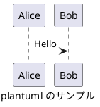

# Markdown のサンプル

これは、Markdown のサンプルです。

> [!NOTE]
> Markdown で PlantUML を記載する際には `@startuml` に続けて図のキャプション名を宣言しますが、Doxygen の場合は二重にキャプションが表示されてしまうため、宣言を省略してください。

```plantuml
@startuml
    caption plantuml のサンプル
    Alice->Bob: Hello
@enduml
```
