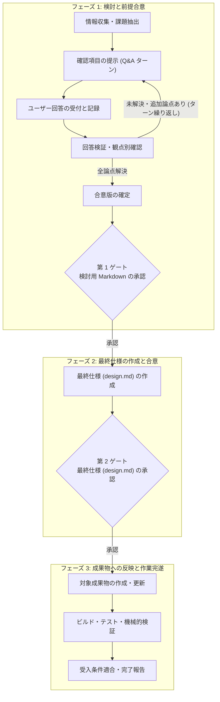

# 成果物生成前の前提合意

## 基本原則

成果物に必要な前提を多角的に検討し、ユーザーとの合意を検討用 Markdown (`対象となる事柄-discussion.md` または `案件ディレクトリ/discussion.md` を基本形とする) に記録してから生成・更新してください。

検討用 Markdown が生成・管理する作業 WBS は、最終決定事項 (最終仕様) を記載した `対象となる事柄-design.md` または `案件ディレクトリ/design.md` を基本形とします。検討用 Markdown のための情報収集と質問の実施、検討用 Markdown の承認の受付 (第 1 ゲート)、最終決定事項 (最終仕様) の作成、最終仕様の承認の受付 (第 2 ゲート) に続いて、最終決定事項に従って作業を完遂するまでの詳細な手順をチェックリスト形式で管理してください。

AI-DLC の質問による明確化を参考とする独自の汎用手順として扱い、AWS 公式スキルや v1 へ厳密に準拠していると表明しないでください。

AI は資料の読解、事実確認、不足や矛盾の検出、選択肢と推奨理由の提示を行います。ただし、ユーザーが示していない条件、判断、決定を補わないでください。これらは推奨案や源泉を明確にした意見の提示としてのみ許されます。慣行、既定値、推奨案、実装の容易さを採用の根拠にしてはなりません。不足、曖昧さ、矛盾はすべて Q としてユーザーに確認してください。事実の引用と、採用すべき方針の決定を明確に区別してください。

## 書き込みの境界

作業の進行段階に応じて、書き込み可能な対象を厳格に制限してください。

1. **検討用 Markdown 承認前 (第 1 ゲート前)**: 指定した検討用 Markdown (`対象となる事柄-discussion.md` または `案件ディレクトリ/discussion.md`) のみを作成・更新してください。対象成果物、参照資料、コード、設定、関連文書の新規作成・変更・削除を行ってはなりません。下書きや試作という名目であっても、セッション用の一時ファイル以外の検討用 Markdown の外へ出力してはなりません。必要な比較案や短い試案は検討用 Markdown 内に配置してください。資料を変更するコマンド、生成器、整形器、ビルドなども合意前に実行しないでください。セッション用の一時フォルダーに複製しての事前検証は許容します。
2. **最終仕様の作成中 (第 1 ゲート承認後 〜 第 2 ゲート前)**: 検討用 Markdown の承認を得た後、最終決定事項 (最終仕様) を記載した `対象となる事柄-design.md` (または `案件ディレクトリ/design.md`) のみを作成・更新してください。この段階でも、対象成果物 (ソース コードや既存文書など) への変更は一切行ってはなりません。
3. **最終仕様の承認後 (第 2 ゲート通過後)**: 最終仕様の承認を得た後、初めて最終仕様に従って対象成果物の作成・変更に着手してください。

検討文書には判断過程を、成果物 (最終決定事項を記載した `対象となる事柄-design.md` または `案件ディレクトリ/design.md`、および以降の対象成果物) には確定した内容を記載します。最終決定事項 (最終仕様) は、途中で覆った経緯や議論の推移を含めず、最終的に確定した仕様を構造的に論ずる構成としてください。重要な補足情報や意思決定の背景を残す場合は、本文の構造を崩さず、admonition (注記ブロック: `> [!NOTE]` や `> [!IMPORTANT]` など) で補ってください。検討用 Markdown を削除しても単体で意味が通る自己完結した文書とし、最終決定事項から検討用 Markdown への個別参照 (個々の記述や節からのリンクや言及) は原則として行わないでください。上流ドキュメントとして検討用 Markdown に 1 行言及する程度は問題ありません。成果物と検討文書は、検討 ID、合意版、パスで対応付けます。

## 検討の開始と再開

まず依頼内容、既存の検討文書、参照資料を確認してください。対象成果物、参照資料の版、今回の範囲、書き込み可能な検討用 Markdown (`対象となる事柄-discussion.md` または `案件ディレクトリ/discussion.md`) を記録します。ユーザーがすでに明示した内容は根拠とともに転記し、再回答を強制しないでください。ただし、新たな意味を含む解釈は Q として確認します。

新規の検討には `assets/discussion-template.md`、各質問には `assets/question-template.md` を参照して使用してください。検討用 Markdown の先頭には、検討用 Markdown のための情報収集と質問の実施、検討用 Markdown の承認の受付 (第 1 ゲート)、最終決定事項 (最終仕様) の作成 (`対象となる事柄-design.md` または `案件ディレクトリ/design.md`)、最終仕様の承認の受付 (第 2 ゲート)、続いて最終決定事項に従って作業を完遂するまでの詳細な手順をチェックリスト形式で設けてください。作業 WBS には抽象的な工程だけでなく、具体的な作業対象 (設計成果物や対象ファイル名など) を明記します。

質問は明確化のための確認項目とし、独立した見出しと安定した Q-ID を持つ単位として、1 件で 1 つの判断のみを求めます (1 問 1 判断)。1 つの検討用 Markdown 内に明確化のための確認項目を複数配置して構いません。確認対象をまとめた複合質問にしないでください。

Markdown 内には必要なファイル内リンクを設けてください。質問一覧テーブル、観点別確認表、関連質問の相互参照など、特に質問同士の依存関係や言及にはファイル内リンク (`[Q-XXX](#q-xxx-質問の短い題名)`) を必須とします。

再開時はユーザーが編集した最新版を読み直してください。前回参照した内容やチャット上の記憶で上書きしてはなりません。更新直前にも変更を確認し、競合を検出したら最新版に基づいて処理します。取得できない過去の内容や時刻を推測で補わないでください。

## 多角的な確認

次の各観点について、確認結果と根拠となる資料またはファイル内リンク付きの Q-ID を記録してください。

| 観点 | 確認事項 |
| --- | --- |
| 目的・利用者 | 誰が何のために使い、何を実現すればよいか |
| 範囲・境界 | 対象、対象外、変更可能範囲が明確か |
| 入力・根拠 | 必要な資料がそろい、版と適用範囲が明確か |
| 整合性・依存関係 | 回答同士、用語、上位資料、制約が整合するか |
| 実現性・例外 | 実現可能性、異常時、境界条件が明確か |
| 受入条件・検証 | 完成と正しさを確認する基準と方法があるか |

観点ごとに「確認済み」「未解決」「対象外」を示してください。対象外としての扱い、後回し、仮定の採用についても、ユーザーによる根拠の提示または回答を必須とします。質問がすべて回答済みであっても、観点の未確認や未解決があれば生成へ進まないでください。

## 質問と回答の形式

**Status** には現在の状態を単語の言い切り (「未回答」「未解決」「解決済み」など) で記述してください。「です・ます調」などの丁寧語は不要です。

**Question** には判断対象を 1 つのみ記述してください。**Context** には質問が必要な理由と影響を示します。専門用語を説明し、回答に必要な背景を省かないでください。

**Answer** には選択方式 (単一選択または複数選択の別) を明記し、代表的な選択肢を記述します。選択肢 ID は A, B, C 形式 (A, B, C) とし、`- [ ]` を付与します。推奨する選択肢がある場合は、選択肢テキストの先頭に `(推奨)` を付与してマークしてください (例: `- [ ] A: (推奨) 代表的な選択肢を記述する。`)。必ず「その他」と自由記入欄を設け、さらに `- [ ] X: 意図不明 (詳細な質問内容に再生成すること)` (選択肢 X) を設けてください。自由回答も正式な回答として受け付けます。「その他の回答」および「補足」をユーザーからフィードバックするための、`その他の回答 / 補足:` 欄を設けてください。

**Recommendation** には推奨する選択肢 ID (A など) と理由、重要な制約を示します。根拠が不足して推奨できない場合は、その不足を明記し、根拠のない推奨案を創作しないでください。推奨案であっても初期状態ではチェックを付けないでください。

**Related** には、関連する質問へのファイル内リンク (`[Q-XXX](#q-xxx-質問の短い題名)`)、参照資料、影響する決定を記述します。該当がなければ **Related** を設ける必要はありません。

Q の提示段階では、**Answer** の回答者、回答日時、および **Assessment**、**History** は記載しないでください。提示段階では意味のない情報であり、ユーザーに質問内容の判断に集中させるためです。これらはユーザーの回答後に追記・記録します。

## 回答の検証と追加質問

回答後は、**Answer** に回答者と回答日時 (JST ベースの日時 `YYYY-MM-DD HH:MM:SS JST`、通常の対話セッションでは Git ユーザー名、トランスクリプト反映時は発言者) を記録し、AI の検証結果として **Assessment** を追記してください。必要に応じて **History** も記録します。回答結果によって過去の質問に **Related** の追加が必要になった場合は、その際に対象の過去質問へ **Related** を追加して相互参照を更新してください。トランスクリプト (`.vtt`) は会議開始時からの相対時刻で記録されるため、絶対日時を特定するために必要があればユーザーに会議の開催日時を確認してください。

**Answer** はユーザーの意思表示、**Assessment** は AI の検証結果として分離してください。ユーザーが明示的に選んだ内容のみを `- [x]` にします。チャットやトランスクリプトから回答および補足事項を転記する場合は発言の出典を残し、推測を回答へ混入させないでください。回答を誘導する事前チェックを行わないでください。

回答後は、単一の Q だけでなく、過去の回答、現行の合意要約、参照資料を横断して再検証してください。回答済みと解決済みを区別します。

未回答、単一選択の複数チェック、自由記述との不一致、「その他」の具体内容不足、曖昧な条件、資料との矛盾は未解決とします。AI が優先順位を決定したり、不足した値を補ったりしないでください。それぞれ 1 つの判断を問う追加 Q を作成します。例えば再試行の実施が決まっても、回数と間隔は別々の Q としてください。

質問に推奨案 (**Recommendation**) が明確に提示されており、ユーザーから「おまかせ」あるいはこれに準じる回答 (「お任せ」「適切に」「推奨で」など) がなされた場合は、その回答を以て推奨案の採用として方針を確定してください。この場合、再確認の質問は不要です。検討用 Markdown の当該質問を推奨案の選択 (`- [x]`) として確定し、対話の応答で推奨案に基づいて回答を自動選定した旨を報告してください。一方、推奨案が明示されていない場合や採用対象が一意でない場合は、具体的な提案を追加 Q にして確認してください。沈黙、経過時間、単なる「続けて」といった指示を、未解決事項の承認とみなさないでください。

## 再質問と補足質問の扱い

再質問、過去の質問に対する補足質問、および意図不明に伴う再生成質問は、過去のやり取りを編集させず、新たな質問番号 (Q-ID) で継続してください。過去の Q&A は確定した記録としてそのまま残し、改変しないでください。

新たな質問から過去の質問への参照は、ファイル内リンク (`[Q-XXX](#q-xxx-質問の短い題名)`) を用いて関連 (**Related**) や背景 (**Context**) に示します。過去の質問側にも必要に応じて **Related** を追加し、双方向の参照関係を維持します。

Q&A のターンごとに、ユーザーの回答や方針決定を踏まえて作業 WBS の見直し要否を判断してください。作業対象の追加・変更や工程の詳細化が必要であれば、適宜作業 WBS を見直して更新します。

質問文と選択肢の意図は原則として固定し、回答後に定義を変更しないでください。新たな判断には新しい Q-ID を用います。

## 「意図不明」による質問再生成

ユーザーが **Answer** の選択肢 X (「意図不明」) を選択した場合は、そのターンでの回答 (その他の回答 / 補足や発言など) を踏まえて、背景、用語説明、選択肢、推奨理由をより具体化した新たな Q-ID の質問として再生成してください。

意図不明とされた元の Q は「回答済み」として確定扱いとし、以降のターンで過去の質問に回答を記入させないでください。

新たな質問の **Context** や **Related** に、意図不明とされた元の Q へのファイル内リンク (`[Q-XXX](#q-xxx-質問の短い題名)`) を記載し、再生成の経緯と具体化した点を明記します。元の質問と新しい質問を独立した履歴として残すことで、過去のやり取りを改変せずに検討の推移を完全に保持します。

## 二段階の合意ゲートと進行順序

前提合意から成果物の生成・更新に至る手順は、必ず次の二段階の承認ゲートを経て進行してください。検討文書の承認時点で対象成果物の変更を一括承認させたり、最終仕様の作成と対象成果物の変更を同時に着手したりしてはなりません。

CodeBlock: 前提合意から作業完遂までの二段階ゲート進行フロー

### 第 1 ゲート: 検討用 Markdown の承認

すべての確認観点に根拠があり、必要な決定に未解決事項がないことを検証してください。未確定事項を対象外、後続判断、仮定として扱う場合も、その扱いに対するユーザーの承認を必須とします。必須の前提が不足したまま作業を進めないでください。

検討用 Markdown に確定内容、更新対象、受入条件、根拠となる Q-ID (ファイル内リンク付き) をまとめ、検討文書の合意版を特定します。対話セッションにおいて、**「検討用 Markdown の確定内容 (方針・前提条件) を承認してよいか」のみを確認** してください。

**禁止事項**:

- 検討用 Markdown の承認受付と同時に、対象成果物への変更着手を求めてはなりません。
- 最終仕様の作成と対象成果物の変更を一括で承認させてはなりません。
- 複数の未決事項を一括承認で解消してはなりません。

### 最終仕様 (design.md) の作成

第 1 ゲートでユーザーの承認を得た後は、検討用 Markdown の作業 WBS の第 1 ゲート項目をチェック (`- [x]`) し、最終決定事項 (最終仕様) を記載した `対象となる事柄-design.md` (または `案件ディレクトリ/design.md`) を作成してください。

設計書は最終的に確定した仕様を構造的に論ずる構成とし、議論の推移は含めず、重要な補足情報や意思決定の背景は admonition (注記ブロック) で補います。検討用 Markdown を削除しても単体で意味が通る自己完結した文書とし、検討用 Markdown への個別参照は原則として行わないでください (上流ドキュメントとして 1 行言及する程度は問題ありません)。

**禁止事項**:

- この段階では最終仕様書の作成のみを行い、対象成果物 (ソース コード、設定、既存文書など) への書き込みを行ってはなりません。
- 最終仕様書内から検討用 Markdown の個々の質問や記述への個別参照を設けてはなりません。

### 第 2 ゲート: 最終仕様 (design.md) の承認

作成した最終仕様 (`対象となる事柄-design.md` または `案件ディレクトリ/design.md`) を対話セッションで提示し、**「この最終仕様に従って対象成果物の作成・更新に着手してよいか」のみを確認** してください。

ユーザーから最終仕様に対する明確な承認を得るまで、対象成果物への変更に着手してはなりません。承認後に前提や参照資料が変更された場合は影響を再検証し、関係する合意を再確認対象に戻します。

### 承認後の作業進行と進捗管理 (作業完遂)

第 2 ゲートでユーザーの承認を得た後は、作業 WBS の第 2 ゲート項目をチェック (`- [x]`) し、承認された最終仕様に従って対象成果物の生成・更新作業に着手してください。ユーザーが承認した版と範囲のみを生成・更新します。

作業の進行に従って検討用 Markdown 先頭の作業 WBS チェックリストを順次更新 (`- [x]`) します。各作業項目の着手前と完了後に該当するチェック ボックスを更新し、進捗状況を可視化してください。

生成中に新たな判断が必要になった場合や問題が発生した場合は、対象成果物への書き込みを中断し、該当する WBS 項目や検討用 Markdown の Q の状態を更新してユーザーに確認してください。変更済みの範囲と停止位置を記録し、独断で修正や巻き戻しを行わないでください。生成後は合意内容および受入条件と照合します。前提合意と成果物の受入を区別し、生成しただけで受入済みとしないでください。

## 出力品質と文書管理

作成する文書 (検討用 Markdown および設計書) は、原則として「です・ます調」の文体で記述してください (見出し、表のセル、コード ブロック、短いリスト項目などは体言止めや常体を使用して構いません)。ただし、状態表示 (各質問の **Status** や検討文書メタデータの `状態:`) は「です・ます調」にせず、単語の言い切り (「未回答」「未解決」「解決済み」「検討中」「合意済み」など) で記述してください。

ユーザーの使用言語で、具体的かつ回答可能な問いを記述してください。質問待ちの応答では検討文書と未解決 Q-ID をファイル内リンク付きで案内します。内部の逐語的思考ではなく、検証可能な根拠、選択理由、決定、変更履歴を記録してください。Markdown ファイルは文字コード UTF-8、LF 改行とし、末尾を空行で終えてください。

Q&A の各ターンで文章を生成・更新する都度、機械的なフォーマット チェック (text_style_jp 等) を実行する必要はありません。検討用 Markdown の初期作成時や、最終承認時の文書確定時などの節目においてフォーマット チェックを実施してください。

## 出典

参考にした公開資料と本対話による独自ルールは [references/sources.md](references/sources.md) に記録します。出典、AWS との対応関係、準拠範囲を説明または変更する際に参照してください。
