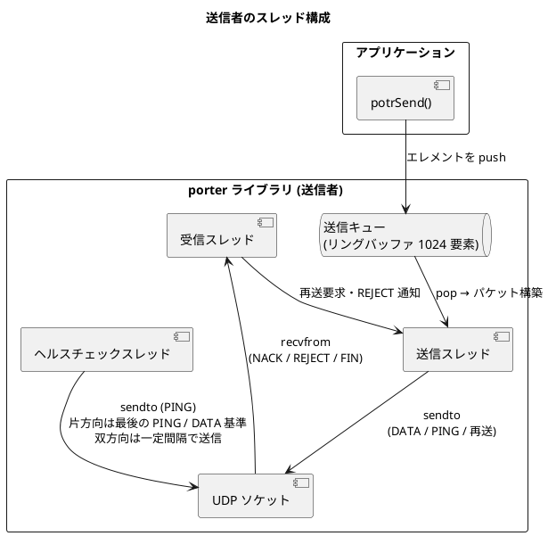
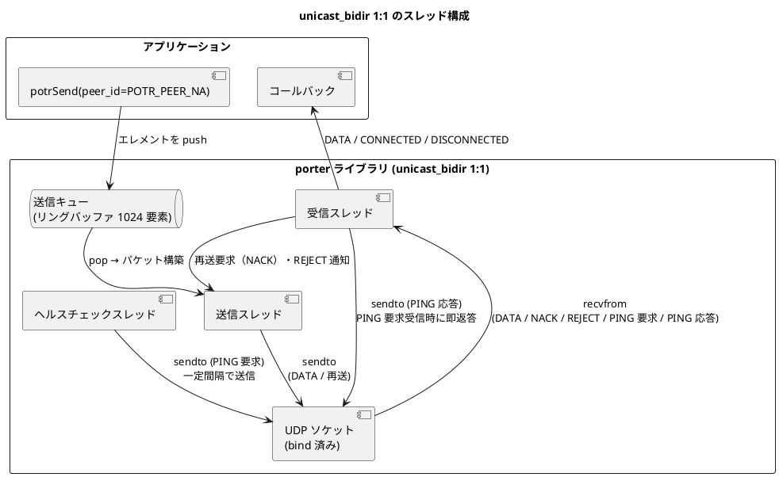
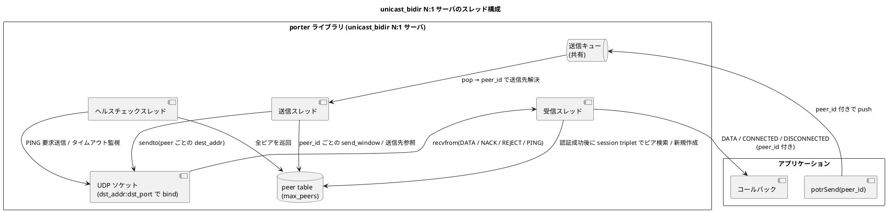
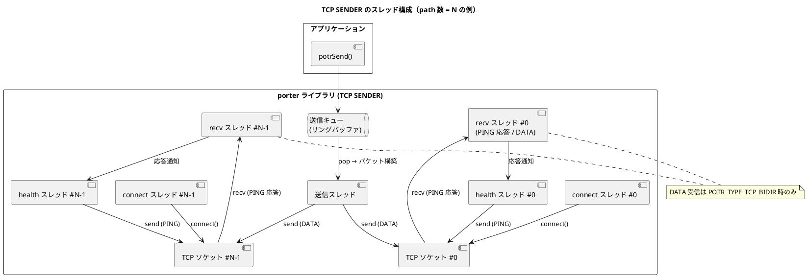
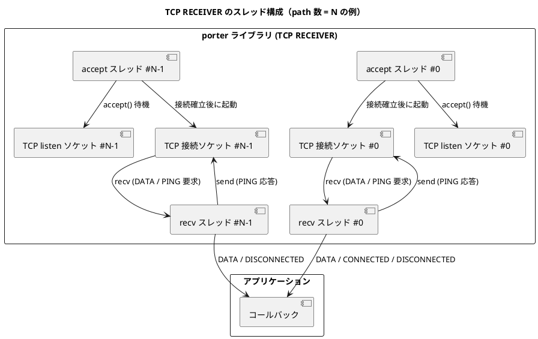
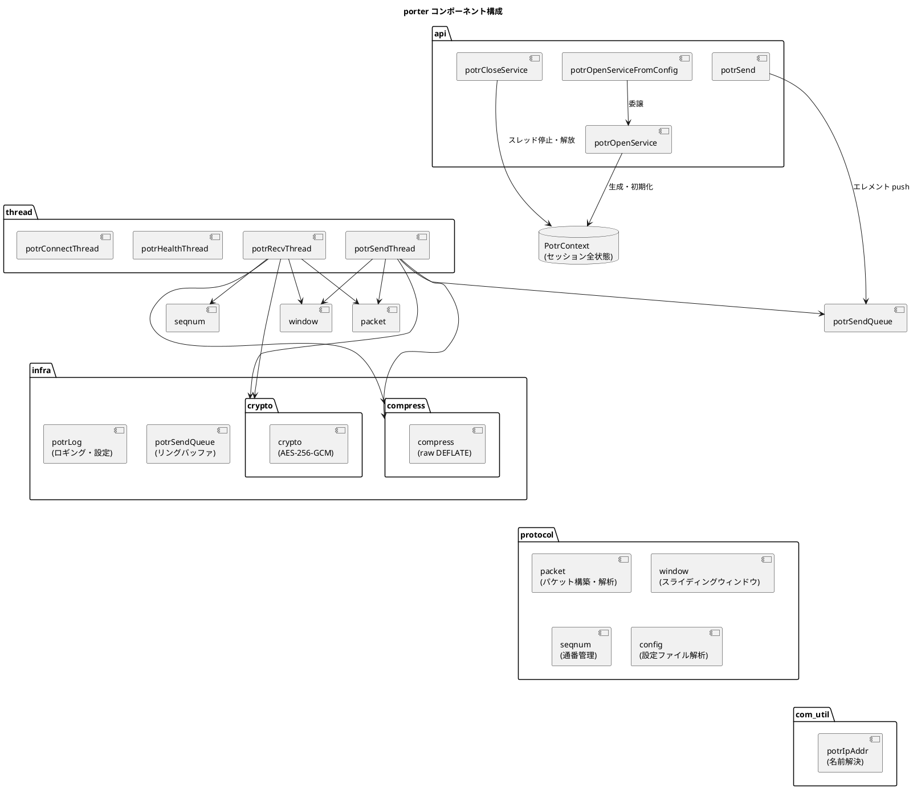

# アーキテクチャ設計

## 概要

porter は、アプリケーションと UDP ソケット層の間に抽象レイヤーを置き、非同期送受信・再送制御・ヘルスチェックを透過的に提供します。
アプリケーションは `potrOpenService()` または `potrOpenServiceFromConfig()` でサービスを開き、送信側は `potrSend(handle, peer_id, ...)` を呼び出すだけで、内部スレッドが送受信・再送・ヘルスチェックをすべて担います。1:1 モードおよび他通信種別では `peer_id` に `POTR_PEER_NA` を指定し、`unicast_bidir` の N:1 モードでは接続中ピアの `peer_id` を指定します。

## 役割モデル

porter は通信の参加者を **送信者 (SENDER)** と **受信者 (RECEIVER)** に区別します。

| 役割 | 説明 |
|---|---|
| SENDER | `potrSend()` でデータを送出する。ヘルスチェック PING を送信する。 |
| RECEIVER | 到着したパケットをコールバックで上位層へ渡す。NACK で再送を要求する。 |

1:1 (ユニキャスト) 通信では送信者 1 : 受信者 1 の構成となります。
1:N (マルチキャスト・ブロードキャスト) 通信では送信者 1 : 受信者 N の構成となります。

### unicast_bidir における役割の解釈

`POTR_TYPE_UNICAST_BIDIR` には **1:1 モード** と **N:1 モード** があります。

- 1:1 モードでは、両端が送受信・NACK・ヘルスチェックを独立して行います。`POTR_ROLE_SENDER` / `POTR_ROLE_RECEIVER` は設定上のラベルであり、データ方向そのものを制約しません
- N:1 モードでは、サーバ側は `src_addr` を省略した `POTR_ROLE_RECEIVER` として開かれ、クライアントごとの状態はピアテーブルで管理されます

| モード | Role / 設定の意味 |
|---|---|
| 1:1 | `POTR_ROLE_SENDER` は `src_addr:src_port` で bind し、`dst_addr:dst_port` へ送信する側。`POTR_ROLE_RECEIVER` は `dst_addr:dst_port` で bind し、必要に応じて送信元を学習して返信する側 |
| N:1 | サーバは `POTR_ROLE_RECEIVER` として `dst_addr:dst_port` で待ち受ける。各クライアントは従来どおり `src_addr` を持つ `unicast_bidir` エンドポイントとして接続する |

> UDP は無接続であるため、1:1 モードではどちらの端が先に `potrOpenServiceFromConfig()` / `potrOpenService()` を呼んでも動作に違いはありません。N:1 モードではサーバが受信ソケットを先に開いて待ち受ける運用が自然です。

### TCP 通信種別における役割の解釈

`POTR_TYPE_TCP` / `POTR_TYPE_TCP_BIDIR` では Role は **TCP 接続方向のみ** を意味します。

| Role | TCP の役割 | データ送受信 |
|---|---|---|
| `POTR_ROLE_SENDER` | TCP クライアント（`connect()`） | tcp: 送信のみ / tcp_bidir: 送受信 |
| `POTR_ROLE_RECEIVER` | TCP サーバー（`listen()` → `accept()`） | tcp: 受信のみ / tcp_bidir: 送受信 |

UDP は無接続のため先に開いた方が待機するだけですが、TCP では RECEIVER が先に `potrOpenServiceFromConfig()` / `potrOpenService()` を呼んで `listen()` に入っている必要があります。

## スレッド構成

### 送信者のスレッド



| スレッド | 役割 |
|---|---|
| 送信スレッド | 送信キューからエレメントを取り出し、DATA パケットを構築して全パスへ sendto する |
| 受信スレッド | NACK / REJECT / FIN / FIN_ACK などの制御パケットを処理し、再送・close 完了通知・DISCONNECTED 発火を行う |
| ヘルスチェックスレッド | 非 TCP は 1 サービス 1 本。片方向 type 1-6 は最後の PING / 有効 DATA 送信時刻を監視して期限到達時だけ PING を送信し、双方向系は一定間隔で PING を送信する |

### 受信者のスレッド

受信者が起動するスレッドは **受信スレッド 1 本のみ** です。
ただし `POTR_TYPE_UNICAST_BIDIR` の RECEIVER は、SENDER と同等のスレッド構成（送信スレッド・ヘルスチェックスレッドを含む 3 本）を起動します（後述「unicast_bidir のスレッド構成」参照）。

受信スレッドが担う処理：

- DATA パケットの受信・受信ウィンドウへの格納・フラグメント結合・コールバック呼び出し
- 欠番検出と NACK 送出 (reorder_timeout_ms > 0 の場合は待機後に送出)
- RAW モードのギャップ検出による `POTR_EVENT_DISCONNECTED` 発火 (reorder_timeout_ms > 0 の場合は待機後に発火)
- FIN / REJECT パケット受信による `POTR_EVENT_DISCONNECTED` 発火
- ヘルスチェックタイムアウト監視による `POTR_EVENT_DISCONNECTED` 発火
- リオーダーバッファタイムアウト監視 (reorder_timeout_ms > 0 の場合): 欠番待機中に期限超過したら NACK 送出または DISCONNECTED 発火

### unicast_bidir のスレッド構成

#### 1:1 モード

`POTR_TYPE_UNICAST_BIDIR` の 1:1 モードでは、両端が対称な 3 スレッド構成を持ちます。



#### N:1 サーバモード

N:1 モードではサーバ側に 1 つの共有スレッド群があり、各ピアの状態は `peer_id` ごとにピアテーブルへ分離して保持されます。



| スレッド | 役割 |
|---|---|
| 送信スレッド | 共有送信キューから `peer_id` 付きエレメントを取り出し、対応するピアの送信先へ `sendto` する。`POTR_PEER_ALL` は `potrSend()` 呼び出し時点で全ピア分に展開される |
| 受信スレッド | `recvfrom` 後に暗号化必須判定と GCM 認証を行い、成功したパケットだけを session triplet (`session_id` + `session_tv_sec` + `session_tv_nsec`) でピア特定する。未知セッションは DATA / PING のみ新規ピア作成対象とする |
| ヘルスチェックスレッド | 非 TCP の共有 1 本が接続中の各ピアを巡回し、`health_interval_ms` に従って PING を送信し、`health_timeout_ms` 超過で個別に切断を検知する。双方向 UDP ではこの定周期 PING が接続確立の前提であり、実効 `health_interval_ms = 0` のままでは `CONNECTED` しない |

### TCP / TCP_BIDIR のスレッド構成

TCP では接続確立・再接続を担う **connect スレッド**（RECEIVER 側では **accept スレッド**）が追加されます。
接続確立後に send / recv / health スレッドを起動し、切断後は停止する「接続ライフサイクル管理」を担います。

#### TCP SENDER のスレッド

path 数 N（最大 `POTR_MAX_PATH = 4`）の例。各 path に独立した connect・recv・health スレッドが起動します。
送信スレッドは 1 本だけ起動し、全アクティブ path への送信を担います。



| スレッド | 数 | 役割 |
|---|---|---|
| connect スレッド | N | path ごとに起動。`connect()` で接続を確立し、成功したら recv / health スレッドを起動する。切断後は `reconnect_interval_ms` 待機して再試行する |
| 送信スレッド | 1 | 全 path 共有。送信キューからエレメントを取り出し、全アクティブ path にループ送信する。各 path の送信前に `poll()` で書き込み可能を確認し、バッファ満杯の path はスキップする（他 path への送信は続行） |
| recv スレッド | N | path ごとに起動。PING 応答（`ack_num > 0`）を受信して対応する health スレッドに通知する。TCP 接続断を検知したら `tcp_active_paths` をデクリメントし、0 になった時点で `POTR_EVENT_DISCONNECTED` を発火する |
| health スレッド | N | path ごとに起動。`tcp_health_interval_ms` 周期で PING 要求を送信する。`tcp_health_timeout_ms` 以内に応答が届かなければその path の接続断と判定して `shutdown()` する |

**スレッド数の合計**（SENDER、path 数 N のとき）:

| スレッド種別 | 数 |
|---|---|
| connect スレッド | N |
| 送信スレッド | 1（全 path 共有） |
| recv スレッド | N |
| health スレッド | N |
| **合計** | **3N + 1** |

#### TCP RECEIVER のスレッド



| スレッド | 数 | 役割 |
|---|---|---|
| accept スレッド | N | path ごとに起動。`listen()` ソケットで `accept()` を待機し、接続確立後に recv スレッドを起動する |
| recv スレッド | N | path ごとに起動。ヘッダー読み取り → ペイロード読み取りの 2 ステップで受信する。`recv_window_mutex` で保護しながら `window_recv_push()` で重複排除する。`ack_num=0` の PING 要求に即応答し、`tcp_health_timeout_ms` 以内に PING 要求が届かない場合は接続断と判定する |

#### TCP_BIDIR のスレッド構成

両端が対称なスレッド構成（connect スレッド × N + 送信 + 受信 × N + ヘルスチェック × N）を持ちます。

| 通信種別 | Role | connect スレッド | 送信スレッド | recv スレッド | health スレッド |
|---|---|---|---|---|---|
| TCP | SENDER | N 本（connect/再接続） | 1 本（接続後起動） | N 本（接続後起動） | N 本（接続後起動） |
| TCP | RECEIVER | N 本（accept ループ） | × | N 本（接続後起動） | × |
| TCP_BIDIR | SENDER | N 本（connect/再接続） | 1 本（接続後起動） | N 本（接続後起動） | N 本（接続後起動） |
| TCP_BIDIR | RECEIVER | N 本（accept ループ） | 1 本（接続後起動） | N 本（接続後起動） | N 本（接続後起動） |

#### TCP 接続管理

**CONNECTED / DISCONNECTED イベントの発火条件**

アクティブ path 数（`tcp_active_paths`）をカウンタで管理します。
カウンタの更新は `tcp_state_mutex` で保護します。

| イベント | 発火条件 |
|---|---|
| `POTR_EVENT_CONNECTED` | アクティブ path 数が 0 → 1 になった時（最初の 1 本が接続した瞬間） |
| `POTR_EVENT_DISCONNECTED` | アクティブ path 数が 1 → 0 になった時（最後の 1 本が切れた瞬間） |

2 本目以降の接続確立・切断では上記イベントは発火しません。

**部分切断時のセッション継続**

残存する path が存在する間は `session_id` / `session_tv_*` を保持し続けます。
再接続した path は既存セッションに合流するため、`POTR_EVENT_CONNECTED` は再発火しません。
全 path が切断した時点で `session_tv_*` をリセットし、
次回の接続は新セッションとして扱います（`POTR_EVENT_CONNECTED` が再発火します）。

RECEIVER 側は、接続時の session triplet（`session_id + session_tv_sec + session_tv_nsec`）が
既知のセッションと一致した場合にセッション初期化をスキップして既存コンテキストに合流します。

**送信スレッドのバッファ満杯対策**

単一の送信スレッドが全 path に逐次 `tcp_send_all()` を呼ぶため、
特定 path の TCP 送信バッファが満杯になると他 path への送信も遅延します。
これを避けるため、各 path への送信前に `poll()` で書き込み可能かを確認し、
書き込み不可の path はその送信をスキップします（他 path への冗長送信で補完）。
バッファ満杯を初回検出した時点で ERROR ログを 1 回出力し、
書き込み可能が 10 回連続するまでログを抑制します（`buf_full_suppress_cnt[POTR_MAX_PATH]`）。

## コンポーネント構成



## セッションコンテキスト (PotrContext)

porter の全状態は `PotrContext` 構造体 (`PotrHandle` の実体) に集約されます。
この構造体はアプリケーションには不透明 (opaque) であり、内部実装のみがアクセスします。

| カテゴリ | 保持する情報 |
|---|---|
| 設定 | サービス定義 (通信種別・アドレス・ポート・暗号化鍵) 、グローバル設定 (ウィンドウサイズ・ヘルスチェック間隔) |
| ソケット | 最大 4 パス分の UDP ソケット |
| スレッド | 受信・送信・ヘルスチェックスレッドハンドル |
| ウィンドウ | 送信ウィンドウ・受信ウィンドウ (各パケットのコピーを保持) |
| 送信キュー | ペイロードエレメントのリングバッファ (1024 要素) |
| セッション状態 | 自セッション ID / 相手セッション ID・開始時刻 |
| 接続状態 | `health_alive` (1: 疎通中、0: 未接続または切断) |
| ヘルスチェック | 最終送信時刻・最終受信時刻 (パス別) |
| フラグメントバッファ | フラグメント結合用バッファ (最大 65,535 バイト) |
| 圧縮バッファ | 圧縮・解凍作業バッファ (約 65 KB) |
| 暗号バッファ | 暗号化・復号作業バッファ (max_payload + 16 バイト) |
| NACK 重複抑制 | 直近 NACK のリングバッファ (8 要素) |
| リオーダー状態 | `reorder_pending` フラグ・待機通番・タイムアウト期限 (`reorder_timeout_ms > 0` のときのみ使用) |

> **TCP 通信種別について**: `POTR_TYPE_TCP` / `POTR_TYPE_TCP_BIDIR` では以下の追加フィールドを保持します。
>
> | フィールド | 説明 |
> |---|---|
> | `tcp_listen_sock[POTR_MAX_PATH]` | RECEIVER の listen ソケット（path ごと） |
> | `tcp_conn_fd[POTR_MAX_PATH]` | アクティブ接続ソケット（path ごと） |
> | `tcp_active_paths` | アクティブ TCP path 数（0 = 全切断） |
> | `tcp_send_mutex[POTR_MAX_PATH]` | TCP `send()` の排他制御（path ごと。送信スレッド・health スレッド・recv スレッドの競合防止） |
> | `recv_window_mutex` | recv_window 保護（複数 recv スレッドが同一 recv_window に並行アクセスするための排他制御） |
> | `connect_thread[POTR_MAX_PATH]` | connect / accept スレッドハンドル（path ごと） |
> | `health_mutex[POTR_MAX_PATH]` / `health_wakeup[POTR_MAX_PATH]` | health スレッドのスリープ制御（path ごと） |
> | `tcp_state_mutex` / `tcp_state_cv` | `tcp_active_paths` カウンタ保護・connect スレッドへの切断通知用 |
> | `tcp_last_ping_recv_ms[POTR_MAX_PATH]` | PING 応答最終受信時刻（ms, monotonic。path ごと。SENDER health スレッドが監視） |
> | `tcp_last_ping_req_recv_ms[POTR_MAX_PATH]` | RECEIVER が最後に PING 要求を受信した時刻（ms, monotonic。path ごと。recv スレッドが PING 到着タイムアウト監視に使用） |
> | `buf_full_suppress_cnt[POTR_MAX_PATH]` | 送信バッファ満杯 ERROR ログの抑制カウンタ（path ごと） |

> **unicast_bidir について**: 1:1 モードの `POTR_ROLE_RECEIVER` は送信ウィンドウ・送信キュー・送信スレッド・ヘルスチェックスレッドも保持します。N:1 モードではさらに `is_multi_peer`、`peers`、`max_peers`、`peers_mutex` などの共有管理情報を持ち、各ピアの詳細状態は `PotrPeerContext` に分離されます。

## クロスプラットフォーム抽象化

`potrContext.h` でプラットフォーム差異を抽象化し、上位層はプラットフォームを意識しません。

| 機能 | Linux | Windows |
|---|---|---|
| ソケット型 (`PotrSocket`) | `int` | `SOCKET` |
| 無効ソケット値 | `-1` | `INVALID_SOCKET` |
| スレッド型 (`PotrThread`) | `pthread_t` | `HANDLE` |
| ミューテックス型 (`PotrMutex`) | `pthread_mutex_t` | `CRITICAL_SECTION` |
| 条件変数型 (`PotrCondVar`) | `pthread_cond_t` | `CONDITION_VARIABLE` |
| ソケット初期化 | 不要 | `WSAStartup()` |
| ソケットクローズ | `close()` | `closesocket()` |
| 単調時間 (ヘルスチェック用) | `clock_gettime(CLOCK_MONOTONIC, ...)` | `GetTickCount64()` |
| カレンダー時刻 (セッション ID 用) | `clock_gettime(CLOCK_REALTIME, ...)` | `GetSystemTimeAsFileTime()` |
| 呼び出し規約 (`POTRAPI`) | (なし) | `__stdcall` |
| 暗号化 (`crypto` モジュール) | OpenSSL EVP AES-256-GCM | Windows CNG (BCrypt) AES-256-GCM |

## データフロー概要

### 送信フロー

```
アプリ
 | potrSend(peer_id, data, len, flags)
 ▼
[圧縮] --- flags に POTR_SEND_COMPRESS が指定された場合、メッセージ全体を raw DEFLATE 圧縮
 |
[フラグメント化] --- データが max_payload を超える場合に分割
 |                    各フラグメントにエレメントヘッダー (6 バイト) を付与
 |
[送信キュー push] --- ペイロードエレメントとして積む
 |                    POTR_SEND_BLOCKING なし: キュー満杯時は空き待ち
 |                    POTR_SEND_BLOCKING あり: 事前に drained 待ち → 積む → sendto 完了待ち
 ▼
[送信スレッド] --- キューから pop
 |               複数エレメントを 1 パケットにパッキング
 |               seq_num 付与・送信ウィンドウに登録
 |               encrypt_key が設定されている場合: AES-256-GCM 暗号化
 ▼
[UDP sendto] --- 全パス (最大 4 経路) に並列送信
```

### 受信フロー

```
[UDP recvfrom] --- 各パスのソケットから受信
 |
[検証] --- service_id 照合 → 不一致は破棄
 |         送信元 IP フィルタ → 不一致は破棄
 |         encrypt_key 設定時は POTR_FLAG_ENCRYPTED 必須
 |         AES-256-GCM 復号・認証タグ検証
 |         (平文・認証失敗パケットは即座に破棄)
 |         セッション識別 → 旧セッションは破棄、新セッションはウィンドウリセット
 |
[種別振り分け]
 +- DATA --→ 受信ウィンドウへ格納
 |            【通常モード】欠番検出 → NACK 送出 → 再送待機
 |                          (reorder_timeout_ms > 0 の場合: 待機タイマー開始 → 期限後に NACK)
 |            【RAW モード】欠番検出 → DISCONNECTED 発火 → ウィンドウリセット
 |                          (reorder_timeout_ms > 0 の場合: 待機タイマー開始 → 期限後に DISCONNECTED)
 |            ↓ 連続した通番が揃ったら順番に取り出し
 |           フラグメント結合・解凍
 |            ↓
 |           コールバック POTR_EVENT_DATA
 |
 +- PING --→ 最終受信時刻を更新 (返信なし)
 |            【通常モード】seq_num を上限に欠番を一括 NACK
 |                          (reorder_timeout_ms > 0 の場合: 各欠番にタイマー確認を適用)
 |            【RAW モード】seq_num > next_seq の場合 DISCONNECTED 発火 → ウィンドウリセット
 |                          (reorder_timeout_ms > 0 の場合: 待機タイマー開始 → 期限後に DISCONNECTED)
 |
 +- FIN  --→ 必要なら pending_fin\n           target 到達後に POTR_EVENT_DISCONNECTED 発火\n(TCP は FIN_ACK 返送)
 |
 +- NACK --→ 送信ウィンドウから該当パケットを検索
 |            存在すれば再送 / 存在しなければ REJECT 送出
 |
 +- REJECT -→ POTR_EVENT_DISCONNECTED 発火 (受信者側)
```

## 型定数

### PotrType

```c
typedef enum {
    POTR_TYPE_UNICAST_RAW     = 1,  /* UDP 再送制御無し */
    POTR_TYPE_MULTICAST_RAW   = 2,
    POTR_TYPE_BROADCAST_RAW   = 3,
    POTR_TYPE_UNICAST         = 4,  /* UDP 再送制御あり */
    POTR_TYPE_MULTICAST       = 5,
    POTR_TYPE_BROADCAST       = 6,
    POTR_TYPE_UNICAST_BIDIR   = 7,  /* UDP 双方向 */
    POTR_TYPE_UNICAST_BIDIR_N1 = 8, /* UDP 双方向 N:1 */
    POTR_TYPE_TCP             = 9,  /* TCP */
    POTR_TYPE_TCP_BIDIR       = 10, /* TCP 双方向 */
    /* POTR_TYPE_TCP_BIDIR_N1 = 11, */ /* TCP 双方向 N:1 (将来) */
} PotrType;
```

### unicast_bidir における RECEIVER の追加フィールド

`POTR_TYPE_UNICAST_BIDIR` の `POTR_ROLE_RECEIVER` は、通常の RECEIVER が持たない以下のフィールドを追加で保持します。

```c
PotrSendQueue     send_queue;       /* 送信キュー */
PotrSendWindow    send_window;      /* 送信ウィンドウ */
PotrThread        send_thread;      /* 送信スレッド */
PotrThread        health_thread;    /* ヘルスチェックスレッド */
PotrMutex         health_mutex;
PotrCondVar       health_wakeup;
```

### コールバック要件

`POTR_TYPE_UNICAST_BIDIR` では両端ともコールバックが必須です。

```c
/* SENDER 側 (設定ファイル使用) */
potrOpenServiceFromConfig("config.conf", 4020, POTR_ROLE_SENDER, on_recv, &handle);

/* RECEIVER 側 (設定ファイル使用) */
potrOpenServiceFromConfig("config.conf", 4020, POTR_ROLE_RECEIVER, on_recv, &handle);
```

## 通信種別の比較

| 項目 | unicast | tcp | tcp_bidir | unicast_bidir |
|---|---|---|---|---|
| トランスポート | UDP | TCP | TCP | UDP |
| データ方向 | 一方向 | 一方向 | 双方向 | 双方向 |
| 接続確立 | なし | TCP 3way | TCP 3way | なし |
| NACK / 再送 | ○（RECEIVER → SENDER） | × | × | ○（双方向） |
| スライディングウィンドウ | ○ | × | × | ○（両端） |
| PING 応答 | なし | ○（`ack_num` で区別） | ○（双方向、`ack_num`） | ○（双方向、`ack_num`） |
| ヘルスタイムアウト | RECEIVER 監視 | SENDER 監視 | 両端監視 | 両端監視 |
| 監視方法 | `last_recv_tv_sec` | PING 応答タイムアウト | PING 応答タイムアウト | `last_recv_tv_sec` |
| src_port | 省略可（SENDER）/ 必須（RECEIVER） | 無視 | 無視 | 1:1 は省略可、N:1 では送信元ポートフィルタとして任意 |
| 自動再接続 | なし | ○（SENDER） | ○（SENDER） | なし |
| マルチパス | ○（最大 4 経路） | ○（最大 4 経路） | ○（最大 4 経路） | ○（最大 4 経路） |
| コールバック | RECEIVER 必須 | RECEIVER 必須（SENDER 任意） | 両端必須 | 両端必須（N:1 は `peer_id` 付き） |

---

## UDP / TCP 機能共有状況

各機能ブロックが UDP・TCP のどれで使われるかを示します。

| 機能ブロック | UDP | TCP | 備考 |
|---|---|---|---|
| `flush_packed()` | ✅ | ✅ | `is_tcp` フラグで送信部分を分岐。TCP は全アクティブ path にループ送信 |
| `health_thread_func()` | ✅ | ✅ | `potr_is_tcp_type()` で分岐済み |
| `deliver_payload_elem()` | ✅ | ✅ | 完全共有 |
| `packet_parse()` | ✅ | ✅ | 完全共有 |
| `window_recv_push/pop()` | ✅ | ✅ | TCP では複数 path からの重複排除に使用。`recv_window_mutex` で保護 |
| `window_send_push()` | ✅ | ❌ | NACK 再送バッファ用。TCP は不要（TCP がトランスポート保証） |
| `recv_thread_func()` | ✅ | ❌ | UDP 専用（`select` + `recvfrom`） |
| `tcp_recv_thread_func()` | ❌ | ✅ | TCP 専用。path 数分起動 |
| `sender_connect_loop()` | ❌ | ✅ | TCP SENDER 専用 |
| `receiver_accept_loop()` | ❌ | ✅ | TCP RECEIVER 専用 |

### window の使用目的の違い

| 目的 | UDP | TCP |
|---|---|---|
| 重複排除 | ✅ | ✅（複数 path からの重複排除） |
| 順序整列 | ✅ | ✅ |
| NACK 再送 | ✅ | ❌ |
| `window_send_push()` | ✅ | ❌ |

TCP は各接続でトランスポート層が再送を保証するため `window_send_push()` は不要。
`window_recv_push/pop()` は複数 path からの重複排除・順序整列のみを目的として使用する。

---

## TCP 処理フロー

### TCP 送信フロー

```
potrSend()
  → フラグメント化 → send_queue.push()
    → send_thread_func() → flush_packed()
        ├─ UDP: sock[i].sendto()                          (全 path)
        └─ TCP: tcp_send_all(tcp_conn_fd[i]) (全 path、send() 前に poll() でブロック回避)
```

### TCP 受信フロー

```
tcp_recv_thread_func(path_idx)  ← path ごとに 1 スレッド起動
  → tcp_wait_readable(tcp_conn_fd[path_idx])
  → tcp_read_all()
  → packet_parse()
  → encrypt_key 設定時は POTR_FLAG_ENCRYPTED を確認
  → AES-256-GCM 復号 / tag-only 検証
  → [recv_window_mutex lock]
  → window_recv_push()          ← 重複排除 + 順序整列（複数 path 対応、NACK なし）
  → window_recv_pop()
  → deliver_payload_elem()      ← コールバック呼び出し前に unlock
  → callback(POTR_EVENT_DATA)
  → [recv_window_mutex unlock]
```

---

## スレッド起動タイミング

| スレッド | UDP | TCP |
|---|---|---|
| connect / accept | なし | `potrOpenService()` 時に path 数分 |
| recv | `potrOpenService()` 時に 1 本 | path 接続ごとに 1 本（`start_connected_threads()` 内） |
| send | `potrOpenService()` 時に 1 本 | 最初の path 接続後（全 path 共有 1 本） |
| health | `potrOpenService()` 時に 1 本 | path 接続ごとに 1 本（`start_connected_threads()` 内） |

UDP は `potrOpenService.c` が直接全スレッドを起動する。
TCP は ConnectThread が接続確立後に `start_connected_threads()`（`potrConnectThread.c`）を呼んで
recv/send/health の各スレッドを起動する。

---

## n_path 決定ロジック

`potrOpenService.c` にて `dst_addr[i]` の非空エントリを先頭から順に確認し、
最初の空エントリで打ち切る（最大 `POTR_MAX_PATH`）。
N:1 モード（`max_peers > 1`）では `n_path = 1` に固定。

---

## CONNECTED / DISCONNECTED イベント管理

| | UDP | TCP |
|---|---|---|
| `POTR_EVENT_CONNECTED` 発火条件 | 初受信時（recv スレッド） | アクティブ path 数が 0 → 1 になった時（connect スレッド） |
| `POTR_EVENT_DISCONNECTED` 発火条件 | health timeout | アクティブ path 数が 1 → 0 になった時（recv / health スレッド） |
| 状態管理 | `health_alive` フラグ | `tcp_active_paths` カウンタ（`tcp_state_mutex` 保護） |

---

## RECEIVER 接続元フィルタ・セッション識別（TCP）

`receiver_accept_loop()` にて `accept()` 直後に以下の 2 段階検証を行う。

**① 接続元アドレスフィルタ**

- RECEIVER が listen するアドレス: `dst_addr[i]`（SENDER から見た接続先）
- `src_addr[i]`: listen アドレスではなく、accept 後の **接続元 IP フィルタ**
- `src_port`: accept 後の **接続元ポートフィルタ**

不一致の場合は即座に `close()` して棄却し、次の `accept()` に戻る。

**② セッション識別（先読みパケットによる UDP との対称化）**

アドレスフィルタ通過後、`tcp_read_first_packet()` で最初のアプリケーションパケットをタイムアウト付きで受信し、パケット内の session triplet (`session_id`, `session_tv_sec`, `session_tv_nsec`) を取得する。`session_establish_mutex` を取得した上で `tcp_session_compare()` を呼び、3 種類に分類して処理する。

| 分類 | 意味 | 処置 |
|---|---|---|
| `TCP_SESSION_NEW` | 新セッション（または初回接続） | 全アクティブパスを切断し `reset_connection_state()` を呼ぶ。その後 recv スレッドを起動する。 |
| `TCP_SESSION_SAME` | 既存セッションの追加パス | `reset_connection_state()` は呼ばずに recv スレッドを起動する。 |
| `TCP_SESSION_OLD` | 期限切れセッション | `close()` して棄却し次の `accept()` に戻る。 |

先読みしたパケットは `tcp_first_pkt_buf[path_idx]` に格納され、recv スレッドがループ開始時に優先的に処理する。これにより、UDP の `recvfrom()` が原子的に行うデータ受信・送信元識別・セッション識別を、TCP でもセッション層レベルで対称に実現する。
