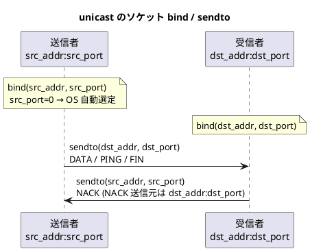
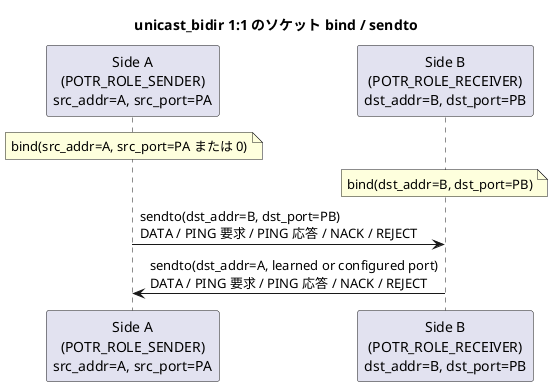
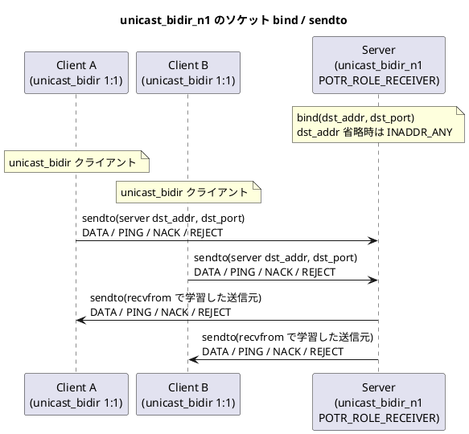
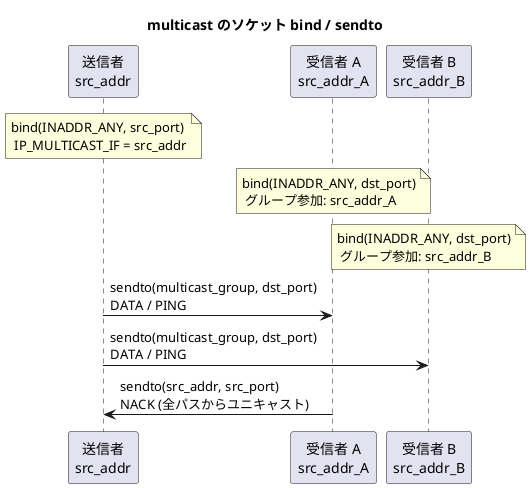
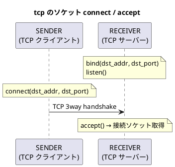

# 設定ファイル仕様

## 概要

porter は INI 形式のテキストファイルでサービスを定義します。
1 つの設定ファイルに定義できるサービス数に上限はありません (初期バッファ容量は 64 で、超過時は自動拡張されます)。

`potrOpenServiceFromConfig()` 呼び出し時にファイルを読み込み、指定した `service_id` のエントリを使用します。
以後はファイルを参照しないため、起動後にファイルを変更しても動作に影響はありません。
`potrOpenService()` を直接呼ぶ場合は設定ファイルを使用せず、`PotrGlobalConfig` / `PotrServiceDef` 構造体を直接渡します。

## ファイル形式

```ini
[global]
キー = 値

[service.サービスID]
キー = 値
```

- セクション名は `[global]` と `[service.数値]` の 2 種類です。
- コメントは `#` または `;` で始まる行です。
- 値前後の空白は無視されます。

## \[global\] セクション

すべてのサービスに適用されるグローバル設定です。

| キー | 型 | デフォルト | 説明 |
|---|---|---|---|
| `window_size` | uint16 | 16 | スライディングウィンドウサイズ (2〜256) |
| `max_payload` | uint16 | 1,400 | DATA パケットのペイロード上限バイト数 (64〜65507) |
| `max_message_size` | uint32 | 65,535 | 1 回の potrSend で送信できる最大メッセージ長 (バイト)。フラグメント化により max_payload を超えるメッセージを送受信できる |
| `send_queue_depth` | uint32 | 1,024 | 非同期送信キューの最大エントリ数。メッセージがフラグメント化される場合、1 メッセージが複数エントリを占有する |
| `udp_health_interval_ms` | uint32 | 3,000 | UDP 通信種別の PING 送信判定間隔 (ms)。片方向 type 1-6 は「最後の PING または有効 DATA 送信」から本値経過時に PING を送信し、双方向 UDP は設定周期ごとに PING を送信する。0 でヘルスチェック送信を無効化。双方向 UDP は定周期 PING の送受信で `CONNECTED` を成立させるため、実効 `health_interval_ms` が 0 のままでは接続確立しない |
| `udp_health_timeout_ms`  | uint32 | 10,000 | UDP 通信種別の受信タイムアウト (ms)。片方向 type 1-6 では有効な `PING` / `DATA`、双方向 UDP では `PING` の最終受信から本値を超えたら DISCONNECTED。0 でタイムアウト検知を無効化 |
| `tcp_health_interval_ms` | uint32 | 10,000 | TCP 通信種別の定周期 PING 送信間隔 (ms)。接続直後の bootstrap PING とは別に、設定周期ごとに PING を送信する。0 の場合は定周期 PING を無効化するが、初回接続確立用の bootstrap PING は送信する |
| `tcp_health_timeout_ms`  | uint32 | 31,000 | TCP 通信種別の PING 応答待機タイムアウト (ms)。`tcp_health_interval_ms > 0` のときだけ有効で、SENDER 側が PING 応答を本値以内に受信できなければ DISCONNECTED。0 でタイムアウト検知を無効化 |
| `tcp_close_timeout_ms` | uint32 | 5,000 | TCP 通信種別の `potrCloseService()` が protocol-level `FIN_ACK` を待つ最大時間 (ms)。送信キュー drain 完了後に `FIN` を送り、本値以内に `FIN_ACK` が返らなければ強制 close して `POTR_ERROR` を返す。0 の場合は待機せず teardown へ進む |
| `reorder_timeout_ms` | uint32 | 0 | 受信ウィンドウで欠番を検出してから NACK 送出 (通常モード) または DISCONNECTED 発行 (RAW モード) を遅延する時間 (ミリ秒)。マルチパスや近距離 WAN での追い越し吸収用。0 で即時 (デフォルト)。推奨値: LAN/マルチパス = 10〜30 ms、遠距離 WAN = 30〜100 ms |

### window_size の影響

ウィンドウサイズは再送可能な過去パケット数の上限です。
送信側ウィンドウが満杯になると最古エントリが evict (削除) されます。
evict 済みの通番を受信者が NACK で要求した場合、REJECT を返します。

通信の安定性を高めるには、往復遅延時間と送信レートに応じてウィンドウサイズを調整してください。

### max_payload の影響

ペイロードエレメント 1 個分のデータサイズ上限です。
`potrSend()` で送信するデータがこのサイズを超える場合、複数のフラグメントに分割されます。

### reorder_timeout_ms の使い所

| 構成 | 推奨値 | 理由 |
|---|---|---|
| 単一パス・同一 LAN | 0 (無効) | 遅延変動が小さく追い越しはほぼ発生しない |
| マルチパス (2 経路以上) | 10〜30 ms | 経路差異で数 ms〜数十 ms の追い越しが起こりうる |
| 遠距離 WAN / 無線 LAN | 30〜100 ms | 遅延変動が大きく再順序付けが頻繁に発生する環境 |

- 設定値を大きくするほど、追い越しを吸収できるが NACK の遅延 (= 再送遅延) も増加する。
- RAW モードでは DISCONNECTED の遅延にも直結するため、リアルタイム性の要件と合わせて調整すること。
- タイムアウト経過後も欠落パケットが届いた場合は NACK なしで正常にウィンドウへ取り込まれる (次の `process_outer_pkt` 呼び出しで自動検出)。

### マルチキャスト/ブロードキャスト通常モードでの NACK 分散

`multicast` / `broadcast` の通常モードかつ `reorder_timeout_ms > 0` の場合、複数の受信者が同一欠番を同時に NACK すると送信者への負荷が集中する (NACK implosion)。

これを回避するため、タイマー起動時に **100%〜200%** の範囲でランダムなジッタを自動付加します。

| 通信種別 | 実効タイムアウト |
|---|---|
| `unicast` (通常モード) | `reorder_timeout_ms` (固定) |
| `multicast` / `broadcast` (通常モード) | `reorder_timeout_ms` 〜 `reorder_timeout_ms × 2` (ランダム分散) |
| `*_raw` (RAW モード全種別) | `reorder_timeout_ms` (固定、DISCONNECTED 発行用) |

- ジッタは monotonic クロックのナノ秒部を乱数源とするため、外部 RNG への依存はありません。
- `reorder_timeout_ms = 20` に設定すると実際のタイマーは **20〜40 ms** の範囲に分散されます。
- NACK が遅延する分だけ再送が遅れる可能性があるため、`reorder_timeout_ms` の設定値には余裕を持たせてください。

### health_interval_ms と health_timeout_ms の関係

グローバル設定の `udp_*` / `tcp_*` は、コードの組み込みデフォルトに次ぐ「サービス定義へ適用する既定値」です。最終的な動作は、通信種別に応じて選ばれたグローバル既定値に対し、`[service.N]` の `health_interval_ms` / `health_timeout_ms` を重ねた実効値で決まります。実効 `health_interval_ms > 0` のとき、片方向 type 1-6 は「最後の PING または有効 DATA 送信」から本値経過時だけ PING を送り、双方向 UDP は設定周期で PING を送信します。TCP は実効 `health_interval_ms` にかかわらず接続直後に bootstrap PING を送り、`health_interval_ms > 0` のときだけ定周期 PING と timeout 監視を有効にします。

| 通信モデル / 種別 | PING 送信 | タイムアウト監視 |
|---|---|---|
| 一方向 UDP (`unicast` / `multicast` / `broadcast` / `*_raw`) | SENDER は open 直後の即時 PING を送らず、最後の `PING` または有効 `DATA` 送信から `health_interval_ms` 経過時にだけ PING を送る。RECEIVER は返信しない | RECEIVER が有効な `PING` / `DATA` の最終受信時刻を監視 |
| 双方向 UDP (`unicast_bidir` / `unicast_bidir_n1`) | 各端点 / 各ピアが周期送信し、要求には即応答する | 各端点 / 各ピアが最終受信時刻を監視 |
| TCP (`tcp`) | 接続直後に bootstrap PING を送る。`health_interval_ms > 0` のときだけ SENDER が周期送信し、RECEIVER が応答する | `health_interval_ms > 0` のときだけ SENDER は PING 応答待機、RECEIVER は PING 要求到着を監視 |
| 双方向 TCP (`tcp_bidir`) | 接続直後に両端が bootstrap PING を送る。`health_interval_ms > 0` のときだけ両端が周期送信し、要求には即応答する | `health_interval_ms > 0` のときだけ両端が PING 応答待機と PING 要求到着を監視 |

一方向 UDP (type 1-6) の RECEIVER は、有効な `PING` または `DATA` を受信すると `health_alive` を立てて `POTR_EVENT_CONNECTED` を発火します。`health_interval_ms = 0` で PING 送信が無効でも、有効な `DATA` が届けば CONNECTED します。双方向 UDP は従来どおり PING ベースで CONNECTED します。TCP は `health_interval_ms = 0` でも bootstrap PING の往復により CONNECTED できますが、定周期 PING と timeout 監視は無効になります。

双方向 UDP (`unicast_bidir` / `unicast_bidir_n1`) は、相手が返してきた PING ペイロードに `POTR_PING_STATE_NORMAL` が含まれて初めて `CONNECTED` します。したがって実効 `health_interval_ms = 0` で PING 自動送信が無効な構成では、`health_timeout_ms` の有無にかかわらず初回 `CONNECTED` に到達しません。

| 設定 | 効果 |
|---|---|
| `udp_health_interval_ms = 0` | UDP 通信種別に適用する既定の PING 周期を 0 にする。サービス側で `health_interval_ms` を指定しない限り、UDP サービスの実効 PING 周期は無効になる。双方向 UDP ではこの状態のまま `CONNECTED` しない |
| `udp_health_timeout_ms = 0` | UDP 通信種別に適用する既定のタイムアウトを 0 にする。サービス側で `health_timeout_ms` を指定しない限り、UDP サービスの実効タイムアウト監視は無効になる |
| `tcp_health_interval_ms = 0` | TCP 通信種別に適用する既定の定周期 PING 周期を 0 にする。サービス側で `health_interval_ms` を指定しない限り、TCP サービスは bootstrap PING の往復だけで CONNECTED し、その後の定周期 PING は送らない |
| `tcp_health_timeout_ms = 0` | TCP 通信種別に適用する既定のタイムアウトを 0 にする。サービス側で `health_timeout_ms` を指定しない限り、TCP サービスの PING 要求 / 応答監視は無効になる |

## \[service.N\] セクション

`N` には整数のサービス ID を指定します。

### 全通信種別で共通のフィールド

| キー | 型 | 必須 | 説明 |
|---|---|---|---|
| `type` | 文字列 | 必須 | `unicast` / `multicast` / `broadcast` / `unicast_raw` / `multicast_raw` / `broadcast_raw` / `unicast_bidir` / `unicast_bidir_n1` / `tcp` / `tcp_bidir` |
| `dst_port` | uint16 | 必須 | 宛先ポート番号 (サービスの識別子) |
| `src_addr` | 文字列 | 条件付き | 通常は送信元 bind アドレスまたは受信側の送信元 IP フィルタ。`unicast_bidir` では SENDER・RECEIVER ともに省略可能 (各役割の省略時動作は後述) |
| `src_port` | uint16 | 省略可 | 送信者の送信元 bind ポート (0 = OS が自動選定) |
| `health_interval_ms` | uint32 | 省略可 | グローバルの `udp_health_interval_ms` または `tcp_health_interval_ms` をサービス単位でオーバーライドする |
| `health_timeout_ms`  | uint32 | 省略可 | グローバルの `udp_health_timeout_ms` または `tcp_health_timeout_ms` をサービス単位でオーバーライドする |
| `pack_wait_ms` | uint32 | 省略可 | パッキング待機時間 (ミリ秒)。0 で即時送信 |
| `encrypt_key` | 文字列 | 省略可 | AES-256-GCM 事前共有鍵。以下の2形式を受け付ける:<br>**① hex 鍵**: 256 ビット (32 バイト) を 64 文字の 16 進数文字列で指定<br>**② パスフレーズ**: 上記以外の任意の文字列を指定すると SHA-256 で 32 バイト鍵に変換する。省略時は暗号化なし |

### unicast 専用フィールド

| キー | 型 | 必須 | 説明 |
|---|---|---|---|
| `dst_addr` | 文字列 | 必須 | 送信者: 送信先アドレス。受信者: bind アドレス |

### multicast 専用フィールド

| キー | 型 | 必須 | デフォルト | 説明 |
|---|---|---|---|---|
| `multicast_group` | 文字列 | 必須 | — | マルチキャストグループ IP アドレス (例: `224.0.0.1`) |
| `ttl` | uint8 | 省略可 | 1 | マルチキャスト TTL |

### unicast_raw / multicast_raw / broadcast_raw (RAW モード)

RAW モードは通常モード (`unicast` / `multicast` / `broadcast`) と同一のアドレス・ポートフィールドを使用します。
追加の専用フィールドはありません。

**通常モードとの差異**:

| 項目 | 通常モード | RAW モード |
|---|---|---|
| 再送制御 | NACK ベース再送あり | 再送なし |
| ギャップ検出時 | NACK を返送して欠落パケットを待機 | 即 `POTR_EVENT_DISCONNECTED` を発行し、次の正規パケットで `POTR_EVENT_CONNECTED` |
| `potrSend` の動作 | `flags` 引数に従う (ノンブロッキング / ブロッキング) | 常にブロッキング送信 (`POTR_SEND_BLOCKING` 相当) |
| 通番 (`seq_num`) | 再送制御・ウィンドウ管理に使用 | AES ノンス生成用のみ (再送制御には使用しない) |
| ヘルスチェック | `health_interval_ms` / `health_timeout_ms` に従う | 同左 (制限なし) |

RAW モードでもスライディングウィンドウによる **順序整列** と **セッション管理** は有効です。

### unicast_bidir 専用フィールド

`unicast_bidir` は常に **1:1 双方向通信** です。SENDER・RECEIVER の双方が独立して送受信・NACK・ヘルスチェックを行います。

| src 情報の指定 | SENDER の bind 動作 | RECEIVER の bind 動作 | 送信元フィルタ |
|---|---|---|---|
| `src_addr` + `src_port` 指定 | `src_addr:src_port` で bind | `dst_addr:dst_port` で bind | アドレス + ポート |
| `src_addr` のみ指定 | `src_addr:エフェメラル` で bind | `dst_addr:dst_port` で bind | アドレスのみ |
| `src_addr` 省略 (SENDER) | `INADDR_ANY:src_port` で bind (OS がアダプタを自動選択) | — | なし |
| `src_addr` 省略 (RECEIVER) | — | `dst_addr:dst_port` で bind し、最初の受信パケットから SENDER のアドレスを動的学習する | なし (学習後は学習アドレスから受信) |

| キー | 型 | 必須 | 説明 |
|---|---|---|---|
| `src_addr` | 文字列 | 省略可 | SENDER: 省略時は `INADDR_ANY` で bind し OS がアダプタを自動選択。RECEIVER: 省略時は SENDER アドレスを動的学習する |
| `src_port` | uint16 | 省略可 | SENDER の bind ポート。`0` または省略でエフェメラルポートを使用し、RECEIVER がパケット受信後に動的学習する |
| `dst_addr` | 文字列 | 条件付き | SENDER: 送信先アドレス。RECEIVER: bind アドレス。省略時は `INADDR_ANY` で bind する |
| `dst_port` | uint16 | 必須 | SENDER: 送信先ポート (RECEIVER の bind ポート) |

### unicast_bidir_n1 専用フィールド

`unicast_bidir_n1` は **N:1 双方向通信** です。サーバ (`POTR_ROLE_RECEIVER`) が複数クライアントを同時に受け入れます。クライアントは `unicast_bidir` (1:1) として接続します。

| キー | 型 | 必須 | 説明 |
|---|---|---|---|
| `dst_addr` | 文字列 | 省略可 | サーバの bind アドレス。省略時は `INADDR_ANY` で bind する |
| `dst_port` | uint16 | 必須 | サーバの受信ポート |
| `src_port` | uint16 | 省略可 | 送信元ポートフィルタ。`0` または省略でフィルタなし (全クライアント受け入れ) |
| `max_peers` | uint32 | 省略可 | 最大同時接続クライアント数。既定値は `1024` |

### tcp / tcp_bidir 専用フィールド

| キー | 型 | 必須 | デフォルト | 説明 |
|---|---|---|---|---|
| `dst_addr` | 文字列 | 必須 | — | SENDER: 接続先アドレス（ホスト名可）。RECEIVER: bind アドレス |
| `dst_port` | uint16 | 必須 | — | SENDER: 接続先ポート。RECEIVER: listen ポート |
| `src_addr` | 文字列 | 省略可 | — | SENDER: ローカル bind アドレス（省略で自動選択）。RECEIVER: 接続元 IP フィルタ（省略でフィルタなし） |
| `src_port` | uint16 | 省略可 | 0 | SENDER: ローカル bind ポート（`0` または省略でエフェメラル）。RECEIVER: 接続元ポートフィルタ（`0` または省略でフィルタなし） |
| `reconnect_interval_ms` | uint32 | 省略可 | 5,000 | SENDER の自動再接続間隔 (ms)。`0` で自動再接続なし。RECEIVER では無視 |
| `connect_timeout_ms` | uint32 | 省略可 | 10,000 | SENDER の TCP 接続タイムアウト (ms)。`0` で OS デフォルト。RECEIVER では無視 |

**tcp / tcp_bidir では使用しないフィールド（記述しても無視）**

| フィールド | UDP での用途 |
|---|---|
| `multicast_group` | マルチキャストグループ |
| `ttl` | マルチキャスト TTL |
| `broadcast_addr` | ブロードキャスト宛先 |

### TCP マルチパス設定

`dst_addr` 〜 `dst_addr.3`（最大 4 エントリ）に接続先アドレスを設定すると、
各エントリに対して独立した TCP 接続（path）が確立されます。
エントリが 1 つのみの場合は単一接続として動作します。

```ini
[service.1]
type         = tcp
dst_addr     = 192.168.1.10   # path 0
dst_addr.1   = 192.168.2.10   # path 1
dst_port     = 5000
src_addr     = 192.168.1.20   # path 0 の bind アドレス
src_addr.1   = 192.168.2.20   # path 1 の bind アドレス
```

#### SENDER の bind 動作（`src_addr` / `src_port` の組み合わせ）

各 path[i] に独立して適用されます。

| `src_addr` | `src_port` | `connect()` 前の `bind()` 動作 |
|---|---|---|
| 未指定 | `0` または省略 | `bind()` しない |
| 未指定 | 指定 | `INADDR_ANY:src_port` で bind |
| 指定 | `0` または省略 | `src_addr:0`（エフェメラルポート）で bind |
| 指定 | 指定 | `src_addr:src_port` で bind |

#### RECEIVER の接続フィルタ動作（`src_addr` / `src_port` の組み合わせ）

各 path[i] の `accept()` 後に接続元を検証します。

| `src_addr` | `src_port` | フィルタ動作 |
|---|---|---|
| 未指定 | `0` または省略 | 全接続を受け付ける |
| 未指定 | 指定 | 接続元ポートが一致する接続のみ受け付ける |
| 指定 | `0` または省略 | 接続元 IP が一致する接続のみ受け付ける |
| 指定 | 指定 | 接続元 IP・ポート両方が一致する接続のみ受け付ける |

### broadcast 専用フィールド

| キー | 型 | 必須 | 説明 |
|---|---|---|---|
| `broadcast_addr` | 文字列 | 必須 | 送信者: 送信先ブロードキャストアドレス (例: `192.168.1.255`) |

### encrypt_key の詳細

`encrypt_key` を設定すると AES-256-GCM による暗号化・認証タグが有効になります。

| 項目 | 説明 |
|---|---|
| **形式① hex 鍵** | 256 ビット鍵を 16 進数文字列 (64 文字、英数字) で記述する |
| **形式② パスフレーズ** | 64 文字 hex 以外の任意の文字列。SHA-256 ハッシュで 32 バイト鍵を自動導出する |
| 暗号化範囲 | DATA パケットのペイロード部分を AES-256-GCM で暗号化する。ヘッダー 36 バイトは平文 |
| AAD | ヘッダー 36 バイトを追加認証データ (AAD) として使用するため、ヘッダー改ざんも検知する |
| 認証タグ (DATA) | 16 バイトの GCM 認証タグを暗号文末尾に付与する。実効ペイロードが `max_payload - 16` バイトに減少する |
| 認証タグ (その他) | PING / NACK / REJECT / FIN / FIN_ACK は平文ペイロードが 0 バイトだが、AAD (ヘッダー 36B) に対して 16 バイトの GCM 認証タグのみを付与する。ヘッダー改ざんを検知できる |
| 双方一致 | 送信者・受信者ともに同一の `encrypt_key` を設定すること |
| 受信要件 | `encrypt_key` を設定した受信側は `POTR_FLAG_ENCRYPTED` 付きパケットのみ受理する。平文パケット、およびタグ検証失敗パケットは破棄する |
| マルチキャスト | 受信者全員が同一の `encrypt_key` を持っていれば動作する |

#### ノンス構成

GCM ノンス (12 バイト) は以下の構成です。

```
[session_id: 4B NBO][flags: 2B NBO][seq_or_ack_num: 4B NBO][padding: 2B 0x00]
```

| フィールド | バイト | 内容 |
|---|---|---|
| `session_id` | 4 | 送信元の自セッション ID (ネットワークバイトオーダー) |
| `flags` | 2 | `POTR_FLAG_ENCRYPTED` を含む実際の送信フラグ値 (NBO) |
| `seq_or_ack_num` | 4 | DATA/PING/FIN は `seq_num`、NACK/REJECT/FIN_ACK は `ack_num` (NBO) |
| padding | 2 | 0x0000 固定 |

各パケット種別の flags 値 (例):

| パケット種別 | flags (16進) |
|---|---|
| DATA (暗号化あり) | `0x0021` (DATA \| ENCRYPTED) |
| PING (暗号化あり) | `0x0024` (PING \| ENCRYPTED) |
| NACK (暗号化あり) | `0x0022` (NACK \| ENCRYPTED) |
| REJECT (暗号化あり) | `0x0028` (REJECT \| ENCRYPTED) |
| FIN (暗号化あり) | `0x0030` (FIN \| ENCRYPTED) |
| FIN_ACK (暗号化あり) | `0x00A0` (FIN_ACK \| ENCRYPTED) |


`src_addr`・`dst_addr` には以下のいずれかを指定できます。

- **IPv4 アドレス** (例: `192.168.1.10`)
- **DNS で解決できるホスト名** (例: `receiver.local`)

### DNS 解決のポリシー

| 項目 | 仕様 |
|---|---|
| 解決タイミング | `potrOpenServiceFromConfig()` / `potrOpenService()` 呼び出し時に 1 回のみ解決する |
| 再解決 | プロセス生存中は再解決しない。DNS 更新後に接続できなくなった場合はプロセスを再起動する |
| 複数アドレス返却時 | 仕様上未定義。実装上は先頭アドレスを採用する |
| IPv6 | 非対応 |

## 通信種別ごとのソケット動作

### unicast (1:1 通信)



| | 送信者 | 受信者 |
|---|---|---|
| bind アドレス | `src_addr` | `dst_addr` |
| bind ポート | `src_port` (0 = OS 自動) | `dst_port` |
| 送信先 | `dst_addr:dst_port` | — |
| 送信元フィルタ | — | `src_addr` |

受信者は `dst_addr` でソケットを bind するため、`dst_addr` は当該ホストの NIC に割り当てられているアドレスでなければなりません。

### unicast_bidir

#### 1:1 モード



| | Side A (SENDER) | Side B (RECEIVER) |
|---|---|---|
| bind アドレス | `src_addr` | `dst_addr` |
| bind ポート | `src_port`（省略可、`0` でエフェメラル） | `dst_port` |
| 送信先アドレス | `dst_addr` | `src_addr`（省略時は最初の受信パケットから動的学習） |
| 送信先ポート | `dst_port` | `src_port`（`0` / 省略時は受信した送信元ポートを動的学習） |
| 送信元フィルタ | — | `src_addr` 指定時はアドレスを照合。省略時は動的学習後に学習済みアドレスを照合 |

#### N:1 モード (unicast_bidir_n1)



| | N:1 サーバ (unicast_bidir_n1) | クライアント (unicast_bidir) |
|---|---|---|
| bind アドレス | `dst_addr`（省略時 `INADDR_ANY`） | `src_addr` |
| bind ポート | `dst_port` | `src_port`（省略可） |
| 送信先 | `recvfrom` で学習した各ピアの送信元 | `dst_addr:dst_port` |
| 送信元フィルタ | `src_port` 指定時のみポートで照合 | — |
| 最大接続数 | `max_peers` | — |

`encrypt_key` を設定した N:1 サーバは、`POTR_FLAG_ENCRYPTED` の確認と GCM タグ検証を新規 peer 確保より前に行います。認証失敗パケットは `max_peers` を消費しません。

### multicast (1:N 通信)



| | 送信者 | 受信者 |
|---|---|---|
| bind アドレス | `INADDR_ANY` | `INADDR_ANY` |
| bind ポート | `src_port` (0 = OS 自動) | `dst_port` |
| マルチキャスト設定 | `IP_MULTICAST_IF = src_addr` | グループ参加: `src_addr` (NIC 指定) |
| 送信先 | `multicast_group:dst_port` | — |
| 送信元フィルタ | — | `src_addr` |

### broadcast (1:N 通信)

| | 送信者 | 受信者 |
|---|---|---|
| bind アドレス | `src_addr` | `INADDR_ANY` |
| bind ポート | `src_port` (0 = OS 自動) | `dst_port` |
| ソケットオプション | `SO_BROADCAST` 有効 | `SO_BROADCAST` 有効 |
| 送信先 | `broadcast_addr:dst_port` | — |
| 送信元フィルタ | — | `src_addr` |

### tcp / tcp_bidir (TCP 接続)



| | SENDER | RECEIVER |
|---|---|---|
| ソケット種別 | `SOCK_STREAM` | `SOCK_STREAM` |
| 動作 | `connect(dst_addr, dst_port)` | `bind(dst_addr, dst_port)` → `listen()` → `accept()` |
| listen ソケット | なし | あり（接続待機専用） |
| 接続ソケット | `connect()` の fd | `accept()` の fd |

RECEIVER が先に `potrOpenServiceFromConfig()` / `potrOpenService()` を呼んで `listen()` に入っている必要があります。

## 送信元フィルタリング

受信スレッドは通信種別とモードに応じて送信元を検査します。

- `unicast` / `multicast` / `broadcast`: `src_addr` を用いて送信元 IP アドレスを照合します
- `unicast_bidir` (src_addr 指定): `src_addr` で送信元 IP アドレスを照合します
- `unicast_bidir` (src_addr 省略・RECEIVER 動的学習): 学習前は全受け入れ、学習後は学習済みアドレスから受信します。セッション追跡により 1:1 が保証されます
- `unicast_bidir_n1`: `src_addr` は照合しません。`src_port` が 0 以外のときのみ送信元ポートを照合します

一致しないパケットはアプリケーション層で破棄します。

### 1:1 モードと N:1 モードの使い分け

| 用途 | 推奨する type |
|---|---|
| 双方向 1:1 通信 (相手アドレス既知) | `unicast_bidir` (src_addr あり) |
| RECEIVER が SENDER のアドレスを事前に知らない 1:1 | `unicast_bidir` (RECEIVER 側 src_addr 省略) |
| 複数クライアントを同時に受け入れる N:1 サーバ | `unicast_bidir_n1` |

## マルチパス設定

最大 4 経路を並列に設定できます。
各経路は独立した UDP ソケットを持ちます。

```ini
[service.1001]
type     = unicast

; 経路 0
src_addr = 192.168.1.20
dst_addr = 192.168.1.10
dst_port = 5001

; 経路 1
src_addr.1 = 10.0.0.20
dst_addr.1 = 10.0.0.10

; 経路 2
src_addr.2 = 172.16.0.20
dst_addr.2 = 172.16.0.10
```

マルチパスを使用すると、DATA・PING・再送パケットがすべての経路へ同時送信されます。

## サンプル設定ファイル

```ini
[global]
window_size        = 16
max_payload        = 1400
# max_message_size   = 65535
# send_queue_depth   = 1024
udp_health_interval_ms = 3000
udp_health_timeout_ms  = 10000
# tcp_close_timeout_ms = 5000 ; TCP close 時の FIN_ACK 待機
# reorder_timeout_ms = 0    ; 0=即時 (デフォルト)。マルチパスは 20 程度が目安

; ---- ユニキャスト ----
[service.1001]
type     = unicast
src_addr = 192.168.1.20
dst_addr = 192.168.1.10
dst_port = 5001

; ホスト名でも指定可能
[service.1002]
type     = unicast
src_addr = sender.local
dst_addr = receiver.local
dst_port = 5002

; ---- マルチキャスト ----
[service.2001]
type            = multicast
src_addr        = 192.168.1.20
dst_port        = 6001
multicast_group = 224.0.0.1
ttl             = 1

; ---- ブロードキャスト ----
[service.3001]
type           = broadcast
src_addr       = 192.168.1.20
dst_port       = 7001
broadcast_addr = 192.168.1.255

; ---- RAW モード (ベストエフォート) ----
[service.1021]
type      = unicast_raw
src_addr  = 127.0.0.1
dst_addr  = 127.0.0.1
dst_port  = 5021

[service.2021]
type            = multicast_raw
src_addr        = 127.0.0.1
dst_port        = 6021
multicast_group = 239.0.0.21
ttl             = 1

; ---- AES-256-GCM 暗号化 (encrypt_key に 64 文字の16進数文字列を指定) ----
[service.1010]
type        = unicast
src_addr    = 192.168.1.20
dst_addr    = 192.168.1.10
dst_port    = 5010
encrypt_key = 0a1b2c3d4e5f6a7b8c9d0e1f2a3b4c5d6e7f0a1b2c3d4e5f6a7b8c9d0e1f2a3b

; ---- UDP unicast 双方向 (1:1) ----

; ループバック（Side A: SENDER ロール）
[service.4020]
type      = unicast_bidir
src_addr  = 127.0.0.1
src_port  = 9020
dst_addr  = 127.0.0.1
dst_port  = 9021

; ループバック（Side B: RECEIVER ロール）
[service.4021]
type      = unicast_bidir
src_addr  = 127.0.0.1
src_port  = 9021
dst_addr  = 127.0.0.1
dst_port  = 9020

; ---- UDP unicast 双方向 (N:1 サーバ) ----

; N:1 サーバ: dst_port で待ち受ける (全クライアント受け入れ)
[service.4050]
type      = unicast_bidir_n1
dst_addr  = 0.0.0.0
dst_port  = 9050
max_peers = 256

; N:1 サーバ: src_port を使って送信元ポートをフィルタする例
[service.4051]
type      = unicast_bidir_n1
src_port  = 19050
dst_addr  = 192.168.1.10
dst_port  = 9051
max_peers = 64

; N:1 サーバへ接続するクライアント (unicast_bidir 1:1 として接続)
[service.4052]
type      = unicast_bidir
src_addr  = 192.168.1.20
src_port  = 19050
dst_addr  = 192.168.1.10
dst_port  = 9051

; AES-256-GCM 暗号化
[service.4031]
type        = unicast_bidir
src_addr    = 192.168.1.10
src_port    = 9031
dst_addr    = 192.168.1.20
dst_port    = 9031
encrypt_key = mysecretphrase

; ---- TCP ユニキャスト ----

; 基本設定（ループバック）
[service.5001]
type     = tcp
dst_addr = 127.0.0.1
dst_port = 9001

; 再接続設定あり
[service.5002]
type                  = tcp
dst_addr              = 192.168.1.100
dst_port              = 9002
reconnect_interval_ms = 5000    ; SENDER のみ有効
connect_timeout_ms    = 10000   ; SENDER のみ有効

; AES-256-GCM 暗号化
[service.5003]
type        = tcp
dst_addr    = 192.168.1.100
dst_port    = 9003
encrypt_key = mysecretphrase

; 再接続なし（切断後に自動復帰しない）
[service.5004]
type                  = tcp
dst_addr              = 192.168.1.100
dst_port              = 9004
reconnect_interval_ms = 0

; ---- TCP 双方向 ----

[service.5010]
type                  = tcp_bidir
dst_addr              = 192.168.1.100
dst_port              = 9010
reconnect_interval_ms = 5000    ; SENDER のみ有効
connect_timeout_ms    = 10000   ; SENDER のみ有効
```
