# シーケンス

本ドキュメントは porter の主要な動作シナリオをシーケンス図で示します。

## サービス開始 (送信者)

`potrOpenService()` を SENDER として呼び出したときの内部処理です。

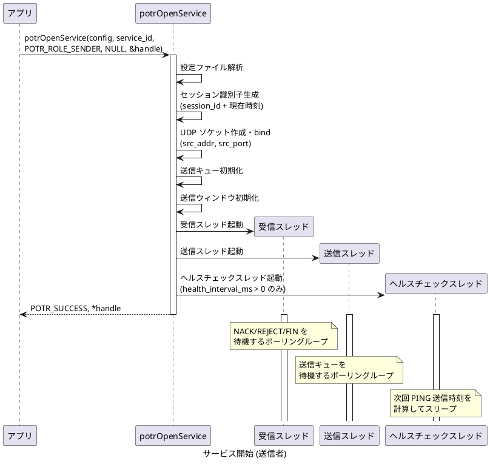
```plantuml
@startuml サービス開始 (送信者)
caption サービス開始 (送信者)

participant "アプリ" as APP
participant "potrOpenService" as OPEN
participant "受信スレッド" as RT
participant "送信スレッド" as ST
participant "ヘルスチェックスレッド" as HT

APP -> OPEN: potrOpenService(config, service_id,\nPOTR_ROLE_SENDER, NULL, &handle)

activate OPEN
OPEN -> OPEN: 設定ファイル解析
OPEN -> OPEN: セッション識別子生成\n(session_id + 現在時刻)
OPEN -> OPEN: UDP ソケット作成・bind\n(src_addr, src_port)
OPEN -> OPEN: 送信キュー初期化
OPEN -> OPEN: 送信ウィンドウ初期化

OPEN -> RT**: 受信スレッド起動
OPEN -> ST**: 送信スレッド起動
OPEN -> HT**: ヘルスチェックスレッド起動\n(health_interval_ms > 0 のみ)

OPEN --> APP: POTR_SUCCESS, *handle
deactivate OPEN

activate RT
activate ST
activate HT

note over RT: NACK/REJECT/FIN を\n待機するポーリングループ
note over ST: 送信キューを\n待機するポーリングループ
note over HT: 次回 PING 送信時刻を\n計算してスリープ

@enduml
```

## サービス開始 (受信者)

`potrOpenService()` を RECEIVER として呼び出したときの内部処理です。

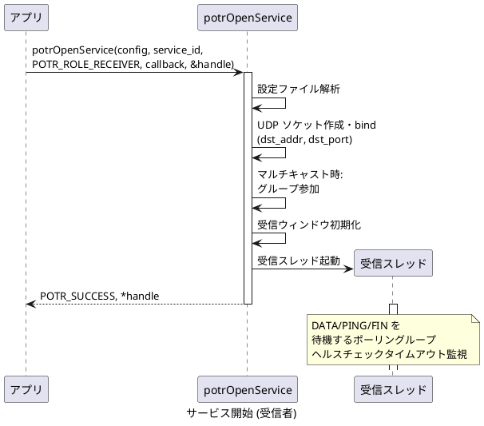
```plantuml
@startuml サービス開始 (受信者)
caption サービス開始 (受信者)

participant "アプリ" as APP
participant "potrOpenService" as OPEN
participant "受信スレッド" as RT

APP -> OPEN: potrOpenService(config, service_id,\nPOTR_ROLE_RECEIVER, callback, &handle)

activate OPEN
OPEN -> OPEN: 設定ファイル解析
OPEN -> OPEN: UDP ソケット作成・bind\n(dst_addr, dst_port)
OPEN -> OPEN: マルチキャスト時:\nグループ参加
OPEN -> OPEN: 受信ウィンドウ初期化

OPEN -> RT**: 受信スレッド起動

OPEN --> APP: POTR_SUCCESS, *handle
deactivate OPEN

activate RT
note over RT: DATA/PING/FIN を\n待機するポーリングループ\nヘルスチェックタイムアウト監視

@enduml
```

## 正常送受信 (ノンブロッキング)

`POTR_SEND_BLOCKING` を指定せずに `potrSend()` を呼び出したときのデータフローです。片方向 type 1-6 では初回の有効 `DATA` 受信でも CONNECTED が成立します。

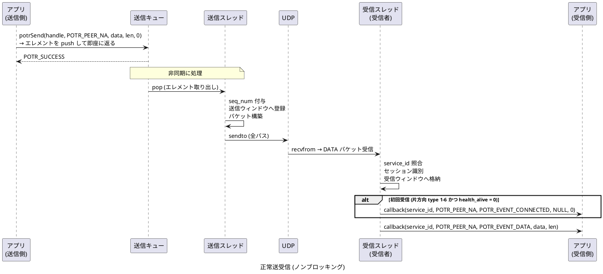
```plantuml
@startuml 正常送受信 (ノンブロッキング)
caption 正常送受信 (ノンブロッキング)

participant "アプリ\n(送信側)" as SAPP
participant "送信キュー" as Q
participant "送信スレッド" as ST
participant "UDP" as UDP
participant "受信スレッド\n(受信者)" as RRT
participant "アプリ\n(受信側)" as RAPP

SAPP -> Q: potrSend(handle, POTR_PEER_NA, data, len, 0)\n→ エレメントを push して即座に返る
SAPP <-- Q: POTR_SUCCESS

note over Q, ST: 非同期に処理

Q -> ST: pop (エレメント取り出し)
ST -> ST: seq_num 付与\n送信ウィンドウへ登録\nパケット構築
ST -> UDP: sendto (全パス)

UDP -> RRT: recvfrom → DATA パケット受信
RRT -> RRT: service_id 照合\nセッション識別\n受信ウィンドウへ格納

alt 初回受信 (片方向 type 1-6 かつ health_alive = 0)
  RRT -> RAPP: callback(service_id, POTR_PEER_NA, POTR_EVENT_CONNECTED, NULL, 0)
end

RRT -> RAPP: callback(service_id, POTR_PEER_NA, POTR_EVENT_DATA, data, len)

@enduml
```

## 正常送受信 (ブロッキング)

`POTR_SEND_BLOCKING` を指定して `potrSend()` を呼び出したときのデータフローです。
送信完了まで `potrSend()` が返りません。

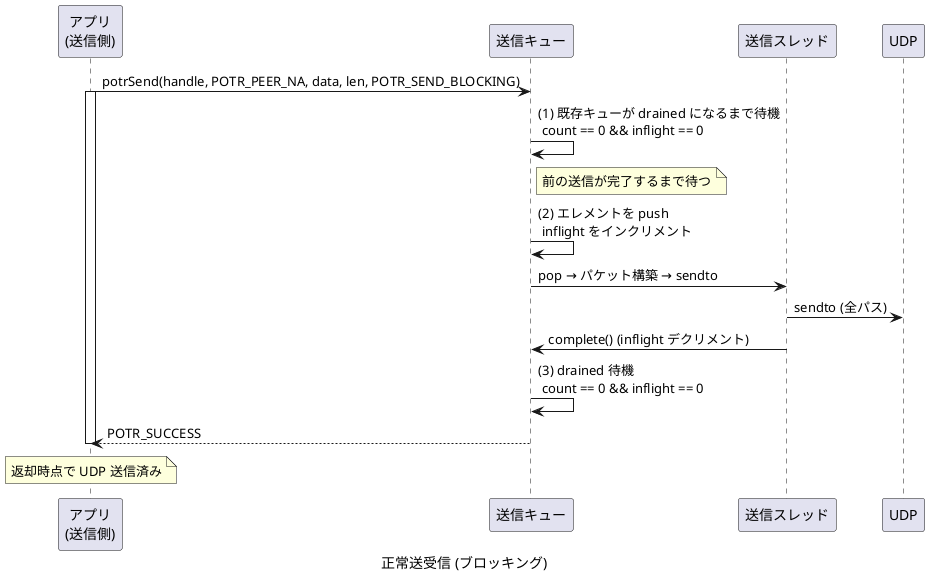
```plantuml
@startuml 正常送受信 (ブロッキング)
caption 正常送受信 (ブロッキング)

participant "アプリ\n(送信側)" as SAPP
participant "送信キュー" as Q
participant "送信スレッド" as ST
participant "UDP" as UDP

SAPP -> Q: potrSend(handle, POTR_PEER_NA, data, len, POTR_SEND_BLOCKING)
activate SAPP

Q -> Q: (1) 既存キューが drained になるまで待機\n count == 0 && inflight == 0
note right of Q: 前の送信が完了するまで待つ

Q -> Q: (2) エレメントを push\n inflight をインクリメント

Q -> ST: pop → パケット構築 → sendto
ST -> UDP: sendto (全パス)
ST -> Q: complete() (inflight デクリメント)

Q -> Q: (3) drained 待機\n count == 0 && inflight == 0

Q --> SAPP: POTR_SUCCESS
deactivate SAPP

note over SAPP: 返却時点で UDP 送信済み

@enduml
```

## フラグメント化と結合

送信データが `max_payload` を超える場合の分割・結合処理です。

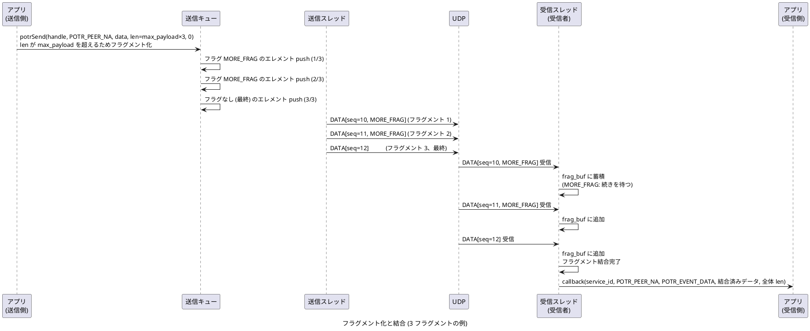
```plantuml
@startuml フラグメント化と結合 (3 フラグメントの例)
caption フラグメント化と結合 (3 フラグメントの例)

participant "アプリ\n(送信側)" as SAPP
participant "送信キュー" as Q
participant "送信スレッド" as ST
participant "UDP" as UDP
participant "受信スレッド\n(受信者)" as RRT
participant "アプリ\n(受信側)" as RAPP

SAPP -> Q: potrSend(handle, POTR_PEER_NA, data, len=max_payload×3, 0)\nlen が max_payload を超えるためフラグメント化

Q -> Q: フラグ MORE_FRAG のエレメント push (1/3)
Q -> Q: フラグ MORE_FRAG のエレメント push (2/3)
Q -> Q: フラグなし (最終) のエレメント push (3/3)

ST -> UDP: DATA[seq=10, MORE_FRAG] (フラグメント 1)
ST -> UDP: DATA[seq=11, MORE_FRAG] (フラグメント 2)
ST -> UDP: DATA[seq=12]           (フラグメント 3、最終)

UDP -> RRT: DATA[seq=10, MORE_FRAG] 受信
RRT -> RRT: frag_buf に蓄積\n(MORE_FRAG: 続きを待つ)

UDP -> RRT: DATA[seq=11, MORE_FRAG] 受信
RRT -> RRT: frag_buf に追加

UDP -> RRT: DATA[seq=12] 受信
RRT -> RRT: frag_buf に追加\nフラグメント結合完了

RRT -> RAPP: callback(service_id, POTR_PEER_NA, POTR_EVENT_DATA, 結合済みデータ, 全体 len)

@enduml
```

## NACK による再送

パケットロスが発生した場合の再送シーケンスです。

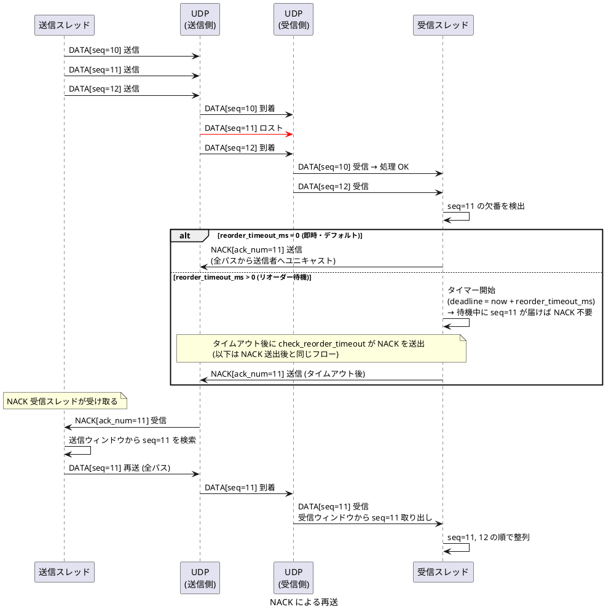
```plantuml
@startuml NACK による再送
caption NACK による再送

participant "送信スレッド" as ST
participant "UDP\n(送信側)" as SUDP
participant "UDP\n(受信側)" as RUDP
participant "受信スレッド" as RRT

ST -> SUDP: DATA[seq=10] 送信
ST -> SUDP: DATA[seq=11] 送信
ST -> SUDP: DATA[seq=12] 送信

SUDP -> RUDP: DATA[seq=10] 到着
SUDP -[#red]> RUDP: DATA[seq=11] ロスト
SUDP -> RUDP: DATA[seq=12] 到着

RUDP -> RRT: DATA[seq=10] 受信 → 処理 OK
RUDP -> RRT: DATA[seq=12] 受信

RRT -> RRT: seq=11 の欠番を検出

alt reorder_timeout_ms = 0 (即時・デフォルト)
  RRT -> SUDP: NACK[ack_num=11] 送信\n(全パスから送信者へユニキャスト)
else reorder_timeout_ms > 0 (リオーダー待機)
  RRT -> RRT: タイマー開始\n(deadline = now + reorder_timeout_ms)\n→ 待機中に seq=11 が届けば NACK 不要
  note over RRT, SUDP: タイムアウト後に check_reorder_timeout が NACK を送出\n(以下は NACK 送出後と同じフロー)
  RRT -> SUDP: NACK[ack_num=11] 送信 (タイムアウト後)
end

note over ST: NACK 受信スレッドが受け取る

SUDP -> ST: NACK[ack_num=11] 受信
ST -> ST: 送信ウィンドウから seq=11 を検索

ST -> SUDP: DATA[seq=11] 再送 (全パス)

SUDP -> RUDP: DATA[seq=11] 到着

RUDP -> RRT: DATA[seq=11] 受信\n受信ウィンドウから seq=11 取り出し
RRT -> RRT: seq=11, 12 の順で整列

@enduml
```

## リオーダーバッファ (reorder_timeout_ms > 0)

`reorder_timeout_ms` を 0 より大きな値に設定すると、欠番検出後にただちに NACK や DISCONNECTED を発行せず、指定時間だけ待機します。待機中に欠落パケットが届いた場合は NACK/DISCONNECTED を発行せずに正常配信します。

### 通常モード: 待機中に届いた場合 (NACK なし)

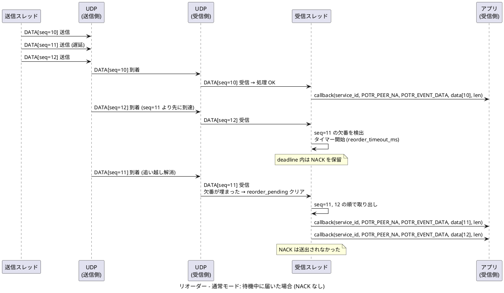
```plantuml
@startuml リオーダー - 通常モード 待機中に届いた場合
caption リオーダー - 通常モード: 待機中に届いた場合 (NACK なし)

participant "送信スレッド" as ST
participant "UDP\n(送信側)" as SUDP
participant "UDP\n(受信側)" as RUDP
participant "受信スレッド" as RRT
participant "アプリ\n(受信側)" as RAPP

ST -> SUDP: DATA[seq=10] 送信
ST -> SUDP: DATA[seq=11] 送信 (遅延)
ST -> SUDP: DATA[seq=12] 送信

SUDP -> RUDP: DATA[seq=10] 到着
RUDP -> RRT: DATA[seq=10] 受信 → 処理 OK
RRT -> RAPP: callback(service_id, POTR_PEER_NA, POTR_EVENT_DATA, data[10], len)

SUDP -> RUDP: DATA[seq=12] 到着 (seq=11 より先に到達)

RUDP -> RRT: DATA[seq=12] 受信
RRT -> RRT: seq=11 の欠番を検出\nタイマー開始 (reorder_timeout_ms)
note over RRT: deadline 内は NACK を保留

SUDP -> RUDP: DATA[seq=11] 到着 (追い越し解消)
RUDP -> RRT: DATA[seq=11] 受信\n欠番が埋まった → reorder_pending クリア
RRT -> RRT: seq=11, 12 の順で取り出し
RRT -> RAPP: callback(service_id, POTR_PEER_NA, POTR_EVENT_DATA, data[11], len)
RRT -> RAPP: callback(service_id, POTR_PEER_NA, POTR_EVENT_DATA, data[12], len)

note over RRT: NACK は送出されなかった

@enduml
```

### RAW モード: 待機中に届いた場合 (DISCONNECTED なし)

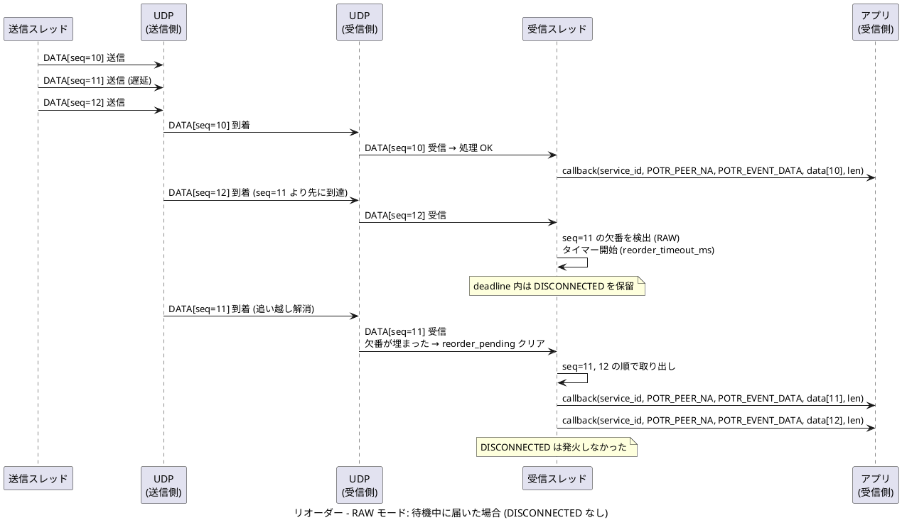
```plantuml
@startuml リオーダー - RAW モード 待機中に届いた場合
caption リオーダー - RAW モード: 待機中に届いた場合 (DISCONNECTED なし)

participant "送信スレッド" as ST
participant "UDP\n(送信側)" as SUDP
participant "UDP\n(受信側)" as RUDP
participant "受信スレッド" as RRT
participant "アプリ\n(受信側)" as RAPP

ST -> SUDP: DATA[seq=10] 送信
ST -> SUDP: DATA[seq=11] 送信 (遅延)
ST -> SUDP: DATA[seq=12] 送信

SUDP -> RUDP: DATA[seq=10] 到着
RUDP -> RRT: DATA[seq=10] 受信 → 処理 OK
RRT -> RAPP: callback(service_id, POTR_PEER_NA, POTR_EVENT_DATA, data[10], len)

SUDP -> RUDP: DATA[seq=12] 到着 (seq=11 より先に到達)

RUDP -> RRT: DATA[seq=12] 受信
RRT -> RRT: seq=11 の欠番を検出 (RAW)\nタイマー開始 (reorder_timeout_ms)
note over RRT: deadline 内は DISCONNECTED を保留

SUDP -> RUDP: DATA[seq=11] 到着 (追い越し解消)
RUDP -> RRT: DATA[seq=11] 受信\n欠番が埋まった → reorder_pending クリア
RRT -> RRT: seq=11, 12 の順で取り出し
RRT -> RAPP: callback(service_id, POTR_PEER_NA, POTR_EVENT_DATA, data[11], len)
RRT -> RAPP: callback(service_id, POTR_PEER_NA, POTR_EVENT_DATA, data[12], len)

note over RRT: DISCONNECTED は発火しなかった

@enduml
```

## REJECT による切断と復帰

送信ウィンドウから evict 済みのパケットを要求した場合のシーケンスです。

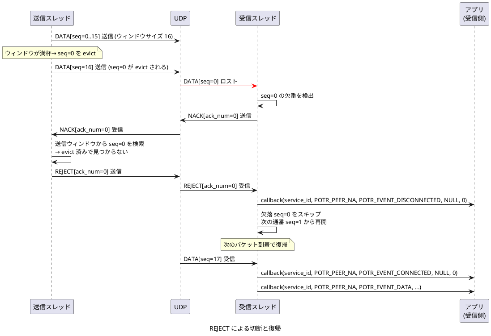
```plantuml
@startuml REJECT による切断と復帰
caption REJECT による切断と復帰

participant "送信スレッド" as ST
participant "UDP" as UDP
participant "受信スレッド" as RRT
participant "アプリ\n(受信側)" as RAPP

ST -> UDP: DATA[seq=0..15] 送信 (ウィンドウサイズ 16)

note over ST: ウィンドウが満杯→ seq=0 を evict

ST -> UDP: DATA[seq=16] 送信 (seq=0 が evict される)

UDP -[#red]> RRT: DATA[seq=0] ロスト

RRT -> RRT: seq=0 の欠番を検出
RRT -> UDP: NACK[ack_num=0] 送信

UDP -> ST: NACK[ack_num=0] 受信
ST -> ST: 送信ウィンドウから seq=0 を検索\n→ evict 済みで見つからない

ST -> UDP: REJECT[ack_num=0] 送信

UDP -> RRT: REJECT[ack_num=0] 受信

RRT -> RAPP: callback(service_id, POTR_PEER_NA, POTR_EVENT_DISCONNECTED, NULL, 0)
RRT -> RRT: 欠落 seq=0 をスキップ\n次の通番 seq=1 から再開

note over RRT: 次のパケット到着で復帰

UDP -> RRT: DATA[seq=17] 受信
RRT -> RAPP: callback(service_id, POTR_PEER_NA, POTR_EVENT_CONNECTED, NULL, 0)
RRT -> RAPP: callback(service_id, POTR_PEER_NA, POTR_EVENT_DATA, ...)

@enduml
```

## ヘルスチェック (正常疎通)

ヘルスチェックが有効な場合の PING 送信です。片方向 type 1-6 は open 直後の即時 PING を行わず、最後の `PING` または有効 `DATA` 送信から `health_interval_ms` 経過したときだけ PING を送ります。双方向 UDP では従来どおり定周期 PING と、`path_ping_state[]` 変化時の割り込み PING を送出します。双方向 UDP はこの PING 往復で `CONNECTED` するため、実効 `health_interval_ms = 0` のままでは接続確立しません。

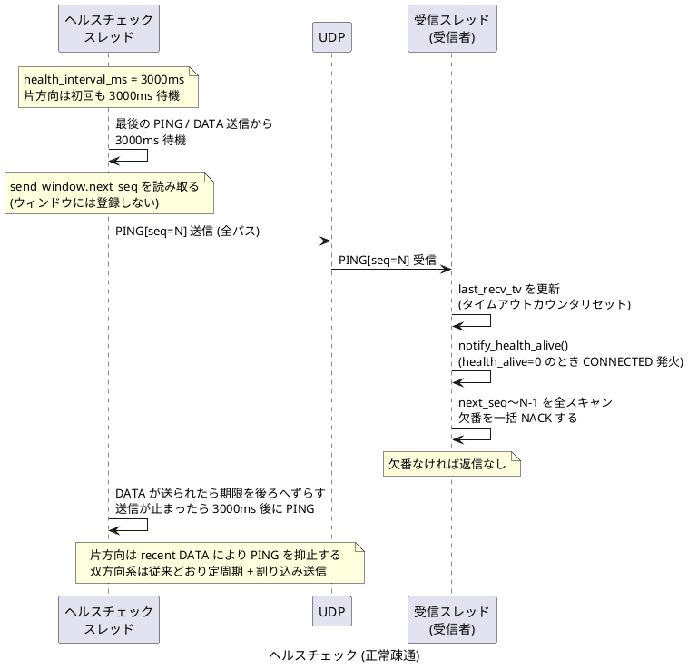
```plantuml
@startuml ヘルスチェック (正常疎通)
caption ヘルスチェック (正常疎通)

participant "ヘルスチェック\nスレッド" as HT
participant "UDP" as UDP
participant "受信スレッド\n(受信者)" as RRT

note over HT: health_interval_ms = 3000ms\n片方向は初回も 3000ms 待機

HT -> HT: 最後の PING / DATA 送信から\n3000ms 待機
note over HT: send_window.next_seq を読み取る\n(ウィンドウには登録しない)
HT -> UDP: PING[seq=N] 送信 (全パス)

UDP -> RRT: PING[seq=N] 受信
RRT -> RRT: last_recv_tv を更新\n(タイムアウトカウンタリセット)
RRT -> RRT: notify_health_alive()\n(health_alive=0 のとき CONNECTED 発火)
RRT -> RRT: next_seq〜N-1 を全スキャン\n欠番を一括 NACK する
note over RRT: 欠番なければ返信なし

HT -> HT: DATA が送られたら期限を後ろへずらす\n送信が止まったら 3000ms 後に PING

note over HT, UDP: 片方向は recent DATA により PING を抑止する\n双方向系は従来どおり定周期 + 割り込み送信

@enduml
```

## ヘルスチェックタイムアウト

片方向 type 1-6 で、最後の有効な `PING` / `DATA` から一定時間パケットが届かなくなった場合の切断検知と復帰です。

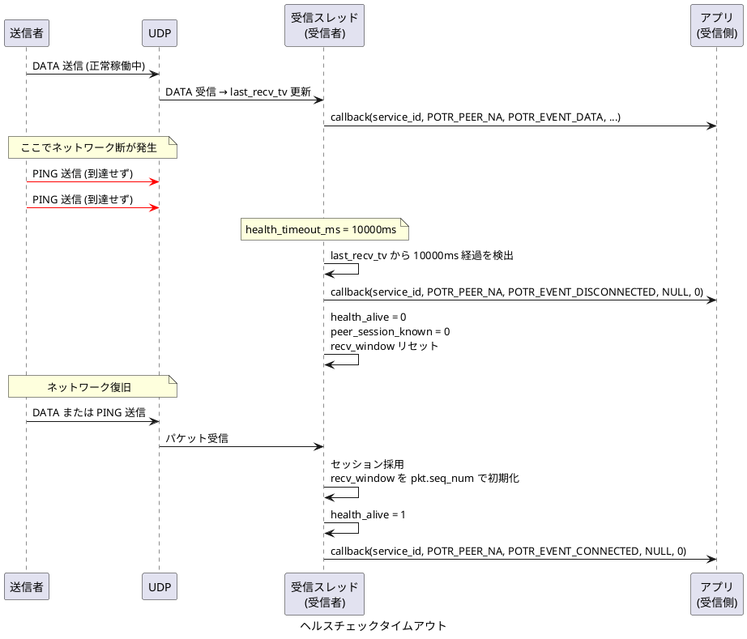
```plantuml
@startuml ヘルスチェックタイムアウト
caption ヘルスチェックタイムアウト

participant "送信者" as S
participant "UDP" as UDP
participant "受信スレッド\n(受信者)" as RRT
participant "アプリ\n(受信側)" as RAPP

S -> UDP: DATA 送信 (正常稼働中)
UDP -> RRT: DATA 受信 → last_recv_tv 更新
RRT -> RAPP: callback(service_id, POTR_PEER_NA, POTR_EVENT_DATA, ...)

note over S, UDP: ここでネットワーク断が発生

S -[#red]> UDP: PING 送信 (到達せず)
S -[#red]> UDP: PING 送信 (到達せず)

note over RRT: health_timeout_ms = 10000ms

RRT -> RRT: last_recv_tv から 10000ms 経過を検出

RRT -> RAPP: callback(service_id, POTR_PEER_NA, POTR_EVENT_DISCONNECTED, NULL, 0)
RRT -> RRT: health_alive = 0\npeer_session_known = 0\nrecv_window リセット

note over S, UDP: ネットワーク復旧

S -> UDP: DATA または PING 送信
UDP -> RRT: パケット受信
RRT -> RRT: セッション採用\nrecv_window を pkt.seq_num で初期化
RRT -> RRT: health_alive = 1

RRT -> RAPP: callback(service_id, POTR_PEER_NA, POTR_EVENT_CONNECTED, NULL, 0)

@enduml
```

## サービス終了 (potrCloseService)

`potrCloseService()` による正常終了シーケンスです。

### 送信者側の終了 (DATA/FIN が順序通りに届く場合)

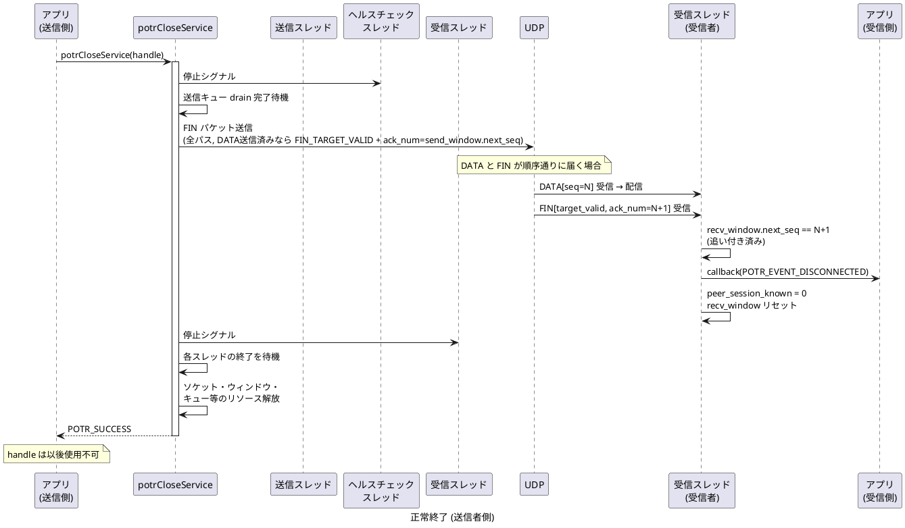
```plantuml
@startuml 正常終了 (送信者側)
caption 正常終了 (送信者側)

participant "アプリ\n(送信側)" as SAPP
participant "potrCloseService" as CLOSE
participant "送信スレッド" as ST
participant "ヘルスチェック\nスレッド" as HT
participant "受信スレッド" as RT
participant "UDP" as UDP
participant "受信スレッド\n(受信者)" as RRT
participant "アプリ\n(受信側)" as RAPP

SAPP -> CLOSE: potrCloseService(handle)
activate CLOSE

CLOSE -> HT: 停止シグナル
CLOSE -> CLOSE: 送信キュー drain 完了待機

CLOSE -> UDP: FIN パケット送信\n(全パス, DATA送信済みなら FIN_TARGET_VALID + ack_num=send_window.next_seq)

note over UDP: DATA と FIN が順序通りに届く場合
UDP -> RRT: DATA[seq=N] 受信 → 配信
UDP -> RRT: FIN[target_valid, ack_num=N+1] 受信
RRT -> RRT: recv_window.next_seq == N+1\n(追い付き済み)
RRT -> RAPP: callback(POTR_EVENT_DISCONNECTED)
RRT -> RRT: peer_session_known = 0\nrecv_window リセット

CLOSE -> RT: 停止シグナル

CLOSE -> CLOSE: 各スレッドの終了を待機
CLOSE -> CLOSE: ソケット・ウィンドウ・\nキュー等のリソース解放

CLOSE --> SAPP: POTR_SUCCESS
deactivate CLOSE

note over SAPP: handle は以後使用不可

@enduml
```

### 送信者側の終了 (FIN が DATA より先に届く場合)

UDP の到達順序は保証されないため、FIN が最後の DATA より先に受信側へ届く場合があります。
受信側は `FIN.ack_num` を参照して DATA の到着を待機します。

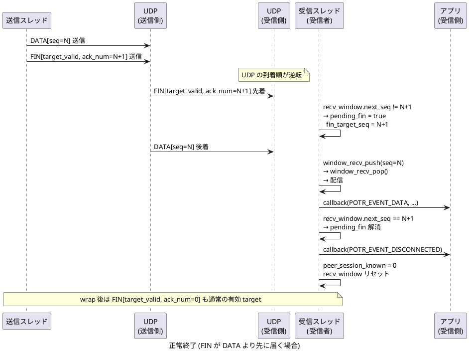
```plantuml
@startuml 正常終了 FIN pending
caption 正常終了 (FIN が DATA より先に届く場合)

participant "送信スレッド" as ST
participant "UDP\n(送信側)" as SUDP
participant "UDP\n(受信側)" as RUDP
participant "受信スレッド\n(受信者)" as RRT
participant "アプリ\n(受信側)" as RAPP

ST -> SUDP: DATA[seq=N] 送信
ST -> SUDP: FIN[target_valid, ack_num=N+1] 送信

note over RUDP: UDP の到着順が逆転

SUDP -> RUDP: FIN[target_valid, ack_num=N+1] 先着
RRT -> RRT: recv_window.next_seq != N+1\n→ pending_fin = true\n  fin_target_seq = N+1

SUDP -> RUDP: DATA[seq=N] 後着
RRT -> RRT: window_recv_push(seq=N)\n→ window_recv_pop()\n→ 配信
RRT -> RAPP: callback(POTR_EVENT_DATA, ...)
RRT -> RRT: recv_window.next_seq == N+1\n→ pending_fin 解消
RRT -> RAPP: callback(POTR_EVENT_DISCONNECTED)
RRT -> RRT: peer_session_known = 0\nrecv_window リセット

note over ST,RRT: wrap 後は FIN[target_valid, ack_num=0] も通常の有効 target

@enduml
```

### 受信者側の終了

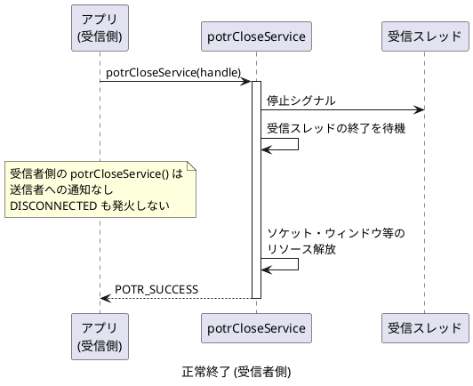
```plantuml
@startuml 正常終了 (受信者側)
caption 正常終了 (受信者側)

participant "アプリ\n(受信側)" as RAPP
participant "potrCloseService" as CLOSE
participant "受信スレッド" as RT

RAPP -> CLOSE: potrCloseService(handle)
activate CLOSE

CLOSE -> RT: 停止シグナル
CLOSE -> CLOSE: 受信スレッドの終了を待機

note over RAPP: 受信者側の potrCloseService() は\n送信者への通知なし\nDISCONNECTED も発火しない

CLOSE -> CLOSE: ソケット・ウィンドウ等の\nリソース解放

CLOSE --> RAPP: POTR_SUCCESS
deactivate CLOSE

@enduml
```

## RAW モード: ギャップ検出による切断と復帰 (DATA)

DATA パケットの追い越し (欠落) を検出した場合のシーケンスです。

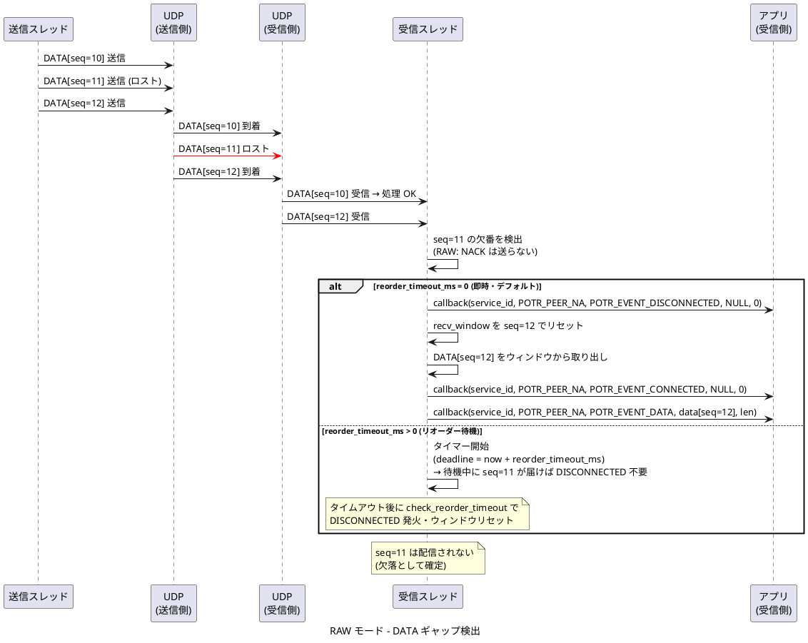
```plantuml
@startuml RAW モード - DATA ギャップ検出
caption RAW モード - DATA ギャップ検出

participant "送信スレッド" as ST
participant "UDP\n(送信側)" as SUDP
participant "UDP\n(受信側)" as RUDP
participant "受信スレッド" as RRT
participant "アプリ\n(受信側)" as RAPP

ST -> SUDP: DATA[seq=10] 送信
ST -> SUDP: DATA[seq=11] 送信 (ロスト)
ST -> SUDP: DATA[seq=12] 送信

SUDP -> RUDP: DATA[seq=10] 到着
SUDP -[#red]> RUDP: DATA[seq=11] ロスト
SUDP -> RUDP: DATA[seq=12] 到着

RUDP -> RRT: DATA[seq=10] 受信 → 処理 OK
RUDP -> RRT: DATA[seq=12] 受信

RRT -> RRT: seq=11 の欠番を検出\n(RAW: NACK は送らない)

alt reorder_timeout_ms = 0 (即時・デフォルト)
  RRT -> RAPP: callback(service_id, POTR_PEER_NA, POTR_EVENT_DISCONNECTED, NULL, 0)
  RRT -> RRT: recv_window を seq=12 でリセット
  RRT -> RRT: DATA[seq=12] をウィンドウから取り出し
  RRT -> RAPP: callback(service_id, POTR_PEER_NA, POTR_EVENT_CONNECTED, NULL, 0)
  RRT -> RAPP: callback(service_id, POTR_PEER_NA, POTR_EVENT_DATA, data[seq=12], len)
else reorder_timeout_ms > 0 (リオーダー待機)
  RRT -> RRT: タイマー開始\n(deadline = now + reorder_timeout_ms)\n→ 待機中に seq=11 が届けば DISCONNECTED 不要
  note over RRT: タイムアウト後に check_reorder_timeout で\nDISCONNECTED 発火・ウィンドウリセット
end

note over RRT: seq=11 は配信されない\n(欠落として確定)

@enduml
```

## RAW モード: ギャップ検出による切断と復帰 (PING)

PING の `seq_num` から欠落パケットを検出した場合のシーケンスです。

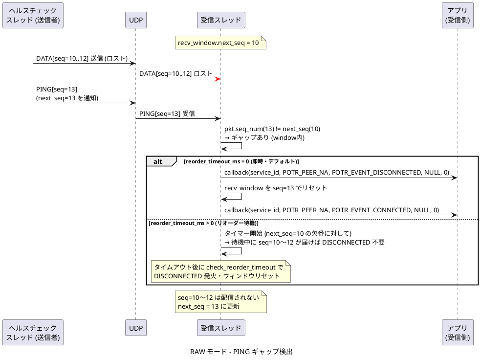
```plantuml
@startuml RAW モード - PING ギャップ検出
caption RAW モード - PING ギャップ検出

participant "ヘルスチェック\nスレッド (送信者)" as HT
participant "UDP" as UDP
participant "受信スレッド" as RRT
participant "アプリ\n(受信側)" as RAPP

note over RRT: recv_window.next_seq = 10

HT -> UDP: DATA[seq=10..12] 送信 (ロスト)
UDP -[#red]> RRT: DATA[seq=10..12] ロスト

HT -> UDP: PING[seq=13]\n(next_seq=13 を通知)
UDP -> RRT: PING[seq=13] 受信

RRT -> RRT: pkt.seq_num(13) != next_seq(10)\n→ ギャップあり (window内)

alt reorder_timeout_ms = 0 (即時・デフォルト)
  RRT -> RAPP: callback(service_id, POTR_PEER_NA, POTR_EVENT_DISCONNECTED, NULL, 0)
  RRT -> RRT: recv_window を seq=13 でリセット
  RRT -> RAPP: callback(service_id, POTR_PEER_NA, POTR_EVENT_CONNECTED, NULL, 0)
else reorder_timeout_ms > 0 (リオーダー待機)
  RRT -> RRT: タイマー開始 (next_seq=10 の欠番に対して)\n→ 待機中に seq=10〜12 が届けば DISCONNECTED 不要
  note over RRT: タイムアウト後に check_reorder_timeout で\nDISCONNECTED 発火・ウィンドウリセット
end

note over RRT: seq=10〜12 は配信されない\nnext_seq = 13 に更新

@enduml
```

## 補足：接続状態の遷移

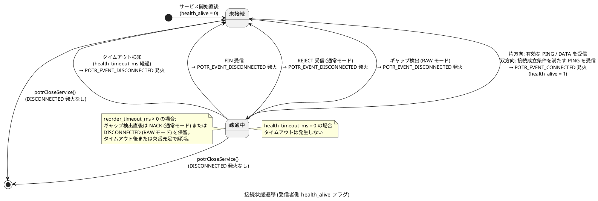
```plantuml
@startuml 接続状態遷移 (受信者側 health_alive フラグ)
caption 接続状態遷移 (受信者側 health_alive フラグ)

[*] -r-> 未接続 : サービス開始直後\n(health_alive = 0)

未接続 ---> 疎通中 : 片方向: 有効な PING / DATA を受信\n双方向: 接続成立条件を満たす PING を受信\n→ POTR_EVENT_CONNECTED 発火\n(health_alive = 1)

疎通中 ---> 未接続 : タイムアウト検知\n (health_timeout_ms 経過) \n→ POTR_EVENT_DISCONNECTED 発火

疎通中 --> 未接続 : FIN 受信\n→ POTR_EVENT_DISCONNECTED 発火

疎通中 --> 未接続 : REJECT 受信 (通常モード)\n→ POTR_EVENT_DISCONNECTED 発火

疎通中 --> 未接続 : ギャップ検出 (RAW モード)\n→ POTR_EVENT_DISCONNECTED 発火

未接続 --> [*] : potrCloseService()\n (DISCONNECTED 発火なし)
疎通中 --> [*] : potrCloseService()\n (DISCONNECTED 発火なし)

note right of 疎通中
  health_timeout_ms = 0 の場合
  タイムアウトは発生しない
end note

note left of 疎通中
  reorder_timeout_ms > 0 の場合:
  ギャップ検出直後は NACK (通常モード) または
  DISCONNECTED (RAW モード) を保留。
  タイムアウト後または欠番充足で解消。
end note

@enduml
```

## unicast_bidir 1:1 双方向通信

`POTR_TYPE_UNICAST_BIDIR` における双方向データ通信のシーケンスです。
両端が独立したセッションを持ち、それぞれがデータ送受信・NACK・ヘルスチェックを行います。

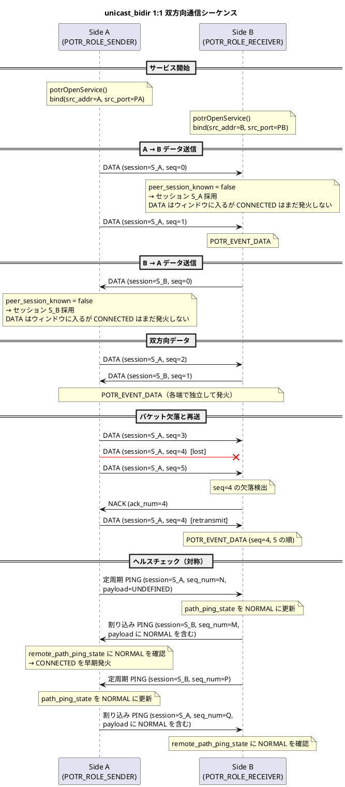
```plantuml
@startuml unicast_bidir 通信シーケンス
title unicast_bidir 1:1 双方向通信シーケンス

participant "Side A\n(POTR_ROLE_SENDER)" as A
participant "Side B\n(POTR_ROLE_RECEIVER)" as B

== サービス開始 ==

note over A: potrOpenService()\nbind(src_addr=A, src_port=PA)
note over B: potrOpenService()\nbind(src_addr=B, src_port=PB)

== A → B データ送信 ==

A -> B: DATA (session=S_A, seq=0)
note over B: peer_session_known = false\n→ セッション S_A 採用\nDATA はウィンドウに入るが CONNECTED はまだ発火しない

A -> B: DATA (session=S_A, seq=1)
note over B: POTR_EVENT_DATA

== B → A データ送信 ==

B -> A: DATA (session=S_B, seq=0)
note over A: peer_session_known = false\n→ セッション S_B 採用\nDATA はウィンドウに入るが CONNECTED はまだ発火しない

== 双方向データ ==

A -> B: DATA (session=S_A, seq=2)
B -> A: DATA (session=S_B, seq=1)
note over A,B: POTR_EVENT_DATA（各端で独立して発火）

== パケット欠落と再送 ==

A -> B: DATA (session=S_A, seq=3)
A -[#red]x B: DATA (session=S_A, seq=4)  [lost]
A -> B: DATA (session=S_A, seq=5)
note over B: seq=4 の欠落検出
B -> A: NACK (ack_num=4)
A -> B: DATA (session=S_A, seq=4)  [retransmit]
note over B: POTR_EVENT_DATA (seq=4, 5 の順)

== ヘルスチェック（対称） ==

A -> B: 定周期 PING (session=S_A, seq_num=N,\npayload=UNDEFINED)
note over B: path_ping_state を NORMAL に更新
B -> A: 割り込み PING (session=S_B, seq_num=M,\npayload に NORMAL を含む)
note over A: remote_path_ping_state に NORMAL を確認\n→ CONNECTED を早期発火

B -> A: 定周期 PING (session=S_B, seq_num=P)
note over A: path_ping_state を NORMAL に更新
A -> B: 割り込み PING (session=S_A, seq_num=Q,\npayload に NORMAL を含む)
note over B: remote_path_ping_state に NORMAL を確認

@enduml
```

## unicast_bidir N:1 サーバでの接続と送受信

`POTR_TYPE_UNICAST_BIDIR` を N:1 モードで開いたサーバが、新規クライアントを受け付けて `peer_id` ごとに通信するシーケンスです。

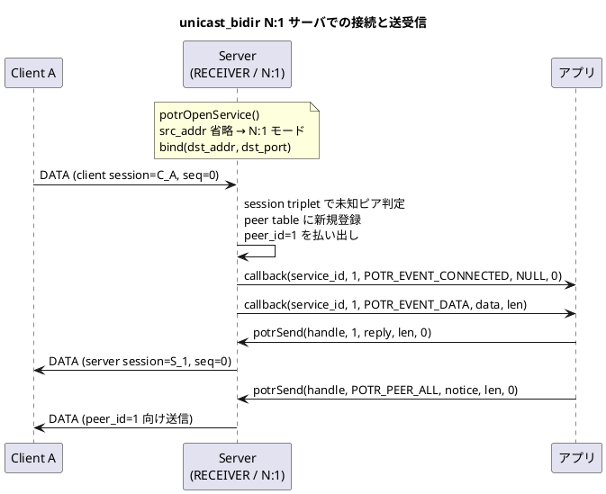
```plantuml
@startuml unicast_bidir N1 接続
title unicast_bidir N:1 サーバでの接続と送受信

participant "Client A" as CA
participant "Server\n(RECEIVER / N:1)" as S
participant "アプリ" as APP

note over S: potrOpenService()\nsrc_addr 省略 → N:1 モード\nbind(dst_addr, dst_port)

CA -> S: DATA (client session=C_A, seq=0)
S -> S: session triplet で未知ピア判定\npeer table に新規登録\npeer_id=1 を払い出し
S -> APP: callback(service_id, 1, POTR_EVENT_CONNECTED, NULL, 0)
S -> APP: callback(service_id, 1, POTR_EVENT_DATA, data, len)

APP -> S: potrSend(handle, 1, reply, len, 0)
S -> CA: DATA (server session=S_1, seq=0)

APP -> S: potrSend(handle, POTR_PEER_ALL, notice, len, 0)
S -> CA: DATA (peer_id=1 向け送信)
@enduml
```

## unicast_bidir N:1 サーバでの切断

サーバは FIN 受信、`potrDisconnectPeer()`、またはヘルスチェックタイムアウトによりピア単位で切断を処理します。

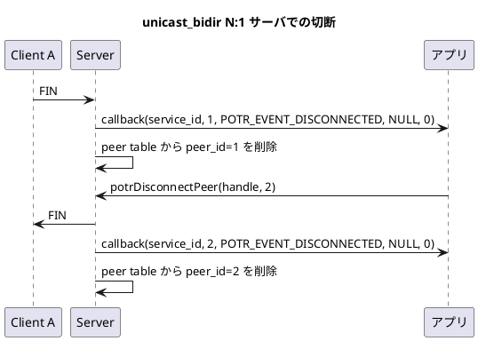
```plantuml
@startuml unicast_bidir N1 切断
title unicast_bidir N:1 サーバでの切断

participant "Client A" as CA
participant "Server" as S
participant "アプリ" as APP

CA -> S: FIN
S -> APP: callback(service_id, 1, POTR_EVENT_DISCONNECTED, NULL, 0)
S -> S: peer table から peer_id=1 を削除

APP -> S: potrDisconnectPeer(handle, 2)
S -> CA: FIN
S -> APP: callback(service_id, 2, POTR_EVENT_DISCONNECTED, NULL, 0)
S -> S: peer table から peer_id=2 を削除
@enduml
```

## unicast_bidir ヘルスタイムアウトによる切断検知

`POTR_TYPE_UNICAST_BIDIR` において、相手側が停止した場合の切断検知シーケンスです。1:1 モードでは相手端単位、N:1 モードでは各 `peer_id` 単位で `last_recv_tv_sec` を監視し、`health_timeout_ms` 超過で切断を検知します。

```plantuml
@startuml unicast_bidir タイムアウト
title unicast_bidir ヘルスタイムアウトによる切断検知

participant "Side A" as A
participant "Side B\n(停止)" as B

note over A,B: 通信中

A -> B: PING (ack_num=0, seq_num=N)
note over B: アプリケーションが停止\n（パケットが一切届かなくなる）
note over A: health_timeout_ms 経過\nlast_recv_tv_sec が更新されない\ncheck_health_timeout() → DISCONNECTED
note over A: POTR_EVENT_DISCONNECTED 発火

@enduml
```

## TCP サービス開始 (SENDER)

`potrOpenService()` を TCP SENDER として呼び出したときの内部処理です。
`potrOpenService()` はすぐに返り、接続確立は connect スレッドが非同期に行います。

```plantuml
@startuml TCP サービス開始 (SENDER)
caption TCP サービス開始 (SENDER)

participant "アプリ" as APP
participant "potrOpenService" as OPEN
participant "connect スレッド" as CT
participant "送信スレッド" as ST
participant "受信スレッド" as RT
participant "ヘルスチェックスレッド" as HT

APP -> OPEN: potrOpenService(config, service_id, POTR_ROLE_SENDER, cb, &handle)
activate OPEN
OPEN -> OPEN: 設定ファイル解析・セッション識別子生成
OPEN -> OPEN: 送信キュー / ウィンドウ初期化
OPEN -> OPEN: tcp_state_mutex / tcp_state_cv 初期化

OPEN -> CT**: connect スレッド起動
OPEN --> APP: POTR_SUCCESS, *handle
deactivate OPEN

activate CT
CT -> CT: connect(dst_addr, dst_port)\n（接続確立まで connect_timeout_ms 待機）
CT -> ST**: 送信スレッド起動
CT -> RT**: 受信スレッド起動
CT -> HT**: ヘルスチェックスレッド起動

note over CT: recv スレッドが切断を検知するまで待機

@enduml
```

## TCP サービス開始 (RECEIVER)

`potrOpenService()` を TCP RECEIVER として呼び出したときの内部処理です。

```plantuml
@startuml TCP サービス開始 (RECEIVER)
caption TCP サービス開始 (RECEIVER)

participant "アプリ" as APP
participant "potrOpenService" as OPEN
participant "accept スレッド" as AT
participant "recv スレッド" as RT

APP -> OPEN: potrOpenService(config, service_id, POTR_ROLE_RECEIVER, callback, &handle)
activate OPEN
OPEN -> OPEN: 設定ファイル解析
OPEN -> OPEN: TCP listen ソケット作成\nbind(dst_addr, dst_port) → listen()

OPEN -> AT**: accept スレッド起動
OPEN --> APP: POTR_SUCCESS, *handle
deactivate OPEN

activate AT
note over AT: accept() 待機中
AT -> RT**: 接続確立後に recv スレッド起動

activate RT
note over RT: DATA / PING を待機するポーリングループ

@enduml
```

## TCP 正常接続・通信・切断

TCP SENDER / RECEIVER 間の正常な接続確立・データ送信・切断シーケンスです。

```plantuml
@startuml TCP 正常シーケンス
caption TCP 正常シーケンス

participant "SENDER\n(クライアント)" as S
participant "RECEIVER\n(サーバー)" as R

== サービス開始 ==

note over R: potrOpenService()\nbind() → listen()
note over S: potrOpenService()\nconnect() 開始
S -> R: TCP 3way handshake
note over S: 接続確立

== データ送信 ==

S -> R: DATA (seq_num=0, 最初のパケット)
note over R: peer_session_known = false\n→ セッション採用\nPOTR_EVENT_CONNECTED 発火

S -> R: DATA (seq_num=1)
S -> R: DATA (seq_num=2)
note over R: POTR_EVENT_DATA × 3

== ヘルスチェック ==

S -> R: 定周期 PING (seq_num=3, payload=UNDEFINED)
note over R: path_ping_state を NORMAL に更新
R -> S: 割り込み PING (seq_num=M,\npayload に NORMAL を含む)
note over S: 初回の認証済み PING を受信\n→ CONNECTED / alive 確認

== 正常終了 ==

note over S: potrCloseService()\nclose_requested=1\nsend_queue drain 待機
S -> R: FIN[target_valid, ack_num=3]
note over R: recv_window.next_seq が 3 に追い付くまで\n必要なら pending_fin
note over R: 最後の DATA callback 完了
R -> S: FIN_ACK[ack_num=3]
note over R: POTR_EVENT_DISCONNECTED 発火\ncurrent session をリセット
note over S: FIN_ACK 受信後に socket teardown

@enduml
```

## TCP SENDER 再起動・自動再接続

SENDER プロセスが再起動した場合に自動再接続が行われるシーケンスです。

```plantuml
@startuml TCP 再接続シーケンス
caption TCP SENDER 再起動・自動再接続

participant "SENDER" as S
participant "RECEIVER" as R

note over S,R: 通信中（セッション A）

== SENDER プロセス再起動 ==

S -[#red]-> R: TCP 接続断
note over R: TCP 切断検知\nPOTR_EVENT_DISCONNECTED 発火\npeer_session_known = false

note over S: potrOpenService()\n新セッション識別子を生成
S -> R: TCP 3way handshake（再接続）
S -> R: DATA (セッション B の最初のパケット)

note over R: セッション B を採用\nPOTR_EVENT_CONNECTED 発火

@enduml
```

## TCP PING 応答タイムアウト

RECEIVER のアプリケーション層がハングした場合に SENDER が切断を検知するシーケンスです。
TCP 接続は OS レベルで生存していてもアプリ層の PING 応答が途絶えることで検知します。

```plantuml
@startuml TCP PING 応答タイムアウト
caption TCP PING 応答タイムアウト

participant "SENDER" as S
participant "RECEIVER\n(応答なし)" as R

note over S,R: 通信中

S -> R: PING (ack_num=0, seq_num=N)
note over R: アプリケーション層がハング\n（TCP 接続は生きているが PING 応答が返らない）
note over S: tcp_health_timeout_ms 経過\nPING 応答（ack_num=N）未受信
note over S: POTR_EVENT_DISCONNECTED 発火\nTCP 接続を切断

note over S: reconnect_interval_ms 待機後\nconnect() 再試行

@enduml
```

## TCP RECEIVER 側 PING タイムアウト

SENDER のアプリケーション層がハングして PING 送信が停止した場合に RECEIVER が切断を検知するシーケンスです。
TCP 接続は OS レベルで生存していても、PING 要求が届かなくなることで RECEIVER が検知します。

```plantuml
@startuml TCP RECEIVER PING タイムアウト
caption TCP RECEIVER 側 PING タイムアウト

participant "SENDER\n(PING 送信停止)" as S
participant "RECEIVER" as R

note over S,R: 通信中

S -> R: 定周期 PING (seq_num=N, payload=UNDEFINED)
R -> S: 割り込み PING (seq_num=M,\npayload に NORMAL を含む)
note over S: アプリケーション層がハング\n（TCP 接続は生きているが PING を送信できない）

note over R: tcp_health_timeout_ms 経過\nPING 要求（ack_num=0）未着信
note over R: POTR_EVENT_DISCONNECTED 発火\nTCP 接続を切断

note over R: accept スレッドへ戻り\n次の接続を待機

@enduml
```

## TCP マルチパス

### TCP マルチパス接続確立

path 数 = 2 の例。RECEIVER が 2 つの listen ソケットを用意し、SENDER が各 path に接続します。
最初の 1 本が接続した時点で `POTR_EVENT_CONNECTED` が発火します。

```plantuml
@startuml TCP マルチパス接続確立
caption TCP マルチパス接続確立（path 数 = 2）

participant "SENDER\n(connect スレッド #0)" as SC0
participant "SENDER\n(connect スレッド #1)" as SC1
participant "RECEIVER\n(accept スレッド #0)" as RA0
participant "RECEIVER\n(accept スレッド #1)" as RA1
participant "アプリ\n(受信側)" as RAPP

note over RA0: bind(dst_addr[0]) → listen()
note over RA1: bind(dst_addr[1]) → listen()

SC0 -> RA0: TCP 3way handshake (path 0)
RA0 -> RA0: tcp_conn_fd[0] = accept()\ntcp_active_paths 0→1
RA0 -> RAPP: callback(POTR_EVENT_CONNECTED)
note over RA0: recv スレッド #0 起動

SC1 -> RA1: TCP 3way handshake (path 1)
RA1 -> RA1: tcp_conn_fd[1] = accept()\ntcp_active_paths 1→2
note over RA1: POTR_EVENT_CONNECTED は発火しない
note over RA1: recv スレッド #1 起動

note over SC0,RA1: 2 path で接続確立。同一 seq_num のパケットが両 path から届く
@enduml
```

### 部分切断時の継続

1 本の path が切断しても残りの path で通信を継続します。
`POTR_EVENT_DISCONNECTED` は発火しません。

```plantuml
@startuml TCP 部分切断時の継続
caption TCP 部分切断時の継続（path 0 切断）

participant "SENDER\n(connect スレッド #0)" as SC0
participant "SENDER\n(送信スレッド)" as ST
participant "RECEIVER\n(accept スレッド #0)" as RA0
participant "RECEIVER\n(recv スレッド #1)" as RR1
participant "アプリ\n(受信側)" as RAPP

note over SC0,RR1: path 0 / path 1 で通信中

note over SC0,RA0: path 0 の TCP 接続断（ネットワーク障害など）
RA0 -> RA0: tcp_active_paths 2→1
note over RA0: POTR_EVENT_DISCONNECTED は発火しない\n(残り 1 path が存在するため)
note over RA0: session_id / session_tv_* を保持

note over ST: path 0 をスキップして path 1 のみ送信継続

SC0 -> SC0: reconnect_interval_ms 待機後に\n再 connect()

SC0 -> RA0: TCP 3way handshake (path 0 再接続)
RA0 -> RA0: session triplet 照合 → 既存セッションに合流\ntcp_active_paths 1→2
note over RA0: POTR_EVENT_CONNECTED は再発火しない

note over SC0,RR1: 2 path で通信再開
@enduml
```

### 全 path 切断

全 path が切断した時点で `POTR_EVENT_DISCONNECTED` が発火します。

```plantuml
@startuml TCP 全 path 切断
caption TCP 全 path 切断

participant "RECEIVER\n(accept スレッド #0)" as RA0
participant "RECEIVER\n(accept スレッド #1)" as RA1
participant "アプリ\n(受信側)" as RAPP

note over RA0,RA1: path 0 / path 1 で通信中

note over RA0: path 0 の TCP 接続断
RA0 -> RA0: tcp_active_paths 2→1
note over RA0: POTR_EVENT_DISCONNECTED は発火しない

note over RA1: path 1 の TCP 接続断
RA1 -> RA1: tcp_active_paths 1→0
RA1 -> RAPP: callback(POTR_EVENT_DISCONNECTED)
note over RA1: session_tv_* をリセット\n次の接続は新セッションとして扱う

note over RA0,RA1: 各 accept スレッドが次の接続を待機
@enduml
```
