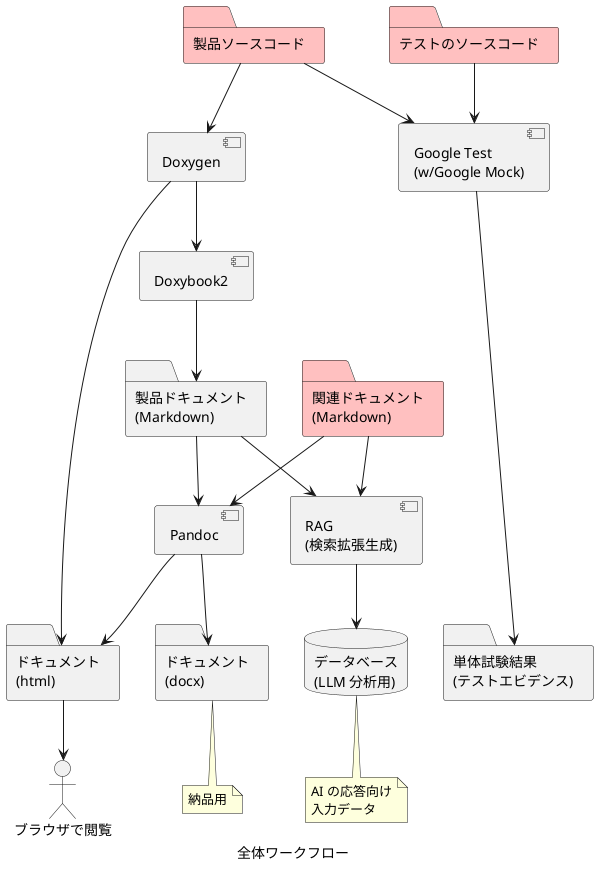
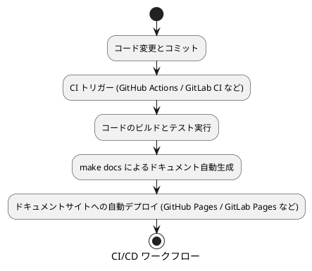

# レガシー C コードにモダン手法を適用する全体像

## はじめに

長年運用してきた C 言語のコードは、変更のたびに影響範囲が読みにくく、ドキュメントやテストが古くなりがちです。ここでは、Docs as Code、自動テスト、CI/CD を組み合わせて、品質と保守性、開発速度を高める方法を、実運用に耐える全体ワークフローとあわせて示します。

## Docs as Code とは

ドキュメントをコードと同じように扱い、バージョン管理と自動化で常に最新に保つ考え方です。Markdown で書き、Git で管理し、レビューや自動生成を組み込みます。解説は次が参考になります[^about_docs_as_code]。

[^about_docs_as_code]: [ゼロから始めるDocs as Code](https://qiita.com/tikamoto/items/c05a5c117c78fb7a4e47)

## 全体ワークフロー

このワークフローでは、製品ソース、テスト、関連ドキュメントを一体で管理し、ビルドからエビデンス、最終成果物までを自動生成します。Doxygen で API ドキュメントを抽出し、Doxybook2 で Markdown 化し、Pandoc で HTML や DOCX を出力します。テストは Google Test を使い、カバレッジなどのエビデンスも得ます。さらに、Markdown を RAG (検索拡張生成) の入力にして、リポジトリ全体の構造を LLM が理解しやすくします。

### ステップの要点

- 製品ソースから Doxygen で API を抽出し、Doxybook2 で Markdown に変換します。
- 単体試験を自動実行し、カバレッジなどのエビデンスを残します。
- Pandoc で HTML と DOCX を生成し、納品や社内共有に使います。
- Markdown 群を RAG の入力にし、LLM の応答精度を上げます。

## モダン開発手法の 3 要素

### Docs as Code の実装例

- Doxygen による自動ドキュメント生成 (HTML と XML)
- Doxybook2 による Markdown 変換と Pandoc による発行
- 日本語向けカスタムテンプレート
- PlantUML 変換や include 前後処理などのスクリプト
- `make docs` で一連の生成を自動実行

### 自動テスト

ユニットテストを自動で実行してリグレッション (デグレード) を早期に見つけます。Google Test を使い、重要な関数から順に追加します。警告やカバレッジを CI で監視すると効果が上がります。

### CI/CD

プッシュを契機にビルド、テスト、ドキュメント生成、デプロイまでを自動化します。GitHub Actions や GitLab CI、Jenkins などに組み込み、ドキュメントサイトの自動公開までを一気通貫で行います。

## レガシー C コードに導入するメリット

### 品質と安定性が上がる

自動テストで変更の影響をすぐ検知できます。静的解析 (cppcheck など) やメモリ検査も CI に入れられます。Doxygen の警告を品質ゲートにすれば、コメントの不整合も早期に直せます。

### 保守が楽になる

コードコメントから Markdown を生成するため、コードとドキュメントが乖離しにくくなります。差分は Git で追えます。PlantUML にも対応し、図を含む資料を継続的に更新できます。

### デプロイが速くなり、リスクが下がる

手順を自動化して再現性を確保します。`make docs` にまとめることで、誰が実行しても同じ結果になります。

### 開発が速くなる

即時にテストと生成結果を確認でき、フィードバックループが短くなります。テンプレートを使って体裁調整の手間を削減します。

### コストを下げられる

手作業のテストやデプロイ、ドキュメント整備の時間を減らします。サブモジュール化したテンプレートやスクリプトを複数プロジェクトで再利用できます。

### セキュリティが強くなる

CI に脆弱性スキャンや静的解析を組み込み、既知のリスクに素早く対応します。依存関係のアップデートも自動化します。

## 導入ステップ

1. Docs as Code の導入から始めます。重要な関数から Doxygen コメントを追加します (`@ingroup` で整理)。
2. バージョン管理を整えます。ブランチ戦略を決め、生成物も Git で差分管理します。
3. 自動テストを追加します。頻繁に触る箇所やリスクが高い箇所を優先します。
4. CI を構築します。チームに合うサービスを選びます。
5. CD に広げます。まずはステージングへ自動デプロイし、安定後に本番適用を検討します。ドキュメントサイトは Pages で自動公開します。

## まとめ

Docs as Code、自動テスト、CI/CD を段階的に導入すると、レガシー C コードを現代的で維持しやすい状態にできます。まず Docs as Code で "常に最新の資料" を作り、その上でテストと CI/CD を重ねると、品質と速度、コストに良い効果を得ることができます。

## よくある懸念に対する回答

### テストコードを作成するのは、手間ではないですか?

手間はかかりますが、長期的には変更の失敗を減らして時間を取り戻せます。

- 単体テストは小さな単位を素早く検証できるため、失敗を早期に見つけやすいです。
- 大規模な UI テストより安価に自動で実行できるため、結果的に全体の工数を抑えやすいです。

Google のテストブログでも、テストの実行時間や維持コストを常に意識して最適化する重要性が指摘されています [^GoogleTestingBlog]。

また、テストは粒度のバランスが要で、単体・結合・E2E を使い分ける考え方は Martin Fowler の「テストピラミッド」で整理されています [^martinfowler_com]。

[^GoogleTestingBlog]: [Google Testing Blog](https://testing.googleblog.com/2008/03/cost-benefit-analysis-of-test.html)

[^martinfowler_com]: [martinfowler.com](https://martinfowler.com/articles/practical-test-pyramid.html)

必ずしもすべてのテストコードを作成することにこだわらず、短時間で回る自動テストを先に整え、重いテストは頻度やトリガーを工夫して全体最適を目指すことでコストとベネフィットのバランスを取ることができます。

### プログラムにドキュメントを含めるのに慣れていません。別管理ではだめですか?

別管理でも不可能ではありませんが、更新のズレが起きやすいです。

コードの変更と同じ Pull Request でドキュメントも更新する運用にすると、レビューとデプロイの仕組みに自然に乗り、陳腐化を防げます。

これこそが Docs as Code の考え方で、プログラムと仕様が同じワークフローに入るため、正確さと一貫性が上がるとされています [^WriteTheDocs]。

[^WriteTheDocs]: [Write the Docs](https://www.writethedocs.org/guide/docs-as-code.html)

このドキュメントで示した構成では、Doxygen から抽出した API 情報を Markdown 化してリポジトリで一緒に管理します。変更点は Git の差分で追え、レビュー時に実装と説明を同時に確認できます。

### Markdown でないとだめですか? Excel や Word など他形式はどうですか?

Markdown には、プレーンテキストなので Git で扱いやすく、自動化しやすく、出力先を選ばないという利点があります。このため、Docs as Code の運用に適しており、開発のレビューやデプロイの流れに自然に組み込むことができます。これらの利点については、[Write the Docs](https://www.writethedocs.org/guide/docs-as-code/)、[UK Home Office Engineering](https://engineering.homeoffice.gov.uk/patterns/docs-as-code/) でも、開発フローとの統合やレビュー容易性として言及があります。

- 差分とレビューが読みやすい  
  Markdown はテキスト形式であるため、Pull Request 上で差分が明瞭に確認できます。これに対して Word の docx はバイナリのため、差分管理に難があります。

- 出力先を自由に選べる  
  1 つの Markdown から、Pandoc で HTML、PDF、docx などに変換できすることができます。既存の Word スタイルを参照テンプレートにすれば、必要な体裁に合わせることもできます。

- 自動化と保守の容易さ  
  テキスト形式なので Lint、リンク検査、見出しレベルのチェックなどを CI に組み込むことが容易です。  
  Docs as Code の実践は、文書の所有を統合し、更新の遅れを防ぐのに有効です。

- AI 時代の標準語  
  Markdown は主要な LLM における標準的な入出力形式であり、LLM との親和性が高く、コード分析の際に AI に対して補足情報を与えるのに適しています。

### CI/CD は小規模チームには過剰ではありませんか?

小規模でも恩恵は大きいです。

変更を自動でビルド・テスト・発行するだけで、レビューの確実性と反復速度が上がります。

DORA (DevOps Research and Assessment) の年次レポートでは、継続的インテグレーションと短いリードタイムなどの実践が、配信の安定性と速度に結びつくことが繰り返し示されています [^DORA_Report] [^GoogleCloudBlog2024]。

[^DORA_Report]: [DORA 2023](https://dora.dev/research/2023/dora-report/)
[^GoogleCloudBlog2024]: [Google Cloud Blog 2024](https://cloud.google.com/blog/products/devops-sre/announcing-the-2024-dora-report)

まずは「プッシュでテストとドキュメント生成が走る」最小構成から始め、必要に応じて段階的に強化するとよいでしょう。
