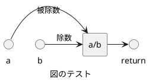

<!-- IMPORTANT: This is an AUTOMATICALLY GENERATED file by doxygen and doxybook. Manual edits are NOT allowed. -->

# 公開 API

外部公開する API 群をカテゴライズします。

## 関数

### subtract

```cpp
int subtract (
    int a,
    int b
)
```

`a` から `b` を減算します。

#### Parameters

* [in] a 被減数
* [in] b 減数

#### Return

減算結果。

#### Remarks

この関数はスレッド セーフです。

### multiply

```cpp
int multiply (
    int a,
    int b
)
```

`a` と `b` を乗算します。

#### Parameters

* [in] a 因数a
* [in] b 因数b

#### Return

乗算結果。

#### Remarks

この関数はスレッド セーフです。

### divide

```cpp
double divide (
    int a,
    int b
)
```

`a` を `b` で除算します。

#### Parameters

* [in] a 被除数
* [in] b 除数

#### Return

除算結果。

#### Warning

`b` が 0 の場合、結果は未定義です。

#### Remarks

この関数はスレッド セーフです。

#### Details



### add

```cpp
int add (
    int a,
    int b
)
```

`a` と `b` を加算します。

#### Parameters

* [in] a 加算数a
* [in] b 加算数b
* [in] a 第一オペランド。
* [in] b 第二オペランド。

#### Return

##### 加算結果。
##### a と b の合計値。

#### Note

オーバーフローが発生する可能性がある場合は、 呼び出し側で範囲チェックを行ってください。

#### Remarks

この関数はスレッド セーフです。

#### Details

2 つの整数を加算します。

この関数は 2 つの整数を受け取り、その合計を返します。 オーバーフローのチェックは行いません。

使用例: ```c

int result = add(10, 20);
printf("Result: %d\n", result);  // 出力: Result: 30
```
## 定数、マクロ

### ZERO_DEVIDE

```cpp
#define ZERO_DEVIDE (0.0)
```
ゼロ除算の戻り値を定義します。

## 型

### SampleEnum

| Enumerator | Value | Description |
| ---------- | ----- | ----------- |
| two | | 2 つめの要素   |
| three | | 3 つめの要素   |
| one | | 1 つめの要素   |

サンプルの列挙体を定義します。

## 構造体

### UserInfo

```cpp
struct UserInfo {
    const char * name;
    int id;
    SampleEnum enumValue;
}
```
ユーザー情報を保持する構造体を定義します。

#### name

```cpp
const char * name;
```
ユーザー名

#### id

```cpp
int id;
```
ユーザーID

#### enumValue

```cpp
SampleEnum enumValue;
```
列挙値
