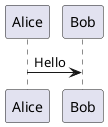

<!-- IMPORTANT: This is an AUTOMATICALLY GENERATED file by doxygen and doxybook. Manual edits are NOT allowed. -->

# src/

これは、Markdown のサンプルです。 フォルダの README には、相対フォルダ名を付与するルールとします。

## 制限事項

インラインイメージは、doxygen では正しく処理することができません。
