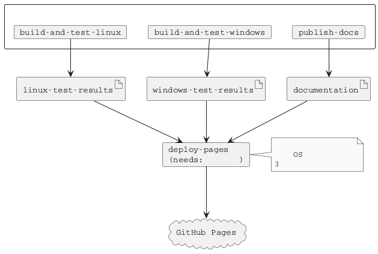
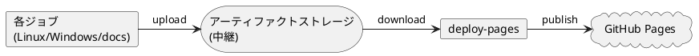

# GitHub Actions CI/CD 仕様

本プロジェクトでは GitHub Actions を使用した継続的インテグレーション (CI) とドキュメント生成を実装しています。

## 概要

main ブランチへの変更時に、Linux/Windows 両環境での自動ビルド・テスト、およびドキュメント生成を実行し、コード品質を維持します。

## ワークフロー構成

### ワークフローファイル

本プロジェクトでは統合ワークフローを使用しています：

- `.github/workflows/ci.yml` - ビルド、テスト、ドキュメント生成、Pages デプロイの統合ワークフロー

このワークフローには以下の 4 つのジョブが含まれています：

1. `build-and-test-linux` - Linux 環境でのビルドとテスト
2. `build-and-test-windows` - Windows 環境でのビルドとテスト
3. `publish-docs` - ドキュメント生成
4. `deploy-pages` - テスト結果とドキュメントの統合と GitHub Pages へのデプロイ

Linux ビルド、Windows ビルド、ドキュメント生成の 3 つのジョブが並列実行されます。すべて完了後に `deploy-pages` ジョブがテスト結果とドキュメントを統合して GitHub Pages にデプロイします。

### トリガー条件

すべてのワークフローは以下のイベントで実行されます：

| イベント | 対象ブランチ |
|---------|-------------|
| push | main |
| pull_request | main |

## 実行環境

### Linux 環境

Linux 環境では Oracle Linux 8 開発コンテナを使用しています。

```yaml
runs-on: ubuntu-latest
container:
  image: ghcr.io/hondarer/oracle-linux-8-container/oracle-linux-8-dev:latest
```

このコンテナには以下の開発ツールが含まれています:

- C/C++ コンパイラ (GCC)
- GNU Make
- Google Test
- Doxygen, PlantUML, Pandoc

#### Linux 環境変数

| 変数名 | 値 | 説明 |
|--------|-----|------|
| HOST_USER | user | コンテナ内ユーザー名 |
| HOST_UID | 1001 | ユーザー ID |
| HOST_GID | 127 | グループ ID |

### Windows 環境

Windows 環境では Windows Server 2025 ランナーを使用しています。

```yaml
runs-on: windows-2025
```

Windows 環境では以下のツールを動的にセットアップしています:

- **OpenCppCoverage** - C++ コードカバレッジツール (Chocolatey 経由でインストール)
- **ReportGenerator** - カバレッジレポート生成ツール (.NET ツール)
- **MSVC 環境** - カスタムスクリプト (`Add-VSBT-Env-x64.ps1`) で環境変数を設定

## ジョブ実行フロー



## 実行ステップ

### build-and-test-linux ジョブ

1. **リポジトリのチェックアウト**
   - サブモジュールを含めて再帰的にチェックアウト

2. **Git safe directory 設定**
   - コンテナ内での Git 操作を許可

3. **ビルド**
   - `make` を実行してプロジェクトをビルド
   - ビルドログを `logs/linux-build.log` に保存

4. **テストの実行**
   - `make test` を実行
   - testfw および test ディレクトリ配下のテストを実行
   - テストログを `logs/linux-test.log` に保存

5. **テスト結果アーティファクトのアップロード**
   - テスト結果 (`test/**/results/`) を保存

6. **ビルド&テストログアーティファクトのアップロード**
   - ビルドログとテストログ (`logs/`) を保存

### build-and-test-windows ジョブ

1. **リポジトリのチェックアウト**
   - サブモジュールを含めて再帰的にチェックアウト

2. **OpenCppCoverage のインストール**
   - Chocolatey を使用してインストール
   - PATH に追加

3. **ReportGenerator のインストール**
   - .NET Global Tool としてインストール

4. **MSVC 環境のセットアップ**
   - カスタムスクリプト (`Add-VSBT-Env-x64.ps1`) で環境変数を設定

5. **ビルド**
   - `make` を実行してプロジェクトをビルド
   - ビルドログを `logs/windows-build.log` に保存

6. **テストの実行**
   - `make test` を実行
   - テストログを `logs/windows-test.log` に保存

7. **テスト結果アーティファクトのアップロード**
   - テスト結果 (`test/**/results/`) を保存

8. **ビルド&テストログアーティファクトのアップロード**
   - ビルドログとテストログ (`logs/`) を保存

### publish-docs ジョブ

このジョブは、`build-and-test-linux` および `build-and-test-windows` と並列に実行されます。

**実行条件**:
- 他のビルド＆テストジョブと独立して並列実行されます
- CI 全体の実行時間を短縮し、効率的なリソース利用を実現します

**処理フロー**:

1. **リポジトリのチェックアウト**
   - `fetch-depth: 0` で全履歴を取得 (Markdown 処理時の author/date 取得用)

2. **Git safe directory 設定**
   - コンテナ内での Git 操作を許可

3. **サブモジュール初期化**
   - `git submodule update --init --recursive --depth 1` で浅いクローン

4. **ドキュメント生成**
   - `make doxy && make docs` を実行
   - Doxygen および Pandoc でドキュメントを生成

5. **gh-pages 用アーティファクトアーカイブの作成**
   - main ブランチへの push 時のみ実行
   - HTML と docx ファイルを zip 形式でアーカイブ

6. **GitHub Pages へのデプロイ**
   - main ブランチへの push 時のみ実行
   - gh-pages ブランチに公開

7. **アーティファクトのアップロード**
   - HTML ドキュメント、docx ファイルを保存

### deploy-pages ジョブ

このジョブは、上記 3 つのジョブ（`build-and-test-linux`、`build-and-test-windows`、`publish-docs`）が並列実行され、すべて完了した後に実行されます。

**実行条件**:
- `needs: [build-and-test-linux, build-and-test-windows, publish-docs]` により、並列実行された 3 つのジョブがすべて成功するまで待機
- `if: github.ref == 'refs/heads/main' && github.event_name == 'push'` により、main ブランチへの push 時のみ実行

**処理フロー**:

1. **アーティファクトのダウンロード**
   - Linux テスト結果アーティファクト (`linux-test-results`) をダウンロード
   - Windows テスト結果アーティファクト (`windows-test-results`) をダウンロード
   - ドキュメントアーティファクト (`documentation`) をダウンロード
   - Linux ログアーティファクト (`linux-logs`) をダウンロード
   - Windows ログアーティファクト (`windows-logs`) をダウンロード

2. **アーティファクトの整理と統合**
   - Linux テスト結果を `linux-test-results.zip` にアーカイブ
   - Windows テスト結果を `windows-test-results.zip` にアーカイブ
   - Linux ビルド&テストログを `linux-logs.zip` にアーカイブ
   - Windows ビルド&テストログを `windows-logs.zip` にアーカイブ
   - アーカイブを `docs/artifacts/` に配置
   - ドキュメントと統合

3. **GitHub Pages へのデプロイ**
   - 統合された `docs/` ディレクトリを gh-pages ブランチに公開

**アーティファクトストレージの役割**:

GitHub Actions のアーティファクトストレージを中継ストレージとして使用することで、異なる OS 環境（Linux、Windows）で生成されたファイルを 1 つのジョブに集約します。



## GitHub Pages デプロイ

main ブランチへの push 時に、`deploy-pages` ジョブがドキュメントとテスト結果を統合して GitHub Pages に自動公開します。

### 使用アクション

```yaml
- name: Deploy to gh-pages
  uses: peaceiris/actions-gh-pages@v4
  with:
    github_token: ${{ secrets.GITHUB_TOKEN }}
    publish_dir: ./docs
    force_orphan: true
```

### 設定詳細

| パラメータ | 値 | 説明 |
|-----------|-----|------|
| publish_dir | `./docs` | 公開するディレクトリ |
| force_orphan | `true` | 履歴なしの孤立ブランチとしてデプロイ |

### デプロイ条件

- **実行される場合**: main ブランチへの push
- **実行されない場合**: Pull Request (PR のレビュー時はアーティファクトで確認)

### Pages に配置される内容

`deploy-pages` ジョブにより、以下の内容が Pages に統合配置されます:

```
https://<username>.github.io/<repository>/
+-- doxygen/                          # Doxygen 生成 HTML
|   +-- index.html
+-- artifacts/
|   +-- docs-html.zip                 # HTML ドキュメントアーカイブ (固定 URL)
|   +-- docs-docx.zip                 # DOCX ドキュメントアーカイブ (固定 URL)
|   +-- linux-test-results.zip        # Linux テスト結果アーカイブ (固定 URL)
|   +-- windows-test-results.zip      # Windows テスト結果アーカイブ (固定 URL)
|   +-- linux-logs.zip                # Linux ビルド&テストログ (固定 URL)
|   +-- windows-logs.zip              # Windows ビルド&テストログ (固定 URL)
+-- (その他の生成ドキュメント)
```

**固定 URL の利点**:
- テスト結果アーカイブは常に同じファイル名で配置されるため、固定 URL でアクセス可能
- ドキュメントへのリンクをハードコードしても、更新後も同じ URL でアクセスできる

### GitHub リポジトリ設定

GitHub Pages を有効にするには、リポジトリ設定で以下を行います:

1. Settings → Pages を開く
2. Source で「Deploy from a branch」を選択
3. Branch で「gh-pages」ブランチを選択
4. フォルダは「/ (root)」を選択
5. Save をクリック

公開後、`https://<username>.github.io/<repository>/` でアクセス可能になります。

## アーティファクト

CI 実行時に生成されるファイルをアーティファクトとして保存し、後から確認できます。

### ジョブ間アーティファクト（中継用）

ジョブ間でファイルを受け渡すためのアーティファクトです。これらは `deploy-pages` ジョブで統合されます。

#### Linux テスト結果

```yaml
- name: Upload test results artifacts
  uses: actions/upload-artifact@v4
  with:
    name: linux-test-results
    path: test/**/results/
    if-no-files-found: warn
```

#### Windows テスト結果

```yaml
- name: Upload test results artifacts
  uses: actions/upload-artifact@v4
  with:
    name: windows-test-results
    path: test/**/results/
    if-no-files-found: warn
```

#### ドキュメント

```yaml
- name: Upload documentation artifacts
  uses: actions/upload-artifact@v4
  with:
    name: documentation
    path: docs/
    if-no-files-found: warn
```

含まれるファイル:
- `docs/doxygen` - Doxygen 生成 HTML
- `docs/**/html` - Pandoc 生成 HTML
- `docs/artifacts/*.zip` - ドキュメントアーカイブ

### 履歴管理用アーティファクト（コミット固有）

過去のビルドを参照するためのアーティファクトです。

#### HTML ドキュメント

```yaml
- name: Upload html artifacts
  uses: actions/upload-artifact@v4
  with:
    name: ${{ github.event.repository.name }}-docs-html-${{ github.sha }}
    path: |
      docs/doxygen
      docs/**/html
    if-no-files-found: warn
```

#### docx ドキュメント

```yaml
- name: Upload docx artifacts
  uses: actions/upload-artifact@v4
  with:
    name: ${{ github.event.repository.name }}-docs-docx-${{ github.sha }}
    path: docs/**/docx/
    if-no-files-found: warn
```

### アーティファクトの確認方法

1. GitHub リポジトリの Actions タブを開く
2. 対象のワークフロー実行を選択
3. 「Artifacts」セクションからダウンロード

Pull Request 時はアーティファクトをダウンロードしてローカルでドキュメントやテスト結果を確認できます。

## 認証

GitHub Container Registry (ghcr.io) からのイメージ取得には `GITHUB_TOKEN` を使用します。

```yaml
credentials:
  username: ${{ github.actor }}
  password: ${{ secrets.GITHUB_TOKEN }}
```

## ローカルでの動作確認

CI と同等のビルドとテストをローカルで実行できます。

### Linux 環境

```bash
# ビルド
make

# テスト実行
make test

# ドキュメント生成
make doxy
make docs
```

### Windows 環境

```powershell
# ビルド
make

# テスト実行
make test
```

**注意**: Windows 環境では、事前に必要な環境設定を行う必要があります。詳細は [CLAUDE.md](../CLAUDE.md) の「Windows にてあらかじめ実施しなくてはいけない作業」を参照してください。

## 関連ドキュメント

- [テストチュートリアル](testing-tutorial.md) - テストの書き方
- [ビルド設計](build-design.md) - makefile の構成
- [Oracle Linux 8 コンテナ](https://github.com/Hondarer/oracle-linux-8-container) - 開発コンテナの詳細
