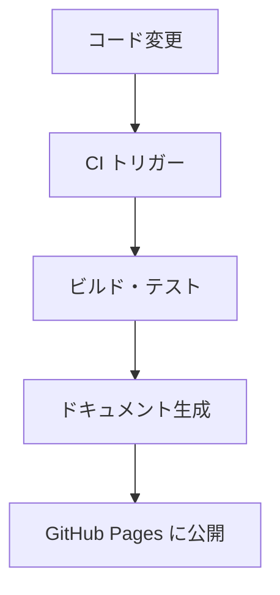

# Mermaid

## 概要

Mermaid はテキスト形式でフローチャート・シーケンス図・ガントチャートなどを記述し、画像として出力するツールです。GitHub や GitLab がネイティブで Mermaid 記法をレンダリングするため、`README.md` などのリポジトリドキュメントに図を直接埋め込んで確認できます。

このリポジトリでは図の作成に PlantUML・Mermaid・draw.io の 3 種類のツールを使用できます。意味論を明確に表現しやすいことから PlantUML を第 1 選択としていますが、GitHub 上でのプレビューを重視する場合や、フローチャートなど記法の簡潔さを優先する場合に Mermaid が有効です。`docsfw/` サブモジュールは Mermaid コードブロックを Pandoc で変換する機能を提供しています。

## 習得目標

- [ ] Mermaid のフローチャート (`flowchart`) 記法を書ける
- [ ] Mermaid のシーケンス図 (`sequenceDiagram`) を書ける
- [ ] GitHub 上で Mermaid 図がレンダリングされることを確認できる
- [ ] Markdown ファイルに Mermaid コードブロックを埋め込める
- [ ] PlantUML と Mermaid の使い分け基準を説明できる

## 学習マテリアル

### 公式ドキュメント

- [Mermaid 公式サイト](https://mermaid.js.org/) - Mermaid のドキュメント (英語)
  - [フローチャート](https://mermaid.js.org/syntax/flowchart.html) - 基本的なフロー図の記法
  - [シーケンス図](https://mermaid.js.org/syntax/sequenceDiagram.html) - シーケンス図の記法
  - [Mermaid Live Editor](https://mermaid.live/) - ブラウザで即試せるエディタ
- [GitHub - 図の作成](https://docs.github.com/ja/get-started/writing-on-github/working-with-advanced-formatting/creating-diagrams) - GitHub での Mermaid 利用方法 (日本語)

## このリポジトリとの関連

### 図ツールの選択基準

| ツール       | 特徴                                | 推奨ケース                                                     |
|--------------|-------------------------------------|----------------------------------------------------------------|
| PlantUML     | UML の意味論を厳密に表現できる      | シーケンス図・クラス図・コンポーネント図など (第 1 選択)        |
| Mermaid      | GitHub でネイティブ表示・記法が簡潔 | フロー図など、GitHub 上でのプレビューを重視する場合 (第 2 選択) |
| draw.io      | GUI で自由に作図できる              | UML の意味論で表現しにくい任意のレイアウトの図 (第 3 選択)      |
| PNG/SVG など | 既存の画像をそのまま利用できる      | 外部ツールで作成済みの図・スクリーンショットなど (第 4 選択)    |

### 使用箇所 (具体的なファイル・コマンド)

Markdown への埋め込み方法:

````markdown

````

GitHub 上では上記のコードブロックがそのまま図としてレンダリングされます。Pandoc での変換時は `docsfw/lib/` の Lua フィルタが Mermaid コードブロックを検出して画像に変換します。

### 関連ドキュメント

- [PlantUML(スキルガイド)](plantuml.md) - UML 図の第 1 選択ツール
- [draw.io(スキルガイド)](drawio.md) - GUI 作図ツール (第 3 選択)
- [Pandoc(スキルガイド)](pandoc.md) - Mermaid 図を含む Markdown の変換
- [Markdown(スキルガイド)](markdown.md) - 図を埋め込む Markdown の基礎
