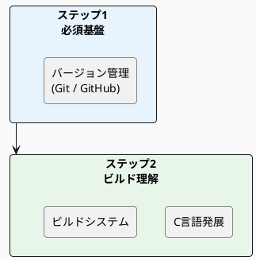
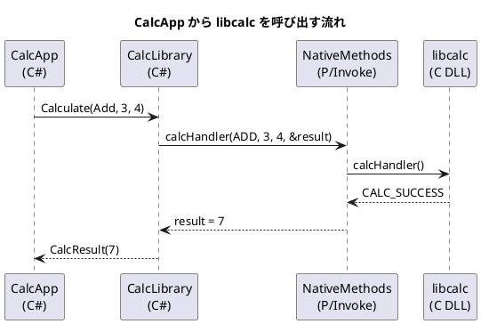

# PlantUML

## 概要

PlantUML はテキスト形式で UML 図 (シーケンス図・クラス図・アクティビティ図など) を記述し、画像として出力するツールです。コードとして管理できるため、Git での差分管理が可能で、Markdown ドキュメントに図を埋め込むのに適しています。

このリポジトリでは PlantUML をドキュメント内の図表作成に使用しています。`docsfw/` サブモジュールが PlantUML の統合機能を提供しており、Markdown ドキュメント内に埋め込んだ PlantUML 記述を Pandoc のフィルタが画像に変換します。このスキルガイドの `README.md` でも学習ステップの概要図に PlantUML を使用しています。

本フレームワークでは PlantUML・Mermaid・draw.io の 3 種類の図ツールを使用できます。意味論を明確に表現しやすいことから PlantUML を第 1 選択としており、次いで Mermaid、任意のレイアウトの図が必要な場合にのみ draw.io を使用します。

テキストベースの図は Word 上でドラッグ＆ドロップで作成する図と比べ、バージョン管理・レビュー・修正が容易です。

## 習得目標

- [ ] PlantUML の基本構文 (`@startuml`・`@enduml`) を理解できる
- [ ] シーケンス図 (`->`・`-->`) を記述できる
- [ ] クラス図 (`class`・`interface`・継承・関連) を記述できる
- [ ] アクティビティ図 (`:アクション;`・`if/else`) を記述できる
- [ ] `skinparam` でスタイルをカスタマイズできる
- [ ] Markdown ファイル内に PlantUML 記述を埋め込む方法を理解できる

## 学習マテリアル

### 公式ドキュメント

- [PlantUML 公式サイト(日本語)](https://plantuml.com/ja/) - PlantUML の公式ドキュメント (日本語あり)
  - [シーケンス図](https://plantuml.com/ja/sequence-diagram)
  - [クラス図](https://plantuml.com/ja/class-diagram)
  - [アクティビティ図](https://plantuml.com/ja/activity-diagram-beta)
  - [コンポーネント図](https://plantuml.com/ja/component-diagram)

## このリポジトリとの関連

### 図ツールの選択基準

| ツール       | 特徴                                | 推奨ケース                                                     |
|--------------|-------------------------------------|----------------------------------------------------------------|
| PlantUML     | UML の意味論を厳密に表現できる      | シーケンス図・クラス図・コンポーネント図など (第 1 選択)        |
| Mermaid      | GitHub でネイティブ表示・記法が簡潔 | フロー図など、GitHub 上でのプレビューを重視する場合 (第 2 選択) |
| draw.io      | GUI で自由に作図できる              | UML の意味論で表現しにくい任意のレイアウトの図 (第 3 選択)      |
| PNG/SVG など | 既存の画像をそのまま利用できる      | 外部ツールで作成済みの図・スクリーンショットなど (第 4 選択)    |

Table: 図ツールの選択基準

### 使用箇所 (具体的なファイル・コマンド)

このスキルガイドの README.md で使用している学習ステップ図 (PlantUML 記述例):



シーケンス図の例 (C ライブラリ呼び出しの流れ):



Markdown への埋め込み方法:

````markdown
```plantuml
@startuml 図の見出し
caption 図の見出し
... PlantUML の記述 ...
@enduml
```
````

Pandoc での変換時、`docsfw/lib/` の Lua フィルタが PlantUML コードブロックを検出して画像に変換します。

### 関連ドキュメント

- [Mermaid(スキルガイド)](mermaid.md) - テキストベースの第 2 選択ツール
- [draw.io(スキルガイド)](drawio.md) - GUI 作図ツール (第 3 選択)
- [Pandoc(スキルガイド)](pandoc.md) - PlantUML 図を含む Markdown の変換
- [Markdown(スキルガイド)](markdown.md) - 図を埋め込む Markdown の基礎
