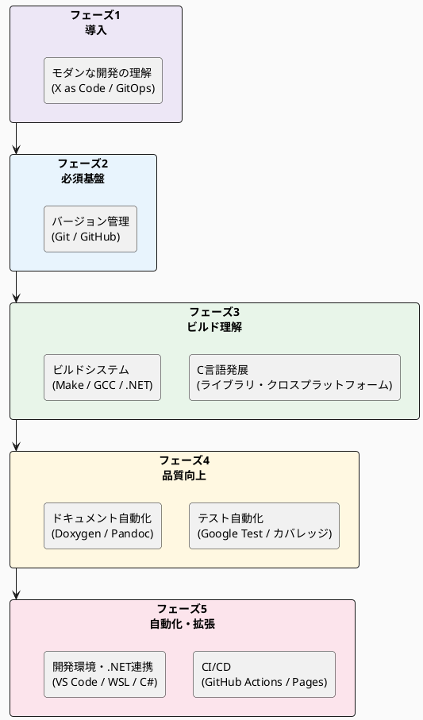

# スキルガイド - 学習ロードマップ

このスキルガイドは、`c-modernization-kit` リポジトリを活用するために必要な技術スキルを整理した学習ガイドです。
レガシー C 言語開発チームが段階的にモダンな開発プラクティスを習得できるよう、5 つのフェーズに分けて学習マテリアルをまとめています。

各スキルガイドは「学習の入り口」として機能します。
技術の詳細な解説は外部の公式ドキュメントやチュートリアルへのリンクで提供し、このリポジトリのどのコードと関連するかを示します。

## 対象読者

- C 言語の基本的な知識を持つ開発者
- Git・自動ビルド・自動テスト・ドキュメント自動化の経験が少ない開発者
- このリポジトリのコードを読み、ビルドし、拡張したい開発者

> C言語の基礎 (変数・関数・ポインタなど) は習得済みを前提とします。

## 学習フェーズ

| フェーズ                 | 目標                                     | 技術カテゴリ                 |
|--------------------------|------------------------------------------|------------------------------|
| フェーズ 1: 導入         | モダン開発の全体像と背景を理解できる     | X as Code・GitOps・生成 AI   |
| フェーズ 2: 必須基盤     | チームでコードを共有・管理できる         | バージョン管理               |
| フェーズ 3: ビルド理解   | ライブラリのビルドと依存関係を理解できる | C ライブラリ・ビルドシステム |
| フェーズ 4: 品質向上     | テストとドキュメントを自動化できる       | テスト・ドキュメント         |
| フェーズ 5: 自動化・拡張 | CI/CD とクロス言語連携を実現できる       | CI/CD・開発環境・.NET        |

## フェーズ 1 - 導入 (モダンな開発の理解)

技術スキルを習得する前に、モダン開発の全体像・背景・思想を把握します。

| ドキュメント | 内容 |
|------------|------|
| [レガシー C コードにモダン手法を適用する全体像](01-modern-development/about-modern-development.md) | Docs as Code・自動テスト・CI/CD を組み合わせた全体ワークフロー |
| [生成 AI 時代のソースコード管理 (X as Code)](01-modern-development/x_as_code.md) | X as Code・GitOps・生成 AI 活用の DevOps 進化論 |

## フェーズ 2 - 必須基盤 (バージョン管理)

Git を使ったバージョン管理はすべての現代的な開発の基盤です。まずここから始めてください。

| スキルガイド          | 内容                                   |
|-----------------------|----------------------------------------|
| [Git 基礎](02-version-control/git-basics.md)                 | init / clone / commit / branch / merge |
| [Git サブモジュール](02-version-control/git-submodules.md)   | サブモジュールの操作                   |
| [GitHub ワークフロー](02-version-control/github-workflow.md) | PR・Issues・コードレビュー             |

## フェーズ 3 - ビルド理解

C ライブラリの種類とビルドシステムを理解することで、このリポジトリのコード構造を把握できます。

### C 言語発展トピック

| スキルガイド                 | 内容                                             |
|------------------------------|--------------------------------------------------|
| [Cライブラリの種類](03-c-language/c-library-types.md)           | 静的ライブラリ・動的ライブラリの違いとリンク方法 |
| [クロスプラットフォーム対応](03-c-language/c-cross-platform.md) | Linux / Windows 対応マクロとビルド条件分岐       |

### ビルドシステム

| スキルガイド                | 内容                                    |
|-----------------------------|-----------------------------------------|
| [GNU Make](04-build-system/gnu-make.md)                       | makefile の基礎と階層ビルド構造         |
| [GCC / MSVC ツールチェイン](04-build-system/gcc-toolchain.md) | コンパイラとリンカのオプション          |
| [.NET SDK](04-build-system/dotnet-sdk.md)                     | dotnet コマンドと .NET プロジェクト構造 |

## フェーズ 4 - 品質向上

テストの自動化とドキュメントの自動生成により、品質と保守性を高めます。

### テスト自動化

| スキルガイド | 内容 |
|------------|------|
| [Google Test](05-testing/google-test.md) | C/C++ 単体テストフレームワーク |
| [コードカバレッジ](05-testing/code-coverage.md) | gcov / lcov / OpenCppCoverage |
| [.NET テスト](05-testing/dotnet-testing.md) | xUnit による .NET 単体テスト |

### ドキュメント自動化

| スキルガイド | 内容 |
|------------|------|
| [Markdown](06-documentation/markdown.md) | ドキュメント記法の基礎 |
| [Doxygen](06-documentation/doxygen.md) | C/C++ ソースコードからのドキュメント生成 |
| [Pandoc](06-documentation/pandoc.md) | Markdown から HTML/docx への変換 |
| [PlantUML](06-documentation/plantuml.md) | テキストベースの図表作成 |

## フェーズ 5 - 自動化・拡張

CI/CD によるビルド・テストの自動化と、.NET 連携および開発環境の整備を行います。

### CI/CD

| スキルガイド | 内容 |
|------------|------|
| [GitHub Actions](07-ci-cd/github-actions.md) | 自動ビルド・テスト・デプロイ |
| [GitHub Pages](07-ci-cd/github-pages.md) | 生成ドキュメントの公開 |

### 開発環境・.NET連携

| スキルガイド | 内容 |
|------------|------|
| [VS Code](08-dev-environment/vscode.md) | エディタの設定と拡張機能 |
| [WSL / MinGW 環境](08-dev-environment/wsl-mingw.md) | Windows での Linux 互換ビルド環境 |
| [C# / P/Invoke](08-dev-environment/dotnet-csharp.md) | .NET から C ライブラリを呼び出す |

## 関連ドキュメント

このリポジトリの実装・設計の詳細については、以下のドキュメントを参照してください。

- [ビルド設計](../build-design.md) - このリポジトリのビルド構成の詳細
- [テストチュートリアル](../testing-tutorial.md) - テストフレームワークの実践的な使い方
- [GitHub Actions 設定](../github-actions.md) - このリポジトリの CI/CD 設定
