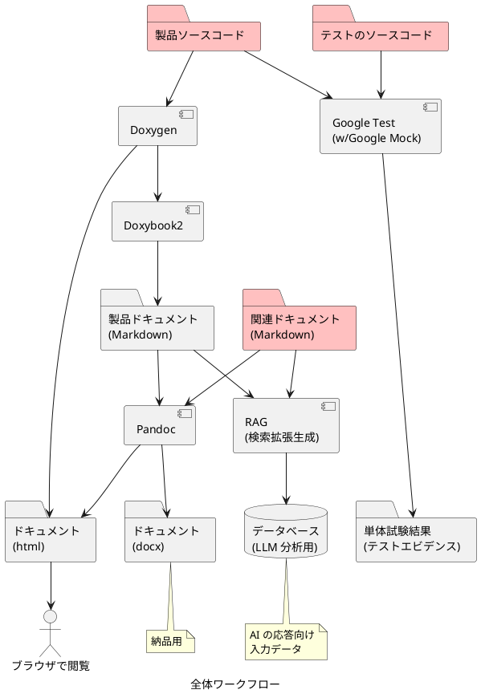

# Docs as Code 手法に基づいた全体ワークフロー

資産全体は、Docs as Code (Documentation as Code) の考え方をもとに設計されたワークフローによって管理します。

Docs as Code とは、ドキュメントをコードと同様に扱い、バージョン管理や自動化されたワークフローを通じて一貫性と品質を確保する考え方です[^about_docs_as_code]。  
これにより、ドキュメントの更新がソフトウェアの開発プロセスと統合され、常に最新の状態を保つことができます。

[^about_docs_as_code]: [ゼロから始めるDocs as Code](https://qiita.com/tikamoto/items/c05a5c117c78fb7a4e47)

このワークフローでは、以下のようなステップを通じて、製品ソースコード、テストコード、関連ドキュメントを管理し、最終的な納品物やエビデンスを自動生成します。

1. 製品ソースコードの作成  
   開発者は製品ソースコードを作成します。このコードは、Doxygen によって解析され、API ドキュメントが生成されます。

2. テストコードの作成と実行  
   開発者はテストコードを作成し、テストフレームワーク (Google Mock/Google Test) を使用して単体試験を実行します。その結果として、テストエビデンスが生成されます。  
   テストエビデンスにはカバレッジ情報も含まれており、テストの妥当性を客観的に評価可能としています。

3. ドキュメントの作成  
   製品ソースコードから生成された API ドキュメントは、Doxybook2 を使用して Markdown 形式に変換されます。また、開発者は補足的なドキュメントやガイド等の関連ドキュメントを Markdown 形式で作成します。

4. ドキュメントの変換と出力  
   Markdown 形式のドキュメントは Pandoc を使用して HTML や Word (docx) 形式に変換されます。これにより、さまざまな形式でドキュメントを提供できます。  
   また、Markdown 形式のドキュメントを RAG (検索拡張生成) の入力とすることで、レポジトリ全体の構造を LLM が理解しやすくします。これにより、LLM の応答品質が向上します。

5. 納品物の生成  
   自動化されたワークフローにより、最終的な納品物やエビデンスが生成されます。これにより、手作業によるミスを防ぎ、効率的な開発プロセスを実現します。

以下は、全体のワークフローを示す図です。

