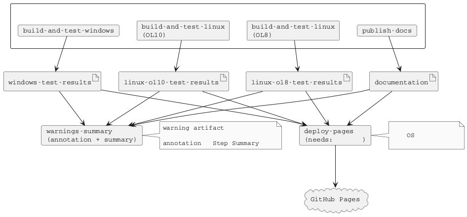
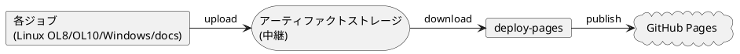

# GitHub Actions CI/CD 仕様

本プロジェクトでは GitHub Actions を使用した継続的インテグレーション (CI) とドキュメント生成を実装しています。

## 概要

main ブランチへの変更時に、Linux/Windows 両環境での自動ビルド・テスト、およびドキュメント生成を実行し、コード品質を維持します。

## ワークフロー構成

### ワークフローファイル

本プロジェクトでは統合ワークフローを使用しています：

- `.github/workflows/ci.yml` - ビルド、テスト、ドキュメント生成、Pages デプロイの統合ワークフロー

このワークフローには以下の 5 つのジョブが含まれています：

1. `build-and-test-linux` - Linux 環境でのビルドとテスト (Oracle Linux 8 / Oracle Linux 10 のマトリクス実行)
2. `build-and-test-windows` - Windows 環境でのビルドとテスト
3. `publish-docs` - ドキュメント生成
4. `warnings-summary` - warning artifact の有無を集約し、annotation と Step Summary で通知
5. `deploy-pages` - テスト結果とドキュメントの統合と GitHub Pages へのデプロイ

Linux ビルド (OL8/OL10)、Windows ビルド、ドキュメント生成のジョブが並列実行されます。これらの完了後に `warnings-summary` が warning artifact を集約し、main ブランチへの push では `deploy-pages` がテスト結果とドキュメントを統合して GitHub Pages にデプロイします。

### トリガー条件

すべてのワークフローは以下のイベントで実行されます：

| イベント | 対象ブランチ |
|---------|-------------|
| push | main |
| pull_request | main |

## 実行環境

### Linux 環境

Linux 環境では Oracle Linux 開発コンテナをマトリクス戦略で使用し、複数バージョンでのビルドとテストを実行しています。

```yaml
runs-on: ubuntu-latest
strategy:
  matrix:
    include:
      - os-name: ol8
        image: ghcr.io/hondarer/oracle-linux-container/oracle-linux-8-dev:latest
      - os-name: ol10
        image: ghcr.io/hondarer/oracle-linux-container/oracle-linux-10-dev:latest
container:
  image: ${{ matrix.image }}
```

| OS 名 | コンテナイメージ | 説明 |
|--------|-----------------|------|
| ol8 | `ghcr.io/hondarer/oracle-linux-container/oracle-linux-8-dev:latest` | Oracle Linux 8 開発コンテナ |
| ol10 | `ghcr.io/hondarer/oracle-linux-container/oracle-linux-10-dev:latest` | Oracle Linux 10 開発コンテナ |

これらのコンテナには以下の開発ツールが含まれています:

- C/C++ コンパイラ (GCC)
- GNU Make
- Google Test
- Doxygen, PlantUML, Pandoc

#### Linux 環境変数

| 変数名 | 値 | 説明 |
|--------|-----|------|
| HOST_USER | user | コンテナ内ユーザー名 |
| HOST_UID | 1001 | ユーザー ID |
| HOST_GID | 127 | グループ ID |

### Windows 環境

Windows 環境では Windows Server 2025 ランナーを使用しています。

```yaml
runs-on: windows-2025
```

Windows 環境では以下のツールを動的にセットアップしています:

- **OpenCppCoverage** - C++ コードカバレッジツール (Chocolatey 経由でインストール)
- **ReportGenerator** - カバレッジレポート生成ツール (.NET ツール)
- **MSVC 環境** - カスタムスクリプト (`Add-VSBT-Env-x64.ps1`) で環境変数を設定

## ジョブ実行フロー



## 実行ステップ

### build-and-test-linux ジョブ

1. **リポジトリのチェックアウト**
   - サブモジュールを含めて再帰的にチェックアウト

2. **Git safe directory 設定**
   - コンテナ内での Git 操作を許可

3. **ビルド**
   - `make` を実行してプロジェクトをビルド
   - ビルドログを `logs/linux-build.log` に保存

4. **テストの実行**
   - `make test` を実行
   - testfw および test ディレクトリ配下のテストを実行
   - テストログを `logs/linux-test.log` に保存

5. **テスト結果アーティファクトのアップロード**
   - テスト結果 (`test/**/results/`) を保存

6. **ビルド&テストログアーティファクトのアップロード**
   - ビルドログとテストログ (`logs/`) を保存

### build-and-test-windows ジョブ

1. **リポジトリのチェックアウト**
   - サブモジュールを含めて再帰的にチェックアウト

2. **OpenCppCoverage のインストール**
   - Chocolatey を使用してインストール
   - PATH に追加

3. **ReportGenerator のインストール**
   - .NET Global Tool としてインストール

4. **MSVC 環境のセットアップ**
   - カスタムスクリプト (`Add-VSBT-Env-x64.ps1`) で環境変数を設定

5. **ビルド**
   - `make` を実行してプロジェクトをビルド
   - ビルドログを `logs/windows-build.log` に保存

6. **テストの実行**
   - `make test` を実行
   - テストログを `logs/windows-test.log` に保存

7. **テスト結果アーティファクトのアップロード**
   - テスト結果 (`test/**/results/`) を保存

8. **ビルド&テストログアーティファクトのアップロード**
   - ビルドログとテストログ (`logs/`) を保存

### publish-docs ジョブ

このジョブは、`build-and-test-linux` および `build-and-test-windows` と並列に実行されます。

**実行条件**:
- 他のビルド＆テストジョブと独立して並列実行されます
- CI 全体の実行時間を短縮し、効率的なリソース利用を実現します

**処理フロー**:

1. **リポジトリのチェックアウト**
   - `fetch-depth: 0` で全履歴を取得 (Markdown 処理時の author/date 取得用)

2. **Git safe directory 設定**
   - コンテナ内での Git 操作を許可

3. **サブモジュール初期化**
   - `git submodule update --init --recursive --depth 1` で浅いクローン

4. **ドキュメント生成**
   - `make doxy && make docs` を実行
   - Doxygen および Pandoc でドキュメントを生成

5. **gh-pages 用アーティファクトアーカイブの作成**
   - main ブランチへの push 時のみ実行
   - HTML と docx ファイルを zip 形式でアーカイブ

6. **GitHub Pages へのデプロイ**
   - main ブランチへの push 時のみ実行
   - gh-pages ブランチに公開

7. **アーティファクトのアップロード**
   - HTML ドキュメント、docx ファイルを保存

### warnings-summary ジョブ

このジョブは、`build-and-test-linux`、`build-and-test-windows`、`publish-docs` の完了後に `if: always()` で実行されます。

**目的**:
- ビルドやドキュメント生成は最後まで走らせる
- warning artifact があれば、ワークフロー自体は成功のまま通知する
- Pull Request でも `deploy-pages` に依存せず警告を確認できるようにする

**処理フロー**:

1. workflow run にアップロードされた artifact 一覧を取得する
2. `linux-ol8-warns` / `linux-ol10-warns` / `windows-warns` / `docs-warns` の有無を確認する
3. warning artifact があれば warning annotation を出し、Step Summary に対象 artifact 名を列挙する
4. warning artifact が無ければ Step Summary に「warning なし」を出す

### deploy-pages ジョブ

このジョブは、上記のジョブ (`build-and-test-linux` (OL8/OL10)、`build-and-test-windows`、`publish-docs`) が並列実行され、すべて完了した後に実行されます。

**実行条件**:
- `needs: [build-and-test-linux, build-and-test-windows, publish-docs]` により、並列実行されたすべてのジョブが成功するまで待機
- `if: github.ref == 'refs/heads/main' && github.event_name == 'push'` により、main ブランチへの push 時のみ実行

**処理フロー**:

1. **アーティファクトのダウンロード**
   - Linux OL8 テスト結果アーティファクト (`linux-ol8-test-results`) をダウンロード
   - Linux OL10 テスト結果アーティファクト (`linux-ol10-test-results`) をダウンロード
   - Windows テスト結果アーティファクト (`windows-test-results`) をダウンロード
   - ドキュメントアーティファクト (`documentation`) をダウンロード
   - Linux OL8 ログアーティファクト (`linux-ol8-logs`) をダウンロード
   - Linux OL10 ログアーティファクト (`linux-ol10-logs`) をダウンロード
   - Windows ログアーティファクト (`windows-logs`) をダウンロード
   - ビルド警告アーティファクト (`linux-ol8-warns` / `linux-ol10-warns` / `windows-warns`) は、存在する場合のみダウンロード

2. **アーティファクトの整理と統合**
   - Linux OL8 テスト結果を `linux-ol8-test-results.zip` にアーカイブ
   - Linux OL10 テスト結果を `linux-ol10-test-results.zip` にアーカイブ
   - Windows テスト結果を `windows-test-results.zip` にアーカイブ
   - Linux OL8 ビルド&テストログを `linux-ol8-logs.zip` にアーカイブ
   - Linux OL10 ビルド&テストログを `linux-ol10-logs.zip` にアーカイブ
   - Windows ビルド&テストログを `windows-logs.zip` にアーカイブ
   - ビルド警告は、存在する OS のみ `linux-ol8-warns.zip` / `linux-ol10-warns.zip` / `windows-warns.zip` にアーカイブ
   - アーカイブを `pages/artifacts/` に配置
   - `pages/` 配下のドキュメントと統合

3. **GitHub Pages へのデプロイ**
   - 統合された `pages/` ディレクトリを GitHub Pages artifact として公開

**アーティファクトストレージの役割**:

GitHub Actions のアーティファクトストレージを中継ストレージとして使用することで、異なる OS 環境 (Linux、Windows) で生成されたファイルを 1 つのジョブに集約します。



## GitHub Pages デプロイ

main ブランチへの push 時に、`deploy-pages` ジョブがドキュメントとテスト結果を統合して GitHub Pages に自動公開します。

### 使用アクション

```yaml
- name: Deploy to gh-pages
  uses: peaceiris/actions-gh-pages@v4
  with:
    github_token: ${{ secrets.GITHUB_TOKEN }}
    publish_dir: ./docs
    force_orphan: true
```

### 設定詳細

| パラメータ | 値 | 説明 |
|-----------|-----|------|
| publish_dir | `./docs` | 公開するディレクトリ |
| force_orphan | `true` | 履歴なしの孤立ブランチとしてデプロイ |

### デプロイ条件

- **実行される場合**: main ブランチへの push
- **実行されない場合**: Pull Request (PR のレビュー時はアーティファクトで確認)

### Pages に配置される内容

`deploy-pages` ジョブにより、以下の内容が Pages に統合配置されます:

```
https://<username>.github.io/<repository>/
+-- doxygen/                          # Doxygen 生成 HTML
|   +-- index.html
+-- artifacts/
|   +-- docs-html-doxygen.zip         # HTML ドキュメントアーカイブ doxygen (固定 URL)
|   +-- docs-html-ja.zip              # HTML ドキュメントアーカイブ ja (固定 URL)
|   +-- docs-html-en.zip              # HTML ドキュメントアーカイブ en (固定 URL)
|   +-- docs-html-ja-details.zip      # HTML ドキュメントアーカイブ ja-details (固定 URL)
|   +-- docs-html-en-details.zip      # HTML ドキュメントアーカイブ en-details (固定 URL)
|   +-- docs-docx-ja.zip              # DOCX ドキュメントアーカイブ ja (固定 URL)
|   +-- docs-docx-en.zip              # DOCX ドキュメントアーカイブ en (固定 URL)
|   +-- docs-docx-ja-details.zip      # DOCX ドキュメントアーカイブ ja-details (固定 URL)
|   +-- docs-docx-en-details.zip      # DOCX ドキュメントアーカイブ en-details (固定 URL)
|   +-- linux-ol8-test-results.zip    # Linux OL8 テスト結果アーカイブ (固定 URL)
|   +-- linux-ol10-test-results.zip   # Linux OL10 テスト結果アーカイブ (固定 URL)
|   +-- windows-test-results.zip      # Windows テスト結果アーカイブ (固定 URL)
|   +-- linux-ol8-logs.zip            # Linux OL8 ビルド&テストログ (固定 URL)
|   +-- linux-ol10-logs.zip           # Linux OL10 ビルド&テストログ (固定 URL)
|   +-- windows-logs.zip              # Windows ビルド&テストログ (固定 URL)
|   +-- linux-ol8-warns.zip           # Linux OL8 ビルド警告詳細 (警告がある場合のみ)
|   +-- linux-ol10-warns.zip          # Linux OL10 ビルド警告詳細 (警告がある場合のみ)
|   +-- windows-warns.zip             # Windows ビルド警告詳細 (警告がある場合のみ)
|   +-- docs-warns.zip                # ドキュメント警告詳細 (警告がある場合のみ)
+-- (その他の生成ドキュメント)
```

**固定 URL の利点**:
- テスト結果アーカイブは常に同じファイル名で配置されるため、固定 URL でアクセス可能
- ドキュメントへのリンクをハードコードしても、更新後も同じ URL でアクセスできる

Pages の `index.html` では、通常アーティファクト一覧とは別に、存在する場合のみ「ビルド・ドキュメント警告詳細」として `.warn` アーカイブを表示します。
`docs-warns.zip` には `docs.warn` と `app/**/doxy.warn` がまとめて格納されます。

### GitHub リポジトリ設定

GitHub Pages を有効にするには、リポジトリ設定で以下を行います:

1. Settings → Pages を開く
2. Source で「Deploy from a branch」を選択
3. Branch で「gh-pages」ブランチを選択
4. フォルダは「/ (root)」を選択
5. Save をクリック

公開後、`https://<username>.github.io/<repository>/` でアクセス可能になります。

## アーティファクト

CI 実行時に生成されるファイルをアーティファクトとして保存し、後から確認できます。

### ジョブ間アーティファクト (中継用)

ジョブ間でファイルを受け渡すためのアーティファクトです。これらは `deploy-pages` ジョブで統合されます。

#### Linux テスト結果

マトリクス戦略により、OL8/OL10 それぞれのアーティファクトが生成されます。

```yaml
- name: Upload test results artifacts
  uses: actions/upload-artifact@v4
  with:
    name: linux-${{ matrix.os-name }}-test-results
    path: app/**/results/
    if-no-files-found: warn
```

#### Windows テスト結果

```yaml
- name: Upload test results artifacts
  uses: actions/upload-artifact@v4
  with:
    name: windows-test-results
    path: app/**/results/
    if-no-files-found: warn
```

#### ドキュメント

```yaml
- name: Upload documentation artifacts
  uses: actions/upload-artifact@v4
  with:
    name: documentation
    path: pages/
    if-no-files-found: warn
```

含まれるファイル:
- `pages/doxygen` - Doxygen 生成 HTML
- `pages/**/html` - Pandoc 生成 HTML
- `pages/artifacts/*.zip` - ドキュメントアーカイブ

#### ビルド警告

```yaml
- name: Upload build warnings
  uses: actions/upload-artifact@v7
  with:
    name: linux-${{ matrix.os-name }}-warns
    path: |
      app/c_cpp_properties.warn
      app/**/prod/**/*.warn
      app/**/test/**/*.warn
    if-no-files-found: ignore
```

`.warn` は警告が出た場合のみ生成され、警告が無いビルドではアーティファクト自体が作られません。`app/c_cpp_properties.warn` は `makepart.mk`、`app/makepart.mk`、`app/*/makepart.mk` の同期結果と `.vscode/c_cpp_properties.json` の不一致を知らせる dry-run 警告です。`deploy-pages` では、実行中の workflow run に warn artifact が存在するか確認したうえで、存在するものだけをダウンロードします。

`warnings-summary` ジョブは同じ artifact 名を検知し、warning annotation と Step Summary で通知します。警告があっても workflow 自体は成功のままです。

#### ドキュメント警告

```yaml
- name: Upload documentation warnings
  uses: actions/upload-artifact@v7
  with:
    name: docs-warns
    path: |
      docs.warn
      app/**/doxy.warn
    if-no-files-found: ignore
```

`docs.warn` は `make docs` 実行時の警告ファイルで、リポジトリルートに生成されます。`doxy.warn` は各アプリ配下に生成される Doxygen 警告ファイルです。`Create artifact archives` ステップではこれらをまとめて `pages/artifacts/docs-warns.zip` に固めます。`warnings-summary` ジョブでは `docs-warns` artifact の有無も集約対象に含めます。

### 履歴管理用アーティファクト (コミット固有)

過去のビルドを参照するためのアーティファクトです。

#### HTML ドキュメント

言語ディレクトリごとに個別の artifact として保存されます (100MB 制限対策)。

```yaml
- name: Upload html artifacts (doxygen)
  uses: actions/upload-artifact@v4
  with:
    name: ${{ github.event.repository.name }}-docs-html-doxygen-${{ github.sha }}
    path: docs/doxygen/
    if-no-files-found: warn

- name: Upload html artifacts (ja)
  uses: actions/upload-artifact@v4
  with:
    name: ${{ github.event.repository.name }}-docs-html-ja-${{ github.sha }}
    path: docs/ja/html/
    if-no-files-found: warn

- name: Upload html artifacts (en)
  uses: actions/upload-artifact@v4
  with:
    name: ${{ github.event.repository.name }}-docs-html-en-${{ github.sha }}
    path: docs/en/html/
    if-no-files-found: warn

- name: Upload html artifacts (ja-details)
  uses: actions/upload-artifact@v4
  with:
    name: ${{ github.event.repository.name }}-docs-html-ja-details-${{ github.sha }}
    path: docs/ja-details/html/
    if-no-files-found: warn

- name: Upload html artifacts (en-details)
  uses: actions/upload-artifact@v4
  with:
    name: ${{ github.event.repository.name }}-docs-html-en-details-${{ github.sha }}
    path: docs/en-details/html/
    if-no-files-found: warn
```

#### docx ドキュメント

言語ディレクトリごとに個別の artifact として保存されます (100MB 制限対策)。

```yaml
- name: Upload docx artifacts (ja)
  uses: actions/upload-artifact@v4
  with:
    name: ${{ github.event.repository.name }}-docs-docx-ja-${{ github.sha }}
    path: docs/ja/docx/
    if-no-files-found: warn

- name: Upload docx artifacts (en)
  uses: actions/upload-artifact@v4
  with:
    name: ${{ github.event.repository.name }}-docs-docx-en-${{ github.sha }}
    path: docs/en/docx/
    if-no-files-found: warn

- name: Upload docx artifacts (ja-details)
  uses: actions/upload-artifact@v4
  with:
    name: ${{ github.event.repository.name }}-docs-docx-ja-details-${{ github.sha }}
    path: docs/ja-details/docx/
    if-no-files-found: warn

- name: Upload docx artifacts (en-details)
  uses: actions/upload-artifact@v4
  with:
    name: ${{ github.event.repository.name }}-docs-docx-en-details-${{ github.sha }}
    path: docs/en-details/docx/
    if-no-files-found: warn
```

### アーティファクトの確認方法

1. GitHub リポジトリの Actions タブを開く
2. 対象のワークフロー実行を選択
3. 「Artifacts」セクションからダウンロード

Pull Request 時はアーティファクトをダウンロードしてローカルでドキュメントやテスト結果を確認できます。

## 認証

GitHub Container Registry (ghcr.io) からのイメージ取得には `GITHUB_TOKEN` を使用します。

```yaml
credentials:
  username: ${{ github.actor }}
  password: ${{ secrets.GITHUB_TOKEN }}
```

## ローカルでの動作確認

CI と同等のビルドとテストをローカルで実行できます。

### Linux 環境

```bash
# ビルド
make

# テスト実行
make test

# ドキュメント生成
make doxy
make docs
```

### Windows 環境

```powershell
# ビルド
make

# テスト実行
make test
```

**注意**: Windows 環境では、事前に必要な環境設定を行う必要があります。詳細は [CLAUDE.md](../CLAUDE.md) の「Windows にてあらかじめ実施しなくてはいけない作業」を参照してください。

## 関連ドキュメント

- [VS Code と CI の環境変数メンテナンス手順](vscode-variables.md) - `app` 配下の構成と依存関係から更新対象を判断する手引き
- [テストチュートリアル](testing-tutorial.md) - テストの書き方
- [ビルド設計](build-design.md) - makefile の構成
- [Oracle Linux コンテナ](https://github.com/Hondarer/oracle-linux-container) - 開発コンテナの詳細
