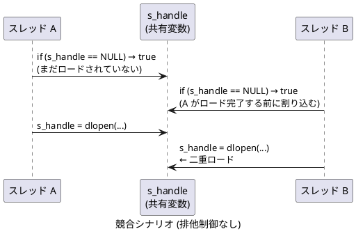

# 動的ライブラリのロード・アンロードに関する実装メモ

## dlopen / LoadLibrary の都度オープン・クローズについて

`func.c` の `useOverride != 0` パスでは、初回呼び出し時のみ以下を実行します。

```text
dlopen("liboverride.so", RTLD_LAZY)   // ① ライブラリのロード / 参照カウント増加
dlsym(handle, "func_override")        // ② シンボルテーブル検索
```

2 回目以降は静的変数にキャッシュされたハンドルと関数ポインタをそのまま使用します。

```text
func_override(...)                    // ③ 本来の処理 (キャッシュ済みポインタを呼び出し)
```

### 各操作のコスト

| 操作 | 初回 (コールド) | 2 回目以降 (ウォーム) |
| ---- | --------------- | --------------------- |
| `dlopen` | 大 (ファイル検索・mmap・シンボル解決・コンストラクタ実行) | 中 (前回の `dlclose` でアンロード済みなら再ロードに近いコスト) |
| `dlsym` | 中 (ハッシュテーブル検索、数 μs 程度) | 同左 |
| `dlclose` | 中 (参照カウント -1、0 になればデストラクタ + アンマップ) | 同左 |
| 関数呼び出し本体 | ns 単位 | ns 単位 |

Linux / Windows ともに `dlopen` / `LoadLibrary` は内部で参照カウントを管理しています。`dlclose` で参照カウントが 0 になると OS はライブラリをアンマップするため、次回の `dlopen` は冷たいロードに近いコストが再びかかります。キャッシュパターンではこのコストを初回のみに抑えます。

### 呼び出し頻度別の判断

| 呼び出し頻度 | 判断 |
| ------------ | ---- |
| 起動時や設定変更時など低頻度 | 無視できます |
| Web API のリクエスト単位など中頻度 | 測定して判断してください |
| ループ内・高速処理パスなど高頻度 | 無視できません。`dlopen` の数 μs ~ 数十 μs が積み重なり支配的になります |

## ハンドルと関数ポインタのキャッシュ

`func.c` では、`libbase_local.h` で定義された `MODULE_HANDLE` 型を使い、ハンドルと関数ポインタをモジュールスコープの変数に保持します。`DllMain.c` からも参照するため `static` は付けず、`libbase_local.h` の `extern` 宣言で共有します。

```c
/* libbase_local.h の extern 宣言と対応するモジュールスコープ変数 */
MODULE_HANDLE   s_handle        = NULL;  /* Linux: void *, Windows: HMODULE */
func_override_t s_func_override = NULL;
```

### スレッドセーフな一回限りのロード

#### なぜ必要か

`s_handle == NULL` の単純なチェックでは、複数のスレッドが同時に `func()` を呼び出したとき競合が発生します。



この競合が引き起こす問題は複数あります。

| 問題 | 内容 |
| ---- | ---- |
| 二重ロード | `dlopen` が 2 回実行され、参照カウントが期待より増加する。`onUnload()` での `dlclose` が 1 回では不十分になる |
| 部分書き込みの参照 | スレッド A が `s_handle` を書き込んでいる途中でスレッド B が読むと、不完全な値を参照する可能性がある (メモリバリアなしでは CPU の書き込み順序が保証されない) |
| `s_func_override` の不整合 | `s_handle` の書き込みと `s_func_override` の書き込みの間に別スレッドが割り込むと、`s_handle != NULL` なのに `s_func_override == NULL` という矛盾した状態が見える |

マルチスレッド環境での初回ロードには、OS が提供する 1 回限りの初期化プリミティブを使用します。

| プラットフォーム | プリミティブ | ヘッダー / ライブラリ |
| ---------------- | ------------ | --------------------- |
| Linux | `pthread_once_t` / `pthread_once()` | `<pthread.h>` / `-lpthread` |
| Windows | `INIT_ONCE` / `InitOnceExecuteOnce()` | `<windows.h>` (追加リンク不要) |

これらのプリミティブは内部でメモリバリアを含む排他制御を提供するため、二重チェックロック (double-checked locking) を自前実装する必要がありません。

```c
/* 一回限りの初期化制御変数 (func.c 内のみ、DllMain.c との共有不要) */
#ifndef _WIN32
static pthread_once_t s_once = PTHREAD_ONCE_INIT;

static void load_liboverride_once(void)
{
    s_handle = dlopen("liboverride.so", RTLD_LAZY);
    if (s_handle == NULL) { return; }
    s_func_override = (func_override_t)dlsym(s_handle, "func_override");
    if (s_func_override == NULL) { dlclose(s_handle); s_handle = NULL; }
}
#else  /* _WIN32 */
static INIT_ONCE s_once = INIT_ONCE_STATIC_INIT;

static BOOL CALLBACK load_liboverride_once(PINIT_ONCE pOnce, PVOID param, PVOID *ctx)
{
    (void)pOnce; (void)param; (void)ctx;
    s_handle = LoadLibrary("liboverride.dll");
    if (s_handle == NULL) { return TRUE; }
    s_func_override = (func_override_t)GetProcAddress(s_handle, "func_override");
    if (s_func_override == NULL) { FreeLibrary(s_handle); s_handle = NULL; }
    return TRUE;
}
#endif /* _WIN32 */
```

`func()` 内での呼び出し部分は以下のようになります。

```c
#ifndef _WIN32
    if (pthread_once(&s_once, load_liboverride_once) != 0) { return -1; }
#else  /* _WIN32 */
    if (!InitOnceExecuteOnce(&s_once, load_liboverride_once, NULL, NULL)) { return -1; }
#endif /* _WIN32 */
    if (s_func_override == NULL) { return -1; }  /* ロード失敗時 */
    return s_func_override(useOverride, a, b, result);
```

### 初期化失敗時の再試行について

`pthread_once` / `InitOnceExecuteOnce` (コールバックが `TRUE` を返す場合) はいずれも「一度実行したら以降はスキップ」という意味論を持ちます。`dlopen` / `LoadLibrary` が失敗した場合でも初期化済みとみなされ、以降の呼び出しではロードを再試行しません。`s_func_override == NULL` チェックにより、失敗時は常に -1 を返します。

再試行が必要な場合は `pthread_mutex_t` / `SRWLOCK` を使った明示的なロックパターンに切り替えてください。

### `s_once` のリセットについて

`s_once` は `func.c` 内の `static` 変数です。`onUnload()` でリセットする必要はありません。

`static` 変数のデータは共有ライブラリのデータセクション (`.data`) に配置され、プロセス単位でマッピングされます。同じ共有ライブラリを複数のスレッドから参照しても、プロセスに対して同一のデータセクションが使われます。`dlopen` / `LoadLibrary` が同じライブラリを複数回呼び出した場合も、OS はプロセス内で同一のマッピングを再利用するため、`s_once` の状態はプロセス全体で一貫して保たれます。

`base.so` / `base.dll` がアンロードされると (`dlclose` で参照カウントが 0 になる、またはプロセス終了)、OS はそのプロセスに対するデータセクションのマッピングを破棄します。その後、同じプロセス内で再ロードされた場合はデータセクションが新たにマッピングされ、`s_once` は初期値 (`PTHREAD_ONCE_INIT` / `INIT_ONCE_STATIC_INIT`) に戻ります。

複数のプロセスが同じ `base.so` / `base.dll` を同時にロードしていても問題はありません。共有ライブラリのコードセクション (`.text`) は物理メモリ上の同一ページを複数プロセスで読み取り専用共有しますが、データセクション (`.data` / `.bss`) は各プロセスが独立したプライベートマッピングを持ちます (Linux: CoW、Windows: 各プロセス固有のページ)。したがって `s_once`・`s_handle`・`s_func_override` はプロセスごとに完全に独立しており、あるプロセスの状態が別プロセスに影響することはありません。

したがって `s_once` の状態は常に「そのプロセスにおける `base.so` / `base.dll` のマッピングライフタイム」と一致し、`onUnload()` で明示的にリセットしなくても整合性が保たれます。

## base.so / base.dll アンロード時の処理

`s_handle` に保持したハンドルは、`base.so` / `base.dll` がアンロードされるタイミングで自動的に解放されます。
アンロード処理は `DllMain.c` に分離しており、`func.c` との変数共有には `libbase_local.h` を使用しています。

### 共通ヘルパー: `onUnload()` (`DllMain.c`)

Linux / Windows 共通のクリーンアップ処理を `onUnload()` にまとめています。Linux / Windows それぞれのエントリーポイントからこの関数を呼び出します。

```c
static void onUnload(void)
{
    LOG_INFO_MSG("base: onUnload called");

    if (s_handle != NULL)
    {
#ifndef _WIN32
        dlclose(s_handle);
#else  /* _WIN32 */
        FreeLibrary(s_handle);
#endif /* _WIN32 */
        s_handle        = NULL;
        s_func_override = NULL;
    }
}
```

`LOG_INFO_MSG` は DLL アンロードコンテキストの API 制約に合わせたログ出力マクロです。Linux では `syslog()`、Windows では `OutputDebugStringA()` を使用します。

### Linux: `__attribute__((destructor))` (`DllMain.c`)

```c
__attribute__((destructor)) static void unload_liboverride(void)
{
    onUnload();
}
```

`__attribute__((destructor))` を付与した関数は、以下のタイミングで呼ばれます。

| トリガー | 呼び出しタイミング |
| -------- | ------------------ |
| `dlclose(base.so)` で参照カウントが 0 になったとき | ライブラリのアンロード直前 |
| プロセス正常終了 (`return` / `exit()`) | `atexit` コールバックの後、OS へ制御が返る前 |
| `_exit()` / `abort()` による強制終了 | **呼ばれない** |

### Windows: `DllMain(DLL_PROCESS_DETACH)` (`DllMain.c`)

```c
BOOL WINAPI DllMain(HINSTANCE hinstDLL, DWORD fdwReason, LPVOID lpvReserved)
{
    (void)hinstDLL;
    (void)lpvReserved;
    if (fdwReason == DLL_PROCESS_DETACH)
    {
        onUnload();
    }
    return TRUE;
}
```

`DLL_PROCESS_DETACH` は以下のタイミングで呼ばれます。

| トリガー | 呼び出しタイミング |
| -------- | ------------------ |
| `FreeLibrary(base.dll)` で参照カウントが 0 になったとき | ライブラリのアンロード直前 |
| プロセス正常終了 (`return` / `ExitProcess()`) | Windows ローダーがロード済み DLL を順にアンロードするとき |
| `TerminateProcess()` による強制終了 | **呼ばれない** |

> **注意**: `DllMain` の `DLL_PROCESS_DETACH` ハンドラ内では、呼び出せる Win32 API が制限されています。`FreeLibrary` は `DLL_PROCESS_DETACH` から呼び出し可能ですが、`lpvReserved != NULL`（プロセス終了による DETACH）の場合はリソースは OS が回収するため、`FreeLibrary` を省略することもあります。本実装では明示的に解放しています。

## ハンドルを保持したままプロセスを終了した場合の影響

キャッシュパターン採用時など、`dlclose` / `FreeLibrary` を呼ばずにプロセスを終了した場合の動作です。

**結論: OS リソースの観点では問題ありません。ただしライブラリが外部リソースを管理している場合は注意が必要です。**

### 終了方法別の動作

#### Linux (dlopen)

プロセスが `exit()` で終了すると、glibc の終了処理が以下を順に実行します。

- `__cxa_atexit()` で登録されたコールバック (C++ 静的デストラクタを含む) を呼び出します
- dlopen されたライブラリが `__cxa_atexit()` 経由でコールバックを登録していれば、dlclose なしでも呼び出されます
- その後 OS がプロセスの全メモリマッピング・ファイルディスクリプタを回収します

`_exit()` や `abort()` による強制終了では glibc の終了処理をスキップするため、登録済みコールバックは呼ばれません。

#### Windows (LoadLibrary)

プロセスが正常終了 (`ExitProcess()` または `main` の return) すると、Windows ローダーが全ロード済み DLL の `DllMain` を `DLL_PROCESS_DETACH` で呼び出します。`FreeLibrary` していない DLL も対象になります。

`TerminateProcess()` による強制終了では `DllMain` は呼ばれません。

### 終了方法まとめ

| 終了方法 | Linux デストラクタ | Windows DllMain(DETACH) |
| -------- | ------------------ | ----------------------- |
| 正常終了 (`return` / `exit()`) | 呼ばれる | 呼ばれる |
| `_exit()` / `abort()` | 呼ばれない | 呼ばれない |
| `TerminateProcess()` | — | 呼ばれない |

### 注意が必要な外部リソース

OS が回収できない外部リソースをライブラリの終了処理が管理している場合に影響が出ます。

| 外部リソースの例 | 影響 |
| ---------------- | ---- |
| ファイル・ソケット | OS がクローズするため問題ありません |
| プロセス間共有メモリ (`shm_open` / `CreateFileMapping`) | 他プロセスが参照中なら残存する可能性があります |
| 名前付きミューテックス・セマフォ | 解放されずロックしたまま残存する可能性があります |
| 一時ファイル・ロックファイル | 削除されずに残る可能性があります |
| 外部サービスへの接続 (DB など) | コネクションが即時切断されず、サーバ側で残留する可能性があります |

### このサンプルへの適用

`liboverride` は乗算のみを行い外部リソースを一切管理していないため、ハンドルを保持したままプロセスを終了しても Linux・Windows ともに問題ありません。アンロード時処理はリソース管理の明示的な例として実装しています。
