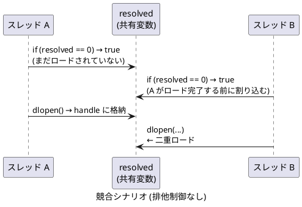

# 動的ライブラリのロード・アンロードに関する実装メモ

## dlopen / LoadLibrary の都度オープン・クローズについて

`funcman_get_func.c` の `_funcman_get_func()` では、初回呼び出し時のみ以下を実行します。

```text
dlopen("lib_name.so", RTLD_LAZY)   // ① ライブラリのロード / 参照カウント増加
dlsym(handle, "func_name")         // ② シンボルテーブル検索
```

`lib_name` と `func_name` は `funcman_init()` が設定ファイルから読み込んだ値です。

2 回目以降は `funcman_object` の `handle` と `func_ptr` にキャッシュされた値をそのまま使用します。

```text
func_ptr(...)                    // ③ 本来の処理 (キャッシュ済みポインタを呼び出し)
```

### 各操作のコスト

| 操作 | 初回 (コールド) | 2 回目以降 (ウォーム) |
| ---- | --------------- | --------------------- |
| `dlopen` | 大 (ファイル検索・mmap・シンボル解決・コンストラクタ実行) | 中 (前回の `dlclose` でアンロード済みなら再ロードに近いコスト) |
| `dlsym` | 中 (ハッシュテーブル検索、数 μs 程度) | 同左 |
| `dlclose` | 中 (参照カウント -1、0 になればデストラクタ + アンマップ) | 同左 |
| 関数呼び出し本体 | ns 単位 | ns 単位 |

Linux / Windows ともに `dlopen` / `LoadLibrary` は内部で参照カウントを管理しています。`dlclose` で参照カウントが 0 になると OS はライブラリをアンマップするため、次回の `dlopen` は冷たいロードに近いコストが再びかかります。キャッシュパターンではこのコストを初回のみに抑えます。

### 呼び出し頻度別の判断

| 呼び出し頻度 | 判断 |
| ------------ | ---- |
| 起動時や設定変更時など低頻度 | 無視できます |
| Web API のリクエスト単位など中頻度 | 測定して判断してください |
| ループ内・高速処理パスなど高頻度 | 無視できません。`dlopen` の数 μs ~ 数十 μs が積み重なり支配的になります |

## ハンドルと関数ポインタのキャッシュ

`funcman_get_func.c` では、`funcman_object` 構造体の `handle` と `func_ptr` メンバにハンドルと関数ポインタを保持します。`dllmain_libbase.c` からも参照するため、`funcman_libbase.c` で実体を定義し、`funcman_libbase.h` の `extern` 宣言で共有します。

```c
/* funcman_libbase.c での実体定義 */
static funcman_object sfo_sample_func = NEW_FUNCMAN_OBJECT("sample_func", sample_func_t);
funcman_object *const pfo_sample_func = &sfo_sample_func;
```

`funcman_object` には以下のキャッシュフィールドが含まれます。

```c
typedef struct
{
    const char *func_key;             /* この関数インスタンスの識別キー */
    char lib_name[FUNCMAN_NAME_MAX];  /* 拡張子なしライブラリ名 */
    char func_name[FUNCMAN_NAME_MAX]; /* 関数シンボル名 */
    MODULE_HANDLE handle;             /* キャッシュ済みハンドル (NULL = 未ロード) */
    void *func_ptr;                   /* キャッシュ済み関数ポインタ (NULL = 未取得) */
    int resolved;                     /* 解決済フラグ (0 = 未解決) */
    /* ... mutex (Linux) または lock (Windows) ... */
} funcman_object;
```

### スレッドセーフな実装

#### なぜ必要か

`resolved == 0` の単純なチェックでは、複数のスレッドが同時に関数ポインタを取得しようとしたとき競合が発生します。



この競合が引き起こす問題は複数あります。

| 問題 | 内容 |
| ---- | ---- |
| 二重ロード | `dlopen` が 2 回実行され、参照カウントが期待より増加する。`onUnload()` での `dlclose` が 1 回では不十分になる |
| 部分書き込みの参照 | スレッド A が `handle` を書き込んでいる途中でスレッド B が読むと、不完全な値を参照する可能性がある (メモリバリアなしでは CPU の書き込み順序が保証されない) |
| `func_ptr` の不整合 | `handle` の書き込みと `func_ptr` の書き込みの間に別スレッドが割り込むと、`handle != NULL` なのに `func_ptr == NULL` という矛盾した状態が見える |

#### 実装方法

`_funcman_get_func()` では `pthread_mutex_t` (Linux) または `SRWLOCK` (Windows) と double-checked locking パターンを組み合わせています。

```c
/* 早期リターン: ロード完了後はロックなしで高速にキャッシュを参照する */
if (fobj->resolved != 0)
    return fobj->func_ptr;

/* ロック取得 */
#ifndef _WIN32
pthread_mutex_lock(&fobj->mutex);
#else  /* _WIN32 */
AcquireSRWLockExclusive(&fobj->lock);
#endif /* _WIN32 */

/* ロック取得後に再確認 (double-checked locking):
 * 他スレッドが先にロードを完了していた場合はスキップする */
if (fobj->resolved == 0)
{
    /* ... dlopen / LoadLibrary ... */
    /* ... dlsym / GetProcAddress ... */
    fobj->resolved = 1;  /* 解決済 */
}

#ifndef _WIN32
pthread_mutex_unlock(&fobj->mutex);
#else  /* _WIN32 */
ReleaseSRWLockExclusive(&fobj->lock);
#endif /* _WIN32 */

return fobj->func_ptr;
```

`pthread_mutex_t` / `SRWLOCK` はロック取得・解放時にメモリバリアを提供するため、`handle` や `func_ptr` への書き込み順序が他スレッドから正しく見えることが保証されます。

### 初期化失敗時の再試行について

`resolved != 0` のチェックにより「一度実行したら以降はスキップ」という意味論が実現されます。`dlopen` / `LoadLibrary` が失敗した場合でも `resolved` が 0 以外に設定され、以降の呼び出しではロードを再試行しません。`resolved < 0` の場合は `func_ptr == NULL` のままとなり、呼び出し元では NULL チェックで失敗を検出できます。

`resolved` の状態値は以下のとおりです。

| resolved | 意味 |
| -------- | ---- |
| 0 | 未解決 |
| 1 | 解決済 |
| 2 | 明示的デフォルト (`lib_name` と `func_name` がともに `"default"`) |
| -1 | 定義なし (定義ファイル不存在、定義行が不存在) |
| -2 | 名称長さオーバー |
| -3 | ライブラリオープンエラー (`dlopen` / `LoadLibrary` 失敗) |
| -4 | 関数探索エラー (`dlsym` / `GetProcAddress` 失敗) |

## base.so / base.dll アンロード時の処理

`handle` に保持したハンドルは、`base.so` / `base.dll` がアンロードされるタイミングで自動的に解放されます。
アンロード処理は `dllmain_libbase.c` に分離しており、`funcman_libbase.h` の `extern` 宣言で変数を共有します。プラットフォームごとのフックは `dllmain.h` が提供します。

### 共通ヘルパー: `onUnload()` (`dllmain_libbase.c`)

Linux / Windows 共通のクリーンアップ処理を `onUnload()` にまとめています。Linux / Windows それぞれのエントリーポイント (`dllmain.h` が提供) からこの関数を呼び出します。

```c
void onUnload(void)
{
    DLLMAIN_INFO_MSG("base: onUnload called");
    funcman_dispose(fobj_array_libbase, fobj_length_libbase);
}
```

`DLLMAIN_INFO_MSG` は DLL アンロードコンテキストの API 制約に合わせたログ出力マクロです。Linux では `syslog()`、Windows では `OutputDebugStringA()` を使用します。

`funcman_dispose()` はすべての `funcman_object` を走査し、`handle != NULL` のものに対して `dlclose` / `FreeLibrary` を呼び出します。

### Linux: `__attribute__((constructor/destructor))` (`dllmain.h`)

`dllmain.h` が以下のフックを提供します。

```c
__attribute__((constructor)) static void dllmain_on_load__(void)   { onLoad(); }
__attribute__((destructor))  static void dllmain_on_unload__(void) { onUnload(); }
```

`__attribute__((constructor/destructor))` を付与した関数は、以下のタイミングで呼ばれます。

| トリガー | 呼び出しタイミング |
| -------- | ------------------ |
| `dlopen(base.so)` されたとき | ライブラリのロード直後 (constructor) |
| `dlclose(base.so)` で参照カウントが 0 になったとき | ライブラリのアンロード直前 (destructor) |
| プロセス正常終了 (`return` / `exit()`) | `atexit` コールバックの後、OS へ制御が返る前 |
| `_exit()` / `abort()` による強制終了 | **呼ばれない** |

### Windows: `DllMain` (`dllmain.h`)

`dllmain.h` が以下の `DllMain` を提供します。

```c
BOOL WINAPI DllMain(HINSTANCE hinstDLL, DWORD fdwReason, LPVOID lpvReserved)
{
    (void)hinstDLL;
    (void)lpvReserved;
    switch (fdwReason)
    {
    case DLL_PROCESS_ATTACH:
        onLoad();
        break;
    case DLL_PROCESS_DETACH:
        onUnload();
        break;
    default:
        break;
    }
    return TRUE;
}
```

`DLL_PROCESS_DETACH` は以下のタイミングで呼ばれます。

| トリガー | 呼び出しタイミング |
| -------- | ------------------ |
| `FreeLibrary(base.dll)` で参照カウントが 0 になったとき | ライブラリのアンロード直前 |
| プロセス正常終了 (`return` / `ExitProcess()`) | Windows ローダーがロード済み DLL を順にアンロードするとき |
| `TerminateProcess()` による強制終了 | **呼ばれない** |

> **注意**: `DllMain` の `DLL_PROCESS_DETACH` ハンドラ内では、呼び出せる Win32 API が制限されています。`FreeLibrary` は `DLL_PROCESS_DETACH` から呼び出し可能ですが、`lpvReserved != NULL`（プロセス終了による DETACH）の場合はリソースは OS が回収するため、`FreeLibrary` を省略することもあります。本実装では明示的に解放しています。

## ハンドルを保持したままプロセスを終了した場合の影響

キャッシュパターン採用時など、`dlclose` / `FreeLibrary` を呼ばずにプロセスを終了した場合の動作です。

**結論: OS リソースの観点では問題ありません。ただしライブラリが外部リソースを管理している場合は注意が必要です。**

### 終了方法別の動作

#### Linux (dlopen)

プロセスが `exit()` で終了すると、glibc の終了処理が以下を順に実行します。

- `__cxa_atexit()` で登録されたコールバック (C++ 静的デストラクタを含む) を呼び出します
- dlopen されたライブラリが `__cxa_atexit()` 経由でコールバックを登録していれば、dlclose なしでも呼び出されます
- その後 OS がプロセスの全メモリマッピング・ファイルディスクリプタを回収します

`_exit()` や `abort()` による強制終了では glibc の終了処理をスキップするため、登録済みコールバックは呼ばれません。

#### Windows (LoadLibrary)

プロセスが正常終了 (`ExitProcess()` または `main` の return) すると、Windows ローダーが全ロード済み DLL の `DllMain` を `DLL_PROCESS_DETACH` で呼び出します。`FreeLibrary` していない DLL も対象になります。

`TerminateProcess()` による強制終了では `DllMain` は呼ばれません。

### 終了方法まとめ

| 終了方法 | Linux デストラクタ | Windows DllMain(DETACH) |
| -------- | ------------------ | ----------------------- |
| 正常終了 (`return` / `exit()`) | 呼ばれる | 呼ばれる |
| `_exit()` / `abort()` | 呼ばれない | 呼ばれない |
| `TerminateProcess()` | — | 呼ばれない |

### 注意が必要な外部リソース

OS が回収できない外部リソースをライブラリの終了処理が管理している場合に影響が出ます。

| 外部リソースの例 | 影響 |
| ---------------- | ---- |
| ファイル・ソケット | OS がクローズするため問題ありません |
| プロセス間共有メモリ (`shm_open` / `CreateFileMapping`) | 他プロセスが参照中なら残存する可能性があります |
| 名前付きミューテックス・セマフォ | 解放されずロックしたまま残存する可能性があります |
| 一時ファイル・ロックファイル | 削除されずに残る可能性があります |
| 外部サービスへの接続 (DB など) | コネクションが即時切断されず、サーバ側で残留する可能性があります |

### このサンプルへの適用

`liboverride` は乗算のみを行い外部リソースを一切管理していないため、ハンドルを保持したままプロセスを終了しても Linux・Windows ともに問題ありません。アンロード時処理はリソース管理の明示的な例として実装しています。
