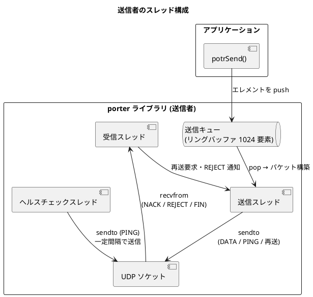
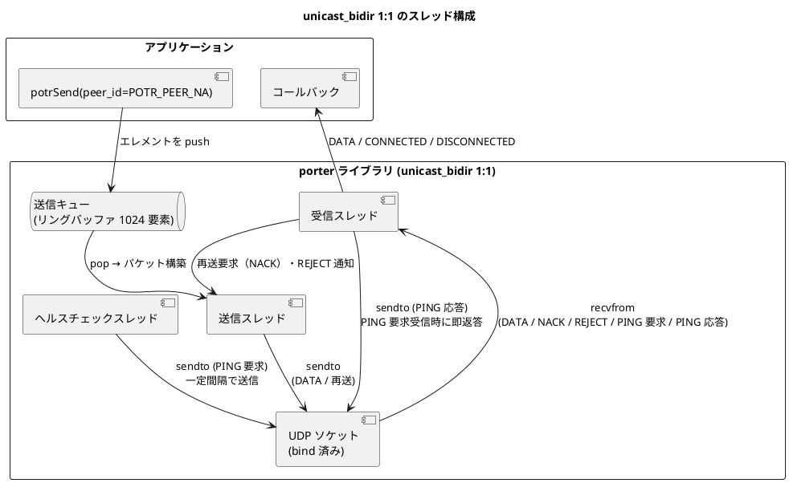
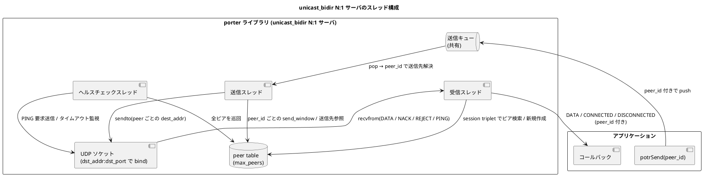
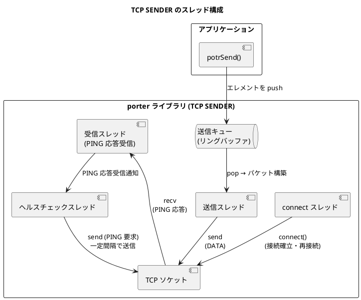
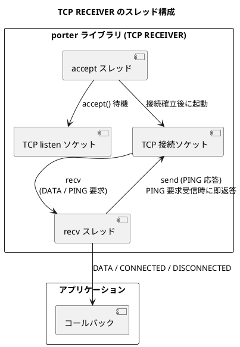
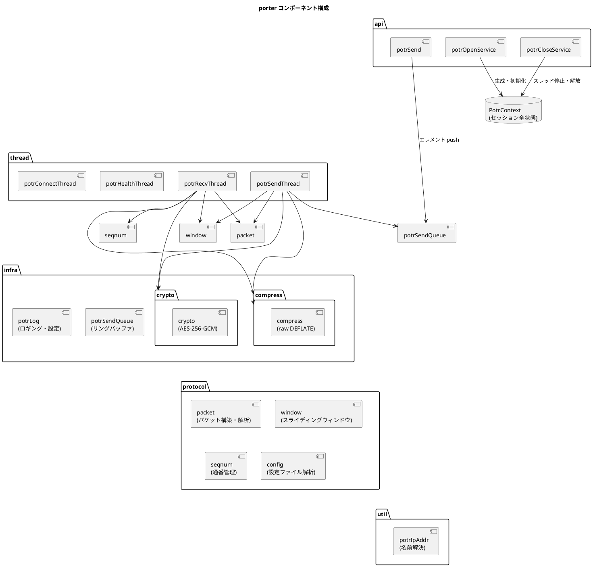

# アーキテクチャ設計

## 概要

porter は、アプリケーションと UDP ソケット層の間に抽象レイヤーを置き、非同期送受信・再送制御・ヘルスチェックを透過的に提供します。
アプリケーションは `potrOpenService()` でサービスを開き、送信側は `potrSend(handle, peer_id, ...)` を呼び出すだけで、内部スレッドが送受信・再送・ヘルスチェックをすべて担います。1:1 モードおよび他通信種別では `peer_id` に `POTR_PEER_NA` を指定し、`unicast_bidir` の N:1 モードでは接続中ピアの `peer_id` を指定します。

## 役割モデル

porter は通信の参加者を **送信者 (SENDER)** と **受信者 (RECEIVER)** に区別します。

| 役割 | 説明 |
|---|---|
| SENDER | `potrSend()` でデータを送出する。ヘルスチェック PING を送信する。 |
| RECEIVER | 到着したパケットをコールバックで上位層へ渡す。NACK で再送を要求する。 |

1:1 (ユニキャスト) 通信では送信者 1 : 受信者 1 の構成となります。
1:N (マルチキャスト・ブロードキャスト) 通信では送信者 1 : 受信者 N の構成となります。

### unicast_bidir における役割の解釈

`POTR_TYPE_UNICAST_BIDIR` には **1:1 モード** と **N:1 モード** があります。

- 1:1 モードでは、両端が送受信・NACK・ヘルスチェックを独立して行います。`POTR_ROLE_SENDER` / `POTR_ROLE_RECEIVER` は設定上のラベルであり、データ方向そのものを制約しません
- N:1 モードでは、サーバ側は `src_addr` を省略した `POTR_ROLE_RECEIVER` として開かれ、クライアントごとの状態はピアテーブルで管理されます

| モード | Role / 設定の意味 |
|---|---|
| 1:1 | `POTR_ROLE_SENDER` は `src_addr:src_port` で bind し、`dst_addr:dst_port` へ送信する側。`POTR_ROLE_RECEIVER` は `dst_addr:dst_port` で bind し、必要に応じて送信元を学習して返信する側 |
| N:1 | サーバは `POTR_ROLE_RECEIVER` として `dst_addr:dst_port` で待ち受ける。各クライアントは従来どおり `src_addr` を持つ `unicast_bidir` エンドポイントとして接続する |

> UDP は無接続であるため、1:1 モードではどちらの端が先に `potrOpenService()` を呼んでも動作に違いはありません。N:1 モードではサーバが受信ソケットを先に開いて待ち受ける運用が自然です。

### TCP 通信種別における役割の解釈

`POTR_TYPE_TCP` / `POTR_TYPE_TCP_BIDIR` では Role は **TCP 接続方向のみ** を意味します。

| Role | TCP の役割 | データ送受信 |
|---|---|---|
| `POTR_ROLE_SENDER` | TCP クライアント（`connect()`） | tcp: 送信のみ / tcp_bidir: 送受信 |
| `POTR_ROLE_RECEIVER` | TCP サーバー（`listen()` → `accept()`） | tcp: 受信のみ / tcp_bidir: 送受信 |

UDP は無接続のため先に開いた方が待機するだけですが、TCP では RECEIVER が先に `potrOpenService()` を呼んで `listen()` に入っている必要があります。

## スレッド構成

### 送信者のスレッド



| スレッド | 役割 |
|---|---|
| 送信スレッド | 送信キューからエレメントを取り出し、DATA パケットを構築して全パスへ sendto する |
| 受信スレッド | NACK / REJECT / FIN パケットを受信し、再送処理または DISCONNECTED 発火を行う |
| ヘルスチェックスレッド | 最終送信時刻を監視し、一定間隔が経過したら PING パケットを送信する |

### 受信者のスレッド

受信者が起動するスレッドは **受信スレッド 1 本のみ** です。
ただし `POTR_TYPE_UNICAST_BIDIR` の RECEIVER は、SENDER と同等のスレッド構成（送信スレッド・ヘルスチェックスレッドを含む 3 本）を起動します（後述「unicast_bidir のスレッド構成」参照）。

受信スレッドが担う処理：

- DATA パケットの受信・受信ウィンドウへの格納・フラグメント結合・コールバック呼び出し
- 欠番検出と NACK 送出 (reorder_timeout_ms > 0 の場合は待機後に送出)
- RAW モードのギャップ検出による `POTR_EVENT_DISCONNECTED` 発火 (reorder_timeout_ms > 0 の場合は待機後に発火)
- FIN / REJECT パケット受信による `POTR_EVENT_DISCONNECTED` 発火
- ヘルスチェックタイムアウト監視による `POTR_EVENT_DISCONNECTED` 発火
- リオーダーバッファタイムアウト監視 (reorder_timeout_ms > 0 の場合): 欠番待機中に期限超過したら NACK 送出または DISCONNECTED 発火

### unicast_bidir のスレッド構成

#### 1:1 モード

`POTR_TYPE_UNICAST_BIDIR` の 1:1 モードでは、両端が対称な 3 スレッド構成を持ちます。



#### N:1 サーバモード

N:1 モードではサーバ側に 1 つの共有スレッド群があり、各ピアの状態は `peer_id` ごとにピアテーブルへ分離して保持されます。



| スレッド | 役割 |
|---|---|
| 送信スレッド | 共有送信キューから `peer_id` 付きエレメントを取り出し、対応するピアの送信先へ `sendto` する。`POTR_PEER_ALL` は `potrSend()` 呼び出し時点で全ピア分に展開される |
| 受信スレッド | `recvfrom` の送信元と session triplet (`session_id` + `session_tv_sec` + `session_tv_nsec`) からピアを特定し、必要に応じて新規ピアを作成する。DATA / NACK / REJECT / PING をピアごとに独立処理する |
| ヘルスチェックスレッド | 接続中の各ピアについて最終送受信時刻を監視し、`health_interval_ms` に従って PING を送信し、`health_timeout_ms` 超過で個別に切断を検知する |

### TCP / TCP_BIDIR のスレッド構成

TCP では接続確立・再接続を担う **connect スレッド**（RECEIVER 側では **accept スレッド**）が追加されます。
接続確立後に send / recv / health スレッドを起動し、切断後は停止する「接続ライフサイクル管理」を担います。

#### TCP SENDER のスレッド



| スレッド | 役割 |
|---|---|
| connect スレッド | `connect()` を実行し、成功したら他スレッドを起動する。切断後は `reconnect_interval_ms` 待機して再試行する |
| 送信スレッド | 送信キューからエレメントを取り出し、DATA パケットを構築して `send()` する |
| 受信スレッド | PING 応答（`ack_num > 0`）を受信してヘルスチェックスレッドに通知する。TCP 接続断を検知したら `POTR_EVENT_DISCONNECTED` を発火する |
| ヘルスチェックスレッド | `tcp_health_interval_ms` 周期で PING 要求を送信する。`tcp_health_timeout_ms` 以内に応答が届かなければ切断と判定する |

#### TCP RECEIVER のスレッド



| スレッド | 役割 |
|---|---|
| accept スレッド | `listen()` ソケットで `accept()` を待機する。接続確立後に recv スレッドを起動する |
| recv スレッド | ヘッダー読み取り → ペイロード読み取りの 2 ステップで受信する。`ack_num=0` の PING 要求に即応答し、最終受信時刻（`tcp_last_ping_req_recv_ms`）を更新する。`poll()` タイムアウトを使い `tcp_health_timeout_ms` 以内に PING 要求が届かない場合は DISCONNECTED と判定する。TCP 接続断も同様に DISCONNECTED を発火して accept スレッドへ戻る |

#### TCP_BIDIR のスレッド構成

両端が対称なスレッド構成（connect スレッド + 送信 + 受信 + ヘルスチェック）を持ちます。

| 通信種別 | Role | connect スレッド | 送信スレッド | 受信スレッド | ヘルスチェックスレッド |
|---|---|---|---|---|---|
| TCP | SENDER | ○（connect/再接続） | ○（接続後起動） | ○（接続後起動） | ○（接続後起動） |
| TCP | RECEIVER | ○（accept ループ） | × | ○（接続後起動） | × |
| TCP_BIDIR | SENDER | ○（connect/再接続） | ○（接続後起動） | ○（接続後起動） | ○（接続後起動） |
| TCP_BIDIR | RECEIVER | ○（accept ループ） | ○（接続後起動） | ○（接続後起動） | ○（接続後起動） |

## コンポーネント構成



## セッションコンテキスト (PotrContext)

porter の全状態は `PotrContext` 構造体 (`PotrHandle` の実体) に集約されます。
この構造体はアプリケーションには不透明 (opaque) であり、内部実装のみがアクセスします。

| カテゴリ | 保持する情報 |
|---|---|
| 設定 | サービス定義 (通信種別・アドレス・ポート・暗号化鍵) 、グローバル設定 (ウィンドウサイズ・ヘルスチェック間隔) |
| ソケット | 最大 4 パス分の UDP ソケット |
| スレッド | 受信・送信・ヘルスチェックスレッドハンドル |
| ウィンドウ | 送信ウィンドウ・受信ウィンドウ (各パケットのコピーを保持) |
| 送信キュー | ペイロードエレメントのリングバッファ (1024 要素) |
| セッション状態 | 自セッション ID / 相手セッション ID・開始時刻 |
| 接続状態 | `health_alive` (1: 疎通中、0: 未接続または切断) |
| ヘルスチェック | 最終送信時刻・最終受信時刻 (パス別) |
| フラグメントバッファ | フラグメント結合用バッファ (最大 65,535 バイト) |
| 圧縮バッファ | 圧縮・解凍作業バッファ (約 65 KB) |
| 暗号バッファ | 暗号化・復号作業バッファ (max_payload + 16 バイト) |
| NACK 重複抑制 | 直近 NACK のリングバッファ (8 要素) |
| リオーダー状態 | `reorder_pending` フラグ・待機通番・タイムアウト期限 (`reorder_timeout_ms > 0` のときのみ使用) |

> **TCP 通信種別について**: `POTR_TYPE_TCP` / `POTR_TYPE_TCP_BIDIR` では以下の追加フィールドを保持します。
>
> | フィールド | 説明 |
> |---|---|
> | `tcp_listen_sock` | RECEIVER の listen ソケット |
> | `tcp_conn_fd[POTR_MAX_PATH]` | アクティブ接続ソケット（v1 では `[0]` のみ使用） |
> | `tcp_connected` | 1 = 接続確立済み |
> | `tcp_send_mutex` | TCP `send()` の排他制御 |
> | `connect_thread` | connect / accept スレッドハンドル |
> | `tcp_state_mutex` / `tcp_state_cv` | connect スレッドへの切断通知用 mutex/condvar |
> | `tcp_last_ping_recv_ms` | PING 応答最終受信時刻（ms, monotonic。SENDER health スレッドが監視） |
> | `tcp_last_ping_req_recv_ms` | RECEIVER が最後に PING 要求を受信した時刻（ms, monotonic。recv スレッドが PING 到着タイムアウト監視に使用） |

> **unicast_bidir について**: 1:1 モードの `POTR_ROLE_RECEIVER` は送信ウィンドウ・送信キュー・送信スレッド・ヘルスチェックスレッドも保持します。N:1 モードではさらに `is_multi_peer`、`peers`、`max_peers`、`peers_mutex` などの共有管理情報を持ち、各ピアの詳細状態は `PotrPeerContext` に分離されます。

## クロスプラットフォーム抽象化

`potrContext.h` でプラットフォーム差異を抽象化し、上位層はプラットフォームを意識しません。

| 機能 | Linux | Windows |
|---|---|---|
| ソケット型 (`PotrSocket`) | `int` | `SOCKET` |
| 無効ソケット値 | `-1` | `INVALID_SOCKET` |
| スレッド型 (`PotrThread`) | `pthread_t` | `HANDLE` |
| ミューテックス型 (`PotrMutex`) | `pthread_mutex_t` | `CRITICAL_SECTION` |
| 条件変数型 (`PotrCondVar`) | `pthread_cond_t` | `CONDITION_VARIABLE` |
| ソケット初期化 | 不要 | `WSAStartup()` |
| ソケットクローズ | `close()` | `closesocket()` |
| 単調時間 (ヘルスチェック用) | `clock_gettime(CLOCK_MONOTONIC, ...)` | `GetTickCount64()` |
| カレンダー時刻 (セッション ID 用) | `clock_gettime(CLOCK_REALTIME, ...)` | `GetSystemTimeAsFileTime()` |
| 呼び出し規約 (`POTRAPI`) | (なし) | `__stdcall` |
| 暗号化 (`crypto` モジュール) | OpenSSL EVP AES-256-GCM | Windows CNG (BCrypt) AES-256-GCM |

## データフロー概要

### 送信フロー

```
アプリ
 | potrSend(peer_id, data, len, flags)
 ▼
[圧縮] --- flags に POTR_SEND_COMPRESS が指定された場合、メッセージ全体を raw DEFLATE 圧縮
 |
[フラグメント化] --- データが max_payload を超える場合に分割
 |                    各フラグメントにエレメントヘッダー (6 バイト) を付与
 |
[送信キュー push] --- ペイロードエレメントとして積む
 |                    POTR_SEND_BLOCKING なし: キュー満杯時は空き待ち
 |                    POTR_SEND_BLOCKING あり: 事前に drained 待ち → 積む → sendto 完了待ち
 ▼
[送信スレッド] --- キューから pop
 |               複数エレメントを 1 パケットにパッキング
 |               seq_num 付与・送信ウィンドウに登録
 |               encrypt_key が設定されている場合: AES-256-GCM 暗号化
 ▼
[UDP sendto] --- 全パス (最大 4 経路) に並列送信
```

### 受信フロー

```
[UDP recvfrom] --- 各パスのソケットから受信
 |
[検証] --- service_id 照合 → 不一致は破棄
 |         送信元 IP フィルタ → 不一致は破棄
 |         セッション識別 → 旧セッションは破棄、新セッションはウィンドウリセット
 |         POTR_FLAG_ENCRYPTED が立っている場合: AES-256-GCM 復号・認証タグ検証
 |         (認証失敗パケットは即座に破棄)
 |
[種別振り分け]
 +- DATA --→ 受信ウィンドウへ格納
 |            【通常モード】欠番検出 → NACK 送出 → 再送待機
 |                          (reorder_timeout_ms > 0 の場合: 待機タイマー開始 → 期限後に NACK)
 |            【RAW モード】欠番検出 → DISCONNECTED 発火 → ウィンドウリセット
 |                          (reorder_timeout_ms > 0 の場合: 待機タイマー開始 → 期限後に DISCONNECTED)
 |            ↓ 連続した通番が揃ったら順番に取り出し
 |           フラグメント結合・解凍
 |            ↓
 |           コールバック POTR_EVENT_DATA
 |
 +- PING --→ 最終受信時刻を更新 (返信なし)
 |            【通常モード】seq_num を上限に欠番を一括 NACK
 |                          (reorder_timeout_ms > 0 の場合: 各欠番にタイマー確認を適用)
 |            【RAW モード】seq_num > next_seq の場合 DISCONNECTED 発火 → ウィンドウリセット
 |                          (reorder_timeout_ms > 0 の場合: 待機タイマー開始 → 期限後に DISCONNECTED)
 |
 +- FIN  --→ POTR_EVENT_DISCONNECTED 発火
 |
 +- NACK --→ 送信ウィンドウから該当パケットを検索
 |            存在すれば再送 / 存在しなければ REJECT 送出
 |
 +- REJECT -→ POTR_EVENT_DISCONNECTED 発火 (受信者側)
```

## 型定数

### PotrType

```c
typedef enum {
    POTR_TYPE_UNICAST         = 1,
    POTR_TYPE_MULTICAST       = 2,
    POTR_TYPE_BROADCAST       = 3,
    POTR_TYPE_UNICAST_RAW     = 4,
    POTR_TYPE_MULTICAST_RAW   = 5,
    POTR_TYPE_BROADCAST_RAW   = 6,
    POTR_TYPE_TCP             = 7,
    POTR_TYPE_TCP_BIDIR       = 8,
    POTR_TYPE_UNICAST_BIDIR   = 9
} PotrType;
```

### unicast_bidir における RECEIVER の追加フィールド

`POTR_TYPE_UNICAST_BIDIR` の `POTR_ROLE_RECEIVER` は、通常の RECEIVER が持たない以下のフィールドを追加で保持します。

```c
PotrSendQueue     send_queue;       /* 送信キュー */
PotrSendWindow    send_window;      /* 送信ウィンドウ */
PotrThread        send_thread;      /* 送信スレッド */
PotrThread        health_thread;    /* ヘルスチェックスレッド */
PotrMutex         health_mutex;
PotrCondVar       health_wakeup;
volatile uint64_t last_send_ms;
```

### potrOpenService() のコールバック要件

`POTR_TYPE_UNICAST_BIDIR` では両端ともコールバックが必須です。

```c
/* SENDER 側 */
potrOpenService("config.conf", 4020, POTR_ROLE_SENDER, on_recv, &handle);

/* RECEIVER 側 */
potrOpenService("config.conf", 4020, POTR_ROLE_RECEIVER, on_recv, &handle);
```

## 通信種別の比較

| 項目 | unicast | tcp | tcp_bidir | unicast_bidir |
|---|---|---|---|---|
| トランスポート | UDP | TCP | TCP | UDP |
| データ方向 | 一方向 | 一方向 | 双方向 | 双方向 |
| 接続確立 | なし | TCP 3way | TCP 3way | なし |
| NACK / 再送 | ○（RECEIVER → SENDER） | × | × | ○（双方向） |
| スライディングウィンドウ | ○ | × | × | ○（両端） |
| PING 応答 | なし | ○（`ack_num` で区別） | ○（双方向、`ack_num`） | ○（双方向、`ack_num`） |
| ヘルスタイムアウト | RECEIVER 監視 | SENDER 監視 | 両端監視 | 両端監視 |
| 監視方法 | `last_recv_tv_sec` | PING 応答タイムアウト | PING 応答タイムアウト | `last_recv_tv_sec` |
| src_port | 省略可（SENDER）/ 必須（RECEIVER） | 無視 | 無視 | 1:1 は省略可、N:1 では送信元ポートフィルタとして任意 |
| 自動再接続 | なし | ○（SENDER） | ○（SENDER） | なし |
| マルチパス | ○（最大 4 経路） | × | × | ○（最大 4 経路） |
| コールバック | RECEIVER 必須 | RECEIVER 必須（SENDER 任意） | 両端必須 | 両端必須（N:1 は `peer_id` 付き） |
