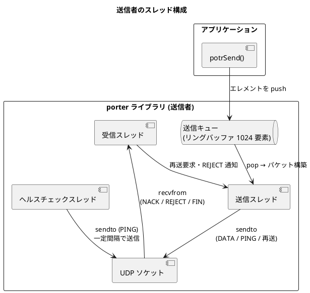
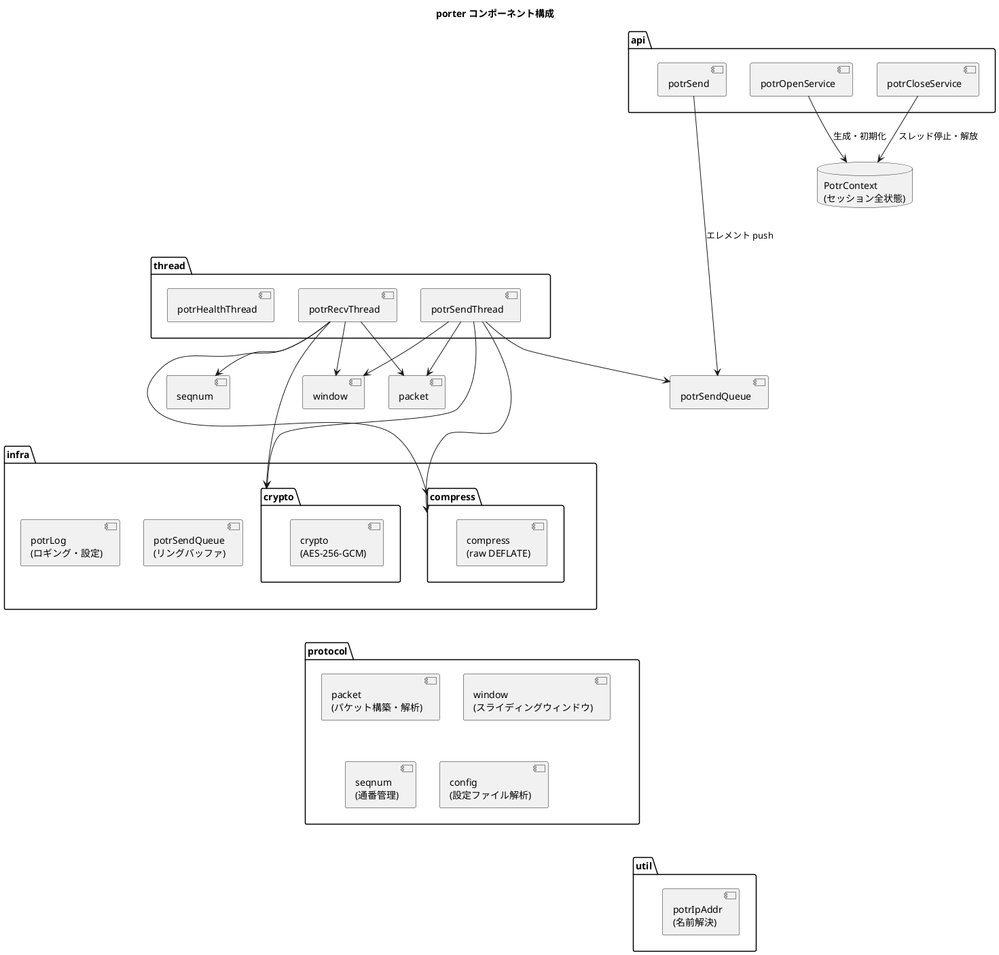

# アーキテクチャ設計

## 概要

porter は、アプリケーションと UDP ソケット層の間に抽象レイヤーを置き、非同期送受信・再送制御・ヘルスチェックを透過的に提供します。
アプリケーションは `potrOpenService()` でサービスを開き、送信側は `potrSend()` を呼び出すだけで、内部スレッドが送受信・再送・ヘルスチェックをすべて担います。

## 役割モデル

porter は通信の参加者を **送信者 (SENDER)** と **受信者 (RECEIVER)** に区別します。

| 役割 | 説明 |
|---|---|
| SENDER | `potrSend()` でデータを送出する。ヘルスチェック PING を送信する。 |
| RECEIVER | 到着したパケットをコールバックで上位層へ渡す。NACK で再送を要求する。 |

1:1 (ユニキャスト) 通信では送信者 1 : 受信者 1 の構成となります。
1:N (マルチキャスト・ブロードキャスト) 通信では送信者 1 : 受信者 N の構成となります。

## スレッド構成

### 送信者のスレッド



| スレッド | 役割 |
|---|---|
| 送信スレッド | 送信キューからエレメントを取り出し、DATA パケットを構築して全パスへ sendto する |
| 受信スレッド | NACK / REJECT / FIN パケットを受信し、再送処理または DISCONNECTED 発火を行う |
| ヘルスチェックスレッド | 最終送信時刻を監視し、一定間隔が経過したら PING パケットを送信する |

### 受信者のスレッド

受信者が起動するスレッドは **受信スレッド 1 本のみ** です。

受信スレッドが担う処理：

- DATA パケットの受信・受信ウィンドウへの格納・フラグメント結合・コールバック呼び出し
- 欠番検出と NACK 送出 (reorder_timeout_ms > 0 の場合は待機後に送出)
- RAW モードのギャップ検出による `POTR_EVENT_DISCONNECTED` 発火 (reorder_timeout_ms > 0 の場合は待機後に発火)
- FIN / REJECT パケット受信による `POTR_EVENT_DISCONNECTED` 発火
- ヘルスチェックタイムアウト監視による `POTR_EVENT_DISCONNECTED` 発火
- リオーダーバッファタイムアウト監視 (reorder_timeout_ms > 0 の場合): 欠番待機中に期限超過したら NACK 送出または DISCONNECTED 発火

## コンポーネント構成



## セッションコンテキスト (PotrContext)

porter の全状態は `PotrContext` 構造体 (`PotrHandle` の実体) に集約されます。
この構造体はアプリケーションには不透明 (opaque) であり、内部実装のみがアクセスします。

| カテゴリ | 保持する情報 |
|---|---|
| 設定 | サービス定義 (通信種別・アドレス・ポート・暗号化鍵) 、グローバル設定 (ウィンドウサイズ・ヘルスチェック間隔) |
| ソケット | 最大 4 パス分の UDP ソケット |
| スレッド | 受信・送信・ヘルスチェックスレッドハンドル |
| ウィンドウ | 送信ウィンドウ・受信ウィンドウ (各パケットのコピーを保持) |
| 送信キュー | ペイロードエレメントのリングバッファ (1024 要素) |
| セッション状態 | 自セッション ID / 相手セッション ID・開始時刻 |
| 接続状態 | `health_alive` (1: 疎通中、0: 未接続または切断) |
| ヘルスチェック | 最終送信時刻・最終受信時刻 (パス別) |
| フラグメントバッファ | フラグメント結合用バッファ (最大 65,535 バイト) |
| 圧縮バッファ | 圧縮・解凍作業バッファ (約 65 KB) |
| 暗号バッファ | 暗号化・復号作業バッファ (max_payload + 16 バイト) |
| NACK 重複抑制 | 直近 NACK のリングバッファ (8 要素) |
| リオーダー状態 | `reorder_pending` フラグ・待機通番・タイムアウト期限 (`reorder_timeout_ms > 0` のときのみ使用) |

## クロスプラットフォーム抽象化

`potrContext.h` でプラットフォーム差異を抽象化し、上位層はプラットフォームを意識しません。

| 機能 | Linux | Windows |
|---|---|---|
| ソケット型 (`PotrSocket`) | `int` | `SOCKET` |
| 無効ソケット値 | `-1` | `INVALID_SOCKET` |
| スレッド型 (`PotrThread`) | `pthread_t` | `HANDLE` |
| ミューテックス型 (`PotrMutex`) | `pthread_mutex_t` | `CRITICAL_SECTION` |
| 条件変数型 (`PotrCondVar`) | `pthread_cond_t` | `CONDITION_VARIABLE` |
| ソケット初期化 | 不要 | `WSAStartup()` |
| ソケットクローズ | `close()` | `closesocket()` |
| 単調時間 (ヘルスチェック用) | `clock_gettime(CLOCK_MONOTONIC, ...)` | `GetTickCount64()` |
| カレンダー時刻 (セッション ID 用) | `clock_gettime(CLOCK_REALTIME, ...)` | `GetSystemTimeAsFileTime()` |
| 呼び出し規約 (`POTRAPI`) | (なし) | `__stdcall` |
| 暗号化 (`crypto` モジュール) | OpenSSL EVP AES-256-GCM | Windows CNG (BCrypt) AES-256-GCM |

## データフロー概要

### 送信フロー

```
アプリ
 | potrSend(data, len, flags)
 ▼
[圧縮] --- flags に POTR_SEND_COMPRESS が指定された場合、メッセージ全体を raw DEFLATE 圧縮
 |
[フラグメント化] --- データが max_payload を超える場合に分割
 |                    各フラグメントにエレメントヘッダー (6 バイト) を付与
 |
[送信キュー push] --- ペイロードエレメントとして積む
 |                    POTR_SEND_BLOCKING なし: キュー満杯時は空き待ち
 |                    POTR_SEND_BLOCKING あり: 事前に drained 待ち → 積む → sendto 完了待ち
 ▼
[送信スレッド] --- キューから pop
 |               複数エレメントを 1 パケットにパッキング
 |               seq_num 付与・送信ウィンドウに登録
 |               encrypt_key が設定されている場合: AES-256-GCM 暗号化
 ▼
[UDP sendto] --- 全パス (最大 4 経路) に並列送信
```

### 受信フロー

```
[UDP recvfrom] --- 各パスのソケットから受信
 |
[検証] --- service_id 照合 → 不一致は破棄
 |         送信元 IP フィルタ → 不一致は破棄
 |         セッション識別 → 旧セッションは破棄、新セッションはウィンドウリセット
 |         POTR_FLAG_ENCRYPTED が立っている場合: AES-256-GCM 復号・認証タグ検証
 |         (認証失敗パケットは即座に破棄)
 |
[種別振り分け]
 +- DATA --→ 受信ウィンドウへ格納
 |            【通常モード】欠番検出 → NACK 送出 → 再送待機
 |                          (reorder_timeout_ms > 0 の場合: 待機タイマー開始 → 期限後に NACK)
 |            【RAW モード】欠番検出 → DISCONNECTED 発火 → ウィンドウリセット
 |                          (reorder_timeout_ms > 0 の場合: 待機タイマー開始 → 期限後に DISCONNECTED)
 |            ↓ 連続した通番が揃ったら順番に取り出し
 |           フラグメント結合・解凍
 |            ↓
 |           コールバック POTR_EVENT_DATA
 |
 +- PING --→ 最終受信時刻を更新 (返信なし)
 |            【通常モード】seq_num を上限に欠番を一括 NACK
 |                          (reorder_timeout_ms > 0 の場合: 各欠番にタイマー確認を適用)
 |            【RAW モード】seq_num > next_seq の場合 DISCONNECTED 発火 → ウィンドウリセット
 |                          (reorder_timeout_ms > 0 の場合: 待機タイマー開始 → 期限後に DISCONNECTED)
 |
 +- FIN  --→ POTR_EVENT_DISCONNECTED 発火
 |
 +- NACK --→ 送信ウィンドウから該当パケットを検索
 |            存在すれば再送 / 存在しなければ REJECT 送出
 |
 +- REJECT -→ POTR_EVENT_DISCONNECTED 発火 (受信者側)
```
