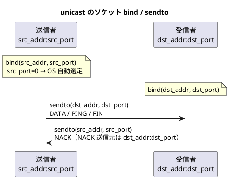
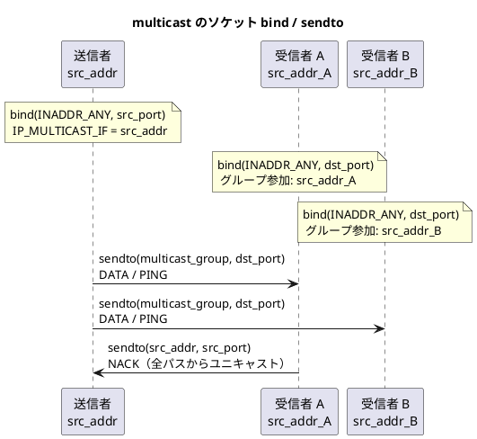

# 設定ファイル仕様

## 概要

porter は INI 形式のテキストファイルでサービスを定義します。
1 つの設定ファイルに複数のサービスを定義でき、最大 64 サービスまで登録できます。

`potrOpenService()` 呼び出し時にファイルを読み込み、指定した `service_id` のエントリを使用します。
以後はファイルを参照しないため、起動後にファイルを変更しても動作に影響はありません。

---

## ファイル形式

```ini
[global]
キー = 値

[service.サービスID]
キー = 値
```

- セクション名は `[global]` と `[service.数値]` の 2 種類です。
- コメントは `#` または `;` で始まる行です。
- 値前後の空白は無視されます。

---

## \[global\] セクション

すべてのサービスに適用されるグローバル設定です。

| キー | 型 | デフォルト | 説明 |
|---|---|---|---|
| `window_size` | uint16 | 16 | スライディングウィンドウサイズ（1〜256） |
| `max_payload` | uint16 | 1,400 | DATA パケットのペイロード上限バイト数（上限 1,400） |
| `health_interval_ms` | uint32 | 0 | PING 送信間隔（ミリ秒）。0 でヘルスチェック送信を無効化 |
| `health_timeout_ms` | uint32 | 0 | タイムアウト閾値（ミリ秒）。0 でタイムアウト検知を無効化 |

### window_size の影響

ウィンドウサイズは再送可能な過去パケット数の上限です。
送信側ウィンドウが満杯になると最古エントリが evict（削除）されます。
evict 済みの通番を受信者が NACK で要求した場合、REJECT を返します。

通信の安定性を高めるには、往復遅延時間と送信レートに応じてウィンドウサイズを調整してください。

### max_payload の影響

ペイロードエレメント 1 個分のデータサイズ上限です。
`potrSend()` で送信するデータがこのサイズを超える場合、複数のフラグメントに分割されます。

### health_interval_ms と health_timeout_ms の関係

| 設定 | 効果 |
|---|---|
| `health_interval_ms = 0` | 送信者が PING を送信しない。受信者はデータパケットが届いたときのみ最終受信時刻を更新する |
| `health_timeout_ms = 0` | 受信者がタイムアウト監視を行わない。DISCONNECTED は FIN / REJECT 受信時のみ発火する |
| 両方 0 | ヘルスチェック機能が完全に無効。CONNECTED / DISCONNECTED は FIN / REJECT のみで発火する |

---

## \[service.N\] セクション

`N` には整数のサービス ID を指定します。

### 全通信種別で共通のフィールド

| キー | 型 | 必須 | 説明 |
|---|---|---|---|
| `type` | 文字列 | 必須 | `unicast` / `multicast` / `broadcast` |
| `dst_port` | uint16 | 必須 | 宛先ポート番号（サービスの識別子） |
| `src_addr` | 文字列 | 必須 | 送信者: 送信元 bind アドレス。受信者: 送信元 IP フィルタ |
| `src_port` | uint16 | 省略可 | 送信者の送信元 bind ポート（0 = OS が自動選定） |

### unicast 専用フィールド

| キー | 型 | 必須 | 説明 |
|---|---|---|---|
| `dst_addr` | 文字列 | 必須 | 送信者: 送信先アドレス。受信者: bind アドレス |

### multicast 専用フィールド

| キー | 型 | 必須 | デフォルト | 説明 |
|---|---|---|---|---|
| `multicast_group` | 文字列 | 必須 | — | マルチキャストグループ IP アドレス（例: `224.0.0.1`） |
| `ttl` | uint8 | 省略可 | 1 | マルチキャスト TTL |
| `pack_wait_ms` | uint32 | 省略可 | 0 | パッキング待機時間（ミリ秒）。0 で即時送信 |

### broadcast 専用フィールド

| キー | 型 | 必須 | 説明 |
|---|---|---|---|
| `broadcast_addr` | 文字列 | 必須 | 送信者: 送信先ブロードキャストアドレス（例: `192.168.1.255`） |

---

## アドレス指定形式

`src_addr`・`dst_addr` には以下のいずれかを指定できます。

- **IPv4 アドレス**（例: `192.168.1.10`）
- **DNS で解決できるホスト名**（例: `receiver.local`）

### DNS 解決のポリシー

| 項目 | 仕様 |
|---|---|
| 解決タイミング | `potrOpenService()` 呼び出し時に 1 回のみ解決する |
| 再解決 | プロセス生存中は再解決しない。DNS 更新後に接続できなくなった場合はプロセスを再起動する |
| 複数アドレス返却時 | 仕様上未定義。実装上は先頭アドレスを採用する |
| IPv6 | 非対応 |

---

## 通信種別ごとのソケット動作

### unicast（1:1 通信）



| | 送信者 | 受信者 |
|---|---|---|
| bind アドレス | `src_addr` | `dst_addr` |
| bind ポート | `src_port`（0 = OS 自動） | `dst_port` |
| 送信先 | `dst_addr:dst_port` | — |
| 送信元フィルタ | — | `src_addr` |

受信者は `dst_addr` でソケットを bind するため、`dst_addr` は当該ホストの NIC に割り当てられているアドレスでなければなりません。

### multicast（1:N 通信）



| | 送信者 | 受信者 |
|---|---|---|
| bind アドレス | `INADDR_ANY` | `INADDR_ANY` |
| bind ポート | `src_port`（0 = OS 自動） | `dst_port` |
| マルチキャスト設定 | `IP_MULTICAST_IF = src_addr` | グループ参加: `src_addr`（NIC 指定） |
| 送信先 | `multicast_group:dst_port` | — |
| 送信元フィルタ | — | `src_addr` |

### broadcast（1:N 通信）

| | 送信者 | 受信者 |
|---|---|---|
| bind アドレス | `src_addr` | `INADDR_ANY` |
| bind ポート | `src_port`（0 = OS 自動） | `dst_port` |
| ソケットオプション | `SO_BROADCAST` 有効 | `SO_BROADCAST` 有効 |
| 送信先 | `broadcast_addr:dst_port` | — |
| 送信元フィルタ | — | `src_addr` |

---

## 送信元フィルタリング

受信スレッドは受信パケットの送信元 IP アドレスを `src_addr` と照合します。
一致しないパケットはアプリケーション層で破棄します（ソケットの bind アドレスは変更しません）。

### 1:1 通信の制約

1:1 通信サービスで `potrSend()` を発行するプロセスは 1 つでなければなりません。
同一 IP アドレス上の複数プロセスが同じサービスの送信者となることは現行仕様では対象外です。

---

## マルチパス設定

最大 4 経路を並列に設定できます。
各経路は独立した UDP ソケットを持ちます。

```ini
[service.1001]
type     = unicast

; 経路 0
src_addr = 192.168.1.20
dst_addr = 192.168.1.10
dst_port = 5001

; 経路 1
src_addr.1 = 10.0.0.20
dst_addr.1 = 10.0.0.10

; 経路 2
src_addr.2 = 172.16.0.20
dst_addr.2 = 172.16.0.10
```

マルチパスを使用すると、DATA・PING・再送パケットがすべての経路へ同時送信されます。

---

## サンプル設定ファイル

```ini
[global]
window_size        = 16
max_payload        = 1400
health_interval_ms = 3000
health_timeout_ms  = 10000

; ---- ユニキャスト ----
[service.1001]
type     = unicast
src_addr = 192.168.1.20
dst_addr = 192.168.1.10
dst_port = 5001

; ホスト名でも指定可能
[service.1002]
type     = unicast
src_addr = sender.local
dst_addr = receiver.local
dst_port = 5002

; ---- マルチキャスト ----
[service.2001]
type            = multicast
src_addr        = 192.168.1.20
dst_port        = 6001
multicast_group = 224.0.0.1
ttl             = 1

; ---- ブロードキャスト ----
[service.3001]
type           = broadcast
src_addr       = 192.168.1.20
dst_port       = 7001
broadcast_addr = 192.168.1.255
```
