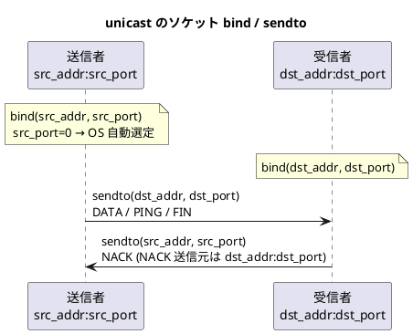
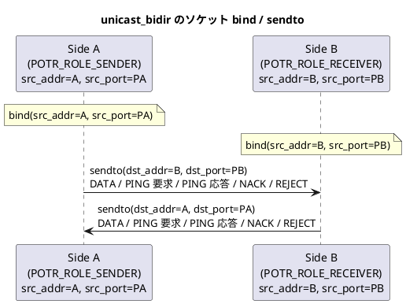

# 設定ファイル仕様

## 概要

porter は INI 形式のテキストファイルでサービスを定義します。
1 つの設定ファイルに定義できるサービス数に上限はありません (初期バッファ容量は 64 で、超過時は自動拡張されます)。

`potrOpenService()` 呼び出し時にファイルを読み込み、指定した `service_id` のエントリを使用します。
以後はファイルを参照しないため、起動後にファイルを変更しても動作に影響はありません。

## ファイル形式

```ini
[global]
キー = 値

[service.サービスID]
キー = 値
```

- セクション名は `[global]` と `[service.数値]` の 2 種類です。
- コメントは `#` または `;` で始まる行です。
- 値前後の空白は無視されます。

## \[global\] セクション

すべてのサービスに適用されるグローバル設定です。

| キー | 型 | デフォルト | 説明 |
|---|---|---|---|
| `window_size` | uint16 | 16 | スライディングウィンドウサイズ (2〜256) |
| `max_payload` | uint16 | 1,400 | DATA パケットのペイロード上限バイト数 (64〜65507) |
| `max_message_size` | uint32 | 65,535 | 1 回の potrSend で送信できる最大メッセージ長 (バイト)。フラグメント化により max_payload を超えるメッセージを送受信できる |
| `send_queue_depth` | uint32 | 1,024 | 非同期送信キューの最大エントリ数。メッセージがフラグメント化される場合、1 メッセージが複数エントリを占有する |
| `health_interval_ms` | uint32 | 0 | PING 送信間隔 (ミリ秒) 。0 でヘルスチェック送信を無効化 |
| `health_timeout_ms` | uint32 | 0 | タイムアウト閾値 (ミリ秒) 。0 でタイムアウト検知を無効化 |
| `reorder_timeout_ms` | uint32 | 0 | 受信ウィンドウで欠番を検出してから NACK 送出 (通常モード) または DISCONNECTED 発行 (RAW モード) を遅延する時間 (ミリ秒)。マルチパスや近距離 WAN での追い越し吸収用。0 で即時 (デフォルト)。推奨値: LAN/マルチパス = 10〜30 ms、遠距離 WAN = 30〜100 ms |

### window_size の影響

ウィンドウサイズは再送可能な過去パケット数の上限です。
送信側ウィンドウが満杯になると最古エントリが evict (削除) されます。
evict 済みの通番を受信者が NACK で要求した場合、REJECT を返します。

通信の安定性を高めるには、往復遅延時間と送信レートに応じてウィンドウサイズを調整してください。

### max_payload の影響

ペイロードエレメント 1 個分のデータサイズ上限です。
`potrSend()` で送信するデータがこのサイズを超える場合、複数のフラグメントに分割されます。

### reorder_timeout_ms の使い所

| 構成 | 推奨値 | 理由 |
|---|---|---|
| 単一パス・同一 LAN | 0 (無効) | 遅延変動が小さく追い越しはほぼ発生しない |
| マルチパス (2 経路以上) | 10〜30 ms | 経路差異で数 ms〜数十 ms の追い越しが起こりうる |
| 遠距離 WAN / 無線 LAN | 30〜100 ms | 遅延変動が大きく再順序付けが頻繁に発生する環境 |

- 設定値を大きくするほど、追い越しを吸収できるが NACK の遅延 (= 再送遅延) も増加する。
- RAW モードでは DISCONNECTED の遅延にも直結するため、リアルタイム性の要件と合わせて調整すること。
- タイムアウト経過後も欠落パケットが届いた場合は NACK なしで正常にウィンドウへ取り込まれる (次の `process_outer_pkt` 呼び出しで自動検出)。

### マルチキャスト/ブロードキャスト通常モードでの NACK 分散

`multicast` / `broadcast` の通常モードかつ `reorder_timeout_ms > 0` の場合、複数の受信者が同一欠番を同時に NACK すると送信者への負荷が集中する (NACK implosion)。

これを回避するため、タイマー起動時に **100%〜200%** の範囲でランダムなジッタを自動付加します。

| 通信種別 | 実効タイムアウト |
|---|---|
| `unicast` (通常モード) | `reorder_timeout_ms` (固定) |
| `multicast` / `broadcast` (通常モード) | `reorder_timeout_ms` 〜 `reorder_timeout_ms × 2` (ランダム分散) |
| `*_raw` (RAW モード全種別) | `reorder_timeout_ms` (固定、DISCONNECTED 発行用) |

- ジッタは monotonic クロックのナノ秒部を乱数源とするため、外部 RNG への依存はありません。
- `reorder_timeout_ms = 20` に設定すると実際のタイマーは **20〜40 ms** の範囲に分散されます。
- NACK が遅延する分だけ再送が遅れる可能性があるため、`reorder_timeout_ms` の設定値には余裕を持たせてください。

### health_interval_ms と health_timeout_ms の関係

| 設定 | 効果 |
|---|---|
| `health_interval_ms = 0` | 送信者が PING を送信しない。受信者はデータパケットが届いたときのみ最終受信時刻を更新する |
| `health_timeout_ms = 0` | 受信者がタイムアウト監視を行わない。DISCONNECTED は FIN / REJECT 受信時のみ発火する |
| 両方 0 | ヘルスチェック機能が完全に無効。CONNECTED / DISCONNECTED は FIN / REJECT のみで発火する |

## \[service.N\] セクション

`N` には整数のサービス ID を指定します。

### 全通信種別で共通のフィールド

| キー | 型 | 必須 | 説明 |
|---|---|---|---|
| `type` | 文字列 | 必須 | `unicast` / `multicast` / `broadcast` / `unicast_raw` / `multicast_raw` / `broadcast_raw` / `unicast_bidir` / `tcp` / `tcp_bidir` |
| `dst_port` | uint16 | 必須 | 宛先ポート番号 (サービスの識別子) |
| `src_addr` | 文字列 | 必須 | 送信者: 送信元 bind アドレス。受信者: 送信元 IP フィルタ |
| `src_port` | uint16 | 省略可 | 送信者の送信元 bind ポート (0 = OS が自動選定) |
| `pack_wait_ms` | uint32 | 省略可 | パッキング待機時間 (ミリ秒)。0 で即時送信 |
| `encrypt_key` | 文字列 | 省略可 | AES-256-GCM 事前共有鍵。以下の2形式を受け付ける:<br>**① hex 鍵**: 256 ビット (32 バイト) を 64 文字の 16 進数文字列で指定<br>**② パスフレーズ**: 上記以外の任意の文字列を指定すると SHA-256 で 32 バイト鍵に変換する。省略時は暗号化なし |

### unicast 専用フィールド

| キー | 型 | 必須 | 説明 |
|---|---|---|---|
| `dst_addr` | 文字列 | 必須 | 送信者: 送信先アドレス。受信者: bind アドレス |

### multicast 専用フィールド

| キー | 型 | 必須 | デフォルト | 説明 |
|---|---|---|---|---|
| `multicast_group` | 文字列 | 必須 | — | マルチキャストグループ IP アドレス (例: `224.0.0.1`) |
| `ttl` | uint8 | 省略可 | 1 | マルチキャスト TTL |

### unicast_raw / multicast_raw / broadcast_raw (RAW モード)

RAW モードは通常モード (`unicast` / `multicast` / `broadcast`) と同一のアドレス・ポートフィールドを使用します。
追加の専用フィールドはありません。

**通常モードとの差異**:

| 項目 | 通常モード | RAW モード |
|---|---|---|
| 再送制御 | NACK ベース再送あり | 再送なし |
| ギャップ検出時 | NACK を返送して欠落パケットを待機 | 即 `POTR_EVENT_DISCONNECTED` を発行し、次の正規パケットで `POTR_EVENT_CONNECTED` |
| `potrSend` の動作 | `flags` 引数に従う (ノンブロッキング / ブロッキング) | 常にブロッキング送信 (`POTR_SEND_BLOCKING` 相当) |
| 通番 (`seq_num`) | 再送制御・ウィンドウ管理に使用 | AES ノンス生成用のみ (再送制御には使用しない) |
| ヘルスチェック | `health_interval_ms` / `health_timeout_ms` に従う | 同左 (制限なし) |

RAW モードでもスライディングウィンドウによる **順序整列** と **セッション管理** は有効です。

### unicast_bidir 専用フィールド

| キー | 型 | 必須 | 説明 |
|---|---|---|---|
| `src_addr` | 文字列 | 必須 | 自側の bind アドレス。`0.0.0.0` で全 IF 受付 |
| `src_port` | uint16 | 省略可 | 自側の bind ポート番号。**0 または省略**: SENDER はエフェメラルポートで bind し、RECEIVER は最初のパケット受信時に SENDER のポートを動的学習して返信する |
| `dst_addr` | 文字列 | 必須 | 相手端のアドレス |
| `dst_port` | uint16 | 必須 | 相手端のポート番号 |

`dst_port` は必須です。`src_port` は省略・0 指定でエフェメラル動作になります（SENDER 側でのポート固定が不要な場合に使用）。

### broadcast 専用フィールド

| キー | 型 | 必須 | 説明 |
|---|---|---|---|
| `broadcast_addr` | 文字列 | 必須 | 送信者: 送信先ブロードキャストアドレス (例: `192.168.1.255`) |

### encrypt_key の詳細

`encrypt_key` を設定すると AES-256-GCM によるペイロード暗号化が有効になります。

| 項目 | 説明 |
|---|---|
| **形式① hex 鍵** | 256 ビット鍵を 16 進数文字列 (64 文字、英数字) で記述する |
| **形式② パスフレーズ** | 64 文字 hex 以外の任意の文字列。SHA-256 ハッシュで 32 バイト鍵を自動導出する |
| 暗号化範囲 | 外側パケットの **ペイロード部分のみ** を暗号化する。ヘッダー 32 バイトは平文 |
| AAD | ヘッダー 32 バイトを追加認証データ (AAD) として使用するため、ヘッダー改ざんも検知する |
| 認証タグ | 16 バイトの GCM 認証タグをペイロード末尾に付与する |
| ペイロード削減 | 認証タグ 16 バイト分、実効ペイロードが `max_payload - 16` バイトに減少する |
| 双方一致 | 送信者・受信者ともに同一の `encrypt_key` を設定すること |
| マルチキャスト | 受信者全員が同一の `encrypt_key` を持っていれば動作する |


`src_addr`・`dst_addr` には以下のいずれかを指定できます。

- **IPv4 アドレス** (例: `192.168.1.10`)
- **DNS で解決できるホスト名** (例: `receiver.local`)

### DNS 解決のポリシー

| 項目 | 仕様 |
|---|---|
| 解決タイミング | `potrOpenService()` 呼び出し時に 1 回のみ解決する |
| 再解決 | プロセス生存中は再解決しない。DNS 更新後に接続できなくなった場合はプロセスを再起動する |
| 複数アドレス返却時 | 仕様上未定義。実装上は先頭アドレスを採用する |
| IPv6 | 非対応 |

## 通信種別ごとのソケット動作

### unicast (1:1 通信)



| | 送信者 | 受信者 |
|---|---|---|
| bind アドレス | `src_addr` | `dst_addr` |
| bind ポート | `src_port` (0 = OS 自動) | `dst_port` |
| 送信先 | `dst_addr:dst_port` | — |
| 送信元フィルタ | — | `src_addr` |

受信者は `dst_addr` でソケットを bind するため、`dst_addr` は当該ホストの NIC に割り当てられているアドレスでなければなりません。

### unicast_bidir (1:1 双方向)



| | Side A (SENDER) | Side B (RECEIVER) |
|---|---|---|
| bind アドレス | `src_addr` | `src_addr` |
| bind ポート | `src_port`（必須） | `src_port`（必須） |
| 送信先アドレス | `dst_addr` | `dst_addr` |
| 送信先ポート | `dst_port` | `dst_port` |

### multicast (1:N 通信)


| | 送信者 | 受信者 |
|---|---|---|
| bind アドレス | `INADDR_ANY` | `INADDR_ANY` |
| bind ポート | `src_port` (0 = OS 自動) | `dst_port` |
| マルチキャスト設定 | `IP_MULTICAST_IF = src_addr` | グループ参加: `src_addr` (NIC 指定) |
| 送信先 | `multicast_group:dst_port` | — |
| 送信元フィルタ | — | `src_addr` |

### broadcast (1:N 通信)

| | 送信者 | 受信者 |
|---|---|---|
| bind アドレス | `src_addr` | `INADDR_ANY` |
| bind ポート | `src_port` (0 = OS 自動) | `dst_port` |
| ソケットオプション | `SO_BROADCAST` 有効 | `SO_BROADCAST` 有効 |
| 送信先 | `broadcast_addr:dst_port` | — |
| 送信元フィルタ | — | `src_addr` |

## 送信元フィルタリング

受信スレッドは受信パケットの送信元 IP アドレスを `src_addr` と照合します。
一致しないパケットはアプリケーション層で破棄します (ソケットの bind アドレスは変更しません) 。

### 1:1 通信の制約

1:1 通信サービスで `potrSend()` を発行するプロセスは 1 つでなければなりません。
同一 IP アドレス上の複数プロセスが同じサービスの送信者となることは現行仕様では対象外です。

## マルチパス設定

最大 4 経路を並列に設定できます。
各経路は独立した UDP ソケットを持ちます。

```ini
[service.1001]
type     = unicast

; 経路 0
src_addr = 192.168.1.20
dst_addr = 192.168.1.10
dst_port = 5001

; 経路 1
src_addr.1 = 10.0.0.20
dst_addr.1 = 10.0.0.10

; 経路 2
src_addr.2 = 172.16.0.20
dst_addr.2 = 172.16.0.10
```

マルチパスを使用すると、DATA・PING・再送パケットがすべての経路へ同時送信されます。

## サンプル設定ファイル

```ini
[global]
window_size        = 16
max_payload        = 1400
# max_message_size   = 65535
# send_queue_depth   = 1024
health_interval_ms = 3000
health_timeout_ms  = 10000
# reorder_timeout_ms = 0    ; 0=即時 (デフォルト)。マルチパスは 20 程度が目安

; ---- ユニキャスト ----
[service.1001]
type     = unicast
src_addr = 192.168.1.20
dst_addr = 192.168.1.10
dst_port = 5001

; ホスト名でも指定可能
[service.1002]
type     = unicast
src_addr = sender.local
dst_addr = receiver.local
dst_port = 5002

; ---- マルチキャスト ----
[service.2001]
type            = multicast
src_addr        = 192.168.1.20
dst_port        = 6001
multicast_group = 224.0.0.1
ttl             = 1

; ---- ブロードキャスト ----
[service.3001]
type           = broadcast
src_addr       = 192.168.1.20
dst_port       = 7001
broadcast_addr = 192.168.1.255

; ---- RAW モード (ベストエフォート) ----
[service.1021]
type      = unicast_raw
src_addr  = 127.0.0.1
dst_addr  = 127.0.0.1
dst_port  = 5021

[service.2021]
type            = multicast_raw
src_addr        = 127.0.0.1
dst_port        = 6021
multicast_group = 239.0.0.21
ttl             = 1

; ---- AES-256-GCM 暗号化 (encrypt_key に 64 文字の16進数文字列を指定) ----
[service.1010]
type        = unicast
src_addr    = 192.168.1.20
dst_addr    = 192.168.1.10
dst_port    = 5010
encrypt_key = 0a1b2c3d4e5f6a7b8c9d0e1f2a3b4c5d6e7f0a1b2c3d4e5f6a7b8c9d0e1f2a3b

; ---- UDP unicast 双方向 ----

; ループバック（Side A: SENDER ロール）
[service.4020]
type      = unicast_bidir
src_addr  = 127.0.0.1
src_port  = 9020
dst_addr  = 127.0.0.1
dst_port  = 9021

; ループバック（Side B: RECEIVER ロール、同一プロセス内で動作させる場合）
[service.4021]
type      = unicast_bidir
src_addr  = 127.0.0.1
src_port  = 9021
dst_addr  = 127.0.0.1
dst_port  = 9020

; 異なるホスト間（Side A）
[service.4030]
type      = unicast_bidir
src_addr  = 192.168.1.10
src_port  = 9030
dst_addr  = 192.168.1.20
dst_port  = 9030

; AES-256-GCM 暗号化
[service.4031]
type        = unicast_bidir
src_addr    = 192.168.1.10
src_port    = 9031
dst_addr    = 192.168.1.20
dst_port    = 9031
encrypt_key = mysecretphrase
```
