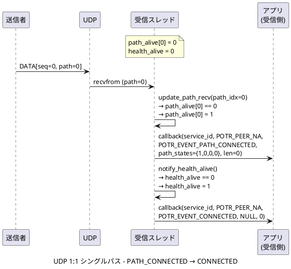
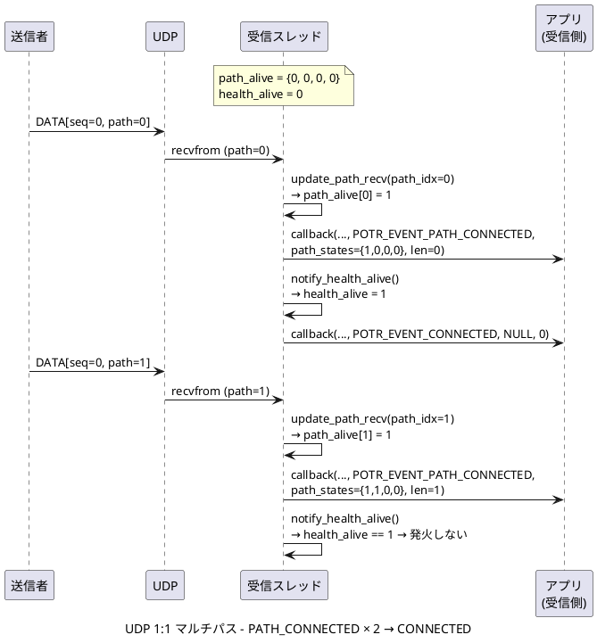
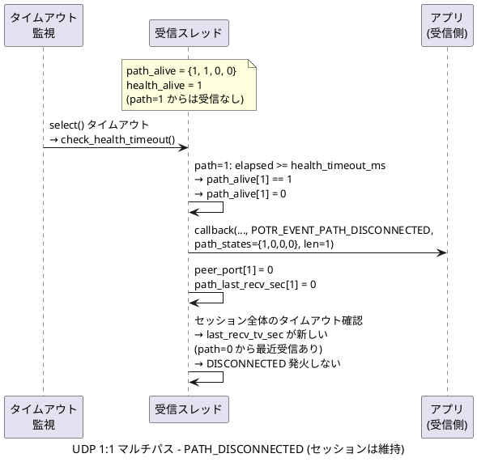
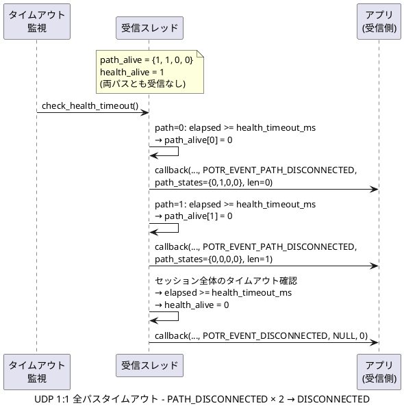
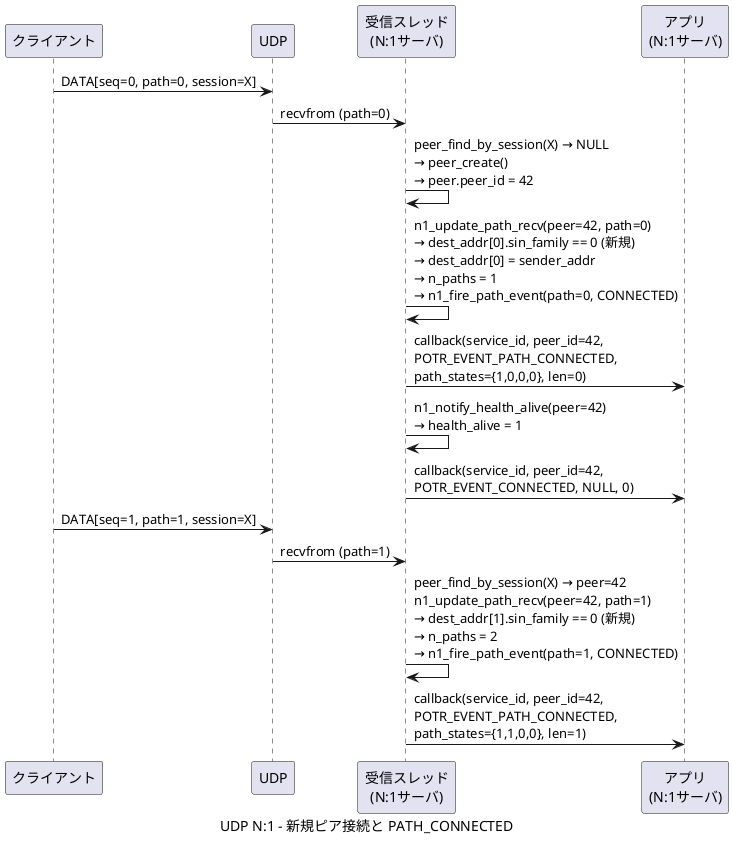
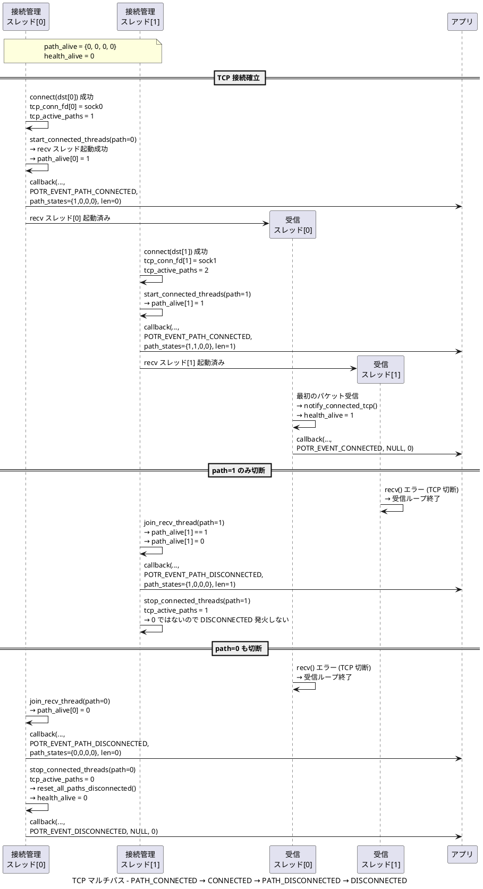
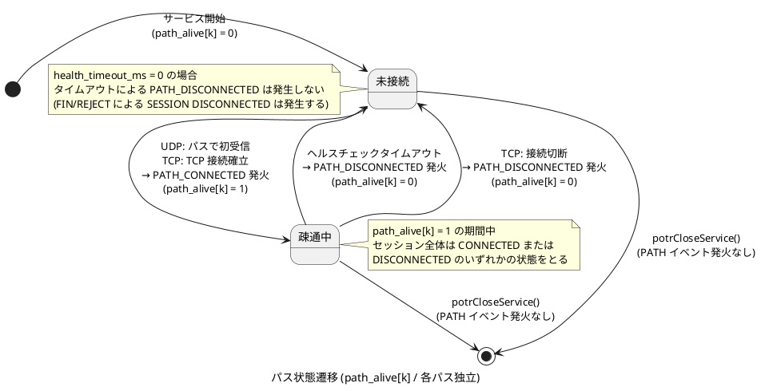

# パスイベント通知 設計ドキュメント

本ドキュメントは、porter にパス単位のイベント通知機能 (`POTR_EVENT_PATH_CONNECTED` / `POTR_EVENT_PATH_DISCONNECTED`) を追加するための設計仕様を記述します。

## 背景と目的

### 現状

porter は現在、セッション全体の接続・切断を以下の 2 つのイベントでアプリケーションへ通知します。

| イベント | 発火条件 |
|---|---|
| `POTR_EVENT_CONNECTED` | セッション全体で初めてパケットが届いた時 (TCP: 初パケット受信時) |
| `POTR_EVENT_DISCONNECTED` | セッション全体が断した時 (全パスタイムアウト / FIN 受信 / REJECT 受信) |

これらはセッション全体の状態変化のみを表し、個々のパスの状態は通知されません。

### 課題

マルチパス構成 (最大 4 パス) では、複数の物理経路を同時に使用します。このとき以下の状況を現行の API では検知できません。

- 4 パス中 1 パスが物理障害で切断された（セッション全体はまだ生きている）
- 切断していたパスが復旧し、再びデータを受信し始めた
- TCP マルチパスで、2 つある接続のうち片方だけが接続を確立した

### 追加する機能

セッション内の個々のパスが疎通状態に変化した際に、アプリケーションへイベントを通知します。これにより、アプリケーションはどのパスが現在有効かをリアルタイムで把握できます。

## 設計概要

### 新しいイベント種別

既存の `PotrEvent` 列挙型に以下の 2 つの値を追加します。

```c
typedef enum
{
    POTR_EVENT_DATA              = 0, /* 変更なし */
    POTR_EVENT_CONNECTED         = 1, /* 変更なし */
    POTR_EVENT_DISCONNECTED      = 2, /* 変更なし */
    POTR_EVENT_PATH_CONNECTED    = 3, /* 新規: セッション内の特定パスで疎通開始 */
    POTR_EVENT_PATH_DISCONNECTED = 4, /* 新規: セッション内の特定パスで疎通断 */
} PotrEvent;
```

FIXME: POTR_EVENT_PATH_CONNECTED, POTR_EVENT_PATH_DISCONNECTED ではなく、POTR_EVENT_PATH_STATUS 1 つにする。

### コールバックシグネチャ

`PotrRecvCallback` のシグネチャは変更しません。既存のアプリケーションコードは変更不要です。

```c
typedef void (*PotrRecvCallback)(int service_id, PotrPeerId peer_id,
                                 PotrEvent event,
                                 const void *data, size_t len);
```

PATH イベント時の引数解釈は以下のとおりです。

| 引数 | PATH イベント時の意味 |
|---|---|
| `service_id` | サービス ID（変更なし） |
| `peer_id` | N:1 モードでは対象ピアの ID。1:1 モードでは `POTR_PEER_NA` |
| `event` | `POTR_EVENT_PATH_CONNECTED` または `POTR_EVENT_PATH_DISCONNECTED` |
| `data` | `const int *` としてキャストして使用。`int path_states[POTR_MAX_PATH]` を指す。コールバック復帰後は無効（スタック変数） |
| `len` | 変化したパスのインデックス (0 〜 POTR_MAX_PATH-1) |

FIXME: `len` は、`sizeof(data)` が自然。

## コールバック呼び出し規約

### `path_states` 配列の読み方

`data` が指す配列には、コールバック呼び出し時点での全パスの疎通状態が格納されます。

```c
void on_recv(int service_id, PotrPeerId peer_id,
             PotrEvent event, const void *data, size_t len)
{
    if (event == POTR_EVENT_PATH_CONNECTED ||
        event == POTR_EVENT_PATH_DISCONNECTED)
    {
        int path_idx = (int)len;                    /* 変化したパス番号 */
        const int *path_states = (const int *)data; /* 全パスの状態スナップショット */
        int k;

        printf("PATH_%s path=%d\n",
               (event == POTR_EVENT_PATH_CONNECTED) ? "CONNECTED" : "DISCONNECTED",
               path_idx);

        /* 全パス状態の確認 */
        for (k = 0; k < POTR_MAX_PATH; k++)
        {
            if (path_states[k])
                printf("  path[%d]: alive\n", k);
        }
        /* data はこの関数を抜けると無効になるためコピーして保存すること */
    }
}
```

`path_states[k]` の値の意味:

| 値 | 意味 |
|---|---|
| `1` | パス `k` は疎通中 |
| `0` | パス `k` は未接続 または 疎通断 |

### 注意事項

- `data` はコールバック復帰後に無効になります（スタック変数のポインタ）。保存が必要な場合は配列ごとコピーしてください。
- `event == POTR_EVENT_PATH_CONNECTED` の時点では、`path_states[(int)len]` は既に `1` に更新されています。
- `event == POTR_EVENT_PATH_DISCONNECTED` の時点では、`path_states[(int)len]` は既に `0` に更新されています（N:1 UDP は `peer_path_clear()` 呼び出し前の状態を渡します）。
- コールバック内でブロッキング処理を行わないでください（既存の注意事項と同様）。

## 内部設計変更

### `PotrContext_` への `path_alive` フィールド追加

`potrContext.h` の `PotrContext_` 構造体に以下のフィールドを追加します。

```c
volatile int path_alive[POTR_MAX_PATH]; /**< パスごとの疎通状態 (1:alive, 0:dead)。
                                          *   PATH_CONNECTED/PATH_DISCONNECTED イベントの
                                          *   二重発火防止に使用する。
                                          *   1:1 UDP および TCP で使用。 */
```

配置位置: `health_alive` フィールドの直後が適切です。

```c
volatile int health_alive;                  /* 既存フィールド */
volatile int path_alive[POTR_MAX_PATH];     /* 追加 */
```

**初期化**: `potrOpenService()` 内で `memset(ctx, 0, sizeof(*ctx))` が実行されるため、明示的な初期化は不要です。

### N:1 モードのパス状態表現

N:1 モード (`POTR_TYPE_UNICAST_BIDIR_N1`) では、`PotrPeerContext` 内の既存フィールドをそのままパス状態の判定に使用します。

```c
/* パス k が疎通中かどうかの判定 */
int path_alive_k = (peer->dest_addr[k].sin_family == AF_INET) ? 1 : 0;
```

`PotrPeerContext` には新しいフィールドを追加しません。

### 二重発火防止のロジック

#### 1:1 UDP / TCP

`path_alive[path_idx]` フラグで制御します。

```
PATH_CONNECTED 発火条件:
  path_alive[path_idx] == 0 のとき のみ発火し、path_alive[path_idx] = 1 にする

PATH_DISCONNECTED 発火条件:
  path_alive[path_idx] == 1 のとき のみ発火し、path_alive[path_idx] = 0 にする
```

#### N:1 UDP

`n1_update_path_recv()` の新規パス学習 (else ブランチ) で PATH_CONNECTED を発火します。
このブランチは `dest_addr[path_idx].sin_family` が `AF_UNSPEC (0)` のときのみ実行されるため、二重発火は発生しません。

`n1_check_health_timeout()` の `peer_path_clear()` 呼び出し前で PATH_DISCONNECTED を発火します。
`peer_path_clear()` が `dest_addr[path_idx]` をゼロクリアするため、その後は再び PATH_CONNECTED が発火できる状態に戻ります。

## 通信種別ごとのイベント発火ポイント

### UDP 1:1 系 (UNICAST / MULTICAST / BROADCAST / UNICAST_BIDIR / RAW 系)

#### PATH_CONNECTED

発火場所: `potrRecvThread.c` の `update_path_recv()` 関数末尾

```c
/* 初受信 または PATH_DISCONNECTED 後の復帰時 */
if (!ctx->path_alive[path_idx])
{
    ctx->path_alive[path_idx] = 1;
    fire_path_event(ctx, path_idx, POTR_EVENT_PATH_CONNECTED);
    /* この後、呼び出し元が notify_health_alive() を呼ぶ (発火順序保証) */
}
```

`update_path_recv()` の呼び出し元は、その直後に `notify_health_alive()` を呼んでセッション全体の CONNECTED を判定します。PATH_CONNECTED → CONNECTED の順序が自然に保証されます。

#### PATH_DISCONNECTED

発火場所: `potrRecvThread.c` の `check_health_timeout()` 関数内、パス単位タイムアウト判定ブロック

```c
if (elapsed_ms >= (int64_t)ctx->global.health_timeout_ms)
{
    /* PATH_DISCONNECTED を先に発火する */
    if (ctx->path_alive[i])
    {
        ctx->path_alive[i] = 0;
        fire_path_event(ctx, i, POTR_EVENT_PATH_DISCONNECTED);
    }
    ctx->peer_port[i]          = 0;
    ctx->path_last_recv_sec[i] = 0;
    /* unicast_bidir 動的学習アドレスのリセット ... (既存処理) */
}
```

このループが終わった後、同関数内でセッション全体のタイムアウト判定が行われます。全パスが消滅していれば DISCONNECTED が発火します。PATH_DISCONNECTED → DISCONNECTED の順序が保証されます。

FIXME: FIN メッセージを受信した後の DISCONNCTED の前には、当該セッションのパスの状態変化として全パスが 0 になるか確認する。

### UDP N:1 (UNICAST_BIDIR_N1)

#### PATH_CONNECTED

発火場所: `potrRecvThread.c` の `n1_update_path_recv()` 関数内、新規パス学習の else ブランチ末尾

```c
else
{
    /* 新規パス: インデックス path_idx のスロットに直接記録 */
    peer->dest_addr[path_idx]           = *sender_addr;
    peer->path_last_recv_sec[path_idx]  = s;
    peer->path_last_recv_nsec[path_idx] = ns;
    peer->n_paths++;
    POTR_LOG(...);
    /* PATH_CONNECTED を発火する */
    n1_fire_path_event(ctx, peer, path_idx, POTR_EVENT_PATH_CONNECTED);
    /* この後、呼び出し元が n1_notify_health_alive() を呼ぶ */
}
```

`n1_fire_path_event()` の内部では `peer->dest_addr[k].sin_family` でパス状態を取得するため、既に `AF_INET` に設定済みの状態 (= このパスが alive) で path_states が構築されます。

#### PATH_DISCONNECTED

発火場所: `potrRecvThread.c` の `n1_check_health_timeout()` 関数内、`peer_path_clear()` 呼び出しの直前

```c
if (path_elapsed >= (int64_t)ctx->global.health_timeout_ms)
{
    /* peer_path_clear() 前に発火する（まだ dest_addr が有効な状態で path_states を構築する）*/
    n1_fire_path_event(ctx, &ctx->peers[i], k, POTR_EVENT_PATH_DISCONNECTED);
    peer_path_clear(ctx, &ctx->peers[i], k);
}
```

`peer_path_clear()` が `dest_addr[k]` をゼロクリアします。直前に呼ぶことで、PATH_DISCONNECTED の `path_states` にはこのパスがまだ alive として反映されます（呼び出し元視点での「最後の疎通状態」）。

> **注意**: PATH_DISCONNECTED 直後の `path_states[k]` の値については、1:1 モードと N:1 モードで扱いが異なります。
>
> | モード | PATH_DISCONNECTED 発火時の `path_states[k]` |
> |---|---|
> | 1:1 UDP / TCP | `0`（発火前に `path_alive[k] = 0` を設定するため） |
> | N:1 UDP | `1`（`peer_path_clear()` 前のため `dest_addr[k].sin_family == AF_INET` のまま） |
>
> N:1 モードの仕様については、将来の改訂で 1:1 モードに合わせることを検討できます。

FIXME: N:1 UDP でも、PATH_DISCONNECTED 発火時の `path_states[k]` は 0 としたい。

### TCP (TCP / TCP_BIDIR)

TCP では、パスの状態変化は TCP 接続の確立・切断に対応します。

FIXME: PING メッセージが有効な場合は、PING メッセージの着信を以て接続にすべきでは。

#### PATH_CONNECTED

発火場所: `potrConnectThread.c` の `start_connected_threads()` 関数末尾、全スレッド起動成功後

```c
/* recv スレッドと health スレッドの起動に成功した後 */
ctx->path_alive[path_idx] = 1;
tcp_fire_path_event(ctx, path_idx, POTR_EVENT_PATH_CONNECTED);
return POTR_SUCCESS;
/* CONNECTED イベントは recv スレッドが最初のパケットを受信した時点で別途発火する */
```

スレッド起動が失敗した場合 (`POTR_ERROR` を返す場合) は `path_alive` をセットしないため、PATH_DISCONNECTED は発火しません。

`start_connected_threads()` は `sender_connect_loop()` と `receiver_accept_loop()` の両方から呼ばれます。

#### PATH_DISCONNECTED

発火場所: `potrConnectThread.c` の `sender_connect_loop()` と `receiver_accept_loop()` 内、`join_recv_thread()` 直後・`stop_connected_threads()` 直前

```c
/* recv スレッドが接続断を検知して自然終了するまで待機する */
join_recv_thread(ctx, path_idx);

/* PATH_DISCONNECTED を発火する */
if (ctx->path_alive[path_idx])
{
    ctx->path_alive[path_idx] = 0;
    tcp_fire_path_event(ctx, path_idx, POTR_EVENT_PATH_DISCONNECTED);
    /* tcp_active_paths が 0 になれば直後に reset_all_paths_disconnected が DISCONNECTED を発火 */
}

stop_connected_threads(ctx, path_idx);
```

`stop_connected_threads()` の後で `tcp_active_paths` をデクリメントし、0 になれば `reset_all_paths_disconnected()` が DISCONNECTED を発火します。PATH_DISCONNECTED → DISCONNECTED の順序が保証されます。

## ヘルパー関数仕様

各発火箇所で重複するボイラープレートを静的ヘルパー関数としてまとめます。

### `fire_path_event()` — 1:1 UDP 用

`potrRecvThread.c` に追加します。

```c
/**
 * @brief  パスイベントを発火する (1:1 UDP 用)。
 *         path_alive[path_idx] を更新した後に呼ぶこと。
 *         スタック変数 path_states を data として渡すため、コールバック内でのみ有効。
 */
static void fire_path_event(struct PotrContext_ *ctx,
                             int                 path_idx,
                             PotrEvent           event)
{
    int path_states[POTR_MAX_PATH];
    int k;
    for (k = 0; k < (int)POTR_MAX_PATH; k++)
        path_states[k] = ctx->path_alive[k];
    POTR_LOG(POTR_LOG_INFO,
             "recv[service_id=%d]: %s path=%d",
             ctx->service.service_id,
             (event == POTR_EVENT_PATH_CONNECTED) ? "PATH_CONNECTED" : "PATH_DISCONNECTED",
             path_idx);
    if (ctx->callback != NULL)
        ctx->callback(ctx->service.service_id, POTR_PEER_NA,
                      event, path_states, (size_t)path_idx);
}
```

### `n1_fire_path_event()` — N:1 UDP 用

`potrRecvThread.c` に追加します。

```c
/**
 * @brief  パスイベントを発火する (N:1 UDP 用)。
 *         PATH_CONNECTED: dest_addr 設定後・peer_path_clear 前に呼ぶこと。
 *         PATH_DISCONNECTED: peer_path_clear の直前に呼ぶこと。
 */
static void n1_fire_path_event(struct PotrContext_ *ctx,
                                PotrPeerContext     *peer,
                                int                  path_idx,
                                PotrEvent            event)
{
    int path_states[POTR_MAX_PATH];
    int k;
    for (k = 0; k < (int)POTR_MAX_PATH; k++)
        path_states[k] = (peer->dest_addr[k].sin_family == AF_INET) ? 1 : 0;
    POTR_LOG(POTR_LOG_INFO,
             "recv[service_id=%d]: peer=%u %s path=%d",
             ctx->service.service_id, (unsigned)peer->peer_id,
             (event == POTR_EVENT_PATH_CONNECTED) ? "PATH_CONNECTED" : "PATH_DISCONNECTED",
             path_idx);
    if (ctx->callback != NULL)
        ctx->callback(ctx->service.service_id, peer->peer_id,
                      event, path_states, (size_t)path_idx);
}
```

### `tcp_fire_path_event()` — TCP 用

`potrConnectThread.c` に追加します。

```c
/**
 * @brief  パスイベントを発火する (TCP 用)。
 *         PATH_CONNECTED: path_alive[path_idx] = 1 設定後に呼ぶこと。
 *         PATH_DISCONNECTED: path_alive[path_idx] = 0 設定後に呼ぶこと。
 */
static void tcp_fire_path_event(struct PotrContext_ *ctx,
                                 int                 path_idx,
                                 PotrEvent           event)
{
    int path_states[POTR_MAX_PATH];
    int k;
    for (k = 0; k < (int)POTR_MAX_PATH; k++)
        path_states[k] = ctx->path_alive[k];
    POTR_LOG(POTR_LOG_INFO,
             "connect_thread[service_id=%d]: %s path=%d",
             ctx->service.service_id,
             (event == POTR_EVENT_PATH_CONNECTED) ? "PATH_CONNECTED" : "PATH_DISCONNECTED",
             path_idx);
    if (ctx->callback != NULL)
        ctx->callback(ctx->service.service_id, POTR_PEER_NA,
                      event, path_states, (size_t)path_idx);
}
```

## イベント発火順序の保証

すべてのシナリオで「PATH イベントを先に発火し、その直後にセッション全体の変化があれば CONNECTED / DISCONNECTED を発火する」順序が保証されます。

FIXME: サービスオープン時は、すべてのPATHが0で、DISCONNECTED状態から始まること。(初期値が0である前提で、呼び出しプロセスはイベントを追跡する)

| シナリオ | 発火順序 |
|---|---|
| UDP 1:1 シングルパス初受信 (セッション開始) | `PATH_CONNECTED(0)` → `CONNECTED` |
| UDP 1:1 追加パス初受信 (セッション既接続) | `PATH_CONNECTED(k)` のみ |
| UDP 1:1 一部パスのみタイムアウト | `PATH_DISCONNECTED(k)` のみ |
| UDP 1:1 全パスタイムアウト | `PATH_DISCONNECTED(0)` ... `PATH_DISCONNECTED(n)` → `DISCONNECTED` |
| UDP 1:1 タイムアウト後の復帰 (セッション既 CONNECTED) | `PATH_CONNECTED(k)` のみ |
| UDP 1:1 タイムアウト後の復帰 (セッション再接続) | `PATH_CONNECTED(k)` → `CONNECTED` |
| UDP N:1 新規ピア・新規パス | `PATH_CONNECTED(k)` → `CONNECTED` |
| UDP N:1 既存ピアへの新規パス | `PATH_CONNECTED(k)` のみ |
| UDP N:1 パスタイムアウト (他パスあり) | `PATH_DISCONNECTED(k)` のみ |
| UDP N:1 全パスタイムアウト → ピア削除 | `PATH_DISCONNECTED(k)` ... → `DISCONNECTED` |
| TCP 初パス接続確立 | `PATH_CONNECTED(0)` → `CONNECTED` (初パケット受信時) |
| TCP 追加パス接続確立 | `PATH_CONNECTED(k)` のみ |
| TCP 一部パス切断 | `PATH_DISCONNECTED(k)` のみ |
| TCP 全パス切断 | `PATH_DISCONNECTED(0)` ... `PATH_DISCONNECTED(n)` → `DISCONNECTED` |
| `potrCloseService()` 呼び出し | 発火なし (既存の設計方針を踏襲) |

> **TCP における PATH_CONNECTED と CONNECTED の間隔**
>
> TCP では PATH_CONNECTED (TCP 接続確立) と CONNECTED (初パケット受信) は別スレッドから発火します。
> - PATH_CONNECTED: 接続管理スレッドが `start_connected_threads()` の末尾で発火
> - CONNECTED: recv スレッドが最初のパケットを受信したときに発火
>
> 典型的な発火順序は PATH_CONNECTED → (短い時間差) → CONNECTED ですが、スレッドスケジューリングにより逆転する可能性があります。アプリケーションは CONNECTED を受け取るまでデータ送信が可能になったとみなさないでください。

## シーケンス図

### UDP 1:1 シングルパス (セッション開始)



### UDP 1:1 マルチパス (2 パス)



### UDP 1:1 マルチパス (1 パスのみタイムアウト)



### UDP 1:1 全パスタイムアウト



### UDP N:1 (新規ピア接続 + 2 パス学習)



### TCP マルチパス (接続確立 → 切断)



### パス状態遷移図



## 変更対象ファイル一覧

実装時に変更が必要なファイルを以下に示します。

| ファイル | 変更種別 | 変更内容 |
|---|---|---|
| `prod/porter/include/porter_type.h` | 変更 | `PotrEvent` に `POTR_EVENT_PATH_CONNECTED = 3`、`POTR_EVENT_PATH_DISCONNECTED = 4` を追加。`PotrEvent` および `PotrRecvCallback` の Doxygen コメントを更新（len/data の意味、発火順序保証、TCP スレッドからの呼び出し注記） |
| `prod/porter/libsrc/porter/potrContext.h` | 変更 | `PotrContext_` 構造体に `volatile int path_alive[POTR_MAX_PATH]` を `health_alive` の直後に追加 |
| `prod/porter/libsrc/porter/thread/potrRecvThread.c` | 変更 | `fire_path_event()` と `n1_fire_path_event()` を静的関数として追加。`update_path_recv()` 末尾に PATH_CONNECTED 発火処理を追加。`check_health_timeout()` のパス単位タイムアウト判定に PATH_DISCONNECTED 発火処理を追加。`n1_update_path_recv()` の新規パス学習ブランチ末尾に PATH_CONNECTED 発火処理を追加。`n1_check_health_timeout()` の `peer_path_clear()` 直前に PATH_DISCONNECTED 発火処理を追加 |
| `prod/porter/libsrc/porter/thread/potrConnectThread.c` | 変更 | `tcp_fire_path_event()` を静的関数として追加。`start_connected_threads()` の `return POTR_SUCCESS` 直前に PATH_CONNECTED 発火処理を追加。`sender_connect_loop()` と `receiver_accept_loop()` の `join_recv_thread()` 直後・`stop_connected_threads()` 直前に PATH_DISCONNECTED 発火処理を追加 |

## 既存ドキュメントの更新が必要な箇所

実装後に以下のドキュメントを更新してください。

| ファイル | 更新内容 |
|---|---|
| `docs/api.md` | 新イベント種別 `POTR_EVENT_PATH_CONNECTED`・`POTR_EVENT_PATH_DISCONNECTED` の説明と呼び出し規約 (`len`/`data`) を追記 |
| `docs/architecture.md` | イベント管理セクション (`CONNECTED`/`DISCONNECTED` の説明箇所) に PATH イベントの発火条件を追記。`PotrContext_` の説明に `path_alive[]` フィールドを追加 |
| `docs/sequence.md` | 各シナリオのシーケンス図に PATH_CONNECTED / PATH_DISCONNECTED の発火タイミングを追加。「補足: 接続状態の遷移」の状態遷移図にパス単位の遷移を追加 |

## 補足: 既存イベントとの対比

| 観点 | `POTR_EVENT_CONNECTED` / `DISCONNECTED` | `POTR_EVENT_PATH_CONNECTED` / `PATH_DISCONNECTED` |
|---|---|---|
| 粒度 | セッション全体 | 個別パス (0〜3) |
| `len` | 常に `0` | パスインデックス (0〜POTR_MAX_PATH-1) |
| `data` | 常に `NULL` | `const int *path_states` (POTR_MAX_PATH 要素) |
| TCP 発火スレッド | recv スレッド / 接続管理スレッド | 接続管理スレッド (PATH_CONNECTED/DISCONNECTED) |
| N:1 `peer_id` | ピア ID | ピア ID (同じ) |
| シングルパス時 | 従来どおり発火 | PATH_* が CONNECTED/DISCONNECTED と同時に発火 |
| `potrCloseService()` | 発火しない | 発火しない |
| ヘルスチェック無効時 | FIN/REJECT のみ | パスタイムアウトは発生しない (FIN/REJECT は従来どおり) |
