# シーケンス図集

本ドキュメントは porter の主要な動作シナリオをシーケンス図で示します。

---

## 目次

1. [サービス開放（送信者）](#1-サービス開放送信者)
2. [サービス開放（受信者）](#2-サービス開放受信者)
3. [正常送受信（ノンブロッキング）](#3-正常送受信ノンブロッキング)
4. [正常送受信（ブロッキング）](#4-正常送受信ブロッキング)
5. [フラグメント化と結合](#5-フラグメント化と結合)
6. [NACK による再送](#6-nack-による再送)
7. [REJECT による切断と復帰](#7-reject-による切断と復帰)
8. [ヘルスチェック（正常疎通）](#8-ヘルスチェック正常疎通)
9. [ヘルスチェックタイムアウト](#9-ヘルスチェックタイムアウト)
10. [正常終了（potrClose）](#10-正常終了potrclose)

---

## 1. サービス開放（送信者）

`potrOpenService()` を SENDER として呼び出したときの内部処理です。

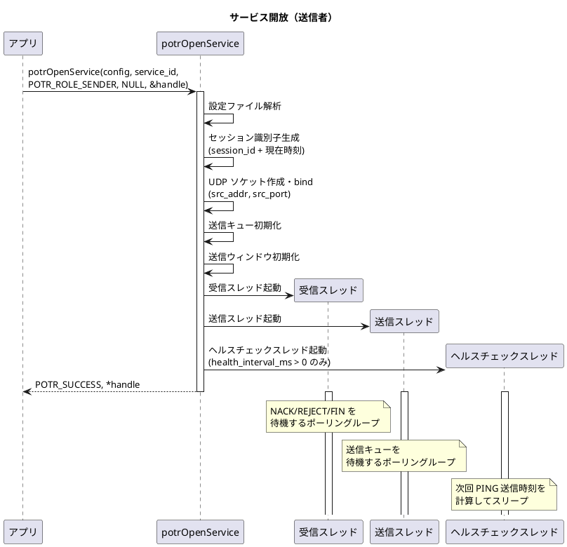

---

## 2. サービス開放（受信者）

`potrOpenService()` を RECEIVER として呼び出したときの内部処理です。

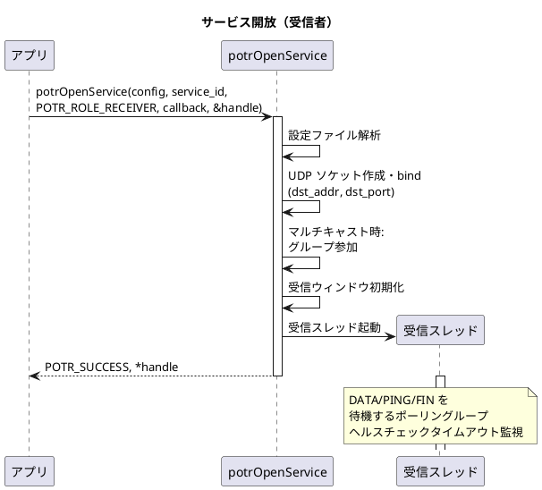

---

## 3. 正常送受信（ノンブロッキング）

`blocking = 0` で `potrSend()` を呼び出したときのデータフローです。

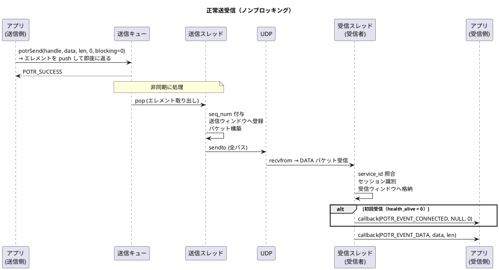

---

## 4. 正常送受信（ブロッキング）

`blocking != 0` で `potrSend()` を呼び出したときのデータフローです。
送信完了まで `potrSend()` が返りません。

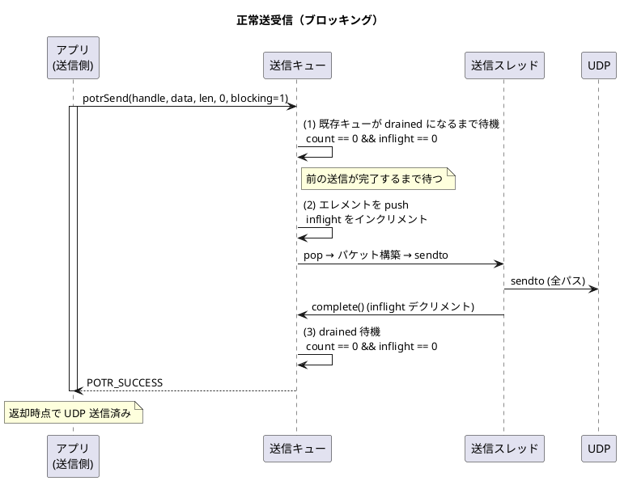

---

## 5. フラグメント化と結合

送信データが `max_payload` を超える場合の分割・結合処理です。

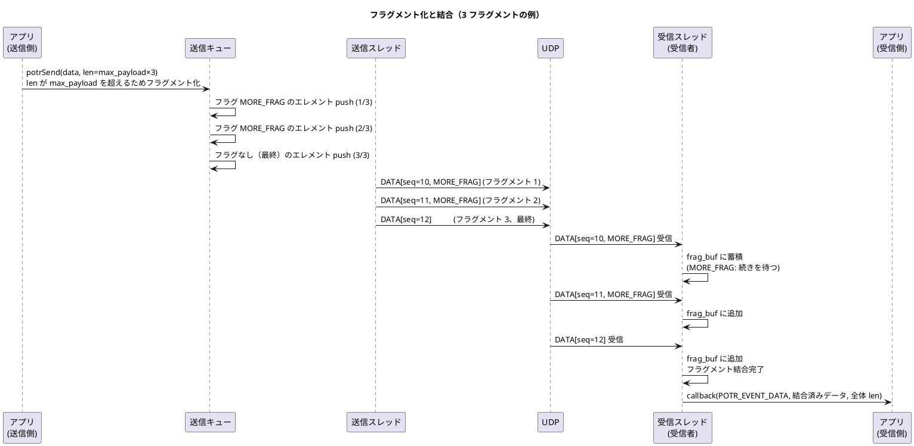

---

## 6. NACK による再送

パケットロスが発生した場合の再送シーケンスです。

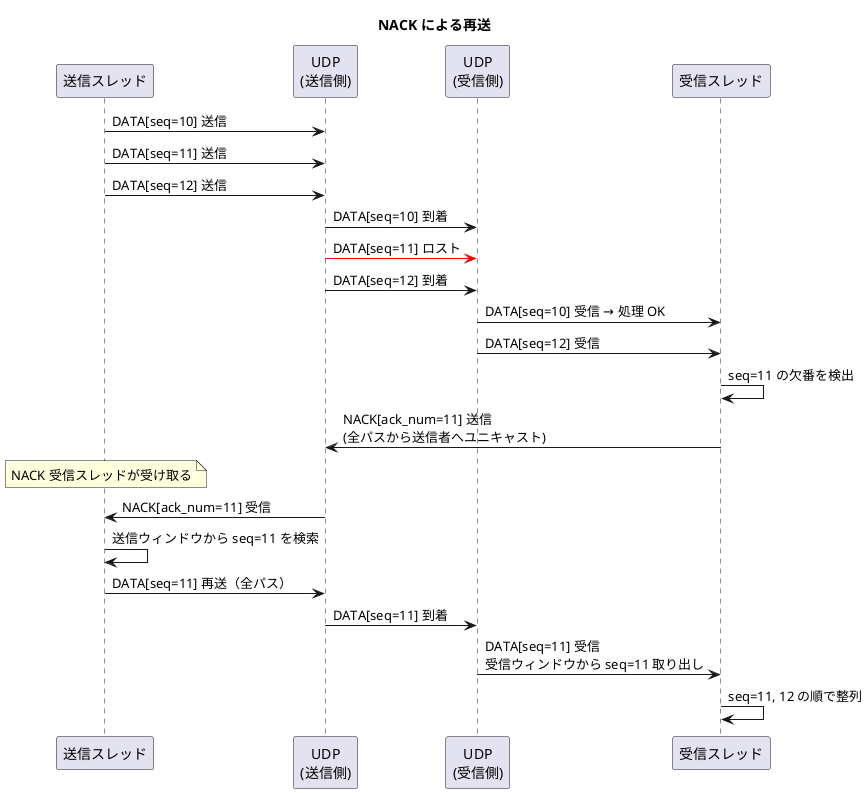

---

## 7. REJECT による切断と復帰

送信ウィンドウから evict 済みのパケットを要求した場合のシーケンスです。

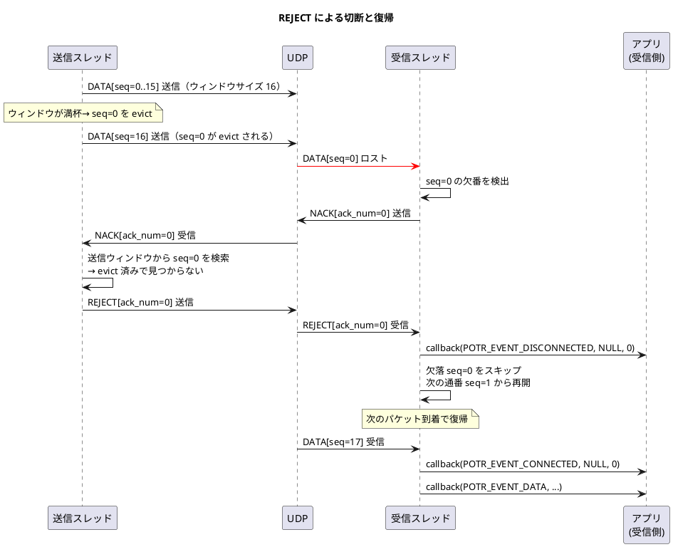

---

## 8. ヘルスチェック（正常疎通）

ヘルスチェックが有効な場合の定周期 PING 送信です。

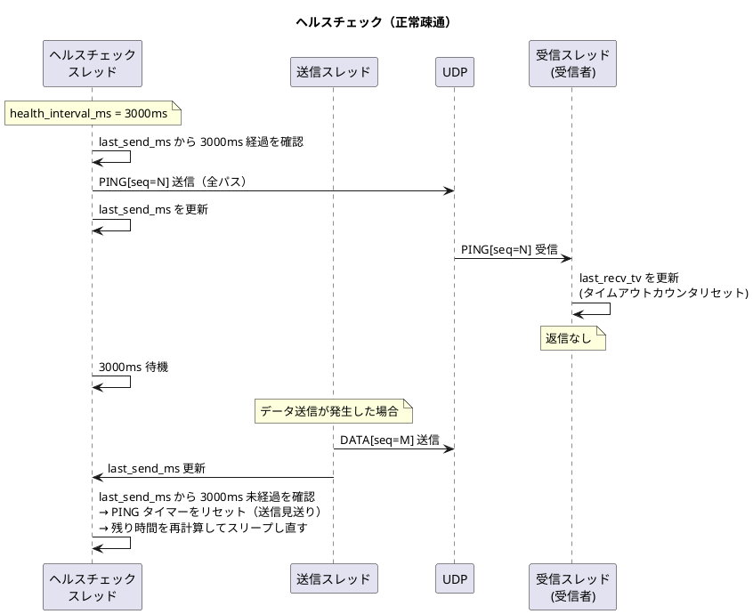

---

## 9. ヘルスチェックタイムアウト

PING が届かなくなった場合の切断検知と復帰です。

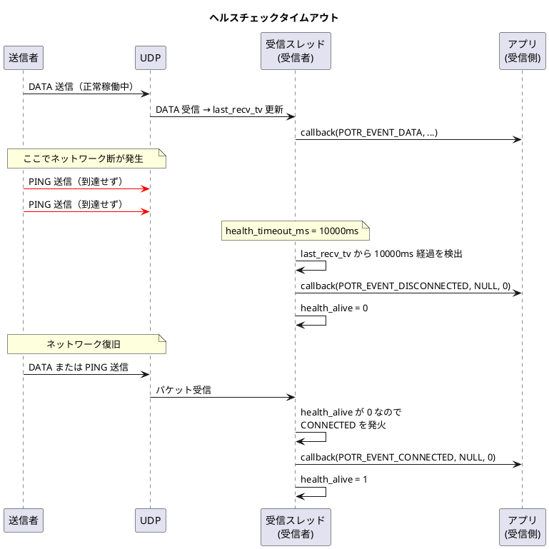

---

## 10. 正常終了（potrClose）

`potrClose()` による正常終了シーケンスです。

### 送信者側の終了

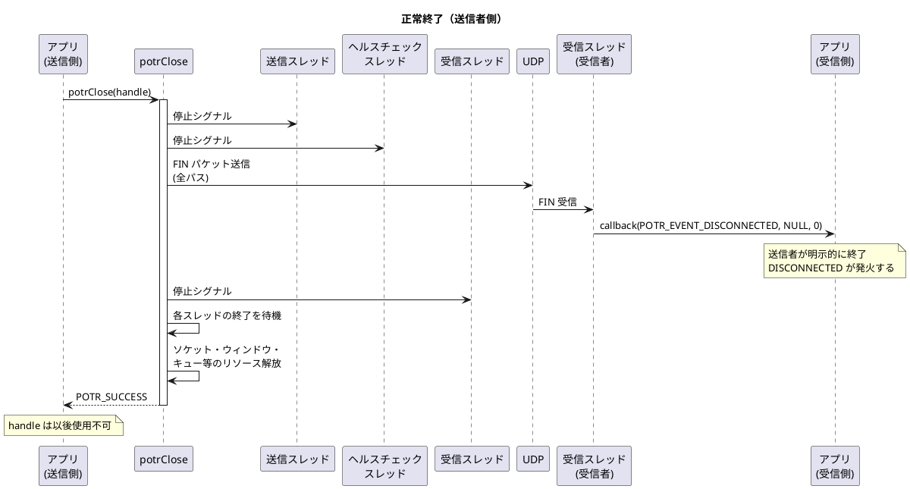

### 受信者側の終了

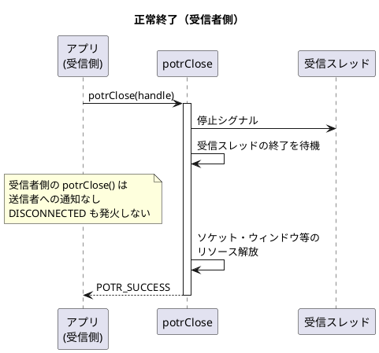

---

## 補足：接続状態の遷移

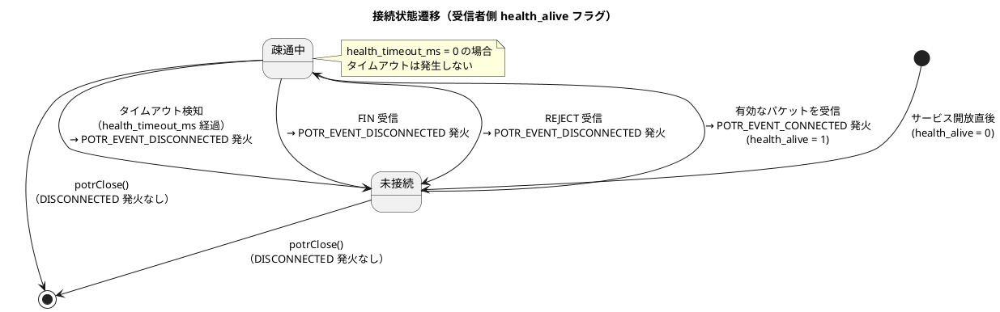
