# シーケンス

本ドキュメントは porter の主要な動作シナリオをシーケンス図で示します。

## サービス開始 (送信者)

`potrOpenService()` を SENDER として呼び出したときの内部処理です。

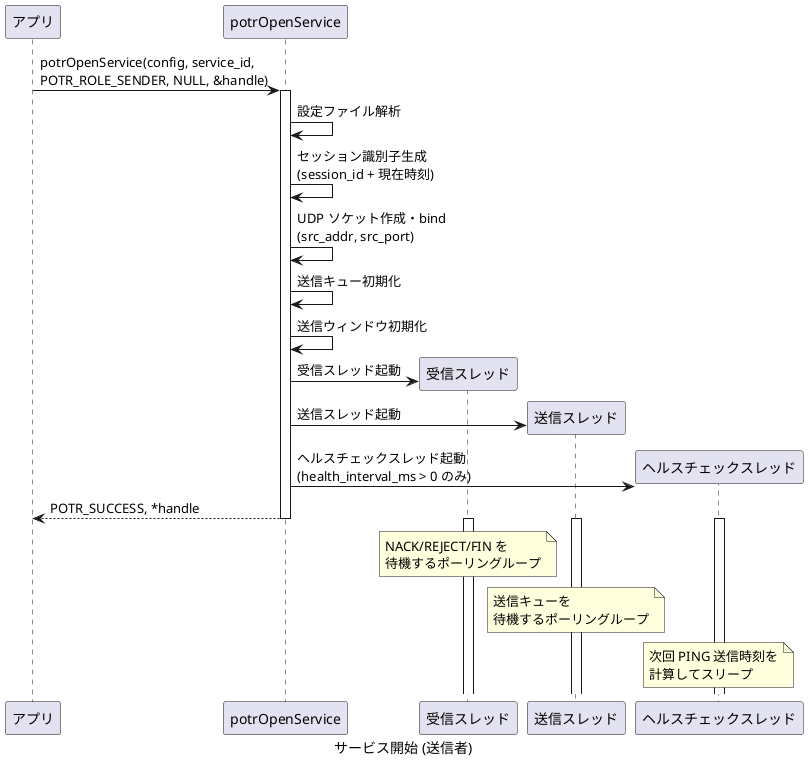

## サービス開始 (受信者)

`potrOpenService()` を RECEIVER として呼び出したときの内部処理です。

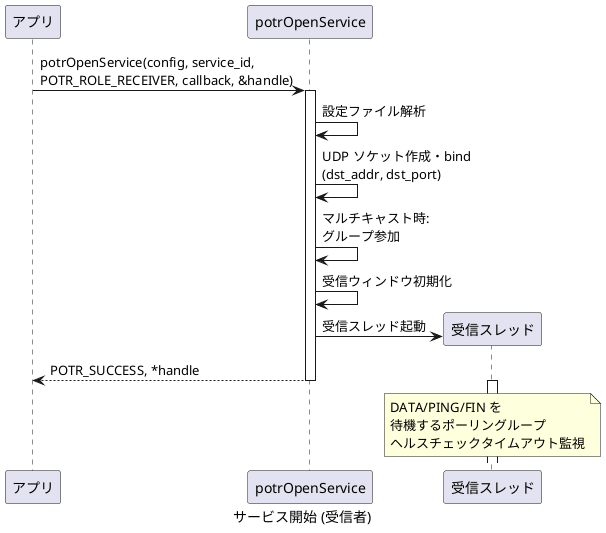

## 正常送受信 (ノンブロッキング)

`POTR_SEND_BLOCKING` を指定せずに `potrSend()` を呼び出したときのデータフローです。

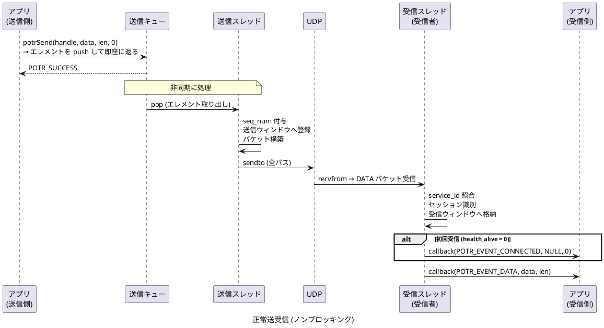

## 正常送受信 (ブロッキング)

`POTR_SEND_BLOCKING` を指定して `potrSend()` を呼び出したときのデータフローです。
送信完了まで `potrSend()` が返りません。

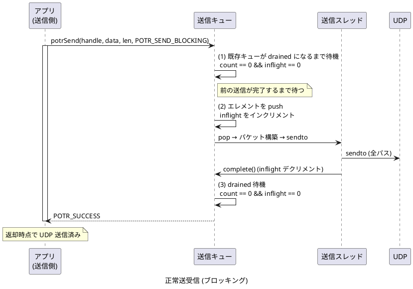

## フラグメント化と結合

送信データが `max_payload` を超える場合の分割・結合処理です。

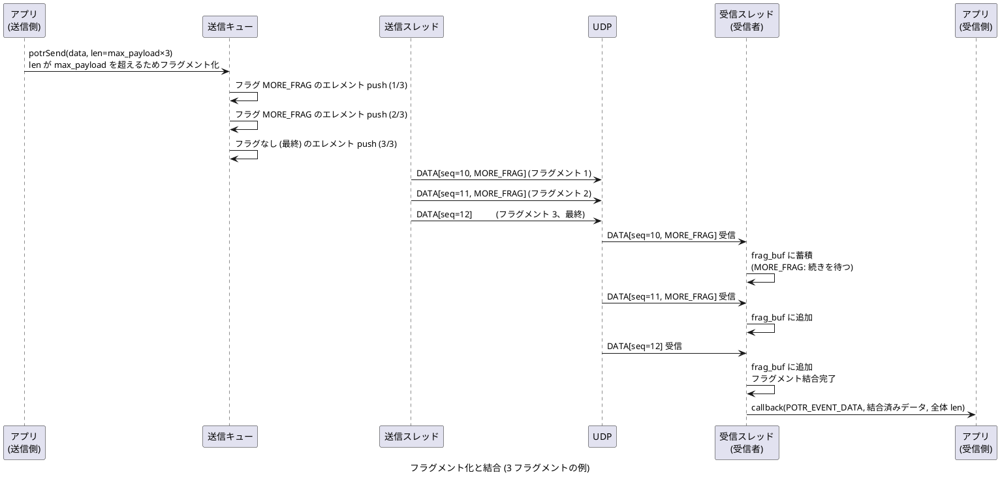

## NACK による再送

パケットロスが発生した場合の再送シーケンスです。

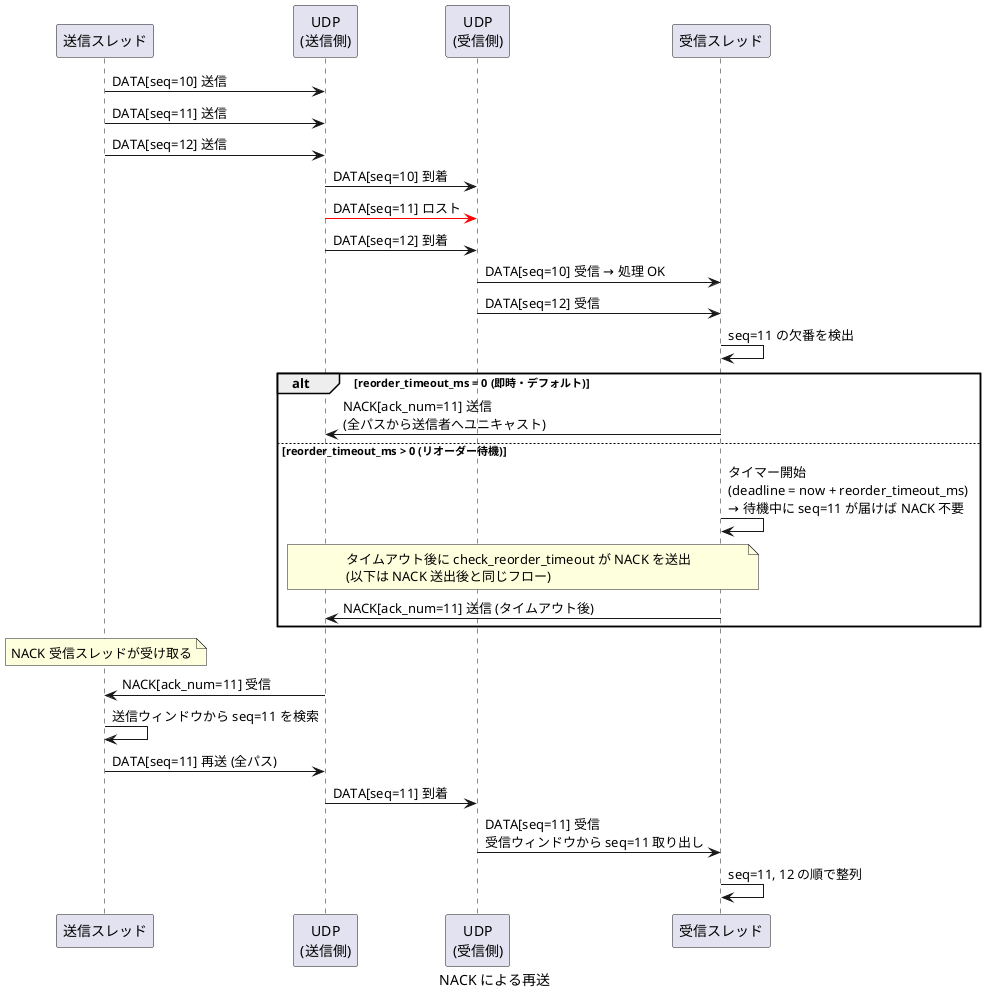

## リオーダーバッファ (reorder_timeout_ms > 0)

`reorder_timeout_ms` を 0 より大きな値に設定すると、欠番検出後にただちに NACK や DISCONNECTED を発行せず、指定時間だけ待機します。待機中に欠落パケットが届いた場合は NACK/DISCONNECTED を発行せずに正常配信します。

### 通常モード: 待機中に届いた場合 (NACK なし)

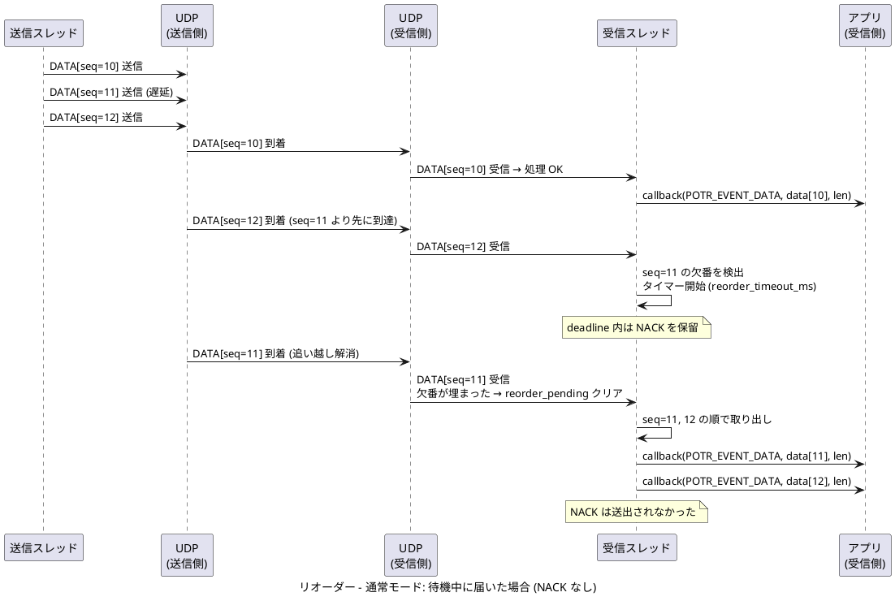

### RAW モード: 待機中に届いた場合 (DISCONNECTED なし)

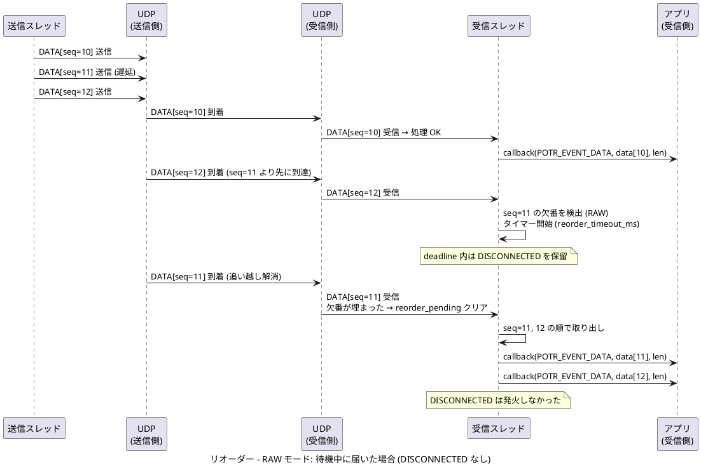

## REJECT による切断と復帰

送信ウィンドウから evict 済みのパケットを要求した場合のシーケンスです。

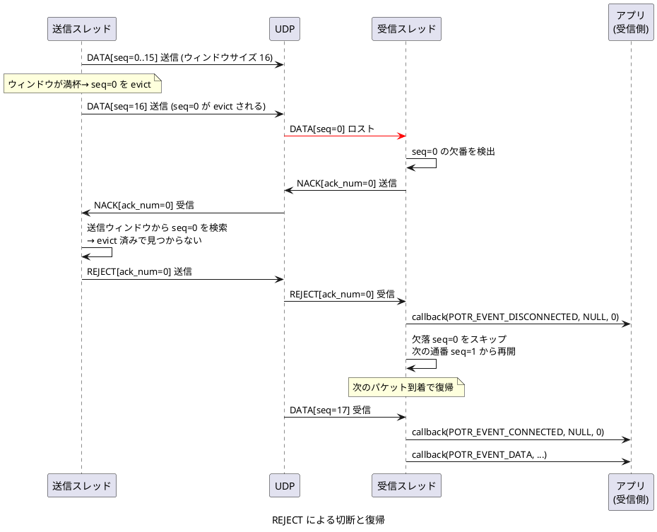

## ヘルスチェック (正常疎通)

ヘルスチェックが有効な場合の定周期 PING 送信です。

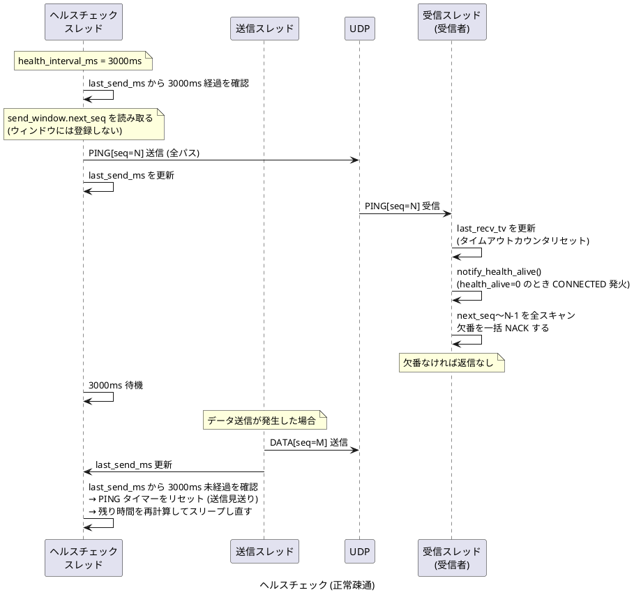

## ヘルスチェックタイムアウト

PING が届かなくなった場合の切断検知と復帰です。

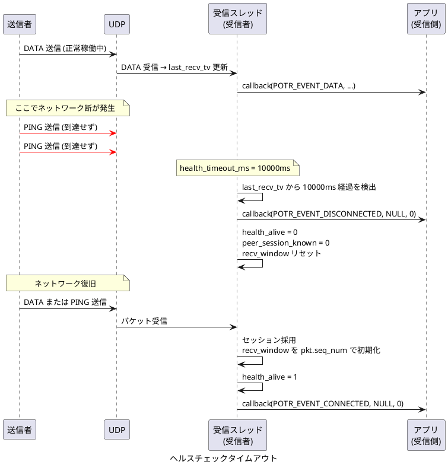

## サービス終了 (potrCloseService)

`potrCloseService()` による正常終了シーケンスです。

### 送信者側の終了

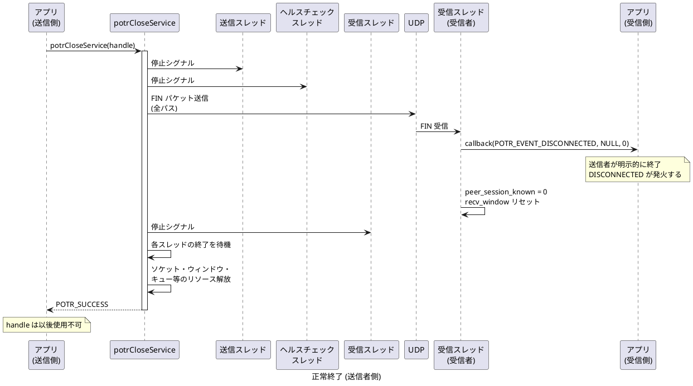

### 受信者側の終了

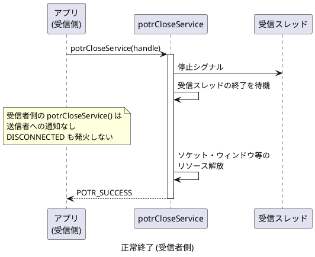

## RAW モード: ギャップ検出による切断と復帰 (DATA)

DATA パケットの追い越し (欠落) を検出した場合のシーケンスです。

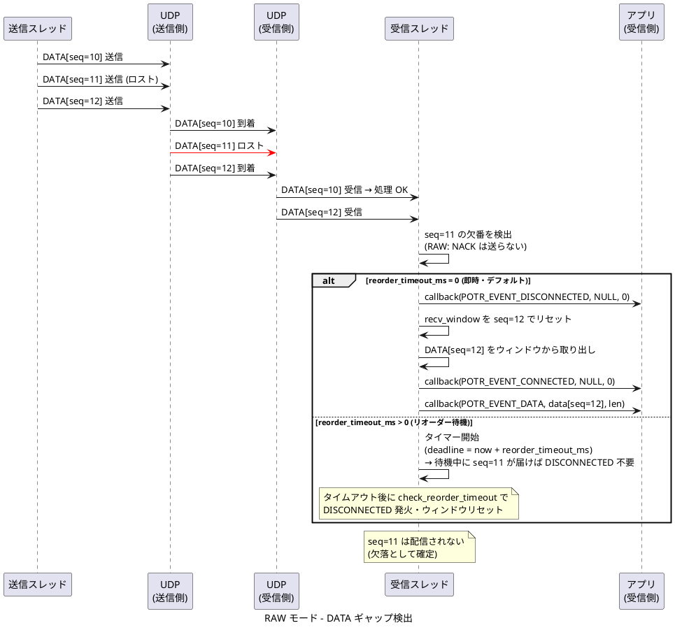

## RAW モード: ギャップ検出による切断と復帰 (PING)

PING の `seq_num` から欠落パケットを検出した場合のシーケンスです。

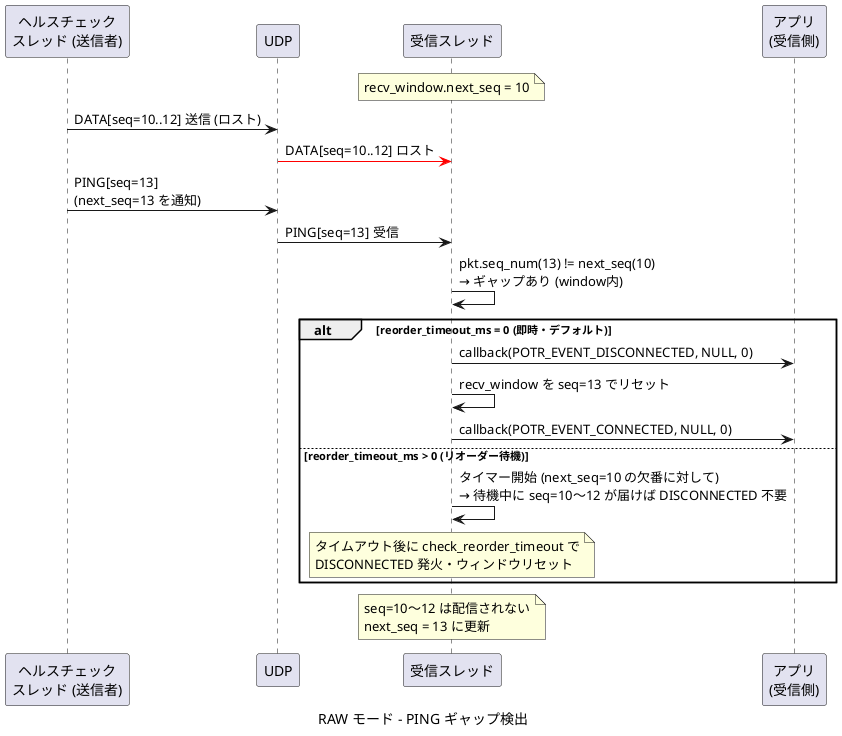

## 補足：接続状態の遷移

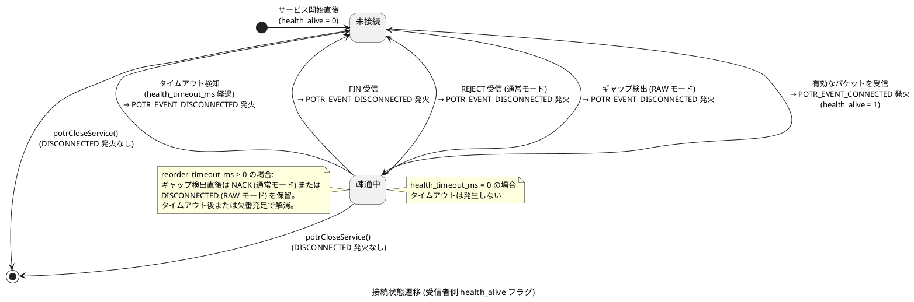

## unicast_bidir 双方向通信

`POTR_TYPE_UNICAST_BIDIR` における双方向データ通信のシーケンスです。
両端が独立したセッションを持ち、それぞれがデータ送受信・NACK・ヘルスチェックを行います。

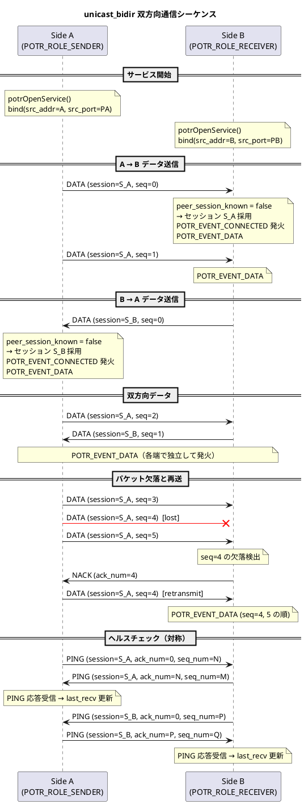

## unicast_bidir ヘルスタイムアウトによる切断検知

`POTR_TYPE_UNICAST_BIDIR` において、相手側が停止した場合の切断検知シーケンスです。
両端がそれぞれ `last_recv_tv_sec` を監視し、`health_timeout_ms` 超過で切断を検知します。

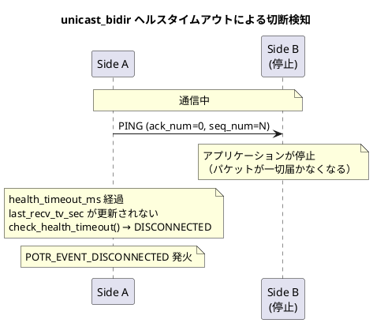
