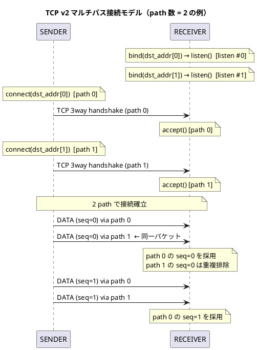

# TCP v2 設計: アプリ層マルチパス（実装計画）

> **ステータス**: 設計・実現性調査済み。v1（`POTR_TYPE_TCP` / `POTR_TYPE_TCP_BIDIR` 単一接続）完了・評価後に着手する。

---

## 概要

v1 は 1 つの TCP 接続（単一 path）のみを使用します。
v2 では UDP マルチパスと同じ思想で、**複数の TCP 接続（path）に同一パケットを冗長送信**します。
受信側は `seq_num` で重複を排除し、最初に届いたパケットを採用します。

使用する PotrServiceDef フィールドは UDP マルチパスと同じです（新フィールド追加なし）。

```
SENDER path[0]: src_addr[0] → dst_addr[0]   (TCP 接続 #0)
SENDER path[1]: src_addr[1] → dst_addr[1]   (TCP 接続 #1)
  ↓ 各接続に同一パケット（同一 seq_num）を送信
RECEIVER: 先着パケットを採用、重複は seq_num で排除
```

---

## 接続モデル



---

## src_addr / src_port の動作仕様

各 `path[i]` に独立して適用される。path 数によらず意味は変わらない。

### SENDER（bind() の動作）

| src_addr | src_port | bind() の動作 |
|---|---|---|
| 未指定 | 0 (省略) | bind() しない（現状維持） |
| 未指定 | 指定 | INADDR_ANY:src_port で bind |
| 指定 | 0 (省略) | src_addr:0（エフェメラル）で bind |
| 指定 | 指定 | src_addr:src_port で bind |

### RECEIVER（フィルタ動作）

| src_addr | src_port | フィルタ動作 |
|---|---|---|
| 未指定 | 0 (省略) | 全接続を受け付ける（現状維持） |
| 未指定 | 指定 | 接続元ポートが一致する接続のみ受け付ける |
| 指定 | 0 (省略) | 接続元 IP が一致する接続のみ受け付ける |
| 指定 | 指定 | 接続元 IP・ポート両方が一致する接続のみ受け付ける |

---

## v1 との差分

| 項目 | v1（単一 path） | v2（マルチパス） |
|---|---|---|
| TCP 接続数 | 1 本 | N 本（`dst_addr[i]` の非空エントリ数） |
| パケット送信 | 1 接続に送信 | 全アクティブ path に同一パケットを送信 |
| `seq_num` | 1 接続で通番管理 | 全 path 共通の通番空間 |
| 重複排除 | 不要 | 必要（UDP マルチパスと同じ仕組みを流用） |
| connect スレッド | 1 個 | path ごとに 1 個（最大 `POTR_MAX_PATH` 個） |
| accept スレッド | 1 個（listen ソケット 1 個） | path ごとに 1 個（listen ソケット N 個） |
| recv スレッド | 1 個 | path ごとに 1 個 |
| health スレッド | 1 個（SENDER のみ） | path ごとに 1 個（SENDER のみ） |
| path 断時の動作 | 全体切断 | 他 path で継続。全 path 断で `POTR_EVENT_DISCONNECTED` |
| `potrSend()` 切断中の戻り値 | `POTR_ERROR`(-1) | `POTR_ERROR_DISCONNECTED`(1)（全 path 切断中を識別可能） |

---

## セッション管理

セッション識別子（`session_id + session_tv_*`）は v1 と同様に接続全体で 1 つです。
どの path から届いたパケットも同一セッションとして扱います。

`POTR_EVENT_CONNECTED` は**いずれか 1 つの path で最初のパケットを受信した時点**で発火します。

### 部分再接続時のセッション継続

v1 では再接続のたびに新しい `session_tv_*` が生成され、RECEIVER は新セッションとして扱います。
v2 では残りの path が生きている間はセッション ID を維持します。

- **SENDER**: 再接続した path は既存の `session_id` / `session_tv_*` を保持したまま接続する（新規生成しない）
- **RECEIVER**: 同一 session triplet を持つ新接続を既存セッションの再参入として扱い、セッション初期化をスキップして既存コンテキストに合流させる
- **境界条件**: アクティブ path カウンタが 0 になった時点（全 path 切断）で `session_tv_*` をリセットし、次回の接続は新セッションとして扱う

---

## ヘルスチェック（PING）

path ごとに独立して PING 要求・応答を管理します。

- 各 path の health スレッドが独立して PING 要求を送信する
- 各 path の recv スレッドが PING 応答を受け取り、対応する health スレッドに通知する
- 個別 path の PING 応答タイムアウト → その path を切断・再接続を試みる
- 全 path が切断状態になった時点で `POTR_EVENT_DISCONNECTED` を発火する

---

## スレッド構成

```plantuml
@startuml TCP v2 SENDER スレッド構成
title TCP v2 SENDER スレッド構成（path 数 = 2 の例）

rectangle "アプリケーション" {
  [potrSend()]
}

rectangle "porter ライブラリ (TCP v2 SENDER)" {
  [connect スレッド #0] as CT0
  [connect スレッド #1] as CT1
  queue "送信キュー\n(リングバッファ)" as Q
  [送信スレッド] as ST
  [recv スレッド #0\n(PING 応答 / DATA)] as RT0
  [recv スレッド #1\n(PING 応答 / DATA)] as RT1
  [health スレッド #0] as HT0
  [health スレッド #1] as HT1
  [TCP ソケット #0] as S0
  [TCP ソケット #1] as S1
}

[potrSend()] --> Q
CT0 --> S0 : connect()
CT1 --> S1 : connect()
Q --> ST : pop → パケット構築
ST --> S0 : send (DATA)
ST --> S1 : send (DATA)
HT0 --> S0 : send (PING)
HT1 --> S1 : send (PING)
RT0 <-- S0 : recv (PING 応答)
RT1 <-- S1 : recv (PING 応答)
RT0 --> HT0 : 応答通知
RT1 --> HT1 : 応答通知

note over RT0, RT1: DATA 受信は POTR_TYPE_TCP_BIDIR 時のみ
@enduml
```

---

## v1 実装時の拡張性への配慮（実施状況）

| 実装箇所 | v1 での配慮 | 実施状況 |
|---|---|---|
| ソケット fd 管理 | `int tcp_fd` ではなく `int tcp_fd[POTR_MAX_PATH]` として宣言し、v1 は `[0]` のみ使用 | ✅ 実施済み（`tcp_conn_fd[POTR_MAX_PATH]`、コメントあり） |
| connect / accept スレッド | path インデックスを引数に取る関数として実装する | ❌ 未実施（path 引数なし、単一スレッド） |
| recv スレッド | path インデックスを引数に取る関数として実装する | ❌ 未実施（path 引数なし、単一スレッド） |
| 送信処理 | 「アクティブな fd の配列を全走査して送信する」ループとして実装する（v1 は要素数 1） | ❌ 未実施（`tcp_conn_fd[0]` をハードコード） |
| 重複排除テーブル | UDP マルチパスと同じ仕組みが流用できるか v1 完了時に確認する | ✅ 確認済み（→ リスク E 参照） |

---

## v1 実装ギャップ（v2 着手時の変更一覧）

v1 実装を調査した結果、以下の変更が必要です。

| # | ファイル | 対象 | v1 の現状 | v2 で必要な変更 |
|---|---|---|---|---|
| 1 | `libsrc/porter/thread/potrSendThread.c` | `flush_packed()` 内の TCP 送信ブロック（行 257-264） | `tcp_conn_fd[0]` のみ送信 | アクティブな全 path をループして送信。送信前に `poll()` で書き込み可能を確認 |
| 2 | `libsrc/porter/thread/potrConnectThread.c` | `sender_connect_loop()`（行 451-547） | 単一接続ループ、`tcp_conn_fd[0]` に代入（行 494） | path インデックスを引数にとり、各自が `tcp_conn_fd[i]` に接続するよう変更。path 数分スレッドを起動 |
| 3 | `libsrc/porter/thread/potrConnectThread.c` | `receiver_accept_loop()`（行 549-608） | 単一 listen ソケット、`tcp_conn_fd[0]` に代入（行 575） | path ごとに listen ソケットを作成し、accept 結果を `tcp_conn_fd[i]` に代入 |
| 4 | `libsrc/porter/thread/potrRecvThread.c` | `tcp_recv_thread_func()`（行 2617-2849） | 単一スレッド、`tcp_conn_fd[0]` を監視（行 2652） | path インデックスを引数にとり、path 数分スレッドを起動 |
| 5 | `libsrc/porter/thread/potrHealthThread.c` | `health_thread_func()` 内の TCP PING 送信（行 343-416） | 単一スレッド、`tcp_conn_fd[0]` へ送信（行 379, 401） | path インデックスを引数にとり、path 数分スレッドを起動 |
| 6 | `libsrc/porter/api/potrOpenService.c` | `start_connected_threads()`（行 153-203） | recv/health/connect 各 1 スレッド起動 | path 数分ループして起動。スレッドハンドルを配列管理 |
| 7 | `libsrc/porter/potrContext.h` | スレッドハンドルの宣言（行 245 付近） | connect/recv/health スレッドハンドルが単一 | スレッドハンドルを `[POTR_MAX_PATH]` 配列化 |
| 8 | `libsrc/porter/potrContext.h` | `tcp_connected` フラグ | 単一ブール値 | アクティブ path 数カウンタ または `[POTR_MAX_PATH]` ブール配列に変更 |
| 9 | `libsrc/porter/potrContext.h` | `tcp_send_mutex` | 単一ミューテックス | `tcp_send_mutex[POTR_MAX_PATH]` に配列化 |
| 10 | `libsrc/porter/thread/potrRecvThread.c` / `libsrc/porter/potrContext.h` | `tcp_recv_thread_func()` の受信処理 | TCP recv 側は `window_recv_push()` 未使用（TCP がトランスポート保証するため） | `window_recv_push()` を追加して重複排除ウィンドウを有効化。`recv_window_mutex` を `potrContext.h` に追加し呼び出し前後を保護する |
| 11 | `include/porter_const.h` / `libsrc/porter/api/potrSend.c` / `include/porter.h` | `potrSend()` の戻り値 | `POTR_ERROR`(-1) のみ。TCP 未接続理由を判別不可 | `POTR_ERROR_DISCONNECTED(1)` を `porter_const.h` に追加。TCP 全 path 切断中は `POTR_ERROR_DISCONNECTED` を返すよう変更。`porter.h` API コメントに戻り値を追記 |

---

## 技術的リスクと対処方針

### リスク A（高）: 送信スレッドのブロッキング

**問題**: 単一の送信スレッドが全 path に対して逐次 `tcp_send_all()` を呼び出します。
path 0 の TCP 送信バッファが満杯になると `send()` がブロックし、path 1 への送信も遅延します。
「切断済み fd への送信でブロックしないこと」（試験項目）にも関わります。

**対処方針**:

各 path への `send()` 前に `poll()` で書き込み可能かを確認し、
書き込み不可（バッファ満杯・切断直後）の path はその送信をスキップします。
スキップされたパケットは他 path のみで送信済みとなり、冗長性の目的上は許容できます。

バッファ満杯を検出した場合は ERROR トレースを出力します。ログの大量出力を防ぐため、
スレッショルドを設けます。初回の満杯検出でトレースを出力し、その後は
「書き込み可能が 10 回連続」するまで抑制します。10 回連続で書き込み可能になったら
カウントをリセットし、次回の満杯検出で再びトレースを出します。
path ごとに抑制カウンタ（`buf_full_suppress_cnt[POTR_MAX_PATH]`）を保持します。

```c
/* 送信前に書き込み可能な path のみ送信 */
for (int i = 0; i < n_path; i++) {
    if (tcp_conn_fd[i] == POTR_INVALID_SOCKET) continue;
    struct pollfd pfd = { tcp_conn_fd[i], POLLOUT, 0 };
    if (poll(&pfd, 1, 0) > 0 && (pfd.revents & POLLOUT)) {
        /* 書き込み可能: 抑制中であれば連続 OK カウントを進める */
        if (buf_full_suppress_cnt[i] > 0) {
            if (++buf_full_suppress_cnt[i] > 10) {
                buf_full_suppress_cnt[i] = 0; /* 抑制解除: 次回満杯で再ログ */
            }
        }
        tcp_send_all(tcp_conn_fd[i], &tcp_send_mutex[i], buf, len);
    } else {
        /* 書き込み不可（バッファ満杯 or 切断直後）: 初回のみ ERROR トレース */
        if (buf_full_suppress_cnt[i] == 0) {
            POTR_LOG_ERROR("path[%d] send buffer full, packet skipped", i);
            buf_full_suppress_cnt[i] = 1; /* 抑制開始 */
        }
    }
}
```

---

### リスク B（中）: `tcp_send_mutex` の配列化

**問題**: 現在 `tcp_send_mutex` は送信スレッドと health スレッドが `tcp_conn_fd[0]` を
安全に共有するための単一ミューテックス。v2 では path ごとに独立したミューテックスが必要。

**対処方針**: `tcp_send_mutex[POTR_MAX_PATH]` に配列化し、`path_idx` で対応するものを使用する。
`potrOpenService.c` の初期化処理でインデックスごとに `pthread_mutex_init()` を呼ぶ。

---

### リスク C（中）: CONNECTED/DISCONNECTED イベントの状態管理

**問題**: v1 は「1 接続 = 1 状態」のシンプルな二値。v2 では「一部の path が接続中、
残りは未接続」という中間状態があります。

**必要なロジック変更**:

| イベント | 発火条件 |
|---|---|
| `POTR_EVENT_CONNECTED` | アクティブ path 数が 0 → 1 になった時（最初の 1 本が繋がった瞬間） |
| `POTR_EVENT_DISCONNECTED` | アクティブ path 数が 1 → 0 になった時（最後の 1 本が切れた瞬間） |

`ctx->tcp_connected` を単一フラグから「アクティブ path 数カウンタ」に変更し、
インクリメント/デクリメント時にイベント発火判定を行います（カウンタ変更はミューテックス保護が必要）。

---

### リスク D（中）: 部分再接続時のセッション継続性

**問題**: v1 では再接続のたびに新しい `session_tv_*` が生成され、RECEIVER は新セッション扱い。
v2 では path の一部が切れても残りの path でセッションが継続しており、
再接続後は既存セッションに合流すべきです。

**対処方針**:

| 箇所 | 変更内容 |
|---|---|
| SENDER reconnect ループ | 再接続時に `session_id` / `session_tv_*` を新規生成しない（既存値を保持） |
| RECEIVER accept 後処理 | 受信した session triplet が既存セッションと一致する場合、セッション初期化をスキップし既存コンテキストに `tcp_conn_fd[i]` を追加 |
| 全 path 切断時 | アクティブ path カウンタが 0 になった時点で `session_tv_*` をリセット。以降の再接続は新セッションとして扱う |

---

### リスク E（低）: 重複排除テーブルの流用確認

**状況**: UDP マルチパスの重複排除は実装済み。TCP への適用について以下のとおり確認済み。

**フラグメント化メッセージの重複排除**:
フラグメントは外側パケット（コンテナ）単位で `seq_num` が付与される。`POTR_FLAG_MORE_FRAG` は
内側ペイロードエレメントの管理に使うため、パケット単位の重複排除で正しく動作する。
UDP マルチパスと同じロジックをそのまま流用できる。

**PING との機能競合**:
PING は `send_window.next_seq` を読むが消費しない（送信ウィンドウに登録されない）。
recv 側は `POTR_FLAG_PING` でフィルタし、ウィンドウに一切投入しない。機能競合なし。

**TCP v1 との差異（実装課題）**:
TCP v1 の recv 側は `window_recv_push()` を呼んでいない（TCP がトランスポート保証するため不要だった）。
TCP v2 では同一パケットが複数 path から届くため、recv スレッドに `window_recv_push()` を追加して
重複排除ウィンドウを有効化する必要がある。詳細はリスク G および v1 実装ギャップ表 #10 を参照。

---

### リスク F（低）: スレッド数の増加

4 path 時の SENDER スレッド数:

| スレッド種別 | v1 | v2 (4 path) |
|---|---|---|
| connect スレッド | 1 | 4 |
| 送信スレッド | 1 | 1（共有） |
| recv スレッド | 1 | 4 |
| health スレッド | 1 | 4 |
| **合計** | **4** | **13** |

Linux の POSIX スレッド制限・負荷的には問題ありません。
`potrCloseService()` での全スレッド停止順序（recv → health → connect の順に停止）を
配列に対応した実装に変更する必要があります。

---

### リスク G（中）: recv ウィンドウへの同時アクセス

**問題**: TCP v2 では path ごとに独立した recv スレッドが起動し、同一の受信ウィンドウ
（`ctx->recv_window`）に同時アクセスする。`window_recv_push()` / `window_recv_pop()` は
現在スレッドセーフではない。

**影響範囲**:
- `POTR_TYPE_TCP`（oneway）: データを受け取る RECEIVER 側のみ
- `POTR_TYPE_TCP_BIDIR`: 両側それぞれの受信ウィンドウ

**対処方針**: `recv_window_mutex` を `potrContext.h` に追加し、`window_recv_push()` 呼び出しを
ミューテックスで保護する。`window_recv_pop()`（配信側）も同一ミューテックスで保護する。

---

## POTR_TYPE_TCP_BIDIR でのマルチパス

SENDER が path 数分（N 本）の TCP 接続を確立し、その同一接続を双方向に多重化する。
接続総数 = N（2N ではない）。TCP の全二重性をそのまま活用する。

- SENDER の recv スレッドは PING 応答に加えてデータパケット（RECEIVER → SENDER 方向）も受信する
- リスク G の recv ウィンドウ保護は SENDER 側の recv スレッドにも適用される

---

## 評価・試験項目

| 試験 | 確認内容 |
|---|---|
| マルチパス送信確認 | 全 path に同一 seq_num のパケットが送信されていること |
| 重複排除 | RECEIVER が同一 seq_num のパケットを 1 回のみ `POTR_EVENT_DATA` で通知すること |
| path 1 本切断 | 残り path で通信が継続し `POTR_EVENT_DISCONNECTED` が発火しないこと |
| 全 path 切断 | `POTR_EVENT_DISCONNECTED` が発火すること |
| 部分再接続 | 切断した path が再接続し通信が正常化すること |
| path 断時の遅延影響 | 送信スレッドが切断済み fd への送信でブロックしないこと |
| SENDER 再起動 | 全 path が再接続し `POTR_EVENT_CONNECTED` が発火すること |
| CONNECTED イベントタイミング | 1 本目の path 接続時に `POTR_EVENT_CONNECTED` が発火し、2 本目では発火しないこと |
| セッション継続性 | path 切断→再接続後も `POTR_EVENT_CONNECTED` が不要に再発火しないこと |
| 全 path 切断中の送信エラー | 全 path 切断中に `potrSend()` を呼ぶと `POTR_ERROR_DISCONNECTED`(1) が返ること |
