# TCP 通信設計

## 概要

porter の既存通信種別（unicast / multicast / broadcast）はすべて UDP ベースです。
`POTR_TYPE_TCP` は TCP/IPv4 をトランスポートとして使用する新しい通信種別です。
UDP が通過できないファイアウォール環境や NAT 越えが必要な場面での使用を主な用途とします。

既存の公開 API（`potrOpenService()` / `potrSend()` / `potrCloseService()` / コールバック）は変更しません。
`type = tcp` を設定ファイルに記述するだけで使用できます。

本機能は 2 段階で実装します。
**v1**（本ドキュメントのメイン設計）では単一 TCP 接続による基本通信を実装し、
**v2** ではアプリ層マルチパス（複数 TCP 接続による冗長送信）を追加します。
詳細は末尾の「[実装ロードマップ](#実装ロードマップ)」を参照してください。

---

## UDP との差異

TCP はトランスポート層で信頼性のある順序保証された配送を提供します。
porter が UDP 向けに実装している再送制御・順序整列は TCP では不要になります。

| 機能 | UDP (unicast 等) | TCP |
|---|---|---|
| 配送保証 | なし → NACK + スライディングウィンドウで補完 | TCP が保証 → アプリ層再送制御不要 |
| 順序保証 | なし → 受信ウィンドウで整列 | TCP が保証 → 受信ウィンドウ不要 |
| フレーム境界 | UDP データグラム = パケット 1 個 | バイトストリーム → ヘッダーで長さ特定 |
| 接続概念 | なし（セッション ID で論理識別） | TCP 接続確立（connect / accept） |
| ブロードキャスト / マルチキャスト | あり | なし（TCP は unicast のみ） |
| NACK | 使用 | 不使用 |
| REJECT | 使用 | 不使用 |
| スライディングウィンドウ | 使用 | 不使用 |
| FIN | `POTR_FLAG_FIN` パケットで通知 | TCP 切断（`close()`）が FIN 相当。`POTR_FLAG_FIN` 不使用 |
| PING | 使用（一方向、返信なし） | 使用。`ack_num=0` で要求、`ack_num>0` で応答（PONG 相当） |
| 自動再接続 | なし（無接続） | あり（`reconnect_interval_ms` で制御） |
| マルチパス | あり（最大 4 経路） | なし（v1 は単一接続） |

---

## ワイヤーフォーマット

既存の `PotrPacket` ヘッダー（32 バイト）をそのまま使用します。
フォーマットの変更はありません。

```
 0                   1                   2                   3
 0 1 2 3 4 5 6 7 8 9 0 1 2 3 4 5 6 7 8 9 0 1 2 3 4 5 6 7 8 9 0 1
+-+-+-+-+-+-+-+-+-+-+-+-+-+-+-+-+-+-+-+-+-+-+-+-+-+-+-+-+-+-+-+-+
|                         service_id (int32)                    |  4バイト
+-+-+-+-+-+-+-+-+-+-+-+-+-+-+-+-+-+-+-+-+-+-+-+-+-+-+-+-+-+-+-+-+
|                         session_id (uint32)                   |  4バイト
+-+-+-+-+-+-+-+-+-+-+-+-+-+-+-+-+-+-+-+-+-+-+-+-+-+-+-+-+-+-+-+-+
|                 session_tv_sec (int64) [高位 32 bit]          |  8バイト
+               -+-+-+-+-+-+-+-+-+-+-+-+-+-+-+-+-+-+-+-+-+-+-+-+
|                 session_tv_sec (int64) [低位 32 bit]          |
+-+-+-+-+-+-+-+-+-+-+-+-+-+-+-+-+-+-+-+-+-+-+-+-+-+-+-+-+-+-+-+-+
|                      session_tv_nsec (int32)                  |  4バイト
+-+-+-+-+-+-+-+-+-+-+-+-+-+-+-+-+-+-+-+-+-+-+-+-+-+-+-+-+-+-+-+-+
|                         seq_num (uint32)                      |  4バイト
+-+-+-+-+-+-+-+-+-+-+-+-+-+-+-+-+-+-+-+-+-+-+-+-+-+-+-+-+-+-+-+-+
|           ack_num (uint32) ※PING 応答識別に使用（後述）      |  4バイト
+-+-+-+-+-+-+-+-+-+-+-+-+-+-+-+-+-+-+-+-+-+-+-+-+-+-+-+-+-+-+-+-+
|           flags (uint16)      |       payload_len (uint16)    |  4バイト
+-+-+-+-+-+-+-+-+-+-+-+-+-+-+-+-+-+-+-+-+-+-+-+-+-+-+-+-+-+-+-+-+
|                  payload (0〜max_payload バイト)              |
|                         ...                                   |
+-+-+-+-+-+-+-+-+-+-+-+-+-+-+-+-+-+-+-+-+-+-+-+-+-+-+-+-+-+-+-+-+
```

**ヘッダー固定長**: 32 バイト

### TCP ストリームからのパケット読み取り

UDP はデータグラム境界がパケット境界と一致しますが、TCP はバイトストリームです。
受信側は次の 2 ステップでパケットを読み取ります。

```
① ソケットから 32 バイト読み取る（ヘッダー確定）
② ヘッダーの payload_len バイトを追加読み取る（ペイロード確定）
```

ヘッダーフォーマットが変わらないため、将来の TCP↔UDP ブリッジ実装を容易にします。

### ack_num の扱い

UDP モードでは `ack_num` は NACK / REJECT の対象通番として使用します。
TCP モードでは NACK / REJECT が不要なため、代わりに **PING 要求と PING 応答の識別** に流用します。

| `ack_num` の値 | 意味 |
|---|---|
| `0` | PING 要求（新規、応答を求める） |
| `N`（N > 0） | PING 応答（`seq_num = N` の PING 要求への返答） |

DATA パケットでは `ack_num` は 0 固定とし、受信時は無視します。

---

## パケット種別

### フラグ一覧

| 定数 | 値 | TCP で使用するか | 説明 |
|---|---|---|---|
| `POTR_FLAG_DATA` | 0x0001 | ○ | データパケット。ペイロードにエレメントを含む |
| `POTR_FLAG_NACK` | 0x0002 | × | 再送要求。TCP が配送を保証するため不要 |
| `POTR_FLAG_PING` | 0x0004 | ○ | ヘルスチェック。`ack_num=0` で要求、`ack_num=N` で応答（N は要求の `seq_num`） |
| `POTR_FLAG_REJECT` | 0x0008 | × | 再送不能通知。TCP モードでは発生しない |
| `POTR_FLAG_FIN` | 0x0010 | × | TCP 切断（`close()`）が FIN 相当のため不要 |
| `POTR_FLAG_ENCRYPTED` | 0x0020 | ○ | AES-256-GCM 暗号化ペイロード。UDP と同様に使用可能 |

---

## 接続モデル

TCP では一方が接続を待ち受けるサーバー、もう一方が接続を開始するクライアントになります。
porter の役割モデルと次のように対応します。

| porter の役割 | TCP の役割 |
|---|---|
| RECEIVER | TCP サーバー（`listen()` → `accept()` で待機） |
| SENDER | TCP クライアント（`connect()` で接続開始） |

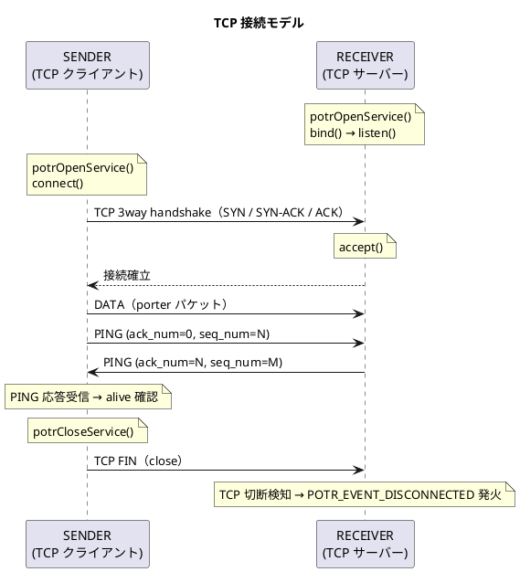

### 1:1 接続

v1 では RECEIVER は同時に 1 つの SENDER 接続のみ受け入れます。
すでに接続中の状態で新たな `connect()` が届いた場合、新しい接続を受け入れ古い接続を切断します。
複数の SENDER と通信するには、サービス ID を分けて `potrOpenService()` を複数回呼び出します。

---

## セッション管理

TCP 接続と porter のセッション管理は独立しています。

- TCP 接続が確立しても、porter はセッション識別子（`session_id` + `session_tv_sec` + `session_tv_nsec`）が届くまで CONNECTED とみなしません
- SENDER は `potrOpenService()` 時にセッション識別子を生成し、最初のパケット（DATA / PING）から付与します
- RECEIVER は最初のパケットを受信した時点で `POTR_EVENT_CONNECTED` を発火します

### セッション採用ポリシー

SENDER が再起動して再接続した場合、セッション識別子が更新されます。
RECEIVER の採用ポリシーは UDP と同一です。

```
1. session_tv_sec が現在追跡中より大きい           → 新セッションとして採用
2. session_tv_sec が等しく session_tv_nsec が大きい → 新セッションとして採用
3. 上記が等しく session_id が大きい                → 新セッションとして採用（タイブレーク）
4. それ以外                                        → 旧セッションのパケットとして破棄
```

TCP 接続が切断されると `peer_session_known` がクリアされ、次の接続で任意のセッション識別子を無条件に受け入れます。

### TCP 切断の種別と porter の扱い

porter は TCP 切断の原因を区別しません。いずれの場合も `recv()` がエラーまたは 0 バイトを返した時点で接続断として処理します。

| TCP の切断契機 | porter の扱い |
|---|---|
| 相手が `close()` / `shutdown()` → FIN | TCP 切断 → `POTR_EVENT_DISCONNECTED` 発火 |
| 相手がクラッシュ・強制終了 → RST | TCP 切断 → `POTR_EVENT_DISCONNECTED` 発火 |
| ファイアウォールによる RST 注入 | TCP 切断 → `POTR_EVENT_DISCONNECTED` 発火 |

RST 受信時は TCP 送信バッファ内の未送信データが破棄される場合があります。
これは porter では特別扱いしません。DISCONNECTED イベントで接続断を通知し、再接続後の対処は上位アプリケーションの責務とします。

### 通番（seq_num）の役割

TCP モードでも通番は維持します。ただし役割が UDP と異なります。

| 目的 | TCP での利用 |
|---|---|
| 再送制御（NACK ターゲット） | 不使用 |
| 順序整列 | 不使用（TCP が保証） |
| AES-256-GCM ノンス生成 | 使用（`session_id + seq_num`） |
| フラグメント順序確認 | 使用（デバッグ・ログ用途） |

---

## ヘルスチェック（PING）

UDP のヘルスチェックは一方向（SENDER が PING を送り、RECEIVER が受信間隔でタイムアウトを検知）でした。
TCP では RECEIVER が同じ `POTR_FLAG_PING` パケットで応答します。`ack_num` で要求と応答を区別します。

TCP 接続の生死は OS レベルで検知できますが、アプリケーション層のハングには対応できません。
PING 要求 / 応答によりアプリケーション層の応答性を確認します。

### PING パケットのフォーマット

| 種別 | `flags` | `seq_num` | `ack_num` | `payload_len` |
|---|---|---|---|---|
| 要求 | `POTR_FLAG_PING` | 送信側の `next_seq` | `0` | `0` |
| 応答 | `POTR_FLAG_PING` | 応答側の `next_seq` | 要求の `seq_num` | `0` |

### SENDER の動作

`health_interval_ms > 0` のときヘルスチェックスレッドが動作します。

1. 最終 PING 応答受信時刻（または接続確立時刻）を参照し、`health_interval_ms`（グローバルは `tcp_health_interval_ms`）が経過したら PING 要求（`ack_num=0`）を送信する。DATA の送信頻度に関わらず定期的に送信する（UDP とは異なり、DATA 送信によって PING をスキップしない）
2. 要求の `seq_num` を記録し、`health_timeout_ms` 以内に対応する PING 応答（`ack_num=seq_num`）が届かない場合、切断と判定する
3. 切断判定時: `POTR_EVENT_DISCONNECTED` を発火し、`reconnect_interval_ms` の待機後に再接続する

### RECEIVER の動作

1. `ack_num=0` の PING 要求を受信したら、即座に PING 応答を返す
2. 応答パケット: `flags=POTR_FLAG_PING`、`ack_num=要求の seq_num`、`seq_num=自側の next_seq`、`payload_len=0`

> **注意**: 単方向 TCP（`POTR_TYPE_TCP`）では RECEIVER は PING を自発送信しないため、`health_timeout_ms` は RECEIVER には適用されません。
> RECEIVER のアプリ層ハングは SENDER 側の PING 応答タイムアウトにより検知されます。

### PING の性質

- PING はウィンドウに登録しない（再送の対象外）
- `seq_num` には送信側の `next_seq` を格納する（通番を消費しない）。TCP でも同様
- 応答を受け取った側は `ack_num` で対応する要求を特定する

### UDP との比較

全 bidir モード共通の PING パケットフォーマットについては `protocol.md` も参照してください。

| 項目 | UDP unicast | UDP unicast_bidir | TCP（単方向） | TCP_bidir（双方向） |
|---|---|---|---|---|
| PING 方向 | SENDER → RECEIVER（一方向、返信なし） | 両端が独立して送信・応答 | SENDER → RECEIVER（RECEIVER が応答） | 両端が独立して送信・応答 |
| DATA 頻送時の PING 動作 | DATA があれば PING 省略 | DATA があれば PING 省略 | DATA に関わらず定期送信 | DATA に関わらず定期送信 |
| PING 応答パケット種別 | なし | `POTR_FLAG_PING`（`ack_num > 0`） | `POTR_FLAG_PING`（`ack_num > 0`） | `POTR_FLAG_PING`（`ack_num > 0`） |
| タイムアウト検知方法 | RECEIVER: `last_recv_tv_sec` 監視 | 両端: `last_recv_tv_sec` 監視 | SENDER: PING 応答タイムアウト監視 | 両端: PING 応答タイムアウト監視 |
| タイムアウト時の処理 | RECEIVER 側で DISCONNECTED 発火 | 先に検知した端で DISCONNECTED 発火 | SENDER 側で DISCONNECTED 発火 | 先に検知した端で DISCONNECTED 発火 |
| `health_timeout_ms` の意味 | RECEIVER の受信無音タイムアウト | 両端の受信無音タイムアウト | SENDER の PING 応答待機タイムアウト（RECEIVER は不使用） | 両端の PING 応答待機タイムアウト |
| UDP/TCP 接続の性質 | UDP（無接続） | UDP（無接続） | TCP（OS 接続が生存したままアプリがハングし得る） | TCP（同左） |

UDP bidir では PING 応答の個別タイムアウト管理は不要です。
UDP は接続概念がないため、相手のアプリケーションが停止すると全パケットが途絶えます。
`last_recv_tv_sec` が更新されなくなることで `check_health_timeout()` のみで切断を検知できます。

---

## 自動再接続（SENDER）

TCP 接続が切断された場合、SENDER は自動で再接続を試みます。

```
TCP 切断 or PING 応答タイムアウト
  → POTR_EVENT_DISCONNECTED 発火
  → reconnect_interval_ms 待機
  → connect() 再試行
  → 成功 → POTR_EVENT_CONNECTED 発火（最初のパケット受信時）
  → 失敗 → reconnect_interval_ms 待機 → 再試行（繰り返し）
```

`reconnect_interval_ms = 0` の場合は自動再接続を行いません。接続断後は `potrCloseService()` 相当の状態になります。

### 接続確立前の potrSend() の動作

TCP SENDER では `potrOpenService()` 返却後、connect スレッドが非同期に接続を試みます。
`connect()` 完了前（接続確立前）に `potrSend()` を呼び出した場合は **`POTR_ERROR` を返します**。

| 通信種別 | 接続確立の検知方法 |
|---|---|
| `POTR_TYPE_TCP`（SENDER） | `potrSend()` の戻り値で判断（`POTR_SUCCESS` になるまで再試行） |
| `POTR_TYPE_TCP_BIDIR`（SENDER） | `POTR_EVENT_CONNECTED` コールバックで検知（コールバック必須） |

再接続後も同様に、接続確立前の `potrSend()` は `POTR_ERROR` を返します。

---

## フラグメント化と結合

フラグメント化の仕組みは UDP と同一です。

1 回の `potrSend()` で送信するデータが `max_payload` を超える場合、複数のフラグメントに分割します。

### 受信側の変更点

UDP では受信ウィンドウ（スライディングウィンドウ）がフラグメントの順序整列を担っていました。
TCP は順序保証があるため、受信ウィンドウは不要です。

TCP モードの受信側では**フラグメントバッファのみ**を使用します。
`POTR_FLAG_MORE_FRAG` が立っているエレメントをバッファに蓄積し、
`POTR_FLAG_MORE_FRAG` がないエレメントを受け取った時点で結合して `POTR_EVENT_DATA` を発火します。

---

## スレッド構成

### SENDER のスレッド

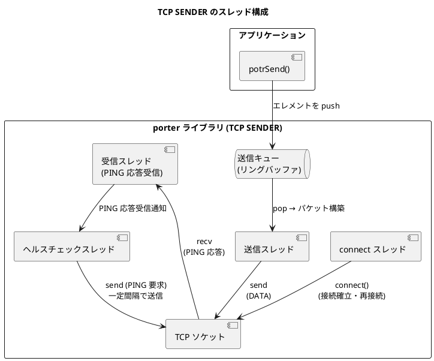

| スレッド | 役割 |
|---|---|
| connect スレッド | `connect()` を実行し、成功したら他スレッドを起動する。切断後は `reconnect_interval_ms` 待機して再試行する |
| 送信スレッド | 送信キューからエレメントを取り出し、DATA パケットを構築して `send()` する |
| 受信スレッド | PING 応答（`ack_num > 0`）を受信してヘルスチェックスレッドに通知する。TCP 接続断を検知したら `POTR_EVENT_DISCONNECTED` を発火する |
| ヘルスチェックスレッド | 最終送信時刻を監視し、`health_interval_ms` が経過したら PING 要求を送信する。`health_timeout_ms` 以内に応答が届かなければ切断と判定する |

### RECEIVER のスレッド

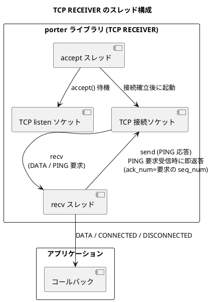

| スレッド | 役割 |
|---|---|
| accept スレッド | `listen()` ソケットで `accept()` を待機する。接続確立後に recv スレッドを起動する |
| recv スレッド | porter パケットをヘッダー読み取り → ペイロード読み取りの 2 ステップで受信する。`ack_num=0` の PING 要求を受け取ったら即 PING 応答（`ack_num=要求の seq_num`）を返す。DATA をコールバックへ渡す。TCP 接続断を検知したら `POTR_EVENT_DISCONNECTED` を発火して accept スレッドへ戻る |

---

## 型・定数の変更

### PotrType への追加

```c
typedef enum {
    POTR_TYPE_UNICAST         = 1,
    POTR_TYPE_MULTICAST       = 2,
    POTR_TYPE_BROADCAST       = 3,
    POTR_TYPE_UNICAST_RAW     = 4,
    POTR_TYPE_MULTICAST_RAW   = 5,
    POTR_TYPE_BROADCAST_RAW   = 6,
    POTR_TYPE_TCP             = 7,   /* 追加: TCP ユニキャスト */
    POTR_TYPE_TCP_BIDIR       = 8,   /* 追加: TCP 双方向 */
    POTR_TYPE_UNICAST_BIDIR   = 9    /* 追加: UDP unicast 双方向 */
} PotrType;
```

### flags の変更なし

TCP モードで新規フラグは追加しません。PING 要求 / 応答の区別は `ack_num` フィールドで行います。

### peer_id の扱い

N:1 通信設計により `PotrRecvCallback` と `potrSend()` のシグネチャに `peer_id` 引数が追加されます
（`porter_type.h` / `porter.h` 参照）。

`POTR_TYPE_TCP` および `POTR_TYPE_TCP_BIDIR` は v1 では 1:1 接続のみのため、**`peer_id` は常に `0`** を使用します。

| 場面 | `peer_id` の値 |
|---|---|
| コールバックで受け取る値 | 常に `0` |
| `potrSend()` の呼び出し | `0` を指定する（`POTR_PEER_ALL` も可。唯一の接続として動作する） |

### PotrServiceDef への追加フィールド

以下の 2 フィールドを `PotrServiceDef` の**末尾**（`encrypt_enabled` の後）に追加します。
`uint32_t` 同士の追加のため既存のアライメントを崩しません。

```c
/* TCP 固有フィールド（POTR_TYPE_TCP / POTR_TYPE_TCP_BIDIR 以外では無視） */
uint32_t reconnect_interval_ms;   /* SENDER 自動再接続間隔 (ms)。0 = 再接続なし。デフォルト: POTR_DEFAULT_RECONNECT_INTERVAL_MS */
uint32_t connect_timeout_ms;      /* SENDER TCP 接続タイムアウト (ms)。0 = OS デフォルト。デフォルト: POTR_DEFAULT_CONNECT_TIMEOUT_MS */
```

### 新規デフォルト定数

```c
#define POTR_DEFAULT_RECONNECT_INTERVAL_MS  5000   /* 再接続間隔デフォルト (ms) */
#define POTR_DEFAULT_CONNECT_TIMEOUT_MS    10000   /* 接続タイムアウトデフォルト (ms) */
```

---

## 設定ファイル仕様

### type = tcp の記法

```ini
[service.4001]
type     = tcp
dst_addr = 192.168.1.100
dst_port = 9001
```

| キー | 役割 | SENDER | RECEIVER |
|---|---|---|---|
| `dst_addr` | 接続先 / bind アドレス | 接続先ホスト（必須） | bind アドレス（必須） |
| `dst_port` | 接続先 / listen ポート | 接続先ポート（必須） | listen ポート（必須） |
| `src_addr` | bind アドレス | 省略可（0.0.0.0） | 省略可（設定しても無視） |
| `reconnect_interval_ms` | 自動再接続間隔 | 省略可（デフォルト 5000） | 無視 |
| `connect_timeout_ms` | 接続タイムアウト | 省略可（デフォルト 10000） | 無視 |
| `pack_wait_ms` | パッキング待機時間 | 省略可 | — |
| `encrypt_key` | AES-256-GCM 事前共有鍵 | 省略可 | 省略可 |
| `health_interval_ms` | PING 送信間隔（グローバルの `tcp_health_interval_ms` をオーバーライド） | 省略可 | 無視 |
| `health_timeout_ms` | PING 応答待機タイムアウト（グローバルの `tcp_health_timeout_ms` をオーバーライド） | 省略可 | 無視 |

### 使用しないフィールド

以下のフィールドは `type = tcp` のサービス定義に記述しても無視されます。

| フィールド | UDP での用途 |
|---|---|
| `src_port` | 送信元 bind ポート |
| `multicast_group` | マルチキャストグループ |
| `ttl` | マルチキャスト TTL |
| `broadcast_addr` | ブロードキャスト宛先 |
| `src_addr.1` 〜 `src_addr.3` | マルチパス経路 |
| `dst_addr.1` 〜 `dst_addr.3` | マルチパス経路 |

### サンプル設定ファイル

```ini
[global]
max_payload            = 1400
udp_health_interval_ms = 3000
udp_health_timeout_ms  = 10000
tcp_health_interval_ms = 10000
tcp_health_timeout_ms  = 31000

; ---- TCP ユニキャスト ----

; 基本設定（ループバック）
[service.4001]
type     = tcp
dst_addr = 127.0.0.1
dst_port = 9001

; 異なるホスト間
[service.4002]
type                  = tcp
dst_addr              = 192.168.1.100
dst_port              = 9002
reconnect_interval_ms = 5000    ; SENDER のみ有効
connect_timeout_ms    = 10000   ; SENDER のみ有効

; ホスト名での指定
[service.4003]
type     = tcp
dst_addr = receiver.local
dst_port = 9003

; AES-256-GCM 暗号化（パスフレーズ形式）
[service.4004]
type        = tcp
dst_addr    = 192.168.1.100
dst_port    = 9004
encrypt_key = mysecretphrase

; AES-256-GCM 暗号化（hex 鍵形式）
[service.4005]
type        = tcp
dst_addr    = 192.168.1.100
dst_port    = 9005
encrypt_key = 0a1b2c3d4e5f6a7b8c9d0e1f2a3b4c5d6e7f0a1b2c3d4e5f6a7b8c9d0e1f2a3b

; 再接続なし（SENDER が切断後に自動復帰しない）
[service.4006]
type                  = tcp
dst_addr              = 192.168.1.100
dst_port              = 9006
reconnect_interval_ms = 0
```

---

## シーケンス図

### 正常な接続・通信・切断

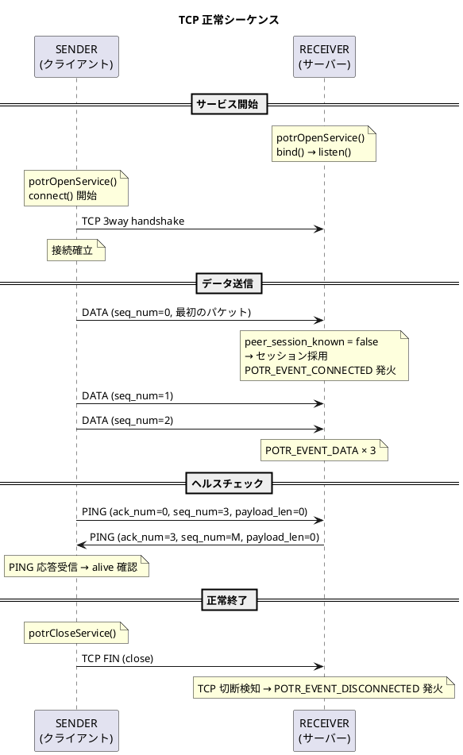

### SENDER 再起動・自動再接続

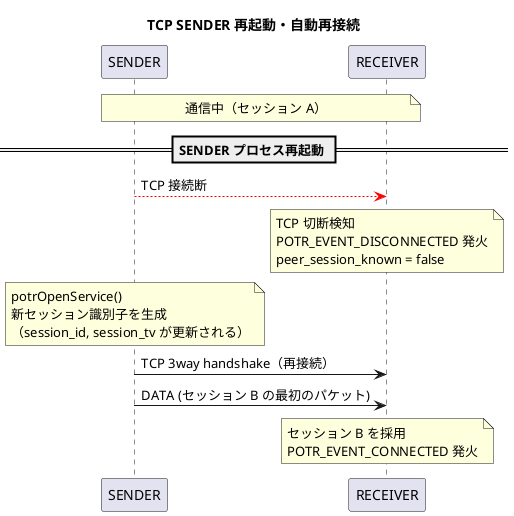

### PING 応答タイムアウトによる切断検知

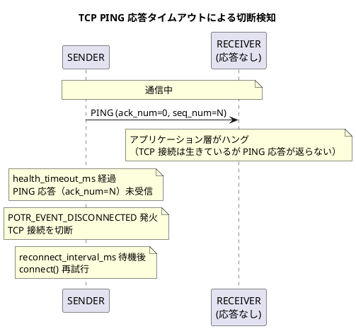

---

## 定数・上限値

TCP モード固有の定数を追加します。
既存の定数（`POTR_MAX_PAYLOAD` / `POTR_MAX_WINDOW_SIZE` 等）は引き続き有効です。

| 定数 | 値 | 説明 |
|---|---|---|
| `POTR_DEFAULT_RECONNECT_INTERVAL_MS` | 5,000 ms | SENDER 自動再接続間隔デフォルト |
| `POTR_DEFAULT_CONNECT_TIMEOUT_MS` | 10,000 ms | SENDER 接続タイムアウトデフォルト |

---

## 双方向通信（POTR_TYPE_TCP_BIDIR）

### 概要

TCP は物理的に双方向のバイトストリームです。`POTR_TYPE_TCP_BIDIR` はこの特性を活かし、
両端がデータの送信と受信を同時に行える通信種別です。

既存の `POTR_TYPE_TCP`（単方向）は変更しません。`POTR_TYPE_TCP_BIDIR` を独立した型として追加します。

### 役割の解釈

双方向モードでは **Role は TCP 接続方向のみ** を意味します。データの流れ方向は関係なくなります。

| Role | TCP の役割 | データ送受信 |
|---|---|---|
| `POTR_ROLE_SENDER` | TCP クライアント（`connect()`） | 送信も受信も可 |
| `POTR_ROLE_RECEIVER` | TCP サーバー（`listen()` → `accept()`） | 送信も受信も可 |

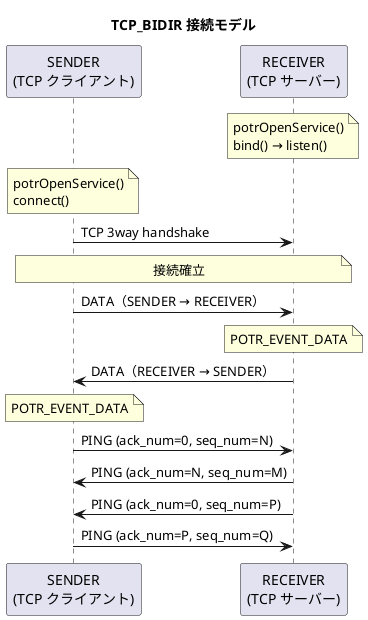

### セッション管理

単方向 TCP では SENDER のみがセッション識別子を生成しました。
双方向では **両端が独立したセッション識別子を持ちます**。

```
PotrContext（双方向）
  ├── 自端セッション: session_id, session_tv_sec, session_tv_nsec  ← 自分の送信パケットに付与
  └── 相手セッション: peer_session_id, peer_session_tv_*           ← 既存フィールドを流用
```

各パケットのヘッダーには **送信側自身のセッション識別子** を付与します。
受信側は相手のセッション識別子を追跡し、変化を検知した時点で `POTR_EVENT_CONNECTED` を発火します。
セッション採用ポリシーは単方向 TCP と同一です。

### ヘルスチェック（PING）

単方向 TCP と同じ仕組みを両端が対称に実行します。

```
両端それぞれ:
  health_interval_ms 周期で PING 要求（ack_num=0）を送信する
  相手から PING 要求（ack_num=0）を受け取ったら即 PING 応答（ack_num=要求の seq_num）を返す
  health_timeout_ms 以内に PING 応答が返ってこなければ DISCONNECTED
```

単方向 TCP との差は「SENDER 側も PING 要求を受け取って応答する」点のみです。仕組みは共通です。

### フラグメント化と結合

単方向 TCP と同一です。両端がそれぞれ独立した `seq_num` 空間を持ち、
送信側でフラグメント化し、受信側でフラグメントバッファを使って結合します。

### スレッド構成

両端が対称なスレッド構成を持ちます。

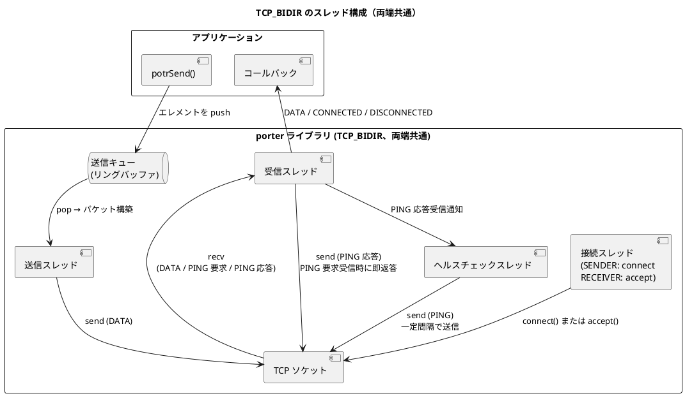

| スレッド | 役割 |
|---|---|
| 接続スレッド | SENDER: `connect()` を実行し、成功したら他スレッドを起動する。切断後は `reconnect_interval_ms` 待機して再試行する。RECEIVER: `accept()` を待機し、接続確立後に他スレッドを起動する |
| 送信スレッド | 送信キューからエレメントを取り出し、DATA パケットを構築して `send()` する |
| 受信スレッド | DATA / PING 要求 / PING 応答を受信する。PING 要求（`ack_num=0`）には即 PING 応答を返す。DATA はコールバックへ渡す。TCP 接続断を検知したら `POTR_EVENT_DISCONNECTED` を発火する |
| ヘルスチェックスレッド | 最終送信時刻を監視し、`health_interval_ms` が経過したら PING 要求を送信する。`health_timeout_ms` 以内に応答が届かなければ切断と判定する |

### 型・定数の変更

#### PotrType への追加

```c
POTR_TYPE_TCP_BIDIR = 8   /* 追加: TCP 双方向 */
```

#### PotrContext への追加

双方向モードでは RECEIVER 側にも送信インフラが必要です。

```c
/* 双方向モードで RECEIVER 側に追加するフィールド */
PotrSendQueue send_queue;       /* 送信キュー */
PotrThread    send_thread;      /* 送信スレッド */
PotrThread    health_thread;    /* ヘルスチェックスレッド */
PotrMutex     health_mutex;
PotrCondVar   health_wakeup;
volatile uint64_t last_send_ms;
```

#### potrOpenService() の変更点

`POTR_TYPE_TCP_BIDIR` では両端ともコールバックが必須です。

```c
/* SENDER 側（tcp_bidir）: コールバックを必ず指定する */
potrOpenService("config.conf", 4010, POTR_ROLE_SENDER, on_recv, &handle);

/* RECEIVER 側（tcp_bidir）: 変わらず */
potrOpenService("config.conf", 4010, POTR_ROLE_RECEIVER, on_recv, &handle);
```

### 設定ファイル仕様

`tcp` と同一のフィールドを使用します。`type = tcp_bidir` と記述します。

```ini
[service.4010]
type                  = tcp_bidir
dst_addr              = 192.168.1.100
dst_port              = 9010
reconnect_interval_ms = 5000    ; SENDER のみ有効
connect_timeout_ms    = 10000   ; SENDER のみ有効
```

### 単方向 TCP との比較

| 項目 | tcp（単方向） | tcp_bidir（双方向） |
|---|---|---|
| `potrSend()` | SENDER のみ | 両端 |
| 受信コールバック | RECEIVER のみ（必須）、SENDER は NULL | 両端必須 |
| セッション ID 生成 | SENDER のみ | 両端が独立して生成 |
| PING 要求送信 | SENDER のみ | 両端が独立して送信 |
| PING 応答返却 | RECEIVER のみ | 両端が応答 |
| 送信キュー / 送信スレッド | SENDER のみ | 両端 |
| ヘルスチェックスレッド | SENDER のみ | 両端 |
| TCP 接続方向 | SENDER=クライアント / RECEIVER=サーバー | 同左（変わらず） |

### シーケンス図

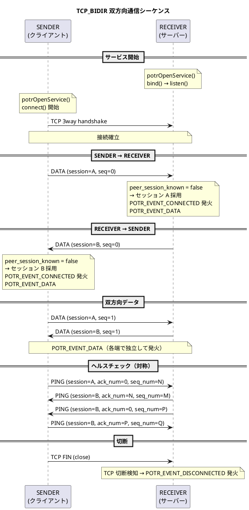

---

## 実装ロードマップ

TCP 通信機能は 2 段階で実装します。各段階で動作評価と試験を完了してから次の段階に進みます。

| フェーズ | 内容 | 完了条件 |
|---|---|---|
| **v1** | 単一 path による TCP 通信（本ドキュメントのメイン設計） | v1 評価・試験クリア |
| **v2** | アプリ層マルチパス（複数 TCP 接続による冗長送信） | v2 評価・試験クリア |

### v1 評価・試験項目

| 試験 | 確認内容 |
|---|---|
| 基本送受信 | DATA が正常に届き `POTR_EVENT_DATA` が発火する |
| 大容量送信 | フラグメント化と結合が正常に動作する |
| 再接続 | SENDER 再起動後に自動再接続し `POTR_EVENT_CONNECTED` が発火する |
| 再接続なし | `reconnect_interval_ms = 0` 時に切断後の再接続が行われない |
| PING タイムアウト | RECEIVER 応答停止時に SENDER が `POTR_EVENT_DISCONNECTED` を発火する |
| 暗号化 | AES-256-GCM 有効時に正常送受信できる |
| 双方向 (TCP_BIDIR) | 両端から DATA 送信・受信ができる |
| 接続置換 | RECEIVER に新 SENDER が接続した際、旧接続が切断される |

---

## v2 将来設計: アプリ層マルチパス

> **ステータス**: 将来実装予定。v1 完了・評価後に着手する。

### 概要

v1 は 1 つの TCP 接続（単一 path）のみを使用します。
v2 では UDP マルチパスと同じ思想で、**複数の TCP 接続（path）に同一パケットを冗長送信**します。
受信側は `seq_num` で重複を排除し、最初に届いたパケットを採用します。

使用する PotrServiceDef フィールドは UDP マルチパスと同じです（新フィールド追加なし）。

```
SENDER path[0]: src_addr[0] → dst_addr[0]   (TCP 接続 #0)
SENDER path[1]: src_addr[1] → dst_addr[1]   (TCP 接続 #1)
  ↓ 各接続に同一パケット（同一 seq_num）を送信
RECEIVER: 先着パケットを採用、重複は seq_num で排除
```

### 接続モデル

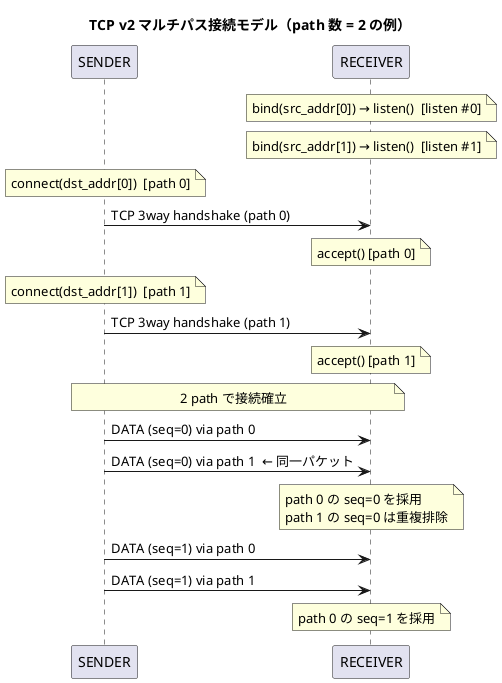

### v1 との差分

| 項目 | v1（単一 path） | v2（マルチパス） |
|---|---|---|
| TCP 接続数 | 1 本 | N 本（`dst_addr[i]` の非空エントリ数） |
| パケット送信 | 1 接続に送信 | 全アクティブ path に同一パケットを送信 |
| `seq_num` | 1 接続で通番管理 | 全 path 共通の通番空間 |
| 重複排除 | 不要 | 必要（UDP マルチパスと同じ仕組みを流用） |
| connect スレッド | 1 個 | path ごとに 1 個（最大 `POTR_MAX_PATH` 個） |
| accept スレッド | 1 個（listen ソケット 1 個） | path ごとに 1 個（listen ソケット N 個） |
| recv スレッド | 1 個 | path ごとに 1 個 |
| health スレッド | 1 個（SENDER のみ） | path ごとに 1 個（SENDER のみ） |
| path 断時の動作 | 全体切断 | 他 path で継続。全 path 断で `POTR_EVENT_DISCONNECTED` |

### セッション管理

セッション識別子（`session_id + session_tv_*`）は v1 と同様に接続全体で 1 つです。
どの path から届いたパケットも同一セッションとして扱います。

`POTR_EVENT_CONNECTED` は**いずれか 1 つの path で最初のパケットを受信した時点**で発火します。

### ヘルスチェック（PING）

path ごとに独立して PING 要求・応答を管理します。

- 各 path の health スレッドが独立して PING 要求を送信する
- 各 path の recv スレッドが PING 応答を受け取り、対応する health スレッドに通知する
- 個別 path の PING 応答タイムアウト → その path を切断・再接続を試みる
- 全 path が切断状態になった時点で `POTR_EVENT_DISCONNECTED` を発火する

### スレッド構成（v2）

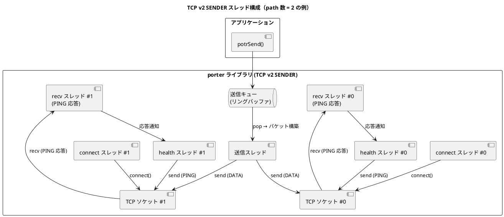

### v1 実装時の拡張性への配慮

v1 を実装する際、以下の点に配慮しておくと v2 への移行コストが下がります。

| 実装箇所 | v1 での配慮 |
|---|---|
| ソケット fd 管理 | `int tcp_fd` ではなく `int tcp_fd[POTR_MAX_PATH]` として宣言し、v1 は `[0]` のみ使用 |
| connect / accept スレッド | path インデックスを引数に取る関数として実装する |
| recv スレッド | path インデックスを引数に取る関数として実装する |
| 送信処理 | 「アクティブな fd の配列を全走査して送信する」ループとして実装する（v1 は要素数 1） |
| 重複排除テーブル | UDP マルチパスと同じ仕組みが流用できるか v1 完了時に確認する |

### v2 評価・試験項目

| 試験 | 確認内容 |
|---|---|
| マルチパス送信確認 | 全 path に同一 seq_num のパケットが送信されていること |
| 重複排除 | RECEIVER が同一 seq_num のパケットを 1 回のみ `POTR_EVENT_DATA` で通知すること |
| path 1 本切断 | 残り path で通信が継続し `POTR_EVENT_DISCONNECTED` が発火しないこと |
| 全 path 切断 | `POTR_EVENT_DISCONNECTED` が発火すること |
| 部分再接続 | 切断した path が再接続し通信が正常化すること |
| path 断時の遅延影響 | 送信スレッドが切断済み fd への送信でブロックしないこと |
| SENDER 再起動 | 全 path が再接続し `POTR_EVENT_CONNECTED` が発火すること |
