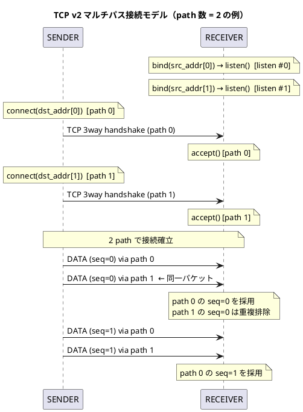
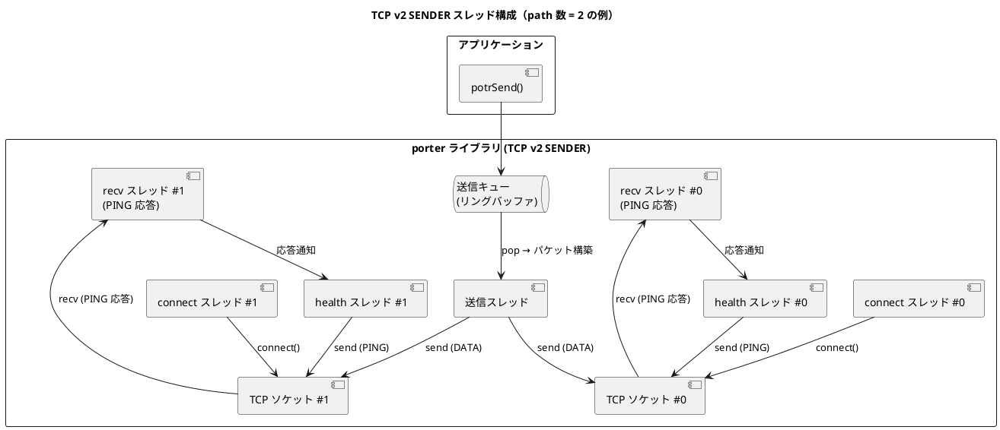

# TCP v2 設計: アプリ層マルチパス

> **ステータス**: 将来実装予定。v1（`POTR_TYPE_TCP` / `POTR_TYPE_TCP_BIDIR` 単一接続）完了・評価後に着手する。

## 概要

v1 は 1 つの TCP 接続（単一 path）のみを使用します。
v2 では UDP マルチパスと同じ思想で、**複数の TCP 接続（path）に同一パケットを冗長送信**します。
受信側は `seq_num` で重複を排除し、最初に届いたパケットを採用します。

使用する PotrServiceDef フィールドは UDP マルチパスと同じです（新フィールド追加なし）。

```
SENDER path[0]: src_addr[0] → dst_addr[0]   (TCP 接続 #0)
SENDER path[1]: src_addr[1] → dst_addr[1]   (TCP 接続 #1)
  ↓ 各接続に同一パケット（同一 seq_num）を送信
RECEIVER: 先着パケットを採用、重複は seq_num で排除
```

---

## 接続モデル



---

## v1 との差分

| 項目 | v1（単一 path） | v2（マルチパス） |
|---|---|---|
| TCP 接続数 | 1 本 | N 本（`dst_addr[i]` の非空エントリ数） |
| パケット送信 | 1 接続に送信 | 全アクティブ path に同一パケットを送信 |
| `seq_num` | 1 接続で通番管理 | 全 path 共通の通番空間 |
| 重複排除 | 不要 | 必要（UDP マルチパスと同じ仕組みを流用） |
| connect スレッド | 1 個 | path ごとに 1 個（最大 `POTR_MAX_PATH` 個） |
| accept スレッド | 1 個（listen ソケット 1 個） | path ごとに 1 個（listen ソケット N 個） |
| recv スレッド | 1 個 | path ごとに 1 個 |
| health スレッド | 1 個（SENDER のみ） | path ごとに 1 個（SENDER のみ） |
| path 断時の動作 | 全体切断 | 他 path で継続。全 path 断で `POTR_EVENT_DISCONNECTED` |

---

## セッション管理

セッション識別子（`session_id + session_tv_*`）は v1 と同様に接続全体で 1 つです。
どの path から届いたパケットも同一セッションとして扱います。

`POTR_EVENT_CONNECTED` は**いずれか 1 つの path で最初のパケットを受信した時点**で発火します。

---

## ヘルスチェック（PING）

path ごとに独立して PING 要求・応答を管理します。

- 各 path の health スレッドが独立して PING 要求を送信する
- 各 path の recv スレッドが PING 応答を受け取り、対応する health スレッドに通知する
- 個別 path の PING 応答タイムアウト → その path を切断・再接続を試みる
- 全 path が切断状態になった時点で `POTR_EVENT_DISCONNECTED` を発火する

---

## スレッド構成



---

## v1 実装時の拡張性への配慮

v1 実装時に以下の点に配慮しておくと v2 への移行コストが下がります。

| 実装箇所 | v1 での配慮 |
|---|---|
| ソケット fd 管理 | `int tcp_fd` ではなく `int tcp_fd[POTR_MAX_PATH]` として宣言し、v1 は `[0]` のみ使用 |
| connect / accept スレッド | path インデックスを引数に取る関数として実装する |
| recv スレッド | path インデックスを引数に取る関数として実装する |
| 送信処理 | 「アクティブな fd の配列を全走査して送信する」ループとして実装する（v1 は要素数 1） |
| 重複排除テーブル | UDP マルチパスと同じ仕組みが流用できるか v1 完了時に確認する |

---

## 評価・試験項目

| 試験 | 確認内容 |
|---|---|
| マルチパス送信確認 | 全 path に同一 seq_num のパケットが送信されていること |
| 重複排除 | RECEIVER が同一 seq_num のパケットを 1 回のみ `POTR_EVENT_DATA` で通知すること |
| path 1 本切断 | 残り path で通信が継続し `POTR_EVENT_DISCONNECTED` が発火しないこと |
| 全 path 切断 | `POTR_EVENT_DISCONNECTED` が発火すること |
| 部分再接続 | 切断した path が再接続し通信が正常化すること |
| path 断時の遅延影響 | 送信スレッドが切断済み fd への送信でブロックしないこと |
| SENDER 再起動 | 全 path が再接続し `POTR_EVENT_CONNECTED` が発火すること |
